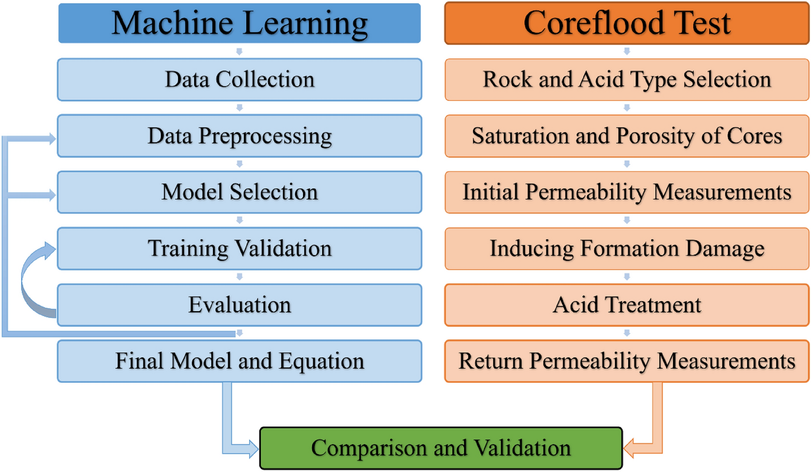

## Table of Contents

## What is acidizing in the context of oil and gas production?

Acidizing is a method used in the oil and gas industry to increase the flow of oil or gas from a well. It involves pumping acid into the well to dissolve some of the rock around it. This creates more space for the oil or gas to move through, making it easier to extract. The acid usually used is hydrochloric acid, which is strong enough to dissolve limestone and other types of rock that might be blocking the well.

There are two main types of acidizing: matrix acidizing and fracture acidizing. In matrix acidizing, the acid is pumped at a pressure that does not fracture the rock. It just flows through the existing spaces in the rock, cleaning them out and making them bigger. Fracture acidizing, on the other hand, involves pumping the acid at a high enough pressure to actually crack the rock. This creates new pathways for the oil or gas to flow through. Both methods help to improve the productivity of a well, but they are used in different situations depending on the type of rock and the specific needs of the well.

## What are the primary goals of acidizing?

The main goal of acidizing is to make it easier to get oil or gas out of the ground. When a well is drilled, the oil or gas might have a hard time flowing because the rock around the well can be tight or blocked. By pumping acid into the well, the acid eats away at the rock, creating more space for the oil or gas to move through. This helps the well produce more oil or gas, which is good for the company that owns the well.

There are two ways to do acidizing: matrix acidizing and fracture acidizing. In matrix acidizing, the acid is pumped in at a pressure that doesn't break the rock. It just cleans out the existing paths in the rock, making them bigger. Fracture acidizing is different because the acid is pumped in at a high pressure that actually cracks the rock. This makes new paths for the oil or gas to flow through. Both methods aim to increase how much oil or gas can be pulled out of the well, but they are used in different situations based on what the well needs.

## What are the different types of acidizing techniques?

There are two main types of acidizing techniques used in the oil and gas industry: matrix acidizing and fracture acidizing. Matrix acidizing is when acid is pumped into the well at a pressure that does not break the rock. Instead, it flows through the small spaces already in the rock and dissolves some of it, making these spaces bigger. This helps the oil or gas flow more easily through the existing paths in the rock.

Fracture acidizing, on the other hand, involves pumping the acid at a much higher pressure. This high pressure actually cracks the rock, creating new paths for the oil or gas to flow through. The acid then dissolves some of the rock along these new cracks, making them even bigger and more useful for getting the oil or gas out of the ground.

Both techniques aim to increase the amount of oil or gas that can be extracted from a well. The choice between matrix acidizing and fracture acidizing depends on the type of rock and the specific needs of the well. Matrix acidizing is often used when the rock is not too hard and the existing paths just need to be cleaned and enlarged. Fracture acidizing is used when the rock is harder and new paths need to be created to improve the flow of oil or gas.

## How does matrix acidizing differ from acid fracturing?

Matrix acidizing and acid fracturing are two ways to help get more oil or gas out of the ground. In matrix acidizing, acid is pumped into the well at a pressure that does not break the rock. The acid flows through the tiny spaces in the rock and dissolves some of it, making these spaces bigger. This helps the oil or gas flow better through the paths that are already there.

Acid fracturing is different because it uses a much higher pressure to pump the acid into the well. This high pressure actually cracks the rock, creating new paths for the oil or gas to flow through. The acid then dissolves some of the rock along these new cracks, making them bigger and more useful for getting the oil or gas out. Both methods aim to increase how much oil or gas can be pulled out of the well, but they are used in different situations based on what the well needs.

## What types of acids are commonly used in acidizing and why?

The most common acid used in acidizing is hydrochloric acid. This acid is strong and good at dissolving limestone and other types of rock that might be blocking the well. It's used because it works well on many types of rock, especially in carbonate formations like limestone and dolomite. Hydrochloric acid is also relatively cheap and easy to get, which makes it a popular choice for oil and gas companies.

Another acid that is sometimes used is hydrofluoric acid. This acid is very strong and can dissolve silicate minerals like quartz and feldspar, which are found in sandstone formations. Hydrofluoric acid is used when the rock around the well is made of these minerals, because hydrochloric acid doesn't work as well on them. However, hydrofluoric acid is more dangerous to handle and more expensive, so it's used less often than hydrochloric acid.

In some cases, a mix of acids is used, like a blend of hydrochloric and hydrofluoric acid. This mix can be useful when the rock around the well is made of different types of minerals. The mix helps to dissolve a wider range of rock types, making the acidizing process more effective. Choosing the right acid or mix of acids depends on what kind of rock is around the well and what the company wants to achieve.

## What are the steps involved in planning an acidizing operation?

Planning an acidizing operation starts with understanding the well and the rock around it. First, the company does tests to see what kind of rock is there and how much oil or gas is in the well. They might use tools to take samples of the rock or to measure how easily the oil or gas can flow. This helps them decide if acidizing will work and which type of acidizing to use. They also look at old records of the well to see how it has been doing over time.

Once they have all this information, they start planning the details of the acidizing job. They choose the right type of acid, like hydrochloric acid for limestone or a mix of acids for different rock types. They also figure out how much acid to use and how fast to pump it into the well. Safety is very important, so they make plans to protect the workers and the environment. They set up equipment and make sure everyone knows what to do during the operation. This careful planning helps make sure the acidizing job goes smoothly and safely.

## What are the key considerations for selecting the appropriate acidizing technique?

When choosing the right acidizing technique, the first thing to think about is the type of rock around the well. If the rock is limestone or dolomite, matrix acidizing with hydrochloric acid might be the best choice because it works well on these types of rock. But if the rock is sandstone, which has different minerals like quartz and feldspar, then acid fracturing with hydrofluoric acid or a mix of acids could be better. The company needs to do tests to find out what kind of rock is there and how much oil or gas is in the well. This helps them decide if acidizing will help and which technique to use.

Another important thing to consider is the condition of the well. If the well is not producing much oil or gas because the paths in the rock are blocked, matrix acidizing might be enough to clean out these paths and make them bigger. But if the rock is very hard and the oil or gas has a hard time flowing, acid fracturing might be needed to create new paths. The company also needs to think about safety and the environment. They need to make sure the acidizing job is done safely and does not harm the environment. All these things help the company pick the right acidizing technique for their well.

## How do you evaluate the success of an acidizing treatment?

To evaluate the success of an acidizing treatment, the first thing to do is to compare how much oil or gas the well is producing before and after the treatment. If the well is producing more oil or gas after the acidizing, it's a good sign that the treatment worked. The company might also look at the pressure in the well. If the pressure goes down after acidizing, it means the oil or gas can flow more easily, which is another sign of success.

Another way to check if the acidizing worked is by doing more tests on the well. These tests can show if the paths in the rock are bigger or if new paths have been created. If the tests show that the rock has more space for the oil or gas to move through, then the acidizing was successful. It's important to keep an eye on the well over time to make sure the treatment keeps working and to see if any more treatments are needed.

## What are the potential risks and challenges associated with acidizing?

Acidizing can be risky because it uses strong acids that can be dangerous if they leak or spill. The acid can harm the environment if it gets into the soil or water. It can also be dangerous for the workers if they are not careful. To keep everyone safe, companies need to follow strict safety rules and use special equipment to handle the acid. They also need to plan carefully to make sure the acidizing job goes smoothly and safely.

Another challenge with acidizing is that it might not always work as expected. Sometimes, the acid can't dissolve enough of the rock to make a big difference in how much oil or gas comes out of the well. Other times, the acid might react with the rock in a way that creates problems, like making the rock weaker or blocking the paths the oil or gas needs to flow through. Companies need to do a lot of testing and planning to figure out the best way to acidize a well and to make sure it will help the well produce more oil or gas.

## How has technology improved acidizing techniques over the years?

Over the years, technology has made acidizing better and safer. One big change is the use of computers and special software to plan acidizing jobs. These tools help companies figure out the best way to use acid on different types of rock. They can also predict how the acid will work and how much oil or gas will come out of the well after the treatment. This makes the whole process more accurate and helps companies get better results.

Another improvement is in the equipment used for acidizing. New pumps and tools can control the pressure and speed of the acid more precisely. This means the acid can be put into the well exactly where it needs to go, making the treatment more effective. Also, better safety gear and monitoring systems help keep workers safe and protect the environment. All these changes have made acidizing a more reliable and safer way to get more oil or gas out of the ground.

## What are some advanced acidizing techniques used in complex reservoirs?

In complex reservoirs, where the rock and oil or gas are harder to work with, companies use advanced acidizing techniques to get better results. One technique is called "diverting agents." These are special materials that are pumped into the well along with the acid. They help the acid go into different parts of the rock, not just the easiest paths. This makes sure the acid can reach more of the rock and dissolve it, which helps the oil or gas flow better.

Another advanced technique is "self-diverting acid systems." These are special types of acid that change how they flow as they go into the rock. At first, the acid goes into the easiest paths, but then it changes and starts to go into harder-to-reach areas. This helps the acid work on more of the rock, making more space for the oil or gas to move through. Both of these techniques help companies get more oil or gas out of complex reservoirs by making sure the acid reaches and dissolves more of the rock.

## How do environmental and regulatory considerations impact acidizing practices?

Environmental and regulatory considerations have a big impact on how acidizing is done. Companies have to follow strict rules to make sure the acid does not harm the environment. They need to be careful not to let the acid leak or spill, because it can get into the soil or water and cause damage. To meet these rules, companies use special equipment and safety plans to handle the acid safely. They also have to report what they are doing to the government and get permits before they can start an acidizing job. This helps make sure the environment is protected and the acidizing is done the right way.

Regulations also affect how companies plan and carry out acidizing treatments. They have to do a lot of testing and planning to make sure the acidizing will work well and be safe. This includes studying the rock around the well and figuring out the best type of acid to use. The rules can also limit where and when acidizing can be done, to protect sensitive areas or times of the year. All these considerations make acidizing more complicated, but they help keep the environment safe and make sure the job is done right.

## What is Understanding Oil Well Stimulation?

Well stimulation techniques are critical operations in the oil and gas industry, primarily aimed at enhancing or restoring the flow of hydrocarbons from reservoirs that might be obstructed due to various geological or technical reasons. The primary goal of these techniques is to increase the permeability of the reservoir rocks, which in turn facilitates an improved flow of oil or gas to the production wells.

One of the most prominent methods of well stimulation is hydraulic fracturing. This process involves injecting a high-pressure fluid—typically a mixture of water, chemicals, and proppants such as sand—into the wellbore. The immense pressure causes the rock formation to fracture, which creates new pathways or enhances existing ones for the hydrocarbons to flow more freely towards the wellbore. These fractures are held open by proppants, which are dispersed in the fluid to ensure the pathways remain unobstructed even post-treatment. Hydraulic fracturing has become a cornerstone technique in unlocking previously inaccessible petroleum reserves, particularly in unconventional formations such as shale.

Another key method of well stimulation is acidizing, which employs chemical reactions to dissolve particular minerals in the rock formations and thereby increase their permeability. Acidizing is typically used when scale deposits, mud filtrates, or other natural formations create blockages that impede oil flow. By introducing acids, specifically formulated to react with the constituents of the rock, these obstructions can be effectively removed. There are two main types of acidizing processes: matrix acidizing and fracture acidizing. Matrix acidizing involves injecting acid into the formation at pressures below the fracturing pressure, which increases permeability by reacting with the rock face. In contrast, fracture acidizing involves higher pressure to create channels as the acid reacts and etches the fracture surfaces.

Acidizing is particularly effective in carbonate reservoirs, where hydrochloric acid (HCl) can be used to dissolve calcite ($CaCO_3$) or dolomite ($CaMg(CO_3)_2$) formations, enhancing the pore space and hence the permeability. The general chemical reaction between hydrochloric acid and limestone (calcite) is represented by the equation:

$$
2 \text{HCl} + \text{CaCO}_3 \rightarrow \text{CaCl}_2 + \text{CO}_2 + \text{H}_2\text{O}
$$

This reaction demonstrates how acidizing not only increases permeability but also assists in efficiently removing mineral deposits that could obstruct hydrocarbon flow.

These stimulation techniques are imperative for maintaining and augmenting the productivity of oil and gas wells, especially considering the challenge of mature reservoirs and the need to optimize extraction processes with minimal environmental impact.

## What is the role of hydrochloric acid in well stimulation?

Hydrochloric acid (HCl) is a critical component in the acidizing process employed in the oil and gas industry to enhance well stimulation. The primary function of HCl is to dissolve mineral components, such as limestone (CaCO₃) and dolomite [CaMg(CO₃)₂], that impede the flow of hydrocarbons within a reservoir. This dissolution process significantly improves the permeability of the rock formations surrounding a well, thereby facilitating a more efficient extraction of petroleum or natural gas.

The chemical reaction induced by hydrochloric acid in the presence of limestone can be represented as follows:

$$
\text{CaCO}_3 + 2\text{HCl} \rightarrow \text{CaCl}_2 + \text{CO}_2 + \text{H}_2\text{O}
$$

This reaction underscores the removal of blockages and the creation of pathways through the precipitation of calcium chloride (CaCl₂) and the release of carbon dioxide (CO₂). The evolution of CO₂ gas helps in further clearing the well pathways by dislodging residual obstructive materials and fine particles, thereby preventing potential blockages.

Acidizing operations typically begin with the injection of HCl into the wellbore, where it targets formation damage and scales within the immediate vicinity of the well. By effectively dissolving obstructive minerals, HCl aids in reopening previously clogged pathways, enhancing the reservoir’s flow capacity and, consequently, boosting the production output.

The success of using hydrochloric acid in these procedures necessitates precise control and monitoring to ensure that the acidizing is effective without compromising the well's material integrity or surrounding environment. As HCl is highly corrosive, careful handling and the use of corrosion inhibitors are essential to protect the metallic components of the well infrastructure from degradation during the acidizing process. This balance of effective acidizing with material preservation highlights the importance of hydrochloric acid in maintaining and increasing the productivity of oil and gas wells.

## References & Further Reading

[1]: Economides, M. J., Hill, A. D., & Ehlig-Economides, C. (1994). ["Petroleum Production Systems"](https://archive.org/details/petroleumproduct0000econ) by Michael J. Economides, A. Daniel Hill, Christine Economides. Prentice Hall.

[2]: Hale, A. H., & Jara, A. L. (2017). ["New advancements in acidizing carbonate reservoirs."](https://www.sciencedirect.com/science/article/pii/S2589791822000172) Paper presented at the SPE Annual Technical Conference and Exhibition.

[3]: Lopez de Prado, M. (2018). ["Advances in Financial Machine Learning"](https://www.amazon.com/Advances-Financial-Machine-Learning-Marcos/dp/1119482089). John Wiley & Sons.

[4]: Cramer, D. D., & Montgomery, C. T. (1989). ["Acidizing techniques in petroleum production."](https://psycnet.apa.org/record/1989-25840-001) SPE Production Engineering.

[5]: Aronson, D. (2006). ["Evidence-Based Technical Analysis: Applying the Scientific Method and Statistical Inference to Trading Signals"](https://www.amazon.com/Evidence-Based-Technical-Analysis-Scientific-Statistical/dp/0470008741) by David Aronson. Wiley Trading Series.

[6]: Economides, M. J., & Nolte, K. G. (2000). ["Reservoir Stimulation"](https://www.amazon.com/Reservoir-Stimulation-3rd-Michael-Economides/dp/0471491926), 3rd Edition. John Wiley & Sons. 

[7]: Chan, E. P. (2009). ["Quantitative Trading: How to Build Your Own Algorithmic Trading Business"](https://github.com/ftvision/quant_trading_echan_book) by Ernest P. Chan. John Wiley & Sons.