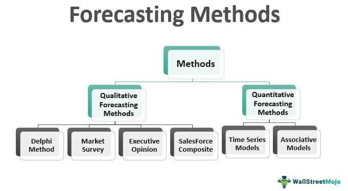

In the oil and gas industry, maximizing the production life and efficiency of wells is a critical objective. Among the various techniques employed to achieve this, acidizing plays a pivotal role. Acidizing involves the use of acids, particularly hydrochloric acid (HCl), to enhance well productivity. Hydrochloric acid is highly effective in dissolving rock formations, such as limestone and dolomite, thereby improving the permeability of the rock and facilitating greater oil and gas flow from the reservoir. This method is an essential component of well stimulation, designed to create new or enhance existing pathways for the extraction of hydrocarbons.

Parallel to the advancements in well stimulation techniques, algorithmic trading has gained traction in the financial sector as an automated method for executing trades. Algorithmic trading utilizes complex algorithms to manage trading decisions, optimize transaction timings, and, ultimately, maximize profits or minimize costs. In the energy sector, such algorithms analyze vast datasets and market trends to optimize trading strategies, leveraging speed, precision, and the processing of extensive information.

This article explores the intriguing intersection between these two seemingly disparate domains: oil well stimulation and algorithmic trading. It considers how algorithmic trading's data-driven insights and predictive capabilities can potentially enhance decisions surrounding acidizing operations, suggesting a possible integration of financial algorithms in technical industry practices. The aim is to demonstrate how advancements in one field can inform and enhance processes in another, highlighting the continuous evolution of technology and strategy in both oil production and financial markets.

## Table of Contents

## Understanding Oil Well Stimulation

Well stimulation techniques are critical operations in the oil and gas industry, primarily aimed at enhancing or restoring the flow of hydrocarbons from reservoirs that might be obstructed due to various geological or technical reasons. The primary goal of these techniques is to increase the permeability of the reservoir rocks, which in turn facilitates an improved flow of oil or gas to the production wells.

One of the most prominent methods of well stimulation is hydraulic fracturing. This process involves injecting a high-pressure fluid—typically a mixture of water, chemicals, and proppants such as sand—into the wellbore. The immense pressure causes the rock formation to fracture, which creates new pathways or enhances existing ones for the hydrocarbons to flow more freely towards the wellbore. These fractures are held open by proppants, which are dispersed in the fluid to ensure the pathways remain unobstructed even post-treatment. Hydraulic fracturing has become a cornerstone technique in unlocking previously inaccessible petroleum reserves, particularly in unconventional formations such as shale.

Another key method of well stimulation is acidizing, which employs chemical reactions to dissolve particular minerals in the rock formations and thereby increase their permeability. Acidizing is typically used when scale deposits, mud filtrates, or other natural formations create blockages that impede oil flow. By introducing acids, specifically formulated to react with the constituents of the rock, these obstructions can be effectively removed. There are two main types of acidizing processes: matrix acidizing and fracture acidizing. Matrix acidizing involves injecting acid into the formation at pressures below the fracturing pressure, which increases permeability by reacting with the rock face. In contrast, fracture acidizing involves higher pressure to create channels as the acid reacts and etches the fracture surfaces.

Acidizing is particularly effective in carbonate reservoirs, where hydrochloric acid (HCl) can be used to dissolve calcite ($CaCO_3$) or dolomite ($CaMg(CO_3)_2$) formations, enhancing the pore space and hence the permeability. The general chemical reaction between hydrochloric acid and limestone (calcite) is represented by the equation:

$$
2 \text{HCl} + \text{CaCO}_3 \rightarrow \text{CaCl}_2 + \text{CO}_2 + \text{H}_2\text{O}
$$

This reaction demonstrates how acidizing not only increases permeability but also assists in efficiently removing mineral deposits that could obstruct hydrocarbon flow.

These stimulation techniques are imperative for maintaining and augmenting the productivity of oil and gas wells, especially considering the challenge of mature reservoirs and the need to optimize extraction processes with minimal environmental impact.

## The Role of Hydrochloric Acid in Well Stimulation

Hydrochloric acid (HCl) is a critical component in the acidizing process employed in the oil and gas industry to enhance well stimulation. The primary function of HCl is to dissolve mineral components, such as limestone (CaCO₃) and dolomite [CaMg(CO₃)₂], that impede the flow of hydrocarbons within a reservoir. This dissolution process significantly improves the permeability of the rock formations surrounding a well, thereby facilitating a more efficient extraction of petroleum or natural gas.

The chemical reaction induced by hydrochloric acid in the presence of limestone can be represented as follows:

$$
\text{CaCO}_3 + 2\text{HCl} \rightarrow \text{CaCl}_2 + \text{CO}_2 + \text{H}_2\text{O}
$$

This reaction underscores the removal of blockages and the creation of pathways through the precipitation of calcium chloride (CaCl₂) and the release of carbon dioxide (CO₂). The evolution of CO₂ gas helps in further clearing the well pathways by dislodging residual obstructive materials and fine particles, thereby preventing potential blockages.

Acidizing operations typically begin with the injection of HCl into the wellbore, where it targets formation damage and scales within the immediate vicinity of the well. By effectively dissolving obstructive minerals, HCl aids in reopening previously clogged pathways, enhancing the reservoir’s flow capacity and, consequently, boosting the production output.

The success of using hydrochloric acid in these procedures necessitates precise control and monitoring to ensure that the acidizing is effective without compromising the well's material integrity or surrounding environment. As HCl is highly corrosive, careful handling and the use of corrosion inhibitors are essential to protect the metallic components of the well infrastructure from degradation during the acidizing process. This balance of effective acidizing with material preservation highlights the importance of hydrochloric acid in maintaining and increasing the productivity of oil and gas wells.

## Acidizing Process: Steps and Technologies

The acidizing process in oil well stimulation is a meticulous procedure aimed at enhancing permeability and boosting hydrocarbon production. It begins with a comprehensive assessment of well conditions, including the evaluation of reservoir characteristics, the presence of blockages, and the mineral composition of the rock formations. This initial assessment is crucial as it informs the subsequent stages of acid selection and job design.

In selecting the appropriate acid, hydrochloric acid (HCl) is a common choice due to its effectiveness in dissolving carbonate formations such as limestone and dolomite. The concentration and [volume](/wiki/volume-trading-strategy) of the acid used are determined based on the well's specific conditions and the desired outcome, ensuring that the acidizing process is both efficient and targeted.

Job design involves a detailed plan that includes the rate and pressure of acid injection. This plan is tailored using advanced technologies, such as acid-engineered systems, which customize the acid blend and delivery techniques to suit unique well conditions. These systems may utilize real-time data analytics and simulation models to predict the behavior of the acid within the reservoir, optimizing the process for maximum effectiveness.

The success of the acidizing process is quantified by increased production rates, which are typically measured against predetermined Key Performance Indicators (KPIs). These KPIs might include parameters such as post-acidizing flow rates, the extent of permeability enhancement, and overall production efficiency. Monitoring these indicators allows for the evaluation of the process's efficacy and the identification of any necessary adjustments in future treatments.

By leveraging precise planning and cutting-edge technology, the acidizing process can significantly enhance oil recovery, making it a vital component of oil well stimulation strategies.

## Algorithmic Trading: A Brief Overview

Algorithmic trading utilizes computer algorithms to systematically execute trading strategies in financial markets. This approach leverages speed and precision to maximize profits or minimize costs by executing trades at optimal times. Algorithms analyze a vast array of market data, including price trends, trading volumes, and historical patterns, to make informed decisions rapidly, which would be challenging for a human trader to accomplish manually.

In the energy sector, [algorithmic trading](/wiki/algorithmic-trading) plays a vital role in optimizing financial transactions. By evaluating real-time market data and trends, such algorithms help traders make informed decisions, identify [arbitrage](/wiki/arbitrage) opportunities, and manage risks more effectively. For instance, energy traders can deploy algorithms to predict price movements in oil, gas, and electricity markets, enabling them to capitalize on short-term fluctuations and enhance profitability.

The primary benefits of algorithmic trading include its speed and accuracy. Algorithms execute trades in a fraction of a second, far outpacing human capabilities. This speed is particularly advantageous in volatile markets, where timely decision-making can significantly impact profitability. Additionally, algorithmic trading reduces the likelihood of human error and emotional decision-making, contributing to more consistent trading outcomes.

Another significant advantage of algorithmic trading lies in its ability to process large datasets. By analyzing substantial volumes of financial data, algorithms uncover patterns and correlations that inform trading strategies. These data-driven insights enable traders to develop more sophisticated and effective approaches to market participation. With the integration of [machine learning](/wiki/machine-learning) and [artificial intelligence](/wiki/ai-artificial-intelligence), algorithmic trading continues to evolve, offering enhanced predictive capabilities and adaptive models that further refine trading performance.

In summary, algorithmic trading represents a powerful tool in financial markets, characterized by its efficiency, accuracy, and data-processing capabilities. In sectors like energy, it provides a strategic edge, optimizing trades based on comprehensive market analyses. As technology advances, algorithmic trading is poised to play an even more pivotal role in shaping financial strategies.

## Linking Acidizing and Algorithmic Trading

The integration of algorithmic trading with acidizing operations represents an innovative approach to enhancing the efficiency and profitability of oil production. Algorithmic trading leverages computer algorithms to analyze vast sets of market data quickly and execute trades based on complex mathematical models. When applied to acidizing operations, these techniques can inform investment decisions by predicting oil market trends.

Algorithms can be employed to identify optimal conditions for investing in acidizing treatments, utilizing historical and real-time data. This capability allows for more informed decision-making, ensuring that resources are allocated effectively, and treatments are scheduled when market conditions are favorable. For example, algorithms can consider factors such as oil price fluctuations, supply and demand metrics, and geopolitical events to provide insights into the potential return on investment for acidizing initiatives.

Moreover, future advancements in artificial intelligence (AI) and machine learning have the potential to optimize both the financial and operational aspects of oil production. Machine learning models can be trained to recognize patterns within data sets, facilitating predictions of equipment degradation or maintenance needs in acidizing operations. This can lead to pre-emptive actions that minimize downtimes and optimize resource usage, reducing costs and enhancing productivity.

In addition, AI technologies can help simulate various scenarios and outcomes for acidizing projects, allowing operators to conduct risk assessments and evaluate environmental impacts. This ensures that acidizing treatments are not only economically viable but also environmentally sustainable, aligning with the industry's shift towards responsible resource management.

In summary, the intersection of algorithmic trading, AI, and machine learning with acidizing operations promises a future where oil production is not only more profitable but also more strategically managed and environmentally considerate. This synergy between finance and operational technology underscores the transformative potential of data-driven decision-making in the oil industry.

## Safety and Environmental Considerations

Acidizing, a common practice in oil well stimulation, presents several environmental challenges that necessitate careful consideration. One of the principal risks associated with acidizing is groundwater contamination. During the acidizing process, hydrochloric acid is injected into the well, which can pose a risk if the acid migrates beyond the targeted geological formations, potentially reaching and contaminating groundwater sources. Additionally, the chemical exposure resulting from acid handling and injection presents hazards to workers and surrounding ecosystems.

Regulatory oversight for acidizing is generally less stringent compared to other extraction methods like hydraulic fracturing. This can be attributed to historical perceptions of acidizing as a less invasive technique; however, its environmental impact still warrants attention. Even though acidizing involves fewer high-pressure injections than hydraulic fracturing, the chemicals used can be equally potent and damaging if not managed correctly.

To mitigate these risks, the industry employs advanced inhibitors and safety protocols. Inhibitors, typically chemical compounds, are used to prevent the acid from reacting with unintended formations or migrating to non-target areas. Effective inhibitors can significantly reduce the risk of corrosion to well equipment and unintentional reactions with non-target geological layers.

Comprehensive safety protocols are integral to minimizing environmental impact. These protocols include rigorous monitoring of both surface and subsurface conditions, ensuring that the acidizing fluid remains contained within the intended zones. Safety protocols might also involve the design of contingency plans to address any accidental chemical releases swiftly. The implementation of such measures not only protects water sources and ecosystems but also ensures the safety of personnel involved in the operation.

The integration of technology can also enhance the safety of acidizing processes. For instance, real-time monitoring systems and predictive algorithms can be employed to predict potential breaches in containment and automatically adjust operational parameters to avert environmental impacts. By leveraging technology, the oil and gas industry can improve both the safety and efficiency of acidizing operations.

## Conclusion

Oil well stimulation through acidizing remains a crucial practice for enhancing hydrocarbon recovery, with hydrochloric acid playing a pivotal role in dissolving geological formations to increase permeability. This technique aids in sustaining oil production levels, making it an indispensable tool in the oil and gas industry. As the demand for efficient and profitable operations intensifies, integrating algorithmic trading strategies presents a novel opportunity for optimizing well stimulation investments. These strategies, powered by data analytics, offer a systematic approach to predicting market trends and timing investments effectively, advancing economic outcomes for operators.

Balancing such technological advancements with environmental stewardship is essential. Acidizing, while beneficial for recovery, introduces potential environmental risks, such as groundwater contamination. It is imperative that the industry adopts strict safety protocols and employs advanced inhibitors to mitigate these effects. Prioritizing environmental considerations ensures the sustainable development of resources, aligning with global calls for responsible energy production practices. By harmonizing innovative technologies with environmental management, the sector can drive forward in a way that respects both economic and ecological imperatives.

## References & Further Reading

[1]: Economides, M. J., Hill, A. D., & Ehlig-Economides, C. (1994). ["Petroleum Production Systems"](https://archive.org/details/petroleumproduct0000econ) by Michael J. Economides, A. Daniel Hill, Christine Economides. Prentice Hall.

[2]: Hale, A. H., & Jara, A. L. (2017). ["New advancements in acidizing carbonate reservoirs."](https://www.sciencedirect.com/science/article/pii/S2589791822000172) Paper presented at the SPE Annual Technical Conference and Exhibition.

[3]: Lopez de Prado, M. (2018). ["Advances in Financial Machine Learning"](https://www.amazon.com/Advances-Financial-Machine-Learning-Marcos/dp/1119482089). John Wiley & Sons.

[4]: Cramer, D. D., & Montgomery, C. T. (1989). ["Acidizing techniques in petroleum production."](https://psycnet.apa.org/record/1989-25840-001) SPE Production Engineering.

[5]: Aronson, D. (2006). ["Evidence-Based Technical Analysis: Applying the Scientific Method and Statistical Inference to Trading Signals"](https://www.amazon.com/Evidence-Based-Technical-Analysis-Scientific-Statistical/dp/0470008741) by David Aronson. Wiley Trading Series.

[6]: Economides, M. J., & Nolte, K. G. (2000). ["Reservoir Stimulation"](https://www.amazon.com/Reservoir-Stimulation-3rd-Michael-Economides/dp/0471491926), 3rd Edition. John Wiley & Sons. 

[7]: Chan, E. P. (2009). ["Quantitative Trading: How to Build Your Own Algorithmic Trading Business"](https://github.com/ftvision/quant_trading_echan_book) by Ernest P. Chan. John Wiley & Sons.