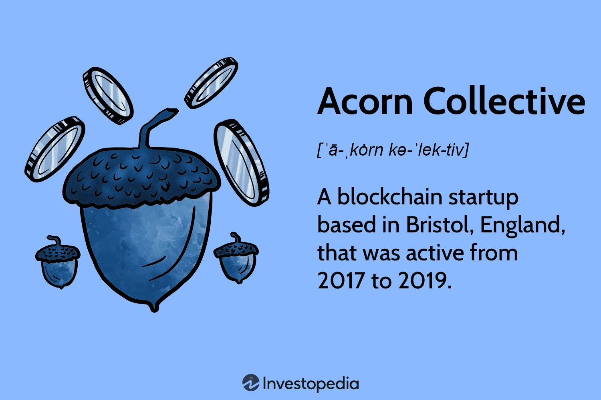

Crowdfunding has evolved significantly with the integration of blockchain technology and digital currencies, offering a disruptive approach to traditional fundraising mechanisms. Blockchain's decentralized nature provides unparalleled transparency and efficiency, reducing the need for intermediaries and lowering transaction costs. This transformation has opened the field to a vast global pool of investors, democratizing access to capital for entrepreneurs worldwide.

Acorn Collective emerged within this innovative landscape, harnessing blockchain's capabilities to offer a novel crowdfunding experience. Positioned as a forward-thinking platform, the Collective aimed to redefine how entrepreneurs and investors interact during fundraising processes. By leveraging its native token, OAK, Acorn Collective sought to provide an accessible, cost-effective crowdfunding solution, empowering both startups and seasoned investors.



This article examines the amalgamation of three cutting-edge technologies: blockchain, crowdfunding, and algo trading, as realized by Acorn Collective. This examination sets the stage for understanding how these technological confluences could potentially revolutionize the crowdfunding sector, offering new opportunities for stakeholders involved in the digital economy.

## Table of Contents

## Understanding Blockchain Crowdfunding

Blockchain crowdfunding utilizes decentralized networks to provide increased transparency and operational efficiency in fundraising. By leveraging blockchain technology, this innovative approach diminishes the need for intermediaries, subsequently reducing associated costs and enabling access to a broader, global pool of investors.

The primary advantage of blockchain crowdfunding lies in its decentralized nature, which facilitates a more direct connection between fundraisers and supporters. Traditional crowdfunding platforms typically involve multiple intermediaries—such as banks and payment processors—that add complexity and cost to the process. Blockchain, on the other hand, employs smart contracts to automate and enforce agreements, ensuring that funds are transferred directly from backers to project creators without the need for third-party intervention. This significantly reduces overheads and enhances transaction transparency.

Acorn Collective exemplified the potential of blockchain crowdfunding through its use of a native cryptocurrency, the OAK token. The platform aimed to democratize access to capital by offering a free and open marketplace for both entrepreneurs and investors. By utilizing OAK, Acorn sought to streamline transactions and provide a low-cost solution for businesses seeking funding. The token served as a medium of exchange within the ecosystem, facilitating smooth and secure financial transactions.

In addition to cost efficiency, blockchain crowdfunding offers enhanced security. The immutable nature of blockchain records ensures that all transactions are traceable and tamper-proof, bolstering investor confidence. Furthermore, the global reach of blockchain networks allows entrepreneurs to connect with investors from diverse geographical locations, expanding their potential funding sources considerably.

The integration of blockchain technology into crowdfunding represents a shift towards more inclusive and efficient fundraising mechanisms. By eliminating intermediaries and leveraging native tokens like OAK, platforms such as Acorn Collective highlighted how blockchain can be harnessed to lower barriers to entry, providing a promising alternative to traditional fundraising methods.

## A Glimpse into Acorn Collective

Acorn Collective was launched with the mission to redefine the crowdfunding landscape by utilizing blockchain technology. Established in 2017, the project aimed to make crowdfunding more accessible and affordable through its decentralized platform. The key innovation of Acorn Collective was its integration of the OAK token, a native [cryptocurrency](/wiki/cryptocurrency) designed to facilitate transactions within its ecosystem. By employing blockchain, Acorn Collective promised a reduced cost structure for both entrepreneurs seeking funding and investors contributing to projects.

At its core, the concept of Acorn Collective revolved around the elimination of traditional intermediaries inherent in conventional fundraising models. By building a transparent and secure environment on the blockchain, Acorn intended to create a marketplace where businesses could reach a global audience free of the barriers often imposed by geographical and financial circumstances.

Despite the promise of a groundbreaking crowdfunding ecosystem, the Acorn Collective faced significant hurdles that ultimately led to its collapse. Nevertheless, the platform's ambition to enable a decentralized, blockchain-powered marketplace for funding and transactions remains a poignant example of how technology can be leveraged to democratize access to capital.

## Challenges Faced by Acorn Collective

The Acorn Collective faced several significant challenges that ultimately led to its collapse. A primary [factor](/wiki/factor-investing) was the Initial Coin Offering (ICO) market collapse of 2018-2019. This period marked a dramatic downturn in investor confidence in blockchain initiatives, leading to a sharp decline in funding for projects relying on ICOs. The market at that time was saturated with numerous projects that often over-promised and under-delivered, which led to increased scrutiny and reduced trust from investors.

For Acorn Collective, this meant a significant impact on their operational funding. The decrease in ICO activity directly correlated with the availability of capital, which is crucial for the development and maintenance of their platform.

Moreover, the technical complexities associated with building a blockchain-based crowdfunding platform were underestimated. Blockchain technology, while offering transparency and security, involves intricate technical challenges that can be resource-intensive and time-consuming to address. The architecture for such a platform requires robust mechanisms to handle smart contracts, ensure security, and manage scalability.

Despite securing initial investments, Acorn Collective struggled to maintain financial [momentum](/wiki/momentum). The financial burden of continuing development in a rapidly evolving technological landscape, along with the downturn in ICO funding, strained their resources. As a result, the company could not sustain its operations in the long term, ultimately leading to its closure.

## Algo Trading: Enhancing Blockchain Crowdfunding

Algorithmic trading, commonly known as algo trading, introduces a transformative element to blockchain-based crowdfunding platforms by providing precision and speed in executing financial transactions. This is achieved through the implementation of automated trading strategies that not only enhance [liquidity](/wiki/liquidity-risk-premium) but also boost the overall efficiency of these platforms.

Adopting algo trading on crowdfunding platforms can significantly optimize token transactions, offering numerous benefits to both investors and platform operators. These automated strategies are formulated using algorithms capable of analyzing vast datasets to make informed trading decisions within milliseconds. For example, algo trading algorithms can monitor real-time market conditions and execute buy or sell orders when pre-set conditions are met. This reduces the delay and human error associated with manual trading processes.

Incorporating algo trading in blockchain crowdfunding platforms like Acorn could notably improve liquidity, which is crucial for maintaining a vibrant trading environment. Enhanced liquidity means that tokens can be bought and sold more easily, which can attract more participants and provide a more dynamic and flexible market environment. Code implementations such as the following Python example showcase a basic strategy leveraging moving averages to trigger trades based on market fluctuations:

```python
def moving_average(data, period):
    return data.rolling(window=period).mean()

def trading_strategy(prices, short_window, long_window):
    signals = pd.DataFrame(index=prices.index)
    signals['price'] = prices
    signals['short_mavg'] = moving_average(prices, short_window)
    signals['long_mavg'] = moving_average(prices, long_window)
    signals['signal'] = 0.0
    signals['signal'][short_window:] = np.where(
        signals['short_mavg'][short_window:] > signals['long_mavg'][short_window:], 1.0, 0.0)
    signals['positions'] = signals['signal'].diff()
    return signals
```

In the above code, a short-term and a long-term moving average are calculated to devise trade signals. When the short-term average crosses above the long-term average, it generates a buy signal, and a sell signal when it crosses below. Such strategies exemplify the potential to automate decision-making processes, thereby enhancing the efficiency of transactions on these platforms.

Moreover, by optimizing transactions through [algorithmic trading](/wiki/algorithmic-trading), investor experience can dramatically improve. The minimization of manual intervention in trading allows for faster transactions, which in turn reduces waiting times and associated costs. This also provides investors with a more predictable and reliable trading environment, encouraging more significant investor participation and fostering a healthier crowdfunding ecosystem.

In conclusion, the integration of algo trading can position blockchain crowdfunding platforms to achieve better performance by enhancing transaction speed, lowering costs, and improving liquidity. As these technologies continue to evolve, their potential to transform the digital crowdfunding landscape will likely increase, paving the way for innovative investment solutions and accelerated market growth.

## Potential and Future Prospects

The Acorn Collective's approach to merging blockchain with crowdfunding, albeit challenged, underscores significant prospects for future applications within this space. Central to this potential is the decentralization offered by blockchain technology, which inherently provides transparency, security, and efficiency—core attributes essential for fostering trust and participation in crowdfunding. Despite the project's closure, the ability to democratize access to capital through blockchain remains a pivotal lesson from Acorn's ambitions.

Emerging opportunities lie in refining the Acorn model by addressing the technological and financial hurdles it encountered. Incorporating new technologies like [artificial intelligence](/wiki/ai-artificial-intelligence) can substantially bolster future blockchain crowdfunding platforms. AI can optimize platforms by offering predictive analytics for investment risks, personalized recommendations for investors, and enhanced fraud detection mechanisms, thus mitigating some of the challenges Acorn faced.

Moreover, enhancing user experience through the seamless integration of algo trading can boost liquidity and efficiency on crowdfunding platforms. Algorithmic trading allows for automated execution of transactions, ensuring timely and cost-effective trading processes. By addressing efficiency concerns and potential bottlenecks in crypto transactions, future platforms can offer a more enticing proposition to investors.

To create resilient and scalable blockchain crowdfunding systems, future platforms can draw lessons from the failures and aspirations of the Acorn Collective. Critically, this encompasses a careful evaluation of technical infrastructure, regulatory considerations, and sustainable financial models. Addressing these areas can enable the development of platforms that are more adaptive to market changes and technological advancements.

In summary, while Acorn Collective's journey met with obstacles, its model serves as a beacon for the latent potential that lies in the intersection of blockchain and crowdfunding. By integrating modern technologies and maintaining a vigilant approach to past pitfalls, future platforms can build upon Acorn’s foundation, leading to more robust and effective crowdfunding ecosystems.

## Conclusion

The demise of Acorn Collective was a setback, but it provided valuable insights into the potential of blockchain crowdfunding. Acorn's initiative demonstrated that blockchain technology could significantly enhance the fundraising process by ensuring greater transparency, reducing costs, and expanding the investor base. Despite the project's ultimate failure, its vision continues to serve as a foundation for future developments in the sector.

One of the key takeaways from Acorn's journey is the importance of embracing technological advancements like algorithmic trading. Algo trading can bring added precision and efficiency to blockchain-based crowdfunding platforms by automating complex trading strategies. For example, algorithmic approaches can be employed to manage the supply and demand of native tokens more effectively, ensuring robust liquidity and smoother transactions for investors.

```python
def calculate_liquidity(demand, supply):
    return demand / supply
```

Incorporating algo trading allows platforms to identify optimal buying and selling points, thereby maximizing investor value and engagement. By leveraging such technologies, future platforms can avoid some of the pitfalls encountered by Acorn Collective, especially those related to sustaining financial momentum and managing [volatility](/wiki/volatility-trading-strategies).

The ongoing evolution of this domain continues to invite ingenuity and experimentation. With the integration of new technologies such as artificial intelligence and [machine learning](/wiki/machine-learning), blockchain crowdfunding is primed for revolutionary shifts. These tools offer the potential to enhance decision-making, streamline operations, and ultimately democratize access to capital on a global scale. As developers and entrepreneurs build on the lessons learned from early pioneers like Acorn Collective, they can lead the way in establishing more resilient and scalable crowdfunding systems.

## References & Further Reading

[1]: Mougayar, W. (2016). ["The Business Blockchain: Promise, Practice, and Application of the Next Internet Technology."](https://books.google.com/books/about/The_Business_Blockchain.html?id=CEsPDAAAQBAJ) Wiley.

[2]: Narayanan, A., Bonneau, J., Felten, E., Miller, A., & Goldfeder, S. (2016). ["Bitcoin and Cryptocurrency Technologies: A Comprehensive Introduction."](https://press.princeton.edu/books/hardcover/9780691171692/bitcoin-and-cryptocurrency-technologies) Princeton University Press.

[3]: Tapscott, D., & Tapscott, A. (2016). ["Blockchain Revolution: How the Technology Behind Bitcoin is Changing Money, Business, and the World."](https://dl.acm.org/doi/10.5555/3051781) Portfolio.

[4]: Nakamoto, S. (2008). ["Bitcoin: A Peer-to-Peer Electronic Cash System."](https://nakamotoinstitute.org/library/bitcoin/)

[5]: Bustillos, M., & Teh, K. S. (2019). ["Crowdfunding using blockchain: Lessons in fairness and transparency from the ICO bubble."](https://www.researchgate.net/publication/367555841_Crowdfunding_using_Blockchain_Technology_A_Review_Blockchain_Crowdfunding) Blockchain at Berkeley Blog.

[6]: Vigna, P., & Casey, M. J. (2015). ["The Age of Cryptocurrency: How Bitcoin and Digital Money are Challenging the Global Economic Order."](https://dl.acm.org/doi/10.5555/2717097) Picador. 

[7]: de Prado, M. L. (2018). ["Advances in Financial Machine Learning."](https://www.amazon.com/Advances-Financial-Machine-Learning-Marcos/dp/1119482089) Wiley.