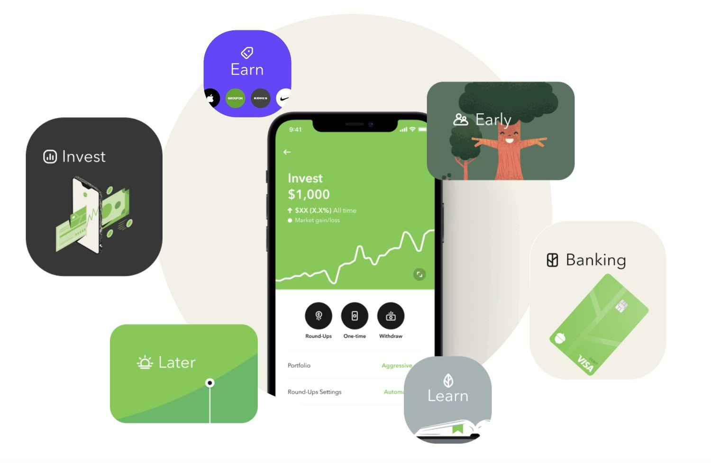

The world of investing is continuously evolving with technological advancements, adapting to the needs of modern investors seeking efficient and effective solutions. A prominent development in 2024 is the sustained popularity of the Acorns app, which continues to be a preferred platform for micro-investing. As digital investment tools proliferate, Acorns distinguishes itself through its user-friendly design, making it a feasible choice for beginner investors aiming to enter the financial markets with minimal barriers.

Acorns is known for its automated investment strategies, which leverage technology to simplify the process of investing small, incremental amounts. The app's signature feature, Round-Ups, allocates spare change from everyday transactions into diversified portfolios, offering an innovative approach to growing one's investments passively. This seamless integration into daily financial habits exemplifies how Acorns has adapted traditional investment principles to fit into a modern, digital lifestyle.

This article aims to explore the investment strategies that Acorns app employs, emphasizing its automated features and the algo trading capabilities that allow users to invest without direct intervention. We will also examine the user experience, explore options for portfolio customization, and evaluate Acorns' overall performance. By providing an in-depth review, we hope to offer valuable insights for both potential and existing users considering or currently utilizing the Acorns app for their investment needs. The goal is to present a comprehensive understanding of how Acorns operates within the dynamic landscape of financial technology and investment management.

## Table of Contents

## What is Acorns App?

Acorns is a robo-advisor app that has revolutionized the way people, particularly beginners, engage with investing. It aims to streamline the investment process and make it accessible to a wider audience, regardless of their financial knowledge or experience. At its core, Acorns simplifies investing by enabling users to invest spare change from their everyday transactions using a unique feature called "Round-Ups." This feature automatically rounds up the user's credit or debit card transactions to the nearest dollar and invests the difference, thereby facilitating a seamless and incremental investment process without requiring significant upfront capital.

The app offers tiered account levels—Bronze, Silver, and Gold—each differing in terms of features and associated fees, providing flexibility depending on the user's financial goals and investment capacity. These tiers are structured to cater to a range of investment needs, from basic spare change investment to more comprehensive account management and advisory services.

Acorns further enhances accessibility by automatically allocating user funds into a diversified portfolio. The portfolios are crafted based on the Modern Portfolio Theory, aiming to optimize returns for a given level of risk through diversification. Users can select their preferred risk level, allowing the algorithm to allocate their funds across various asset classes such as equities and fixed income. The automated nature of Acorns' portfolio management ensures that users can engage in investing without needing to manually adjust or rebalance their portfolios, thereby maintaining alignment with their financial strategies.

Overall, Acorns provides a user-friendly platform that encourages consistent investment habits and promotes financial literacy among beginners and seasoned investors alike.

## Investment Strategy and Portfolio Management

Acorns employs an automated investment strategy designed to streamline the investment process for users. Its primary mechanism for portfolio construction involves the use of Exchange Traded Funds (ETFs), which are selected to fit varying risk profiles. Users can choose from conservative, moderate, and aggressive growth portfolios, each containing a distinct mix of asset classes. These asset allocations are intended to align with the user's financial goals and risk tolerance, offering a spectrum of potential returns and volatilities.

The app's emphasis on diversification is evident with its inclusion of Environmental, Social, and Governance ([ESG](/wiki/esg-investing)) ETFs and Bitcoin-linked ETFs. This incorporation allows investors to participate in ethically oriented and [cryptocurrency](/wiki/cryptocurrency) markets, providing enhanced diversification for users interested in these sectors. However, unlike many other investment platforms, Acorns does not feature tax-loss harvesting. This means users miss out on the potential tax advantages that can arise from offsetting gains with losses within a portfolio.

To ensure that portfolios remain aligned with users' investment strategies over time, Acorns provides automatic rebalancing. This process systematically adjusts the portfolio back to the target asset allocation, counteracting the effects of market fluctuations that might push the allocation off [course](/wiki/best-algorithmic-trading-courses). By doing so, it maintains the intended level of risk and return, optimizing the investment strategy without requiring direct user intervention.

## Algo Trading Features

The Acorns app incorporates automated features that parallel [algorithmic trading](/wiki/algorithmic-trading) principles. Users' investments are facilitated through recurring transfers and the Round-Ups feature, which automatically allocates spare change from everyday transactions into their investment accounts. This automation simplifies the investment process for individuals, particularly those new to investing, by incorporating disciplined savings habits seamlessly into their daily financial activities.

The foundational concept behind Acorns' approach lies in using automation to remove the element of emotional investing and the complexities tied to market timing. By automatically investing small amounts, often linked to consumer transactions, Acorns demonstrates a rudimentary form of algorithmic investment strategy, capitalizing on the idea of dollar-cost averaging. This strategy involves buying a fixed dollar amount of a particular investment on a regular schedule, regardless of the asset's price, reducing the impact of market [volatility](/wiki/volatility-trading-strategies).

Beyond Round-Ups, Acorns analyzes user data to enhance investment optimization and portfolio management. The app considers various factors, including user-defined preferences and risk tolerance, to allocate investments into a diversified portfolio of Exchange-Traded Funds (ETFs). While not as sophisticated as full-scale algorithmic trading systems that execute complex strategies in high-frequency trading environments, Acorns leverages basic data analysis to achieve investment efficiency tailored to the individual investor’s goals and risk profile.

This method of operation ensures users can maintain aligned portfolios with their financial objectives without actively managing individual stocks or market investments. However, it's important to note that despite these features, Acorns does not support more advanced functionalities, such as tax-loss harvesting, which can be significant for users with larger investment portfolios. Overall, Acorns provides a simplified, automated investment experience, borrowing elements from algorithmic strategies to enhance accessibility for novice investors.

## User Experience and Interface

Acorns provides an intuitive and user-friendly interface designed to accommodate users with minimal investment experience. The platform is accessible on both desktop and mobile devices, offering a seamless transition between the two to meet user preferences and availability. This accessibility ensures that investors can monitor their investments irrespective of their location, thus enhancing the overall user experience.

The app layout emphasizes simplicity, with clearly labeled sections and straightforward navigation. Upon logging in, users are welcomed by an overview of their investment accounts, showcasing the total account balance, recent transactions, and performance charts. This real-time snapshot enables investors to quickly assess their portfolio's performance and progress towards financial goals.

One of Acorns' standout features is the real-time updates on portfolio performance. These updates are crucial in assisting users to visualize changes in their investments in relation to market movements. Performance data is graphically represented, often through easy-to-understand charts and graphs, so even those unfamiliar with financial jargon can comprehend their investment status. This feature ensures that users are always informed about the status of their investments, allowing for greater engagement and more informed decision-making.

Furthermore, the interface allows for customization to some extent, permitting users to adjust settings to suit their individual needs. For example, notifications can be customized to alert users about significant portfolio changes or when investment deposits occur. These customizable alerts can enhance the user experience by providing timely information that aligns with personal investment strategies and goals.

Overall, the Acorns app successfully combines simplicity with functionality, ensuring that users with varying degrees of investment knowledge can easily manage and track their portfolios. This focus on usability and accessibility has contributed to its popularity among novice investors looking for a hassle-free introduction to investing.

## Fees and Costs

Acorns imposes a tiered monthly fee structure of $3, $5, or $9, corresponding respectively to its Bronze, Silver, and Gold account levels. This fee structure, while straightforward, poses a substantial consideration for users with smaller account balances. For example, if an account holds $300 and is subject to a $3 monthly fee, the annual cost of $36 equates to a 12% fee relative to the account's value—a significant expense which may exceed potential investment returns, especially in years of modest market performance.

Despite this potential drawback, Acorns offers a suite of features that might warrant the expense for those valuing convenience and ease of use in their investment strategy. The app's automated savings and investment functionalities provide a seamless experience for users, simplifying the often-daunting process of investment management. This ease of entry can be particularly beneficial for novice investors or those who prefer a passive role in portfolio oversight.

Acorns' diversified portfolios are designed to align with different risk preferences, and its automated rebalancing helps maintain the chosen investment strategy without requiring user intervention. For individuals seeking an investment platform with a low barrier to entry and minimal active management requirements, Acorns can be an attractive option, as these features offer added value beyond the tangible costs implied by the fee structure.

## Pros and Cons

Acorns app presents several advantages for individuals looking to embark on their investment journey through automated micro-investing. One of the most notable benefits is its ability to invest spare change through the Round-Ups feature, seamlessly accumulating and deploying small amounts of money into an investment portfolio. This approach lowers the barrier to entry for users, allowing them to start investing with minimal initial capital. Furthermore, Acorns maintains transparency by implementing a simple fee structure without hidden charges, adding to its appeal for novice investors seeking straightforward solutions.

However, prospective and current users should also be aware of some limitations. A primary concern is the relatively high fee structure, especially concerning small account balances. With monthly charges starting at $3, the cost can become significant if the returns on investment do not adequately cover these expenses. This aspect is particularly critical for those with minimal balances, as fees might erode the investment gains over time. 

Additionally, while Acorns offers automated portfolio management, customization options are somewhat limited. Users are primarily restricted to a fixed set of portfolio options, which might not cater to those with more specific investment preferences or strategies. The absence of tax-loss harvesting is another drawback, particularly for tax-minded investors looking to optimize after-tax returns, as they miss out on strategic avenues for minimizing tax liabilities through loss offsetting.

In summary, Acorns serves as a convenient platform for beginners looking to enter the market with little effort and capital. However, potential users should weigh the implications of its fees and limited customization against its strengths in automated micro-investing.

## Security and Customer Support

Acorns prioritizes user security through robust protective measures, ensuring that users' financial and personal information remains safe. The app employs two-[factor](/wiki/factor-investing) authentication (2FA) as a primary security feature. This method requires users to provide two separate forms of identification before gaining access to their accounts, thereby adding an additional layer of security beyond simple passwords. Furthermore, Acorns implements SSL (Secure Socket Layer) encryption. SSL encryption secures the data transmitted between the user's device and Acorns' servers, safeguarding it from potential interception by unauthorized parties.

In addition to security measures, Acorns offers comprehensive customer support options, although users report variability in response times. Support is accessible via chat, email, and phone, providing multiple channels for addressing user concerns and queries. The availability of these different support methods ensures that users can choose the most convenient way to get assistance, although the quality and speed of response may differ.

Acorns also assures users that their account information is well-regulated and safeguarded under the protections offered by the Securities Investor Protection Corporation (SIPC). This insurance covers securities and cash in a brokerage account up to $500,000, including a $250,000 limit for cash. This level of protection is crucial for users' confidence, ensuring that their investments have a safety net against potential risks associated with broker-dealer failures.

By combining strong security protocols with accessible customer support and account insurance, Acorns provides a secure and reliable platform for users embarking on their investment journey.

## Conclusion

Acorns remains a proper choice for novice investors who seek a straightforward entry into investing. Its approach of automatically managed portfolios offers a largely stress-free experience, as the app handles the intricacies of asset allocation and rebalancing. This automation aligns with the aim of providing an effortless pathway for users who may not yet possess extensive investment knowledge or confidence.

The fee structure, ranging from $3 to $9 per month depending on the user's chosen account level, is an aspect potential users should consider closely. For small account balances, the impact of such fees on net returns can be significant, potentially undermining the benefits of micro-investing. Therefore, users with modest investments must evaluate whether the app's convenience and accessibility outweigh the associated costs.

While the application does not support advanced features such as tax-loss harvesting, which may be a limitation for more seasoned investors, its micro-investment approach mimics aspects of algorithm trading by leveraging automated contributions and portfolio management. For those who have an interest in exploring algorithmic investment strategies without the complexities typically associated with them, Acorns provides a simplified, accessible model.

## References & Further Reading

[1]: ["Investing Basics: How Acorns Works"](https://www.acorns.com/learn/acorns/how-does-acorns-work/), Investopedia.

[2]: Malkiel, B.G. (1996). ["A Random Walk Down Wall Street: The Time-Tested Strategy for Successful Investing"](https://www.academia.edu/10850809/A_Random_Walk_Down_Wall_Street_The_Time_Tested_Strategy_for_Successful_Investing). W.W. Norton & Company.

[3]: ["Modern Portfolio Theory: Foundations, Analysis, and New Developments"](https://www.wiley.com/en-us/Modern+Portfolio+Theory%3A+Foundations%2C+Analysis%2C+and+New+Developments%2C+%2B+Website-p-9781118370520) by Martin J. Gruber.

[4]: Bhansali, V. (2014). ["All About Dividend Investing"](https://www.amazon.com/All-About-Dividend-Investing-Second/dp/0071637133). McGraw-Hill Education.

[5]: Tseng, V. (2019). ["Robo-Advisors: Passive Investment For The 21st Century"](https://scholar.google.com/citations?user=DFjmS6AAAAAJ), Forbes.

[6]: Sharpe, W.F. (1964). ["Capital Asset Prices: A Theory of Market Equilibrium Under Conditions of Risk."](https://onlinelibrary.wiley.com/doi/full/10.1111/j.1540-6261.1964.tb02865.x) Journal of Finance, 19(3): 425-442.

[7]: Markowitz, H. (1952). ["Portfolio Selection."](https://www.jstor.org/stable/2975974) The Journal of Finance, 7(1): 77-91.