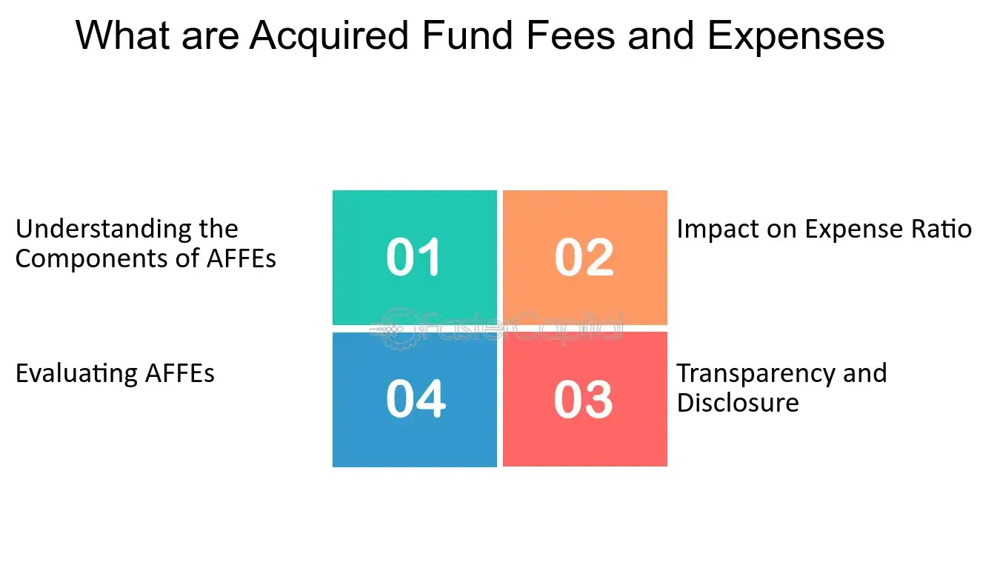

## Table of Contents

## What are Acquired Fund Fees and Expenses (AFFE)?

Acquired Fund Fees and Expenses (AFFE) are costs that investors pay indirectly when they invest in a fund that itself invests in other funds. These fees are not directly charged to the investor but are part of the overall cost of the investment. For example, if you invest in a mutual fund that holds shares in other mutual funds or ETFs, the fees and expenses of those underlying funds are passed on to you as part of the AFFE.

Understanding AFFE is important because these costs can affect the overall return on your investment. They are usually listed in the fund's prospectus, which is a document that provides detailed information about the fund. Even though AFFE might seem small, over time they can add up and reduce the amount of money you earn from your investment. It's a good idea to look at these fees when choosing where to invest your money.

## How do Acquired Fund Fees and Expenses differ from other fund fees?

Acquired Fund Fees and Expenses (AFFE) are different from other fund fees because they are costs you pay indirectly. When you invest in a fund that holds other funds, like a mutual fund that invests in ETFs, the fees of those other funds are passed on to you. These are the AFFE. They are not fees that the fund you directly invest in charges you, but rather fees from the funds your fund invests in.

Other fund fees, on the other hand, are charged directly by the fund you invest in. These can include management fees, which pay for the fund managers who choose what to invest in, and administrative fees, which cover the costs of running the fund. These fees are usually listed clearly in the fund's prospectus and are taken out of your investment before you see any returns. Understanding the difference between AFFE and other direct fees helps you see the full cost of your investment and how it might affect your returns.

## Why are Acquired Fund Fees and Expenses important for investors to understand?

Acquired Fund Fees and Expenses (AFFE) are important for investors to understand because they add to the total cost of investing. When you put your money into a fund that itself invests in other funds, you end up paying the fees of those other funds indirectly. These fees might seem small, but over time, they can reduce the amount of money you make from your investment. Knowing about AFFE helps you see the true cost of where you are putting your money.

Understanding AFFE also helps you make better choices about where to invest. If you are comparing different funds, looking at their AFFE can show you which one might be cheaper in the long run. This way, you can pick the fund that not only matches your investment goals but also keeps more money in your pocket by having lower overall fees.

## How are Acquired Fund Fees and Expenses calculated?

Acquired Fund Fees and Expenses (AFFE) are calculated by looking at the fees and expenses of the other funds that your fund invests in. If you invest in a fund, and that fund puts some of its money into other funds like ETFs or mutual funds, those other funds have their own fees. The AFFE is the total of all those fees from the other funds, based on how much of your fund's money is invested in them.

These fees are usually shown as a percentage of the fund's assets. For example, if your fund has $100 invested in another fund that charges a 1% fee, that would add $1 to your AFFE. The fund's prospectus, which is a document that tells you about the fund, will list the AFFE so you can see how much you are paying indirectly. It's important to check this because even small percentages can add up over time and affect how much money you make from your investment.

## Where can investors find information about Acquired Fund Fees and Expenses in fund documents?

Investors can find information about Acquired Fund Fees and Expenses (AFFE) in the fund's prospectus. The prospectus is a detailed document that tells you everything you need to know about a fund, including what it invests in and how much it costs. In the prospectus, there will be a section that lists all the fees and expenses, and this is where you'll see the AFFE mentioned. It will be shown as a percentage of the fund's assets, so you can understand how much you are paying indirectly through the fees of the other funds the fund invests in.

Looking at the AFFE in the prospectus helps you see the total cost of your investment. Even though these fees might seem small, they can add up over time and affect how much money you make from your investment. It's a good idea to compare the AFFE of different funds when you are choosing where to invest your money. This way, you can pick the fund that not only fits your investment goals but also keeps more money in your pocket by having lower overall fees.

## Can Acquired Fund Fees and Expenses impact the overall return of an investment?

Yes, Acquired Fund Fees and Expenses (AFFE) can impact the overall return of an investment. When you invest in a fund that itself invests in other funds, you pay the fees of those other funds indirectly. These fees might seem small, but over time, they can add up and reduce the amount of money you make from your investment. For example, if a fund you invest in has a lot of AFFE, it means a bigger part of your returns goes towards paying those fees, leaving you with less money at the end.

Understanding AFFE is important because it helps you see the true cost of your investment. Even though these fees are not charged directly by the fund you invest in, they still affect how much you earn. By checking the AFFE in the fund's prospectus, you can compare different funds and choose the one that not only matches your investment goals but also has lower overall fees. This way, you keep more of your investment returns in your pocket.

## How do Acquired Fund Fees and Expenses affect the expense ratio of a fund?

Acquired Fund Fees and Expenses (AFFE) are part of the total cost of investing in a fund. When you invest in a fund that puts its money into other funds, like ETFs or mutual funds, those other funds have their own fees. These fees are called AFFE and they add to the expense ratio of the fund you're investing in. The expense ratio is a number that shows how much it costs to run the fund, and it's shown as a percentage of the fund's assets.

AFFE can make the expense ratio of a fund go up. If a fund has a lot of AFFE, it means the overall cost of investing in that fund is higher. This is because the fees from the other funds the fund invests in are added to the direct fees the fund charges, like management and administrative fees. A higher expense ratio means less money in your pocket because more of your investment returns go towards paying these costs.

## What strategies can investors use to minimize the impact of Acquired Fund Fees and Expenses?

Investors can minimize the impact of Acquired Fund Fees and Expenses (AFFE) by choosing funds that invest directly in stocks, bonds, or other assets instead of other funds. This way, they avoid the extra fees that come from investing in funds that hold other funds. By looking at a fund's prospectus, investors can see how much AFFE they might have to pay. If a fund has high AFFE, it might be better to pick a different fund with lower or no AFFE.

Another strategy is to compare the expense ratios of different funds. The expense ratio shows the total cost of investing in a fund, including AFFE. By choosing funds with lower expense ratios, investors can keep more of their returns. It's also a good idea to think about how long you plan to keep your money in the fund. Over many years, even small fees can add up, so [picking](/wiki/asset-class-picking) funds with lower AFFE can make a big difference in the long run.

## How do regulatory bodies oversee the disclosure of Acquired Fund Fees and Expenses?

Regulatory bodies like the Securities and Exchange Commission (SEC) in the United States make sure that funds tell investors about Acquired Fund Fees and Expenses (AFFE). They do this by setting rules that say funds have to list all their fees, including AFFE, in their prospectus. This is a document that tells you everything about the fund, so you can see all the costs before you decide to invest. The SEC checks that funds follow these rules and that the information they give to investors is clear and easy to understand.

By making sure funds show their AFFE clearly, regulatory bodies help investors make better choices. If you know all the fees you might have to pay, you can compare different funds and pick the one that is right for you. This way, you can keep more of your investment returns and not be surprised by hidden costs.

## What are some common misconceptions about Acquired Fund Fees and Expenses?

A common misconception about Acquired Fund Fees and Expenses (AFFE) is that they don't matter much because they are small. People sometimes think that since AFFE are usually shown as a tiny percentage, they won't make a big difference in their investment. But over time, even small fees can add up and take away a lot from your returns. It's important to look at AFFE because they can affect how much money you make from your investment in the long run.

Another misconception is that AFFE are the same as the direct fees a fund charges. But AFFE are different because they come from the fees of other funds that your fund invests in. Direct fees, like management fees, are charged by the fund you invest in directly. AFFE are indirect costs that add to the total expense of your investment. Understanding the difference helps you see the full cost of where you are putting your money.

## How have Acquired Fund Fees and Expenses evolved over time in the investment industry?

Over time, Acquired Fund Fees and Expenses (AFFE) have become more important in the investment world. As more funds started to invest in other funds, like ETFs and mutual funds, the fees from those other funds added up. This meant that investors were paying more in indirect costs. In the past, people didn't always know about these extra fees because they weren't shown clearly. But now, rules have changed to make sure funds tell investors about AFFE in their prospectus, so people can see all the costs before they invest.

Today, investors are more aware of AFFE and how they can affect their returns. Because of this, many funds have tried to lower their AFFE to attract more investors. Some funds have even changed their strategies to invest directly in stocks or bonds instead of other funds, which helps reduce these indirect costs. As a result, the overall expense of investing in funds has gone down over time, making it easier for investors to keep more of their money.

## What advanced analytical methods can be used to assess the long-term impact of Acquired Fund Fees and Expenses on portfolio performance?

To understand how Acquired Fund Fees and Expenses (AFFE) affect a portfolio over a long time, investors can use advanced analytical methods like Monte Carlo simulations. This method helps by running many different scenarios to see how AFFE might change the value of an investment over time. By doing this, investors can see how even small fees can add up and take away from their returns. It's like playing out many possible futures to get a good idea of what might happen to your money.

Another way to look at the long-term impact of AFFE is by using regression analysis. This method helps find patterns between AFFE and the performance of a portfolio. By studying past data, investors can see how AFFE have affected returns in the past and use that to guess how they might affect returns in the future. Both of these methods help investors make better choices about where to put their money by showing them the true cost of their investments over many years.

## What is the understanding of Multi-Manager and Fund-of-Funds Investments?

A fund of funds (FOF) represents a strategic approach where investments are directed into other mutual funds or hedge funds. This method effectively enables investors to achieve broad diversification and suitable asset allocation, as FOFs invest across a range of fund categories. The fundamental advantage of this strategy lies in its capacity to provide exposure to a variety of investment opportunities, thus spreading risk across multiple asset classes and management styles.

The structure of FOFs typically encapsulates two levels of fees that investors must consider. The first level involves a management fee charged by the fund of funds itself. This fee compensates the FOF manager for selecting and overseeing the portfolio of underlying funds. The second level includes additional fees associated with the underlying funds in which the FOF invests. These may comprise management fees, performance fees, and other operational expenses intrinsic to each underlying fund.

Mathematically, the total expense incurred by an investor in a FOF can be represented as:

$$
\text{Total Expense Ratio (TER)} = \text{Management Fee}_{\text{FOF}} + \sum_{i=1}^{n} \left( \text{Management Fee}_{i} + \text{Expense Ratio}_{i} \right)
$$

Here, $\text{Management Fee}_{\text{FOF}}$ is the fee levied by the fund of funds, while $\text{Management Fee}_{i}$ and $\text{Expense Ratio}_{i}$ are the fees for each of the $i$ underlying funds within the portfolio. The ability of FOFs to offer diverse investment options is counterbalanced by these aggregated fee layers, necessitating careful scrutiny by investors to ensure that the potential returns justify the costs involved.

Overall, while FOFs offer enhanced diversification and professional management, investors must thoroughly assess the associated costs, particularly the compound effect of layered fees, before committing to such investment vehicles.

## What is the impact of AFFE on algorithmic trading?

Algorithmic trading leverages automated systems to execute trades based on predefined instructions, utilizing speed and efficiency to capitalize on market opportunities. In this context, precise cost calculations are essential to maintain profitability. Acquired Fund Fees and Expenses (AFFE), representing the costs associated with the underlying funds in a multi-manager structure, become a critical [factor](/wiki/factor-investing) influencing these calculations.

Understanding AFFE is crucial for algorithm-driven portfolios, as these expenses can directly impact the net returns of an investment strategy. Algorithmic trading strategies typically involve large volumes of transactions, and even marginal variations in cost structures can significantly affect overall performance. For instance, when calculating the expected return of a trading strategy, AFFE must be accounted for to ensure that the transaction costs do not overshadow the anticipated profits. The formula for calculating net returns could be expressed as:

$$
\text{Net Return} = \text{Gross Return} - (\text{Transaction Costs} + \text{AFFE})
$$

Here, incorporating AFFE alongside transaction costs allows for a more comprehensive assessment of the trading strategy's effectiveness.

Moreover, the cost-benefit analysis inherent in [algorithmic trading](/wiki/algorithmic-trading) requires algorithms to evaluate the potential profitability of trades after accounting for all expenses, including AFFE. This ensures that trades contributing positively to the portfolio's performance are prioritized. In Python, an algorithm might implement such an evaluation using a cost-adjusted return calculation like this:

```python
def calculate_cost_adjusted_return(gross_return, transaction_costs, affe):
    return gross_return - (transaction_costs + affe)

# Example usage
gross_return = 0.07  # 7% gross return
transaction_costs = 0.01  # 1% of transaction costs
affe = 0.005  # 0.5% AFFE

net_return = calculate_cost_adjusted_return(gross_return, transaction_costs, affe)
print(f"Cost-Adjusted Net Return: {net_return:.4f}")
```

In this example, understanding and inputting AFFE into the algorithm's calculations are pivotal for ensuring that only viable trades are executed, thereby optimizing the trading strategy's performance.

Overall, integrating AFFE into algorithmic trading's quantitative assessments ensures accurate evaluation of potential returns, contributing to the successful deployment of trading strategies. This integration highlights the necessity of a comprehensive understanding of all associated expenses in achieving and maintaining trading efficiency and profitability.

## References & Further Reading

[1]: ["Fund Fees and Expenses"](https://www.nerdwallet.com/article/investing/mutual-fund-fees-what-investors-need-to-know) by the U.S. Securities and Exchange Commission (SEC).

[2]: Clunie, J. (2010). "Fund-of-Funds versus Multi-Manager Funds: Structural Differences and Investment Implications." CFA Institute Journal Review.

[3]: ["Algorithmic Trading and DMA: An Introduction to Direct Access Trading Strategies"](https://www.amazon.com/Algorithmic-Trading-DMA-introduction-strategies/dp/0956399207) by Barry Johnson.

[4]: Grinold, R.C., & Kahn, R.N. (2000). ["Active Portfolio Management: A Quantitative Approach for Producing Superior Returns and Controlling Risk."](https://www.amazon.com/Active-Portfolio-Management-Quantitative-Controlling/dp/0070248826) McGraw-Hill.

[5]: "Understanding Mutual Fund Fees and Expenses." Morningstar. 

[6]: Harrell, D.C. (2018). ["A Guide to Algorithmic Trading: The factors driving success in 2020 and beyond."](https://www.semanticscholar.org/paper/Factors-Affecting-Technology-Integration-in-the-Harrell-Bynum/e730e5bf8d3323d62b16892b516eee7b2899f93c) CFA Institute Financial Analysts Journal.