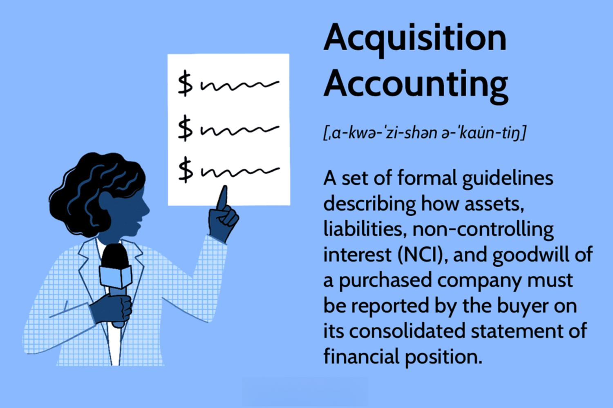

In recent years, the cryptocurrency landscape has evolved significantly, moving beyond established digital currencies like Bitcoin and Ethereum. Among these new entrants is ApeCoin (APE), which has rapidly garnered interest due to its affiliation with the Bored Ape Yacht Club (BAYC) NFT collection. ApeCoin is gaining traction not only as a financial asset but also as a central component of a vibrant, community-driven ecosystem.

This article aims to provide a comprehensive guide to purchasing ApeCoin, highlighting its utility and governance capabilities. ApeCoin operates as the native token of the APE ecosystem, which supports innovative applications, including real-world transactions and governance participation through the ApeCoin DAO. Such functionalities contribute to its growing appeal among investors who are eager to participate in the emerging Web3 space, gaining access to exclusive events and services.



Algorithmic trading has emerged as a significant advancement in cryptocurrency investment strategies, offering a method to enhance engagement with volatile digital assets like ApeCoin. By employing pre-programmed algorithms, traders can manage risks and maximize profits in a disciplined manner, harnessing market trends efficiently. While effective, this trading approach necessitates a profound grasp of both technical and market analyses.

Moreover, we'll examine the performance of ApeCoin in the market and evaluate why it might be an attractive addition to a diversified digital asset portfolio. Investors will find insights into navigating the challenges of cryptocurrency investment, including market volatility and regulatory uncertainties.

This guide will equip investors with the necessary tools, enabling a strategic approach to ApeCoin—from buying methods to exploring the complex potential of algorithmic trading. By understanding these elements, investors can make well-informed decisions in the rapidly evolving world of cryptocurrencies.

## Table of Contents

## Understanding ApeCoin

ApeCoin is the native utility token within the APE ecosystem, primarily associated with the Bored Ape Yacht Club (BAYC). This cryptocurrency is designed to empower and engage the community that supports the BAYC, a prestigious NFT collection. ApeCoin provides multiple functionalities both within and outside the digital world. 

One of its key roles is facilitating transactions, enabling users to perform real-world payments and transactions seamlessly. Another significant function of ApeCoin is governance. Holders of ApeCoin can participate in decision-making processes through the ApeCoin DAO (Decentralized Autonomous Organization). This allows community members to vote on proposals regarding the future and changes within the ecosystem.

The investment allure of ApeCoin extends beyond its utilitarian functions to its positioning within the Web3 revolution. The token provides access to exclusive events, merchandise, games, and services only available to the APE community, tapping into the growing intersection of cryptocurrencies and digital culture.

However, investing in ApeCoin carries inherent risks. As with any [cryptocurrency](/wiki/cryptocurrency), it exhibits high [volatility](/wiki/volatility-trading-strategies) and unpredictability in its price movements. Factors like market sentiment, regulatory updates, and technological advancements can impact its value. Therefore, potential investors should conduct careful assessments and risk management before adding ApeCoin to their portfolios. While it offers promising opportunities, due diligence is crucial to navigate the risks involved effectively.

## How to Buy ApeCoin

Buying ApeCoin involves a process similar to purchasing other cryptocurrencies, though it is essential to choose a reliable platform since not all exchanges support ApeCoin. Here is a step-by-step guide to acquiring ApeCoin:

**Step 1: Sign up on a Crypto Exchange**

The first step to buying ApeCoin is selecting a cryptocurrency exchange that lists it. Prominent exchanges like Binance, Coinbase, and Kraken offer ApeCoin, providing a robust platform for trading. Create an account on one of these platforms by providing the necessary personal information. Ensure that the exchange operates in your geographic region and complies with local regulations.

**Step 2: Complete Identity Verification**

Once your account is created, you'll need to complete the Know Your Customer (KYC) process. This involves verifying your identity by uploading identification documents such as a passport or driver's license. KYC is mandatory as it ensures compliance with regulatory standards and enhances the security of the exchange. After verification, you can proceed to deposit funds into your account using available payment methods like bank transfers, credit cards, or other cryptocurrencies.

**Step 3: Purchase ApeCoin**

With funds in your account, navigate to the market section of the exchange and search for ApeCoin. Select it from the list of tradable assets. Decide on the amount you wish to purchase based on your investment strategy and enter the quantity. Review the current market price and any fees associated with the transaction. Once satisfied, confirm your order. The amount of ApeCoin purchased will reflect in your exchange account once the transaction is processed.

**Step 4: Transfer to a Personal Crypto Wallet**

For enhanced security, it is advisable to transfer your ApeCoin from the exchange to a personal crypto wallet. Exchange accounts are susceptible to hacks and security breaches, posing a risk to stored funds. A personal wallet, preferably a hardware wallet, provides greater control and security. To transfer ApeCoin, generate a wallet address from your crypto wallet and use it to withdraw the ApeCoin from the exchange. Confirm the transaction, and the ApeCoin will be securely stored in your wallet.

## Exploring Algorithmic Trading in Cryptocurrency

Algorithmic trading is a method of executing trades utilizing computer algorithms based on predefined parameters, removing the need for human intervention. This technique is particularly beneficial in the cryptocurrency sector, where market conditions can be highly volatile and unpredictable. By automating trading processes, [algorithmic trading](/wiki/algorithmic-trading) can enhance the efficiency and speed of transactions, aid in managing risks more effectively, and increase opportunities for profit.

A primary advantage of algorithmic trading is its ability to manage the emotional aspect of trading. With the sheer volatility of cryptocurrencies, emotional decision-making can often lead to suboptimal outcomes. Algorithms, however, operate strictly according to their programming, ensuring a consistent and disciplined approach. This allows traders to capitalize on market trends and fluctuations in ApeCoin and other digital assets with greater precision.

For instance, algorithms can be designed to implement a variety of trading strategies such as mean reversion, [momentum](/wiki/momentum) trading, or statistical [arbitrage](/wiki/arbitrage). These strategies rely on certain mathematical models and can be expressed in code. Below is an example of a simple moving average crossover strategy implemented in Python, a popular approach in algorithmic trading:

```python
# Sample Python code for a simple moving average crossover

import pandas as pd

def moving_average_crossover(stock_data, short_window=40, long_window=100):
    # Calculate short and long moving averages
    stock_data['Short_MA'] = stock_data['Close'].rolling(window=short_window, min_periods=1).mean()
    stock_data['Long_MA'] = stock_data['Close'].rolling(window=long_window, min_periods=1).mean()

    # Create signals
    stock_data['Signal'] = 0.0
    stock_data['Signal'][short_window:] = \
        np.where(stock_data['Short_MA'][short_window:] > stock_data['Long_MA'][short_window:], 1.0, 0.0)

    # Generate trading orders
    stock_data['Position'] = stock_data['Signal'].diff()

    return stock_data

# Example usage
# Load your cryptocurrency data into stock_data DataFrame
# stock_data = ...

# Apply the strategy
strategy_result = moving_average_crossover(stock_data)
```

In this example, the algorithm generates buy and sell signals based on the crossover of short and long moving averages, which can then be used to automate trading decisions.

However, successful implementation of algorithmic trading requires substantial technical expertise. A comprehensive understanding of both technical analysis to interpret market data and market analysis to understand broader economic trends is essential. Moreover, strategies must be continually monitored and adjusted in response to changing market dynamics. This necessity for constant vigilance ensures that the algorithms remain effective in optimizing investment strategies.

In conclusion, while algorithmic trading presents substantial opportunities for enhanced efficiency and profitability in cryptocurrency trading, it also demands a high level of knowledge and active management to be truly effective. By leveraging algorithms, traders and investors can potentially improve their ApeCoin trades, provided they maintain a diligent and informed approach.

## The Future of ApeCoin and its Investment Potential

ApeCoin represents a promising investment opportunity within the expanding NFT and Web3 ecosystem. This is largely due to its association with the Bored Ape Yacht Club (BAYC), a rapidly growing cultural phenomenon that has captured the attention of investors and enthusiasts alike. As cryptocurrencies gain mainstream acceptance, ApeCoin could enjoy increased market activity and wider adoption, potentially enhancing its value proposition.

The broader acceptance of cryptocurrencies is derived from various factors, including technological advancements, increased regulatory clarity, and growing public interest. In particular, ApeCoin can leverage its unique position in the NFT space, where digital art and collectibles have become a significant area of interest and investment. The association with BAYC strengthens ApeCoin's brand, giving it a pivotal role within the NFT ecosystem. As more artists, creators, and collectors engage with NFTs, ApeCoin may see a rise in utility and demand.

Despite its promising future, investing in ApeCoin involves several risks. Regulatory frameworks for cryptocurrencies and NFTs are still evolving, and new regulations could impose additional compliance burdens or restrictions. Furthermore, ApeCoin faces competition from a myriad of cryptocurrencies and NFT projects vying for investor attention. These factors, combined with the inherent volatility of digital assets, highlight the risk of significant price fluctuations.

Given these risks, investors should exercise caution. Conducting thorough research is paramount, which involves analyzing market trends, the regulatory landscape, and potential technological developments. Diversification is another essential strategy. By spreading investments across different assets, investors can mitigate potential losses while capitalizing on growth opportunities within the cryptocurrency market.

In conclusion, while ApeCoin has significant potential within the expanding NFT and cryptocurrency market, its investment landscape is fraught with challenges. Informed and cautious investment strategies are essential for those looking to navigate the opportunities and risks associated with ApeCoin.

## References & Further Reading

[1]: Animoca Brands. ["APECOIN: BUILDING WEB3.0 & NFT COMMUNITIES OF TOMORROW."](https://www.animocabrands.com/animoca-brands-subsidiary-forj-opens-applications-to-ape-accelerator) Animoca Brands.

[2]: Vigna, P., & Casey, M. J. (2016). ["The Age of Cryptocurrency: How Bitcoin and the Blockchain Are Challenging the Global Economic Order."](https://archive.org/details/ageofcryptocurre0000vign) St. Martin's Griffin.

[3]: Narayanan, A., Bonneau, J., Felten, E., Miller, A., & Goldfeder, S. (2016). ["Bitcoin and Cryptocurrency Technologies: A Comprehensive Introduction."](https://press.princeton.edu/books/hardcover/9780691171692/bitcoin-and-cryptocurrency-technologies) Princeton University Press.

[4]: Yermack, D. (2017). ["Corporate Governance and Blockchains."](https://papers.ssrn.com/sol3/papers.cfm?abstract_id=2700475) Journal of Accounting and Finance.

[5]: Scholten, O., Pruss, U., & Walther, B. (2019). ["Enabling Algorithmic Trading through Deep Reinforcement Learning: An End-to-End Approach."](https://www.hswt.de/forschung/forschungsprofil/publikationen?tx_lfpublications_list%5Baction%5D=list&tx_lfpublications_list%5Bcontroller%5D=Publications&tx_lfpublications_list%5Bfilter%5D%5Bauthors%5D%5B0%5D=2018&cHash=5f5f81d560737c1443e1bb5c7ddfd963) arXiv.