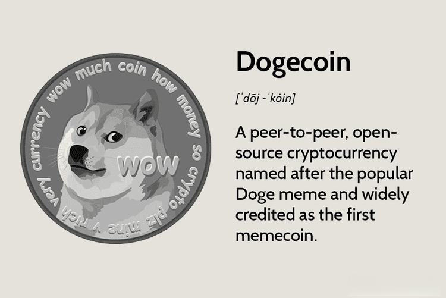

## Table of Contents

## What is Dogecoin and why might someone want to acquire it?

Dogecoin is a type of digital money, similar to Bitcoin, that you can use to buy things online or trade with other people. It was created in 2013 by two programmers, Billy Markus and Jackson Palmer, as a fun and friendly alternative to more serious cryptocurrencies. The name Dogecoin comes from a popular internet meme featuring a Shiba Inu dog, which is why it has a lighthearted and playful image.

People might want to acquire Dogecoin for a few reasons. One reason is that it's cheaper than many other cryptocurrencies, so it's easier for someone to buy a lot of it without spending too much money. Another reason is that Dogecoin has a strong community of supporters who often use it to tip others for good content on social media or forums. Finally, some people see Dogecoin as a good investment because its value can go up quickly, although this also means it can be risky.

## How can beginners start acquiring Dogecoin?

To start acquiring Dogecoin, beginners need to first set up a digital wallet where they can store their Dogecoin. There are many types of wallets available, like software wallets that you can download on your computer or phone, and online wallets that you can access through a website. It's important to choose a wallet that is easy to use and has good security. Once you have a wallet, you can get the wallet address, which is a long string of letters and numbers that you'll use to receive Dogecoin.

After setting up a wallet, the next step is to buy Dogecoin. You can do this through a [cryptocurrency](/wiki/cryptocurrency) exchange, which is like an online marketplace where you can trade money for Dogecoin. Some popular exchanges that support Dogecoin are Binance, Coinbase, and Kraken. To buy Dogecoin, you'll need to sign up for an account on the exchange, deposit some money, and then use that money to buy Dogecoin. Once you've bought Dogecoin, you can send it to your wallet using your wallet address. Remember, the value of Dogecoin can go up and down, so it's wise to only spend money you can afford to lose.

## What are the different methods to buy Dogecoin?

There are a few different ways to buy Dogecoin. One common way is to use a cryptocurrency exchange. These are websites where you can trade regular money for Dogecoin. Some popular exchanges that let you buy Dogecoin are Binance, Coinbase, and Kraken. To use an exchange, you need to sign up for an account, put some money into it, and then use that money to buy Dogecoin. After you buy it, you can send the Dogecoin to your digital wallet.

Another method to get Dogecoin is through peer-to-peer trading. This means you trade directly with another person, without using an exchange. Websites like LocalDogecoin and Paxful let you find people who want to sell their Dogecoin. You can agree on a price and then send them money, usually through a bank transfer or a service like PayPal, and they will send you the Dogecoin.

Lastly, you can also earn Dogecoin by providing services or products. Some people accept Dogecoin as payment for things like writing articles, creating art, or even doing small tasks online. You can find these opportunities on websites and forums where people are looking to spend their Dogecoin. This way, you can get Dogecoin without spending money directly, but by offering something in return.

## Which exchanges support Dogecoin trading?

There are several popular exchanges where you can trade Dogecoin. Some of the well-known ones include Binance, Coinbase, and Kraken. These exchanges let you sign up for an account, put money into it, and then use that money to buy Dogecoin. Once you have bought Dogecoin, you can send it to your digital wallet to keep it safe.

Another exchange that supports Dogecoin trading is Bittrex. It's also easy to use and lets you trade your regular money for Dogecoin. Besides these, there are other exchanges like Bitfinex and Poloniex that also let you buy and sell Dogecoin. Each exchange might have slightly different rules and fees, so it's a good idea to check them out before you decide which one to use.

Some exchanges might be better for beginners because they are easier to use and have good customer support. Others might be more suitable for people who have been trading for a while and want more advanced features. It's important to choose an exchange that fits your needs and feels comfortable for you to use.

## What are the fees associated with acquiring Dogecoin?

When you buy Dogecoin, you will usually have to pay some fees. These fees can come from different places. The first type of fee is from the exchange where you buy your Dogecoin. Exchanges like Binance, Coinbase, and Kraken all charge a small percentage of the total amount you spend on Dogecoin. This fee can be different depending on which exchange you use and how much Dogecoin you are buying. Some exchanges might charge around 0.1% to 0.5% of your total purchase, but it's a good idea to check the exact fee before you buy.

Another fee you might have to pay is called a transaction fee. This fee is for sending your Dogecoin from the exchange to your digital wallet. The fee is usually very small, often just a few cents, but it can change depending on how busy the Dogecoin network is. Sometimes, if a lot of people are using Dogecoin at the same time, the fee might go up a little bit. It's important to know about these fees so you can plan how much money you will need to buy and move your Dogecoin.

## How can one store Dogecoin safely after acquisition?

After you buy Dogecoin, you need to keep it safe in a digital wallet. There are different types of wallets you can use. One type is a software wallet, which you can download on your computer or phone. These are easy to use but you need to make sure your device is safe from viruses and hackers. Another type is an online wallet, which you can use through a website. These are handy because you can use them from anywhere, but you need to trust the website to keep your Dogecoin safe. The safest type of wallet is a hardware wallet, which is like a small device you can [carry](/wiki/carry-trading) with you. It keeps your Dogecoin offline, making it very hard for anyone to steal it.

No matter which type of wallet you choose, it's important to keep your wallet's private key safe. The private key is a secret code that lets you spend your Dogecoin. If someone else gets your private key, they can take your Dogecoin. So, write down your private key and keep it in a safe place, like a locked drawer or a safe. Also, make sure to back up your wallet regularly. That way, if something happens to your wallet, you can still get your Dogecoin back. By following these tips, you can keep your Dogecoin safe and enjoy using it.

## What are the risks involved in acquiring and holding Dogecoin?

When you buy and keep Dogecoin, there are some risks you should know about. One big risk is that the price of Dogecoin can go up and down a lot. This means you could lose money if the price goes down after you buy it. Another risk is that there might be people trying to steal your Dogecoin. If you don't keep your digital wallet safe, hackers could take your Dogecoin. Also, the websites where you buy Dogecoin, called exchanges, could have problems or even close down, which could make it hard for you to get your money back.

Another thing to think about is that Dogecoin might not be accepted everywhere you want to use it. Even though it's popular, not all stores or websites take Dogecoin as payment. This means you might have to change it back to regular money, which can cost you more money in fees. Plus, the rules about using cryptocurrencies like Dogecoin can change. Governments might make new laws that could affect how you can use or trade Dogecoin. So, it's important to be careful and understand these risks before you decide to buy and keep Dogecoin.

## How does the volatility of Dogecoin affect acquisition strategies?

The price of Dogecoin can go up and down a lot, which is called [volatility](/wiki/volatility-trading-strategies). Because of this, people need to think carefully about when and how much Dogecoin they want to buy. If you buy Dogecoin when the price is high, it might go down later, and you could lose money. On the other hand, if you buy when the price is low, you might be able to sell it later for more money and make a profit. So, one strategy is to buy a little bit of Dogecoin at different times instead of all at once. This way, you spread out the risk and might not lose as much if the price drops suddenly.

Another thing to think about is how long you plan to keep your Dogecoin. If you want to hold onto it for a long time, you might not worry as much about small price changes. But if you want to trade Dogecoin often, you need to pay close attention to the price and be ready to buy and sell quickly. It's also a good idea to only spend money on Dogecoin that you can afford to lose, because the price can be unpredictable. By understanding how volatile Dogecoin can be, you can make smarter choices about when and how to buy it.

## What are the tax implications of buying and selling Dogecoin?

When you buy and sell Dogecoin, you might have to pay taxes on it. In many countries, if you make money from selling Dogecoin for more than you paid for it, that profit is considered taxable income. This means you need to report it on your tax return and pay taxes on it, just like you would with money you earn from a job. The exact amount of tax you have to pay can depend on how long you held the Dogecoin before selling it. If you held it for less than a year, it might be taxed at a higher rate than if you held it for more than a year.

It's also important to keep good records of all your Dogecoin transactions. You need to know how much you paid for the Dogecoin, when you bought it, and how much you sold it for, so you can figure out if you made a profit or a loss. Some countries might also have special rules for cryptocurrencies, so it's a good idea to check with a tax professional to make sure you're following the rules correctly. They can help you understand what you need to do and make sure you don't miss anything important when it comes time to file your taxes.

## How can one use advanced trading techniques to acquire Dogecoin?

When you want to use advanced trading techniques to buy Dogecoin, one way is to use something called "dollar-cost averaging." This means you don't buy all your Dogecoin at once. Instead, you buy a little bit at different times. This can help you not lose as much money if the price of Dogecoin goes down suddenly. Another advanced technique is called "limit orders." With a limit order, you tell the exchange to buy Dogecoin for you only if the price reaches a certain level that you choose. This can help you get a better price and save money.

Another technique you can use is "stop-loss orders." This is when you tell the exchange to sell your Dogecoin if the price drops to a certain level. It can help you not lose too much money if the price goes down a lot. Also, some people use "technical analysis" to try to predict what the price of Dogecoin will do next. They look at charts and patterns to decide when to buy and sell. These advanced techniques can be helpful, but they also need a lot of practice and understanding. It's important to learn about them and maybe even practice with small amounts of money before you use them with a lot of Dogecoin.

## What are the future prospects for Dogecoin and how should they influence acquisition decisions?

The future of Dogecoin can be hard to predict, but it has a few things going for it. It has a big and active community of people who like it and use it. This community can help keep Dogecoin popular and maybe even make its value go up over time. Also, some big companies and famous people have started to accept or talk about Dogecoin, which can make more people want to buy it. But, Dogecoin can also be very up and down in price, and it might not be used as much for buying things as other cryptocurrencies. So, it's a good idea to think about these things before you decide to buy Dogecoin.

When you're thinking about buying Dogecoin, it's important to look at both the good and the bad sides. If you believe that Dogecoin will keep being popular and more places will start to accept it, you might want to buy some. But, because its price can change a lot, it's smart to only spend money you can afford to lose. Also, think about how long you want to keep your Dogecoin. If you're planning to hold onto it for a long time, you might not worry as much about the price going up and down. But if you want to trade it a lot, you need to be ready for the price to change quickly.

## How can one participate in Dogecoin mining to acquire more coins?

Dogecoin mining is a way to get more Dogecoin without buying it. Mining means using your computer to help keep the Dogecoin network running smoothly. When you mine, your computer solves hard math problems, and if it solves them correctly, you get rewarded with new Dogecoin. To start mining, you need a computer with a good graphics card, because mining uses a lot of computer power. You also need to join a mining pool, which is a group of people working together to mine Dogecoin. The pool shares the rewards, so you get a little bit of Dogecoin more often than if you mined by yourself.

Mining Dogecoin can be fun, but it also has some challenges. It uses a lot of electricity, so your power bill might go up. Also, as more people start mining, it gets harder to solve the math problems and get the rewards. This means you might not get as much Dogecoin as you used to. But if you like the idea of helping the Dogecoin network and getting some coins for your effort, mining could be a good way to go. Just remember to think about the costs and how much time you want to spend on it.

## References & Further Reading

[1]: ["Dogecoin: The Origin Story"](https://dogecoin.com/dogepedia/articles/history-of-dogecoin/) by Coindesk

[2]: ["Mastering Blockchain"](https://books.google.com/books/about/Mastering_Blockchain.html?id=3ZlUDwAAQBAJ) by Imran Bashir

[3]: ["Cryptocurrency Trading & Investing: Beginners Guide To Trading & Investing In Bitcoin, Alt Coins & ICOs"](https://www.amazon.com/Cryptocurrency-Trading-Investing-Beginners-Bitcoin/dp/1977924530) by Aimee Vo

[4]: ["The Basics of Bitcoins and Blockchains"](https://www.amazon.com/Basics-Bitcoins-Blockchains-Introduction-Cryptocurrencies/dp/1633538001) by Antony Lewis

[5]: ["Dogecoin Explained: Understanding Dogecoin Basics"](https://cointelegraph.com/learn/what-is-dogecoin-a-beginners-guide-to-doge-cryptocurrency) by Investopedia