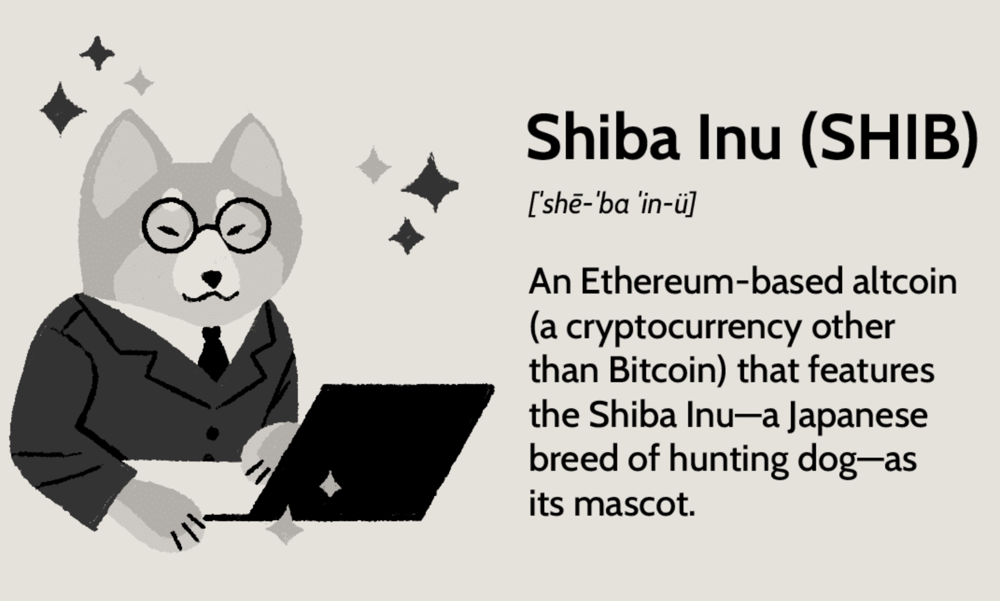

Shiba Inu (SHIB) is a prominent meme cryptocurrency, frequently compared to Dogecoin, that has captured the attention of a worldwide audience. Originating in 2020, Shiba Inu quickly attracted a dedicated investor base and achieved a substantial market capitalization. This rapid growth has been facilitated by the expansion of its blockchain ecosystem, which now includes projects such as Shibarium and the Shiba Metaverse. These developments have significantly heightened interest and engagement with SHIB.

Investors are drawn to Shiba Inu not only for its potential entertainment value as a meme token but also for its possibility of yielding high returns. However, like all ventures within the cryptocurrency sphere, investing in SHIB involves considerable risks. The volatility inherent in digital currencies adds an additional layer of uncertainty, requiring careful investment strategies.



This article provides insights into purchasing Shiba Inu and explores the advantages of using algorithmic trading to potentially achieve favorable investment outcomes. Algorithmic trading, which employs computer algorithms to automate and optimize trading strategies, can offer significant benefits in terms of speed, accuracy, and efficiency. Given SHIB's price volatility, strategic algorithmic approaches may prove advantageous for investors aiming to maximize returns. Nonetheless, these strategies come with their own set of complexities and risks, underscoring the importance of thorough research and informed decision-making in this dynamic field.

## Table of Contents

## What Is Shiba Inu?

Shiba Inu is a decentralized cryptocurrency operating on the Ethereum blockchain. It was launched as a direct competitor to Dogecoin, using the same meme-inspired branding but with distinct objectives and technological underpinnings. Its remarkable rise in popularity can be attributed to its active community and strategic developmental initiatives, which have contributed to its growing ecosystem.

Shiba Inu's infrastructure includes Shibarium, a Layer 2 solution, aimed at enhancing transaction speed and reducing costs within the Ethereum network. This development signifies a move toward increased utility, distinguishing Shiba Inu from its reputation solely as a meme token. Additionally, Shiba Inu has ventured into the Metaverse, a thriving virtual domain, providing the opportunity for virtual experiences and transactions within their platform. This expansion reflects the project's ambition to integrate into more sophisticated applications beyond traditional cryptocurrency use cases.

The token's appeal extends beyond its meme status and low entry price. It attracts investors by emphasizing a community-driven approach. This involves engaging and empowering its user base to contribute to the token's growth and potential future developments. The governance framework for Shiba Inu relies heavily on its community, which participates in the decision-making processes that shape the project's direction.

Overall, Shiba Inu represents a nuanced offering in the [cryptocurrency](/wiki/cryptocurrency) market. It appeals to those interested in both speculative investment opportunities and community-centered platforms, providing a blend of entertaining elements with practical applications.

## How to Buy Shiba Inu

Purchasing Shiba Inu (SHIB) involves several key steps that begin with selecting a suitable cryptocurrency exchange. Leading exchanges like Coinbase and Binance are popular choices for buying SHIB. These platforms provide a user-friendly interface and broad market reach, making them ideal for acquiring cryptocurrencies.

To initiate the purchase process, creating an account on an exchange is necessary. This procedure usually requires completing a Know Your Customer (KYC) process, which involves verifying your identity with documents such as a passport or driver's license. This step is crucial for regulatory compliance, ensuring that the exchange adheres to anti-money laundering (AML) and combating the financing of terrorism (CFT) standards.

Once your account is verified, purchasing SHIB typically involves using well-established cryptocurrencies like Bitcoin (BTC) or Ethereum (ETH) as trading pairs. Many exchanges provide direct trading pairs with these cryptocurrencies due to their [liquidity](/wiki/liquidity-risk-premium) and widespread adoption. For instance, you might trade a certain amount of ETH for SHIB, based on the current market exchange rate.

Upon executing the purchase, the acquired SHIB tokens are stored in the digital wallet associated with your exchange account. This wallet allows you to manage and transfer your cryptocurrency holdings. Ensuring your wallet's security is paramount, as it protects against unauthorized access and potential hacking threats.

Before executing any transactions, understanding the exchange's fee structure and security features is vital. Fees can vary significantly between platforms, affecting the overall cost of your investment. Being aware of these charges can help in optimizing your purchasing experience, minimizing expenses, and ensuring smooth transactions.

In summary, buying SHIB involves setting up an account on a reputable cryptocurrency exchange, completing necessary KYC procedures, and conducting transactions using popular cryptocurrencies as trading pairs. By staying informed about potential costs and security protocols, investors can enhance their purchasing strategy and safeguard their digital assets.

## Exploring Algo Trading for Shiba Inu

Algorithmic trading, commonly known as algo trading, employs advanced computer algorithms to execute trades in financial markets under specific pre-set rules. This trading methodology is known for its efficiency and precision, which makes it particularly suitable for handling volatile assets such as Shiba Inu (SHIB). By minimizing human intervention, algo trading can greatly enhance the speed and accuracy of transactions, while reducing the potential for human errors.

One of the key advantages of algo trading is its capacity to exploit price [volatility](/wiki/volatility-trading-strategies) in cryptocurrencies like SHIB. Strategies such as mean reversion and [momentum](/wiki/momentum) trading are often employed. Mean reversion is based on the assumption that the price of SHIB, like other assets, will return to its average over time, providing opportunities for profit when the price deviates from the mean. On the other hand, momentum trading capitalizes on existing trends; the algorithm buys SHIB if upward momentum is detected and sells if the momentum reverses.

Choosing the right software or platform is crucial for executing effective [algorithmic trading](/wiki/algorithmic-trading) strategies. Platforms should not only offer the necessary tools for algorithm development and testing but also ensure robust security measures to protect against cyber threats. They should support back-testing, allowing traders to validate their strategies against historical data before risking capital in live markets. Python is a widely used programming language for algorithmic trading due to its extensive libraries such as Pandas for data manipulation, NumPy for numerical computations, and [backtrader](/wiki/backtrader) for back-testing trading strategies.

Here is a simple Python example to illustrate how one might set up a basic momentum strategy for SHIB using backtrader:

```python
import backtrader as bt

class MomentumStrategy(bt.Strategy):
    params = (('period', 20),)  # Moving average period

    def __init__(self):
        self.sma = bt.indicators.SimpleMovingAverage(
            self.datas[0].close, period=self.params.period
        )

    def next(self):
        if self.datas[0].close[0] > self.sma[0]:
            self.buy()  # Buy signal
        elif self.datas[0].close[0] < self.sma[0]:
            self.sell()  # Sell signal

cerebro = bt.Cerebro()
cerebro.addstrategy(MomentumStrategy)
# Add SHIB data to cerebro here
cerebro.run()
```

While algo trading offers considerable advantages, it is critical to conduct thorough testing and avoid over-optimization of algorithms, which can lead to strategies that perform well on historical data but fail in live trading environments. Additionally, staying informed about market conditions and regulatory changes is essential for mitigating risks associated with trading SHIB, ensuring both compliance and financial security. In summary, while algorithmic trading can optimize the trading experience, it requires a careful and methodical approach to maximize its potential advantages fully.

## Risks and Considerations in Algo Trading with SHIB

The volatility of cryptocurrencies, including Shiba Inu (SHIB), presents considerable risks to investors. Due to rapid fluctuations common in the crypto market, algorithmic trading (algo trading) offers both opportunities and challenges. To mitigate financial losses, rigorous testing and thorough understanding of the algorithms involved are essential. This involves back-testing algorithms on historical data to validate their effectiveness and robustness under different market conditions. It is essential to implement risk management techniques, such as stop-loss orders and position sizing, to protect investor capital.

Security is a critical aspect of algorithmic trading. Trading platforms must be secure against potential hacks that could lead to financial losses. Utilizing multi-[factor](/wiki/factor-investing) authentication and secure API connections are standard practices to enhance security. Additionally, employing reliable cybersecurity measures can further protect trading accounts and sensitive information from unauthorized access.

Regulatory environments governing cryptocurrencies and algo trading are in constant flux. Staying compliant with current regulations is crucial to avoiding potential legal issues. This involves keeping abreast of international and local financial regulations that may impact trading activities, including anti-money laundering (AML) and know your customer (KYC) requirements. Non-compliance can lead to penalties and limit the ability to trade on certain platforms.

Traders must be cognizant of potential algorithmic failures. Algorithms can malfunction or produce unintended consequences, especially in volatile markets. Having contingency plans, such as manual intervention protocols and redundant systems, can help mitigate the adverse effects of such failures. Additionally, continuously monitoring and updating trading algorithms can keep them aligned with changing market dynamics, reducing the risk of obsolescence.

In conclusion, while algo trading offers potential advantages for trading SHIB, understanding its inherent risks and implementing robust security and compliance strategies are paramount. By preparing for contingencies and staying informed about regulatory and market changes, traders can better navigate the complexities of algo trading in the cryptocurrency market.

## Conclusion

Shiba Inu (SHIB) continues to draw attention due to its unique combination of meme-driven appeal and emerging utility within the cryptocurrency market. As this digital asset gains traction, potential investors are encouraged to adopt responsible trading practices, ensuring they utilize reliable exchanges to mitigate risks associated with market volatility and security breaches. Algorithmic trading presents an appealing opportunity to enhance SHIB investment strategies, allowing for optimized trade execution and management through predefined logic. However, it also comes with inherent challenges and risks that necessitate thorough comprehension and caution.

To navigate the continually evolving cryptocurrency landscape effectively, continuous learning and market research are indispensable. Understanding market trends, technological advances, and regulatory changes is crucial for making informed investment decisions. By maintaining a prudent approach and keeping abreast of developments, investors can effectively explore SHIB's dynamic potential, balancing meme popularity with its growing functional uses. Moreover, the integration of algorithmic trading can complement these efforts, providing a sophisticated toolset to manage investments more strategically while acknowledging its complexity and potential pitfalls.

## References & Further Reading

[1]: Bergstra, J., Bardenet, R., Bengio, Y., & Kégl, B. (2011). ["Algorithms for Hyper-Parameter Optimization."](https://dl.acm.org/doi/10.5555/2986459.2986743) Advances in Neural Information Processing Systems 24.

[2]: ["Advances in Financial Machine Learning"](https://www.amazon.com/Advances-Financial-Machine-Learning-Marcos/dp/1119482089) by Marcos Lopez de Prado

[3]: ["Evidence-Based Technical Analysis: Applying the Scientific Method and Statistical Inference to Trading Signals"](https://www.amazon.com/Evidence-Based-Technical-Analysis-Scientific-Statistical/dp/0470008741) by David Aronson

[4]: ["Machine Learning for Algorithmic Trading"](https://github.com/stefan-jansen/machine-learning-for-trading) by Stefan Jansen

[5]: ["Quantitative Trading: How to Build Your Own Algorithmic Trading Business"](https://www.amazon.com/Quantitative-Trading-Build-Algorithmic-Business/dp/1119800064) by Ernest P. Chan