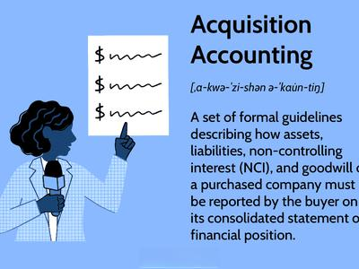

## Table of Contents

## What is acquisition accounting?

Acquisition accounting is a method used when one company buys another company. It involves recording the purchase and all the assets and liabilities of the company that was bought. The main goal is to show the fair value of what was bought on the buyer's financial statements. This helps everyone see a clear picture of the new combined company's financial health.

When a company is acquired, the buyer must figure out how much they paid and what they got in return. This includes tangible things like buildings and equipment, and intangible things like brand names and customer lists. The buyer records these at their fair value, which might be different from what the seller had them listed at. Any difference between the purchase price and the fair value of the net assets is recorded as goodwill. This process helps make sure the financial statements are accurate and useful for investors and other stakeholders.

## Why is acquisition accounting important in business?

Acquisition accounting is important in business because it helps show the true value of a company after it buys another company. When a company is bought, everything it owns and owes needs to be added to the buyer's financial statements. This process makes sure that the numbers are correct and reflect what the buyer actually paid. It's like getting a clear picture of the new, bigger company's financial health, which is really helpful for everyone who looks at the financial statements, like investors and managers.

Another reason acquisition accounting is important is that it helps with decision-making. By showing the fair value of what was bought, it gives a good idea of whether the purchase was a smart move. If the price paid is much higher than the value of the assets and liabilities, it might mean the buyer paid too much. On the other hand, if the value is higher than the price, it could be a good deal. This information is crucial for making future business decisions and planning.

## What are the key principles of acquisition accounting?

Acquisition accounting follows some key principles that help keep things clear and fair. One important principle is to record everything at fair value. This means when a company buys another company, it needs to figure out how much the buildings, equipment, and even things like brand names and customer lists are really worth. This helps everyone see the true value of what was bought, which is important for understanding the new company's financial health.

Another principle is about handling any difference between the purchase price and the fair value of the net assets. If a company pays more than the fair value of what it's buying, this extra amount is called goodwill. Goodwill can show up on the financial statements and it represents the value of things like a good reputation or a strong customer base that aren't easy to put a number on. This principle helps make sure the financial statements tell the whole story of the acquisition.

Lastly, acquisition accounting needs to be done carefully and according to rules set by accounting standards. This makes sure that all companies do it the same way, which is important for comparing different companies and making good decisions. By following these principles, acquisition accounting helps give a clear, honest picture of a company's finances after it buys another company.

## How does acquisition accounting differ from other accounting methods?

Acquisition accounting is different from other accounting methods because it focuses on what happens when one company buys another. When a company is bought, acquisition accounting makes sure everything the bought company owns and owes is added to the buyer's financial statements at their fair value. This is different from regular accounting, where things are usually recorded at their original cost. For example, if a company buys a building, regular accounting would keep it at the price paid, but acquisition accounting would change it to what the building is worth now.

Another way acquisition accounting is different is how it deals with the difference between the purchase price and the fair value of the net assets. If a company pays more than the fair value of what it's buying, this extra amount is called goodwill. In regular accounting, you don't usually see goodwill, but in acquisition accounting, it's an important part of the financial statements. This helps show the value of things like a good reputation or a strong customer base that aren't easy to put a number on.

Acquisition accounting also follows specific rules set by accounting standards, which can be different from the rules used in other types of accounting. These rules make sure that all companies do acquisition accounting the same way, which is important for comparing different companies and making good decisions. By following these rules, acquisition accounting helps give a clear, honest picture of a company's finances after it buys another company, which is different from the ongoing, day-to-day accounting that happens in regular business operations.

## What are the steps involved in the acquisition accounting process?

When a company buys another company, the first step in acquisition accounting is to figure out the fair value of everything the bought company owns and owes. This includes things like buildings, equipment, and even things you can't touch, like brand names and customer lists. The buyer needs to look at what these things are really worth now, not just what they were bought for originally. This helps everyone see the true value of what was bought.

Next, the buyer adds up the fair value of all these assets and liabilities. If the price they paid for the company is more than this total, the difference is called goodwill. Goodwill shows up on the financial statements and represents the value of things like a good reputation or a strong customer base that aren't easy to put a number on. The buyer then puts all this information into their financial statements, making sure everything is recorded at the fair value they figured out.

Finally, the buyer needs to follow specific rules set by accounting standards to make sure everything is done correctly. These rules help make sure that all companies do acquisition accounting the same way, which is important for comparing different companies and making good decisions. By following these steps, acquisition accounting helps give a clear, honest picture of a company's finances after it buys another company.

## What is the role of goodwill in acquisition accounting?

Goodwill plays a big role in acquisition accounting. When one company buys another, it often pays more than the total value of the buildings, equipment, and other things the bought company owns. This extra amount is called goodwill. Goodwill shows up on the buyer's financial statements and represents the value of things like a good reputation, strong customer base, or great employees that are hard to put a number on.

Goodwill is important because it helps give a full picture of what the buyer got in the deal. It's like paying for the value of the brand or the loyalty of customers, which can be really valuable even if you can't see them. By including goodwill in the financial statements, acquisition accounting makes sure everyone can see the true cost and value of the acquisition.

## How do you calculate the purchase price in an acquisition?

Calculating the purchase price in an acquisition involves figuring out how much the buyer is willing to pay for the company they want to buy. This price is usually based on a lot of things, like how much money the company makes, how much it's expected to grow, and what its assets and liabilities are worth. The buyer and seller might negotiate to agree on a price that they both think is fair. Sometimes, the purchase price can be a fixed amount of money, or it might include other things like shares of the buyer's company or future payments based on how well the bought company does.

Once the purchase price is set, the buyer needs to break it down into different parts for accounting purposes. They look at the fair value of everything the bought company owns, like buildings and equipment, and everything it owes, like loans. If the purchase price is more than the total fair value of these assets and liabilities, the difference is called goodwill. Goodwill represents the value of things like the company's reputation or customer loyalty, which are hard to put a number on but still very important. This way, the purchase price helps show the true cost and value of the acquisition on the buyer's financial statements.

## What are the common challenges faced in acquisition accounting?

One common challenge in acquisition accounting is figuring out the fair value of the assets and liabilities of the company being bought. It's not always easy to decide what things like buildings, equipment, or even brand names are really worth now. Sometimes, the buyer and seller might disagree on these values, which can make the process harder. Getting the fair value right is important because it affects how much goodwill the buyer has to record, and that can make a big difference in the financial statements.

Another challenge is dealing with the rules and regulations that come with acquisition accounting. There are specific standards that companies need to follow, and these can be complicated. Making sure everything is done correctly takes a lot of time and careful work. If something is done wrong, it could lead to mistakes in the financial statements, which might cause problems with investors or other people who look at the company's finances.

## How does acquisition accounting affect financial statements?

When a company buys another company, acquisition accounting changes the buyer's financial statements. It adds all the things the bought company owns, like buildings and equipment, and all the things it owes, like loans, to the buyer's financial statements. These things are added at their fair value, which means what they are really worth now, not just what they were bought for originally. If the price the buyer paid is more than the fair value of these things, the difference is called goodwill. Goodwill shows up on the financial statements and represents the value of things like the company's reputation or customer loyalty that are hard to put a number on.

These changes can make the buyer's financial statements look very different. For example, the buyer's assets might go up because of the new things they own, and their liabilities might go up too because of the new things they owe. Goodwill can also make the buyer's total assets look bigger. All these changes help give a clear picture of the new, bigger company's financial health. It's important for investors and other people who look at the financial statements to see these changes so they can understand the true cost and value of the acquisition.

## What are the tax implications of acquisition accounting?

When a company buys another company, acquisition accounting can change how much tax the buyer has to pay. The tax rules can be different depending on where the companies are located and what kind of things the bought company owns. For example, if the bought company has a lot of buildings or equipment, the buyer might be able to take more tax deductions because these things can be written off over time. Also, if the buyer records goodwill, they might not be able to take tax deductions for it right away, which can affect their taxes.

Another thing to think about is how the purchase price is split up for tax purposes. The buyer needs to figure out how much of the price goes to different things like buildings, equipment, and goodwill. This can be tricky because the tax rules might not let the buyer split things up the same way they do for their financial statements. Getting this right is important because it can change how much tax the buyer has to pay now and in the future. It's a good idea for the buyer to work with tax experts to make sure they do everything correctly and take advantage of any tax benefits they can.

## How do international accounting standards impact acquisition accounting?

International accounting standards, like those set by the International Financial Reporting Standards (IFRS), have a big impact on acquisition accounting. These standards make sure that companies all over the world do acquisition accounting the same way. This is important because it helps everyone understand and compare financial statements from different countries. For example, IFRS rules say that when a company buys another company, it has to record everything at fair value. This means figuring out what things like buildings, equipment, and even brand names are really worth now, not just what they were bought for originally. Following these rules helps make sure the financial statements are clear and honest.

Another way international standards affect acquisition accounting is by setting rules for how to handle goodwill. If a company pays more for another company than the fair value of its assets and liabilities, the difference is called goodwill. IFRS has specific rules about how to record and check goodwill over time. These rules can be different from what other countries' standards say, so companies need to be careful to follow the right rules. By using international standards, companies can show a true picture of their finances after an acquisition, which is helpful for investors and other people who look at the financial statements.

## What advanced techniques can be used to optimize acquisition accounting?

One advanced technique to optimize acquisition accounting is using fair value measurements more accurately. This means working with experts like appraisers and valuation specialists to figure out the real worth of things like buildings, equipment, and even brand names. By getting these values right, companies can make sure their financial statements show the true cost and value of the acquisition. This can help avoid mistakes and make the financial statements more useful for investors and other people who look at them.

Another technique is using technology to help with the acquisition accounting process. Software can make it easier to gather and analyze all the information needed to record the acquisition correctly. It can also help with following the rules set by accounting standards, which can be complicated. By using technology, companies can do the work faster and with fewer mistakes. This can save time and money, and make sure the financial statements are done right.

A third technique is to plan ahead and think about the tax implications of the acquisition. Companies can work with tax experts to figure out the best way to split up the purchase price for tax purposes. This can help them take advantage of tax benefits and avoid paying more tax than they need to. By planning carefully, companies can make sure the acquisition is as good a deal as possible, not just for their financial statements, but also for their taxes.

## How can financial reporting be integrated with algorithmic insights?

The integration of financial reporting with [algorithmic trading](/wiki/algorithmic-trading) insights has ushered in novel approaches to strategic financial decision-making. By merging these fields, businesses can leverage computational methods to model and forecast various economic scenarios, which enhances the accuracy and responsiveness of financial reporting.

Algorithmic insights facilitate the analysis of vast datasets, allowing businesses to identify trends and patterns that would be imperceptible through traditional methods. For instance, [machine learning](/wiki/machine-learning) algorithms can be applied to historical financial data to predict future performance metrics, effectively enabling a predictive modeling approach to financial reporting. Such models can include time-series forecasting, which is often employed to predict stock prices, interest rates, or economic indices. This approach can be mathematically represented as:

$$
X(t) = \sum_{i=1}^{N} \phi_i X(t-i) + \epsilon(t)
$$

where $X(t)$ is the forecasted value at time $t$, $\phi_i$ represents the model parameters, and $\epsilon(t)$ is the error term. The incorporation of these predictive models into financial reporting allows for actionable insights, enabling firms to adjust strategies proactively in response to forecasted economic conditions.

Case studies demonstrate the efficacy of integrating algorithmic insights with financial reporting. For example, a multinational corporation implemented a machine learning model to incorporate global economic indicators into their financial reports. The enhanced reports improved the precision of their quarterly earnings forecasts, leading to elevated investor confidence and a reduction in earnings announcement [volatility](/wiki/volatility-trading-strategies). This integration enriched investor relations by providing stakeholders with greater transparency and informed expectations.

Another compelling example is the use of natural language processing (NLP) algorithms to analyze sentiment in financial disclosures and earnings calls. By quantifying sentiment and correlating it with market reactions, companies can refine communication strategies to better manage market expectations and investor perceptions.

Python, with libraries such as Pandas, NumPy, and Scikit-learn, facilitates these advanced analytical techniques. For instance, a basic implementation of a linear time-series forecast model could be structured as follows:

```python
import pandas as pd
from sklearn.linear_model import LinearRegression

# Sample financial data
data = pd.DataFrame({
    'time': [1, 2, 3, 4, 5],
    'value': [10, 11, 13, 16, 18]
})

# Preparing data for the model
X = data['time'].values.reshape(-1, 1)
y = data['value'].values

# Applying linear regression
model = LinearRegression().fit(X, y)

# Predicting future values
future_time = [[6], [7]]
predictions = model.predict(future_time)

print(predictions)  # Output: array([20.4, 22.6])
```

This integration aligns financial reporting with real-time market dynamics, fostering a data-driven decision-making culture. As businesses continue to adapt to the ever-evolving financial landscape, the synergies offered by this convergence promise significant competitive advantages.

## References & Further Reading

[1]: ["IFRS 3 Business Combinations"](https://www.ifrs.org/content/dam/ifrs/publications/pdf-standards/english/2022/issued/part-a/ifrs-3-business-combinations.pdf?bypass=on) by International Financial Reporting Standards (IFRS) Foundation

[2]: ["Financial Reporting and Analysis"](https://www.wallstreetmojo.com/financial-reporting/) by Charles H. Gibson

[3]: Peterson, M. A. (2009). ["Estimating Standard Errors in Finance Panel Data Sets: Comparing Approaches."](https://papers.ssrn.com/sol3/papers.cfm?abstract_id=661481) The Review of Financial Studies, 22(1), 435-480.

[4]: ["Algorithmic Trading and DMA: An Introduction to Direct Access Trading Strategies"](https://archive.org/details/algorithmictradi0000john) by Barry Johnson

[5]: Devaney, M., & Weber, J. M. (2005). ["Real-Time Algorithmic Trading in a Machine Learning Framework."](https://pmc.ncbi.nlm.nih.gov/articles/PMC4986507/) Papers.ssrn.com

[6]: Petyuk, V. A., & Shishkin, A. A. (2013). ["High-Frequency Trading and Probability: On the Fairness of Prices"](https://pubmed.ncbi.nlm.nih.gov/17255552/) in Physica A: Statistical Mechanics and its Applications, 392(3), 472-484.

[7]: ["The Essentials of M&A Due Diligence"](https://www.taylorfrancis.com/books/mono/10.4324/9781315107097/essentials-due-diligence-peter-howson) by Peter Howson