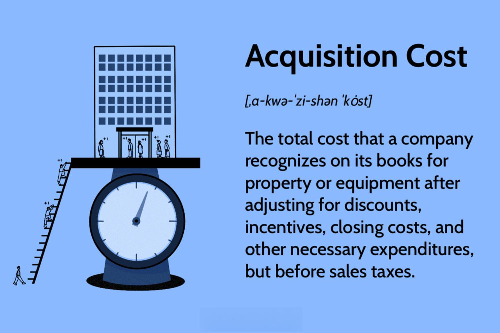

## Table of Contents

## What is acquisition cost in business accounting?

Acquisition cost in business accounting is the total amount of money a company spends to buy something. This could be a new machine, a building, or even another company. It includes not just the price of the item itself, but also any other costs needed to get it ready for use. For example, if a company buys a new computer, the acquisition cost would include the price of the computer, plus any delivery fees, installation costs, and any other expenses needed to start using it.

Understanding acquisition cost is important because it helps businesses keep track of their spending and make better decisions. When a company knows the full cost of acquiring an asset, it can plan its budget more effectively and see if the purchase is worth it. This information is also used in financial reporting, where the acquisition cost of assets is recorded on the company's balance sheet. This helps everyone see the true value of what the company owns.

## How is acquisition cost calculated?

Acquisition cost is calculated by adding up all the costs a company pays to get and start using a new asset. This includes the price of the item itself, like a machine or a building. But it also includes other costs, like delivery fees, installation charges, and any taxes or legal fees needed to complete the purchase. For example, if a company buys a new truck, the acquisition cost would be the price of the truck plus the cost to ship it to the company, any fees to register it, and the cost to add any special equipment.

To figure out the acquisition cost, a company needs to keep track of all these different expenses. They add up the purchase price and all the extra costs to get the total acquisition cost. This total amount is then recorded in the company's financial records. Knowing the full acquisition cost helps the company understand how much they are really spending on new assets. It's important for making good decisions about what to buy and how to budget for the future.

## What types of costs are included in the acquisition cost?

Acquisition cost includes all the money a company spends to get and start using a new asset. This means the price they pay to buy the item, like a machine or a building, is part of the acquisition cost. But it's not just the price tag. There are other costs too, like the fees to ship the item to the company, any taxes they have to pay, and the costs to set up or install the item so it's ready to use.

For example, if a company buys a new computer, the acquisition cost is more than just the price of the computer. It also includes the cost to have it delivered, any sales tax, and the fee to set it up and get it working. All these costs together make up the total acquisition cost. This helps the company know the real cost of adding a new asset and plan their budget better.

## Can acquisition costs be capitalized, and if so, under what conditions?

Yes, acquisition costs can be capitalized, which means they are recorded as an asset on the company's balance sheet instead of being treated as an expense right away. This happens when the costs are part of buying a long-term asset, like a machine or a building, that the company will use for a long time. The idea is that since the asset will be useful for many years, the cost of getting it should be spread out over that time instead of all at once.

To capitalize acquisition costs, they need to meet certain conditions. The costs have to be directly related to getting the asset ready for use. This includes the price of the asset itself, plus things like delivery fees, installation costs, and any taxes or legal fees needed to complete the purchase. If these costs are necessary to make the asset work and last longer, they can be added to the asset's value on the balance sheet. This way, the company can slowly expense these costs over the life of the asset, which matches the cost with the income it helps to generate.

## How does acquisition cost affect a company's financial statements?

When a company buys something new, like a machine or a building, the total cost to get it and make it ready to use is called the acquisition cost. This cost affects the company's financial statements in a big way. On the balance sheet, the acquisition cost is added to the value of the company's assets. This makes the total assets go up. If the company borrows money to pay for the new asset, it will also increase the company's liabilities, like loans or debts. So, the balance sheet shows both the new asset and any new debt.

The acquisition cost also shows up on the income statement, but not right away. Instead of being an expense all at once, the cost is spread out over the time the asset is used. This is called depreciation for things like machines or buildings, and amortization for things like patents. Each year, a part of the acquisition cost is taken out of the asset's value and shown as an expense on the income statement. This way, the cost matches the income the asset helps to make over its life. This can affect the company's profit and loss, making the income statement look different each year as the asset gets older.

## What is the difference between acquisition cost and historical cost?

Acquisition cost and historical cost are both ways to value assets, but they are a bit different. Acquisition cost is the total amount a company pays to buy something new, like a machine or a building. It includes the price of the item itself, plus any other costs needed to get it ready to use, such as delivery fees, installation costs, and taxes. So, acquisition cost is all about the actual money spent at the time of purchase.

Historical cost, on the other hand, is the original cost of an asset when it was first bought, no matter how long ago that was. It's like a snapshot of the price at the time of purchase, and it stays the same even if the value of the asset changes over time. While acquisition cost can include extra costs to get the asset ready, historical cost is just the price paid, without those extra costs. Both concepts help companies keep track of their assets, but they focus on different aspects of the cost.

## How do businesses account for acquisition costs in mergers and acquisitions?

When a company buys another company, the total cost of the purchase is called the acquisition cost. This cost includes the price paid for the other company, plus any other expenses like legal fees, advisory fees, and costs to make the merger happen. All these costs are important because they affect how the buying company records the purchase in its financial statements. The acquisition cost is added to the buying company's balance sheet as an asset, showing the new value of what they own.

After the merger or acquisition, the buying company needs to figure out how to spread out the acquisition cost over time. This is done by valuing the different parts of the acquired company, like buildings, machines, and other assets. The cost of these assets is then slowly turned into an expense over the years they are used, through a process called depreciation or amortization. This way, the buying company can match the cost of the acquisition with the income it helps to make, which is shown on the income statement. This helps to give a clear picture of how the merger or acquisition is affecting the company's financial health over time.

## What are the tax implications of acquisition costs?

When a company buys something new, like a machine or another company, the total cost of getting it is called the acquisition cost. This cost can affect the company's taxes in a few ways. If the company buys a long-lasting asset, like a machine, they can spread out the cost over time through depreciation or amortization. This means they can take a little bit of the cost as a tax deduction each year the asset is used. This can lower their taxable income and the taxes they have to pay each year.

For mergers and acquisitions, the tax implications can be more complicated. The acquisition cost includes the price paid for the other company, plus any fees and costs to make the merger happen. If the buying company pays more than the value of the assets they are buying, this extra amount is called goodwill. Goodwill cannot be deducted right away for tax purposes. Instead, it stays on the balance sheet and can only be written off if the value of the acquired company goes down. So, the way acquisition costs are handled can affect the company's tax bill now and in the future.

## How do acquisition costs impact the valuation of assets?

When a company buys something, like a machine or another company, the total cost they pay is called the acquisition cost. This cost includes the price of the item and any other expenses, like delivery fees or legal costs, needed to get it ready to use. The acquisition cost is important because it sets the starting value of the asset on the company's balance sheet. This value is what the company uses to figure out how much the asset is worth when they first get it. As time goes by, this starting value helps the company decide how to spread out the cost of the asset over the years it will be used.

Over time, the way acquisition costs are handled can change the value of the asset on the balance sheet. For example, if a company buys a machine, they will slowly reduce its value each year through something called depreciation. This means they take a little bit of the acquisition cost as an expense each year, which makes the asset's value go down. This process helps match the cost of the asset with the income it helps to make. For mergers and acquisitions, if the buying company pays more than the value of the assets they are buying, this extra amount is called goodwill. Goodwill stays on the balance sheet and can only be written off if the value of the acquired company goes down. So, acquisition costs play a big role in how a company values its assets and plans its finances.

## What methods can be used to amortize or depreciate acquisition costs?

When a company buys something like a machine or a building, they spread out the cost of it over time. This is done through two main ways: depreciation for physical things like machines, and amortization for non-physical things like patents. Depreciation means the company takes a little bit of the cost as an expense each year. They can use the straight-line method, where they divide the total cost evenly over the years the asset will be used. Or they can use the declining balance method, where they take a bigger expense in the early years and smaller ones later. The method they choose depends on how they think the asset will lose value over time.

Amortization works in a similar way but is used for things like patents or trademarks. The most common way to amortize these costs is the straight-line method. This means the company takes the total cost and divides it evenly over the useful life of the asset. For example, if a patent costs $10,000 and lasts 10 years, the company would take $1,000 as an expense each year. This helps match the cost of the asset with the income it helps to make over time. Both depreciation and amortization help the company show a fair picture of its financial health by spreading out the acquisition costs.

## How do international accounting standards treat acquisition costs?

International accounting standards, like those set by the International Accounting Standards Board (IASB), have rules on how to handle acquisition costs. When a company buys something, like a machine or another company, they need to add up all the costs to get it ready to use. This total is called the acquisition cost. Under these standards, the acquisition cost is recorded as an asset on the company's balance sheet. This means the company shows the full cost of what they bought as something they own. The idea is to show a true picture of what the company has spent and what it now owns.

Over time, the company needs to spread out the acquisition cost. For things like machines or buildings, they use a process called depreciation. This means they take a little bit of the cost as an expense each year. The most common way to do this is the straight-line method, where the cost is divided evenly over the years the asset will be used. For things like patents or trademarks, they use amortization, which works the same way but for non-physical assets. The goal is to match the cost of the asset with the income it helps to make over its life. This helps everyone see how the company's spending affects its financial health over time.

## What are the best practices for managing and reporting acquisition costs in a business?

When a business buys something new, like a machine or another company, it's important to keep track of all the costs to get it ready to use. This total is called the acquisition cost. The best way to manage these costs is to keep detailed records of everything spent, from the price of the item itself to any extra costs like delivery fees, installation charges, and taxes. This helps the business know exactly how much they are spending and make sure nothing is missed. It's also good to have a clear plan for how to pay for these costs, whether it's using money the company already has or taking out a loan.

When it comes to reporting acquisition costs, businesses should follow accounting rules, like those set by the International Accounting Standards Board (IASB). This means adding the total acquisition cost to the company's balance sheet as an asset. Over time, the cost should be spread out through depreciation for physical things like machines, or amortization for non-physical things like patents. The best practice is to use the straight-line method, which divides the cost evenly over the years the asset will be used. This helps match the cost of the asset with the income it helps to make, giving a clear picture of the company's financial health to everyone who looks at the reports.

## What is the Importance of Acquisition Cost in Business Accounting?

Acquisition cost in business accounting is fundamental to accurately representing an asset's initial value on financial statements. This cost includes the purchase price, taxes, and any other expenses necessary to bring an asset to its operational state. Properly accounting for acquisition costs is essential for the integrity of balance sheets and income statements.

Correct recording of acquisition costs directly impacts various financial statements. On a balance sheet, the acquisition cost is listed under assets, reflecting their initial value. This accurate valuation is necessary for presenting the company's financial position to stakeholders. On income statements, acquisition costs influence how expenses are recorded, especially concerning depreciation and amortization. These non-cash expenses are calculated based on the initial recorded cost and affect profitability metrics.

Depreciation and amortization techniques, such as the straight-line or declining balance methods, rely on acquisition costs to determine an asset's systematic allocation over its useful life. For example, the straight-line depreciation method is calculated as:

$$
\text{Depreciation Expense} = \frac{\text{Acquisition Cost} - \text{Salvage Value}}{\text{Useful Life}}
$$

This calculation shows the significance of acquisition costs in determining expense allocations over time, impacting net income and tax obligations.

Effective management of acquisition costs enhances budgeting and forecasting accuracy. By precisely accounting for these costs, businesses can better predict future financial needs, allocate resources efficiently, and avoid unexpected expenses. This process is crucial for strategic planning and maintaining financial health.

Analyzing acquisition costs allows businesses to optimize their cost management strategies. By understanding and scrutinizing these expenses, companies can identify areas for cost savings, negotiate better vendor agreements, and leverage economies of scale through bulk purchasing. Such proactive measures can lead to significant financial benefits and improve overall operational efficiency.

In conclusion, from accurate financial reporting to strategic planning, acquisition costs are integral to business accounting. Understanding and managing these costs ensures accurate representation of financial health and contributes to informed decision-making and potential profitability.

## What is the Impact of Acquisition Costs on Algorithmic Trading?

Algorithmic trading relies heavily on automated strategies to navigate financial markets and execute trades with speed and precision. An essential consideration in these strategic operations is the impact of acquisition costs, which encompass all expenses related to executing and managing trades. These costs include trading fees, slippage, and other transaction-related expenses that directly affect the overall profitability of [algorithmic trading](/wiki/algorithmic-trading) strategies.

Trading fees are a primary component of acquisition costs and can include commissions paid to brokers, exchange fees, and other transactional charges. These fees can vary significantly depending on the trading platform, the type of instrument being traded, and the [volume](/wiki/volume-trading-strategy) of trades. For algorithmic traders, particularly those employing high-frequency trading ([HFT](/wiki/high-frequency-trading-strategies)) strategies, minimizing trading fees is a crucial aspect of maintaining profitability. Even marginal fee reductions can lead to substantial cost savings when scaled across thousands of transactions.

Slippage is another critical [factor](/wiki/factor-investing) in the calculation of acquisition costs. It refers to the difference between the expected price of a trade and the actual price at which the trade is executed. Slippage can occur due to market [volatility](/wiki/volatility-trading-strategies), low [liquidity](/wiki/liquidity-risk-premium), or delays in order execution. For algorithmic strategies, especially those operating on razor-thin margins, slippage can erode potential profits and turn a seemingly profitable strategy into a loss-making one. 

To accurately assess the profitability of a trading strategy, algorithmic traders must conduct comprehensive cost analyses that incorporate these acquisition costs. This involves calculating not just the direct costs of trading but also considering indirect costs such as market impact—the effect a large trade may have on the market price—as well as latency issues that can affect order timing. The total acquisition cost for a trade can be expressed as:

$$
\text{Total Acquisition Cost} = \text{Trading Fees} + \text{Slippage} + \text{Market Impact}
$$

Failing to account for these costs can lead to flawed assessments of a strategy's true performance. A strategy may appear profitable on paper when considering only the raw trade outcomes, but net gains may diminish significantly when all acquisition costs are factored in.

For example, in Python, one might model acquisition cost evaluation as follows:

```python
def calculate_acquisition_cost(trading_fees, slippage, market_impact):
    return trading_fees + slippage + market_impact

# Example data
trading_fees = 0.001  # Example trading fee as a fraction
slippage = 0.002  # Example slippage as a fraction
market_impact = 0.0005  # Example market impact as a fraction

# Total acquisition cost
total_cost = calculate_acquisition_cost(trading_fees, slippage, market_impact)
print("Total Acquisition Cost: ", total_cost)
```

Effective management of these costs is essential for optimizing algorithmic trading performance. This requires ongoing evaluation and refinement of trading algorithms, including the use of advanced analytics and technology to reduce latency and improve order execution. Regularly monitoring acquisition costs ensures the strategy remains viable and competitive in rapidly changing market conditions.

## References & Further Reading

[1]: ["Advances in Financial Machine Learning"](https://www.amazon.com/Advances-Financial-Machine-Learning-Marcos/dp/1119482089) by Marcos Lopez de Prado

[2]: Hasbrouck, J. (2007). ["Empirical Market Microstructure: The Institutions, Economics, and Econometrics of Securities Trading"](https://academic.oup.com/book/52241). Oxford University Press.

[3]: Fabozzi, F. J., & Choudhry, M. (2010). ["The Handbook of High-Frequency Trading"](https://www.mhebooklibrary.com/doi/book/10.1036/9781260473902). Wiley.

[4]: Kissell, R. L. (2013). ["The Science of Algorithmic Trading and Portfolio Management"](https://www.sciencedirect.com/book/9780124016897/the-science-of-algorithmic-trading-and-portfolio-management). Academic Press.

[5]: Chan, E. (2009). ["Quantitative Trading: How to Build Your Own Algorithmic Trading Business"](https://github.com/ftvision/quant_trading_echan_book) by Ernest P. Chan