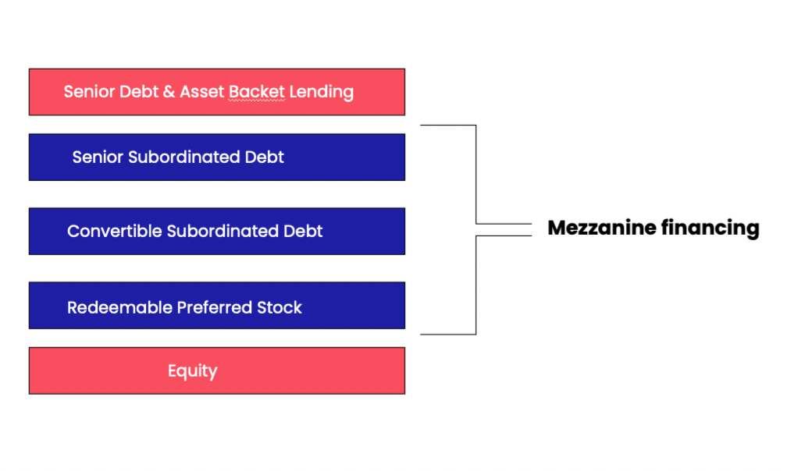

## Table of Contents

## What is acquisition debt?

Acquisition debt is money that people borrow to buy, build, or improve a home. It includes things like mortgages and home equity loans. When you take out a loan to buy a house, that loan is considered acquisition debt. The IRS has rules about how much acquisition debt you can have and still get tax benefits. For example, you can usually deduct the interest you pay on up to $750,000 of acquisition debt if you're married filing jointly.

It's important to know the difference between acquisition debt and other types of debt. For instance, if you take out a loan to buy a car or pay for a vacation, that's not acquisition debt. Only loans used for buying, building, or improving your main home or a second home count. Keeping track of your acquisition debt can help you when you're doing your taxes because it can affect how much you can deduct and save on taxes.

## How does acquisition debt differ from other types of debt?

Acquisition debt is a special kind of debt that you use to buy, build, or make your home better. This includes things like your mortgage or a home equity loan. The important thing about acquisition debt is that it's only for your main home or a second home, not for other stuff like cars or vacations. When you use money to improve your home, like adding a new room or fixing the roof, that can also be considered acquisition debt.

Other types of debt are different because they don't have to do with your home. For example, if you borrow money to buy a car, that's a car loan, not acquisition debt. Credit card debt from buying things like clothes or going on a trip is also different. The big difference is that acquisition debt can help you save money on taxes because you can often deduct the interest you pay on it, but you can't do that with other kinds of debt. Knowing which is which can help you manage your money better and maybe save on taxes.

## What are the common uses of acquisition debt?

Acquisition debt is money people borrow to do things with their homes. The most common use is to buy a home. When you get a mortgage to purchase your house, that's acquisition debt. It helps you own a place to live without having to pay all the money at once.

Another common use is to build a new home. If you take out a loan to construct a house from the ground up, that loan counts as acquisition debt too. It's not just for buying existing homes; it can be used to create a brand new one. Also, people use acquisition debt to make their homes better. For example, if you borrow money to add a new room or fix the roof, that's also considered acquisition debt. It helps improve where you live and can increase the value of your home.

## Who typically uses acquisition debt and why?

People who want to own a home but don't have all the money right away usually use acquisition debt. This includes first-time homebuyers who are starting to build their lives and need a place to live. It also includes families who want to move into a bigger or better home. These people use acquisition debt, like a mortgage, because it lets them spread out the cost of the home over many years, making it easier to afford.

Homeowners also use acquisition debt to make their homes better. If someone wants to add a new room, fix the roof, or make other improvements, they might take out a home equity loan. This type of acquisition debt helps them pay for these changes without using all their savings. It can make their home more comfortable and might even increase its value, which is good for their future.

## What are the benefits of using acquisition debt for business growth?

Using acquisition debt for business growth can help a company buy another business or assets that can make it bigger and stronger. When a company takes on acquisition debt to buy another company, it can quickly grow without using all its own money. This can help the company get new customers, products, or technology that can make it more successful. It's like using a loan to buy something that can help the business make more money in the future.

Another benefit is that acquisition debt can be a smart way to use other people's money to grow. Instead of using all the company's cash, which might be needed for other things, the company can borrow money to make the acquisition. If the acquisition works out well, the company can pay back the debt with the extra money it makes. This can lead to faster growth and more profits without putting all the company's own money at risk.

## How is acquisition debt structured in terms of interest rates and repayment terms?

When you take out acquisition debt, like a mortgage or a home equity loan, the [interest rate](/wiki/interest-rate-trading-strategies) can be fixed or variable. A fixed interest rate stays the same for the whole time you're paying back the loan. This means your monthly payments won't change, which can make it easier to plan your budget. A variable interest rate can go up or down based on the market. This means your monthly payments might change, which can be good if rates go down but harder if they go up.

The repayment terms for acquisition debt can vary a lot. For a mortgage, you might have 15, 20, or 30 years to pay it back. Longer terms mean smaller monthly payments, but you'll pay more interest over time. Shorter terms mean bigger monthly payments, but you'll pay less interest overall. Home equity loans usually have shorter repayment terms, like 5 to 15 years. It's important to pick the right term that fits your budget and how long you plan to stay in your home.

## What are the risks associated with acquisition debt?

Taking on acquisition debt, like a mortgage or a home equity loan, can be risky. One big risk is that if you can't make your monthly payments, you could lose your home. If you lose your job or have other money problems, it might be hard to keep up with the payments. If you fall behind, the bank could take your home away in a process called foreclosure. This is a scary thing that can affect your life a lot.

Another risk is that the interest rates might go up if you have a variable rate loan. If rates go up, your monthly payments will go up too. This can make it harder to afford your home, especially if your income doesn't go up at the same time. Also, if you use a home equity loan to improve your home and the value of your home goes down, you might end up owing more on your home than it's worth. This is called being "underwater" on your mortgage, and it can make selling your home really tough.

## Can acquisition debt be used for personal investments, and if so, how?

Yes, acquisition debt can be used for personal investments, but it's important to understand how it works. When you take out a home equity loan, which is a type of acquisition debt, you can use the money for things other than just buying or fixing your home. For example, you might use it to invest in stocks, start a small business, or buy rental property. The key thing is that the loan is still tied to your home, so you need to be careful because if you can't pay it back, you could lose your home.

Using acquisition debt for personal investments can be risky but also rewarding. If your investments do well, you might make more money than the interest you're paying on the loan. This can help you grow your wealth over time. But if your investments don't do well, you could end up owing more money than you make. It's important to think carefully and maybe talk to a financial advisor before using acquisition debt for personal investments, because it's a big decision that can affect your home and your future.

## How does the tax treatment of acquisition debt impact its attractiveness to borrowers?

The tax treatment of acquisition debt makes it more attractive to borrowers because they can often deduct the interest they pay on the loan from their taxes. For example, if you have a mortgage or a home equity loan, the interest you pay on that debt can be subtracted from your taxable income. This can lower your tax bill and save you money. Knowing that you can get this tax break can make taking out a loan to buy or improve your home seem like a better deal.

However, there are limits to how much interest you can deduct. For instance, if you're married filing jointly, you can usually deduct interest on up to $750,000 of acquisition debt. If you borrow more than that, you won't get to deduct the interest on the extra amount. This means you need to think carefully about how much you borrow. Even with the tax benefits, taking on too much debt can still be risky. It's important to weigh the savings from the tax deduction against the risk of not being able to make your payments.

## What role does acquisition debt play in mergers and acquisitions?

Acquisition debt is a big part of mergers and acquisitions. It's the money a company borrows to buy another company. When a company wants to grow fast, it might not have enough cash to buy another business outright. So, it takes out a loan to make the purchase. This loan is called acquisition debt. It lets the company use other people's money to get bigger, which can help it make more money in the future.

Using acquisition debt can be good for a company because it doesn't have to use all its own money. If the company it buys does well, the extra profits can help pay back the loan. But there are risks too. If the bought company doesn't do well, the company might struggle to pay back the debt. It's like betting on the future success of the bought company. If the bet pays off, the company grows and makes more money. If not, it can have a hard time.

## How do lenders assess the viability of providing acquisition debt?

Lenders look at a lot of things before they decide to give a company acquisition debt. They want to make sure the company can pay back the loan. So, they check the company's money situation, like how much money it makes and how much it owes. They also look at the company's past to see if it has been good at paying back loans. Lenders want to know if the company it wants to buy is a good one. They check if the new company can make more money and help the buyer pay back the loan.

Sometimes, lenders also look at the bigger picture. They think about what's happening in the market and if it's a good time for the company to grow. They might talk to experts or look at reports to understand if the plan to buy another company makes sense. Lenders want to be sure that giving the loan is a safe bet. If everything looks good, they might say yes to the acquisition debt. But if there are too many risks, they might say no or ask for the company to give something valuable as a promise to pay back the loan.

## What are advanced strategies for managing and optimizing acquisition debt?

One advanced strategy for managing acquisition debt is to use it to buy assets that will make more money than the interest you pay on the loan. For example, if you buy a rental property with a home equity loan, the rent you get can help you pay back the loan and maybe even make extra money. Another way is to pay off the debt faster than you have to. If you can afford to pay more each month, you'll pay less interest over time. This can save you a lot of money and help you own your home or business sooner.

Another strategy is to refinance your acquisition debt when interest rates go down. If you can get a new loan with a lower interest rate, your monthly payments will be smaller. This can free up money for other things or help you pay off the loan faster. It's also smart to keep an eye on the value of your home or the business you bought. If the value goes up, you might be able to borrow more money at a better rate or even sell the asset to pay off the debt completely. These strategies can help you use acquisition debt in a smart way to grow your wealth and reduce your risks.

## What is the relationship between Algorithmic Trading and Financial Metrics?

Algorithmic trading refers to the use of computer algorithms to automate trading decisions and execute trades at speeds and frequencies beyond the capability of human traders. This approach relies heavily on financial metrics to optimize strategies and ensure effective risk management. Among the various financial metrics, debt and leverage ratios play a significant role in [algorithmic trading](/wiki/algorithmic-trading) strategies.

Debt ratios, such as the debt-to-equity ratio (D/E), offer insights into a company's financial leverage by comparing its total liabilities to its shareholder equity. A higher ratio can indicate greater risk, as companies rely more heavily on borrowed money. Leverage ratios like the interest coverage ratio inform traders about a company's ability to meet interest obligations, a critical component in assessing credit risk. These ratios help traders evaluate the financial stability of the entities involved and incorporate this assessment into trading algorithms.

One of the core aspects of algorithmic trading is risk management, where financial metrics are crucial. Algorithms use metrics such as the Sharpe ratio, which measures the return per unit of risk, to adjust trading strategies and optimize the risk-return profile. The formula for the Sharpe ratio is expressed as:

$$
\text{Sharpe Ratio} = \frac{E[R_p - R_f]}{\sigma_p}
$$

where $E[R_p]$ is the expected portfolio return, $R_f$ is the risk-free rate, and $\sigma_p$ is the standard deviation of the portfolio's excess return.

Machine learning and [artificial intelligence](/wiki/ai-artificial-intelligence) (AI) have enhanced the capability to evaluate financial ratios accurately and swiftly. These technologies enable the processing of vast datasets to uncover patterns and predict price movements. By employing [machine learning](/wiki/machine-learning) algorithms, trading systems can automatically adapt and refine their strategies based on historical data and market conditions—improving the integration of financial metrics like debt ratios.

For example, a decision tree algorithm might be used to segregate stocks with different leverage characteristics, identifying those with optimal risk-adjusted returns:

```python
from sklearn.tree import DecisionTreeClassifier
import pandas as pd

# Assume 'data' is a DataFrame with columns 'DebtEquityRatio', 'InterestCoverage', and 'TargetReturn'
X = data[['DebtEquityRatio', 'InterestCoverage']]
y = data['TargetReturn']

# Initialize and train the decision tree classifier
clf = DecisionTreeClassifier()
clf.fit(X, y)

# Predict based on a hypothetical company's metrics
company_data = [[0.5, 10]]  # [DebtEquityRatio, InterestCoverage]
prediction = clf.predict(company_data)
```

Through debt analysis, algorithmic trading strategies can be specifically designed to exploit inefficiencies in the market. A practical instance of this is [pair trading](/wiki/pair-trading), where an algorithm identifies two companies with similar financial metrics, such as leverage ratios. The strategy involves taking a long position in the underperforming stock while shorting the outperforming one, anticipating a convergence in their performance.

Furthermore, quant funds and other algorithmic-driven trading houses are applying neural networks to model the non-linear relationships between financial ratios and asset price movements. This approach not only aids in risk assessment but also enhances the prediction of financial distress, enabling algorithms to avoid or short unsusceptive trading positions.

Overall, the integration of financial metrics such as debt and leverage within algorithmic trading frameworks is pivotal. Technologies like machine learning serve to deepen the analysis, making these strategies more adaptive and robust. As markets evolve, the sophistication and accuracy of the metrics-driven trading models continue to advance, affirming the essential role of these financial measures.

## How can one craft effective debt strategies?

Crafting effective debt strategies involves a multifaceted approach, integrating financial analysis, economic forecasting, and strategic planning. The primary objective is to manage acquisition debt across various financial contexts efficiently, ensuring that entities, be they corporate or individual, can optimize their returns while maintaining financial stability.

### Strategies for Managing Acquisition Debt

**Balancing Leverage and Equity in Debt Finance**

Incorporating balance in the leverage and equity ratio is essential to optimize returns in debt finance. Leverage refers to the use of borrowed money to amplify potential returns on investment, while equity relates to the ownership interest held by shareholders. An optimal balance minimizes financial risks associated with excessive debt while maximizing potential gains.

The debt-to-equity ratio, expressed mathematically as:

$$
\text{Debt-to-Equity Ratio} = \frac{\text{Total Liabilities}}{\text{Shareholders' Equity}}
$$

is a crucial metric for maintaining this balance. A lower ratio suggests less risk but potentially lower returns, whereas a higher ratio increases both potential return and risk. Effective debt strategies involve adjusting this ratio to align with financial goals and risk tolerance.

**Utilizing Modern Technologies**

Technological advancements play a pivotal role in assessing and restructuring debt portfolios. With the rise of big data analytics, machine learning, and artificial intelligence, organizations can now deploy sophisticated models to predict financial outcomes, assess risk, and optimize debt structures. For example, machine learning algorithms can analyze historical data and identify patterns that suggest optimal restructuring strategies.

Python code example for analyzing debt portfolios using machine learning:

```python
import pandas as pd
from sklearn.model_selection import train_test_split
from sklearn.ensemble import RandomForestRegressor

# Load financial data
data = pd.read_csv('debt_portfolio_data.csv')

# Define features and target variable
features = data.drop(columns=['DebtPortfolioValue'])
target = data['DebtPortfolioValue']

# Split the data
X_train, X_test, y_train, y_test = train_test_split(features, target, test_size=0.2, random_state=42)

# Train a model
model = RandomForestRegressor(n_estimators=100, random_state=42)
model.fit(X_train, y_train)

# Predict and evaluate
predictions = model.predict(X_test)
print("Model predictions:", predictions)
```

This code snippet demonstrates how machine learning can be instrumental in evaluating and optimizing debt portfolios.

**Analyzing Interest Rates and Macroeconomic Factors**

Interest rates and macroeconomic conditions significantly influence debt management strategies. High interest rates increase the cost of borrowing, impacting cash flow and profit margins. Conversely, low rates can encourage borrowing but may reflect broader economic uncertainty. Understanding these dynamics involves rigorous analysis of central bank policies, inflation trends, and economic indicators.

Quantitative models, such as the Capital Asset Pricing Model (CAPM), assess the impact of these factors on debt portfolios, guiding strategic decision-making. CAPM's formula is:

$$
\text{Expected Return} = R_f + \beta \times (R_m - R_f)
$$

where $R_f$ is the risk-free rate, $\beta$ is the beta, and $R_m$ is the market return.

**Securing Favorable Debt Terms**

Securing favorable debt terms is critical for minimizing costs and optimizing financial outcomes. For corporate acquisitions, this may involve negotiating interest rates, repayment schedules, and covenants. Individuals may seek to secure mortgage terms that align with their financial capabilities.

Strategies to secure favorable terms include:

- Demonstrating a strong credit profile and financial health to creditors.
- Exploring competitive financing options.
- Leveraging existing relationships with financial institutions to negotiate better terms.

Overall, crafting effective debt strategies requires a comprehensive understanding of financial metrics, market conditions, and emerging technologies. By balancing leverage with equity, utilizing modern analytical tools, and responding to macroeconomic signals, both corporations and individuals can make informed debt decisions, achieving financial growth and stability.

## References & Further Reading

[1]: Damodaran, A. (2012). ["Investment Valuation: Tools and Techniques for Determining the Value of Any Asset"](https://books.google.com/books/about/Investment_Valuation.html?id=5SRHAAAAQBAJ) (3rd ed.). Wiley.

[2]: Loh, A. L., & Stulz, R. M. (2017). ["The Credit Market Consequences of Large Tax Cuts."](https://onlinelibrary.wiley.com/doi/abs/10.1111/jofi.12611) National Bureau of Economic Research.

[3]: Lopez de Prado, M. (2018). ["Advances in Financial Machine Learning"](https://www.amazon.com/Advances-Financial-Machine-Learning-Marcos/dp/1119482089). Wiley.

[4]: Fabozzi, F. J. (2016). ["Bond Markets, Analysis, and Strategies"](https://books.google.com/books/about/Bond_Markets_Analysis_and_Strategies_ten.html?id=bQpNEAAAQBAJ) (9th ed.). Pearson.

[5]: Jansen, S. (2020). ["Machine Learning for Algorithmic Trading: Predictive models to extract signals from market and alternative data for systematic trading strategies with Python"](https://www.amazon.com/Machine-Learning-Algorithmic-Trading-alternative/dp/1839217715). Packt Publishing.

[6]: Chan, E. (2009). ["Quantitative Trading: How to Build Your Own Algorithmic Trading Business"](https://github.com/ftvision/quant_trading_echan_book). Wiley.