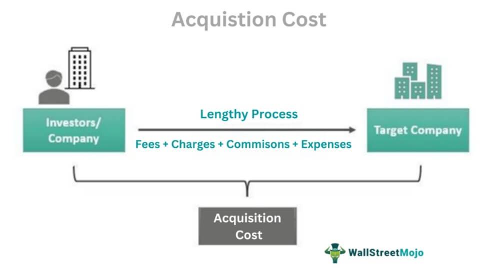

The contemporary financial landscape is continually evolving, bringing forth an array of sophisticated practices in both financing and trading. Among these, leasing, finance, and algorithmic trading stand out as particularly complex yet influential sectors. Each of these areas contributes to the dynamic nature of modern financial markets and requires a thorough understanding to leverage their potential effectively.

A frequently encountered term in the leasing domain is the 'acquisition fee,' which plays a significant role in structuring leasing agreements. Understanding these fees is crucial as they can substantially impact the total cost of a lease. In broader finance, grasping the intricacies of various costs and fees is paramount to maximizing returns on investment and ensuring financial efficiency. Mastery of these financial building blocks is essential for anyone looking to succeed in positions that manage or negotiate financial obligations.



On a different but equally compelling front, algorithmic trading has revolutionized the way trades are executed in financial markets. This approach uses technology to carry out transactions at remarkable speeds and frequencies, often surpassing what is possible through manual trading methods. Algorithmic trading involves deploying complex mathematical models and statistical analyses to make automated trading decisions, thus enhancing market efficiency and liquidity. As such, it epitomizes the intersection of financial expertise and technological innovation, demanding a deep understanding of both areas to harness its potential effectively.

This article aims to elucidate how these elements intersect and influence each other, offering a comprehensive overview and practical insights for managing leasing acquisition fees and engaging in algorithmic trading. Through exploring these topics, the text will provide readers with the knowledge necessary to navigate the intricacies of finance and trading in modern markets.

## Table of Contents

## Understanding Leasing Acquisition Fees

An acquisition fee, also known as a "lease initiation fee," represents a charge levied to cover administrative costs incurred during the arrangement of a lease or loan. This fee is a fundamental component that lessors charge to initiate a lease agreement. These fees can significantly impact the total cost of leasing, and their transparency is crucial for lessees to accurately interpret the financial implications of their lease agreements.

Typically, acquisition fees are non-negotiable and can range from a few hundred to a few thousand dollars, depending on the type of asset being leased and the policies of the leasing company. However, while these fees are sometimes prominently displayed, they can also be embedded within a larger lease agreement, emphasizing the importance of careful scrutiny of lease terms to understand all cost components.

Borrowers have the option to pay acquisition fees upfront, thereby minimizing the added interest cost over the term of the lease. This prepayment can be advantageous, as it reduces the principal amount on which interest is calculated, potentially saving borrowers money over the lease term. For example, paying a $500 acquisition fee upfront, rather than financing this amount over a three-year lease at an [interest rate](/wiki/interest-rate-trading-strategies) of 5%, can result in savings of approximately $39 in interest payments.

The importance of understanding and negotiating acquisition fees extends beyond personal leasing and is equally relevant in business contexts, such as real estate investments. In real estate, acquisition fees might be charged by portfolio managers as compensation for their efforts in identifying and acquiring properties for investment funds. These fees can be a percentage of the purchase price, and it is crucial for investors to comprehend how these fees impact overall returns.

In any leasing scenario, the ability to analyze and negotiate acquisition fees is critical. For individuals and businesses alike, these fees impact financial planning and contract terms. A thorough understanding enables lessees to make informed decisions, ensuring their financial commitments align with their objectives and capabilities. Negotiating lower fees or opting for payment structures that align with personal financial strategies can mitigate the impact of acquisition fees on overall leasing costs.

## Algorithmic Trading: A Modern Market Phenomenon

Algorithmic trading has transformed the landscape of financial markets by employing computer algorithms to execute trades at extraordinary speeds, utilizing pre-defined market signals. This approach is underpinned by the integration of extensive market data, sophisticated computational algorithms, and real-time trading capabilities.

Historically, trading depended on human judgment and was significantly constrained by the time and resources it required. With the advent of [algorithmic trading](/wiki/algorithmic-trading), market efficiency has improved considerably because these algorithms can process vast data sets and execute trades within milliseconds. These systems can identify [arbitrage](/wiki/arbitrage) opportunities, perform market-making, or implement [statistical arbitrage](/wiki/statistical-arbitrage) strategies without the emotional or psychological biases inherent in human traders.

Algorithmic trading, however, is not without challenges. As these systems can execute numerous transactions across multiple venues simultaneously, they contribute to market [liquidity](/wiki/liquidity-risk-premium) but also increase the complexity of regulatory oversight. Regulatory bodies across the globe have intensified scrutiny to ensure market integrity and protect against systemic risks, such as flash crashes, which may arise from errors in algorithms or unexpected market conditions.

The financial and technological barriers to entry in algorithmic trading are substantial. Firms must invest heavily in technology infrastructure to support high-frequency trading scenarios. This encompasses robust hardware, such as low-latency servers and networking equipment, and specialized software for developing and optimizing trading algorithms. Additionally, access to real-time data feeds and historical data for back-testing algorithms is crucial and often expensive.

Moreover, compliance costs have risen alongside increased regulatory demands. Firms need to ensure their trading practices align with financial regulations, requiring ongoing investment in compliance infrastructure and expertise.

Navigating these financial and technical costs is paramount for traders who aspire to thrive in this competitive environment. They must balance the expenses associated with technology and regulatory compliance while striving to craft algorithms that produce consistent returns. Optimization often involves examining the trade-off between speed and accuracy in algorithm execution or deploying [machine learning](/wiki/machine-learning) techniques to refine decision-making processes.

Algorithmic trading has undeniably ushered in a new era of trading, marked by efficiency and complexity. As technology and markets continue to evolve, those participating in algorithmic trading will need to continuously adapt and refine their strategies to remain competitive.

## Financing the Algorithmic Trading Venture

Starting an algorithmic trading business requires strategic investment in software and technology infrastructure. These investments vary from basic systems to advanced, data-intensive platforms, depending on the firm's trading strategies and market goals. A robust infrastructure is essential for processing vast market data in real time and executing trades efficiently. 

Key expenses in establishing an algorithmic trading venture encompass several categories:

1. **Software Development**: Developing proprietary trading algorithms necessitates skilled developers and programmers. Costs can vary significantly based on the complexity of the algorithms and the level of customization required. Open-source programming languages such as Python are often utilized due to their flexibility and a wide range of available libraries like Pandas for data analysis and NumPy for numerical computations.

2. **Market Data Subscriptions**: Access to historical and real-time market data is crucial for building and testing trading algorithms. Subscriptions to data providers may include feeds for stocks, futures, options, and foreign exchange markets. The cost of these subscriptions can range from a few hundred to thousands of dollars per month depending on the breadth and depth of the data.

3. **Compliance Costs**: Regulatory compliance is an unavoidable aspect of financial trading. An algorithmic trading firm must ensure adherence to relevant financial regulations, which can involve legal consultations, compliance software, and periodic audits. These measures help avoid potential fines and ensure the firm operates within legal frameworks.

4. **Infrastructure Investments**: To achieve millisecond or even microsecond trading speeds, firms need cutting-edge technology infrastructure. This includes high-performance computing (HPC) clusters, low-latency network connections, and co-location services near stock exchanges. 

Financing these expenses can be challenging, especially for startups and smaller firms. Several financing options can mitigate the financial burden:

- **Venture Capital**: Many algorithmic trading startups turn to venture capitalists for funding, trading equity stakes for the necessary capital to develop their infrastructure and refine their algorithms.
- **Strategic Partnerships**: Collaborating with established financial institutions can provide access to resources and technology while sharing the risk. These partnerships can also open up new markets and customer bases, facilitating growth.
- **Debt Financing**: Bank loans or issuing bonds may also be a path, though this adds an obligation to make regular repayments and interest expenditures.

Successful algorithmic trading ventures demand not just adequate funding, but also effective financial planning and budget management. Allocating resources wisely, forecasting future capital needs, and preparing for market changes are essential strategies for achieving sustainable profitability. Firms must continuously evaluate their cost structures and investment outcomes to remain competitive in an ever-evolving financial market.

## Synergies and Divergences: Leasing and Algo Trading

While leasing acquisition fees and algorithmic trading might initially seem unrelated, both financial activities demand a thorough understanding of cost management and strategic investment decision-making. This convergence lies mainly in how financial professionals approach these areas to maximize profitability and efficiency.

In leasing, acquisition fees are an integral part of the cost structure. These fees cover administrative expenses and are either paid upfront or incorporated into the lease payments, affecting the overall financial outcome. Understanding the nuances of these costs allows lessees to negotiate and manage their lease agreements more effectively, ensuring that they align with their financial objectives. Similarly, algorithmic trading involves a complex array of costs such as technology infrastructure, data feeds, and compliance expenses. Mastering these costs is essential for maintaining a competitive edge in the market.

Both leasing and algorithmic trading require negotiations and informed decision-making to optimize financial results. For instance, in leasing, negotiating lower acquisition fees can significantly reduce overall costs. In algorithmic trading, making informed decisions about initial technological investments and ongoing operational expenses can lead to better profitability. The ability to scrutinize cost structures, minimize unnecessary expenditures, and allocate resources efficiently is crucial to success in both fields.

The analytical skills developed through the management and negotiation of leasing agreements can be directly applied to strategic planning in algorithmic trading. Professionals can leverage their knowledge of cost efficiencies gained from leasing to design algorithms and investment strategies that optimize resource allocation. This might involve analyzing market data to develop cost-effective trading strategies or utilizing predictive models to forecast market behavior and adjust trading tactics accordingly.

Below is an example of how Python can be used to analyze and optimize cost structures within algorithmic trading systems:

```python
# Sample Python code for basic cost analysis in algorithmic trading

def calculate_total_cost(infrastructure_costs, data_feed_costs, compliance_costs):
    total_cost = infrastructure_costs + data_feed_costs + compliance_costs
    return total_cost

# Example inputs
infrastructure_costs = 50000  # e.g., servers, hardware
data_feed_costs = 15000       # e.g., market data subscriptions
compliance_costs = 8000       # e.g., regulatory compliance

total_expense = calculate_total_cost(infrastructure_costs, data_feed_costs, compliance_costs)
print(f"Total Trading System Cost: ${total_expense}")
```

Ultimately, whether managing leasing acquisition fees or setting up an algorithmic trading venture, the core competencies of understanding and effectively managing costs are invaluable. The synergy between these seemingly different activities lies in the ability to strategically navigate financial landscapes, ensuring long-term sustainability and success.

## Conclusion

Navigating through the financial intricacies of leasing acquisition fees and algorithmic trading demands not only a comprehensive understanding of financial concepts but also a strategic approach to cost management. The interdependent and often volatile nature of financial markets underscores the importance of analytical skills in dissecting complex financial data and deriving meaningful insights. Such acumen enables professionals to adapt to and capitalize on emerging trends and technologies, ensuring sustained success. 

In the domain of leasing, recognizing the impact of acquisition fees on overall expenses facilitates informed decision-making, potentially leading to significant cost savings. By negotiating terms and understanding the components of these fees, professionals can optimize lease agreements to align with financial objectives.

Algorithmic trading, on the other hand, highlights the necessity of leveraging technology and data analytics for precise and efficient trade execution. With ongoing advancements amplifying both opportunities and challenges, strategic foresight becomes crucial. This involves critical assessment of technology investments, understanding algorithmic intricacies, and anticipating market dynamics to enhance profitability.

As financial landscapes continue to evolve, professionals who adeptly manage costs and fees will stand out, driving their organizations towards sustained competitiveness and financial prosperity. Maintaining vigilance in monitoring and adapting to changes ensures not only compliance but also the optimization of financial outcomes in both leasing and algorithmic trading environments.

## References & Further Reading

[1]: Bergstra, J., Bardenet, R., Bengio, Y., & Kégl, B. (2011). ["Algorithms for Hyper-Parameter Optimization."](https://dl.acm.org/doi/10.5555/2986459.2986743) Advances in Neural Information Processing Systems 24.

[2]: ["Advances in Financial Machine Learning"](https://www.amazon.com/Advances-Financial-Machine-Learning-Marcos/dp/1119482089) by Marcos Lopez de Prado

[3]: ["Evidence-Based Technical Analysis: Applying the Scientific Method and Statistical Inference to Trading Signals"](https://www.amazon.com/Evidence-Based-Technical-Analysis-Scientific-Statistical/dp/0470008741) by David Aronson

[4]: ["Machine Learning for Algorithmic Trading"](https://github.com/stefan-jansen/machine-learning-for-trading) by Stefan Jansen

[5]: ["Quantitative Trading: How to Build Your Own Algorithmic Trading Business"](https://www.amazon.com/Quantitative-Trading-Build-Algorithmic-Business/dp/1119800064) by Ernest P. Chan