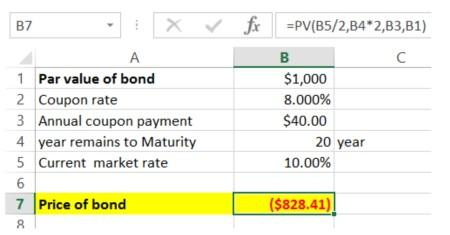

In the highly competitive financial market, understanding financial instruments such as bonds, their coupon rates, and the impact of algorithmic trading is essential for informed investment decisions. Bonds are debt securities that governments, municipalities, and corporations use to raise capital. Investors who purchase bonds lend their money to the issuer in exchange for periodic interest payments, known as coupon payments, as well as the repayment of the bond's face value upon maturity. The coupon rate, which denotes the interest payment a bondholder receives as a percentage of the bond's face value, plays a critical role in determining a bond's price and yield.

Coupon rates influence investor decisions significantly, as they reflect the bond's potential income relative to market interest rates. A higher coupon rate can provide better income protection in a rising interest rate environment, making it an attractive option for investors seeking steady, predictable returns. Conversely, bonds with lower coupon rates may be less appealing when interest rates rise since their fixed payments become comparatively less valuable.



Algorithmic trading, known for bringing automation and efficiency to financial markets, is increasingly prevalent in bond trading. It allows investors to execute trades at high speeds and large volumes using pre-programmed instructions based on various criteria, such as timing, price, and even mathematical models that predict price movements. By automating these processes, investors can optimize their returns through precise decision-making and reduce the cost and time otherwise required for manual trades.

The interplay of bond investments, coupon rates, and algorithmic trading unveils a complex landscape of strategic opportunities and market dynamics. Investors benefit from understanding how these elements interact to make informed decisions that align with their financial objectives. This introduction sets the stage for a deeper exploration of these key aspects, guiding investors through the intricacies of bond markets and the innovative approaches made possible by technological advancements.

## Table of Contents

## Understanding Bonds and Coupon Rates

Bonds are a type of fixed-income security issued by corporations, municipalities, and governments as a means of raising capital. When an entity issues a bond, it essentially borrows money from investors, promising to repay the face value of the bond at maturity, along with periodic interest payments known as coupon payments. These coupon payments are typically disbursed semi-annually or annually and represent a fixed percentage of the bond's face value, known as the coupon rate.

The coupon rate is a critical factor in determining a bond's attractiveness to potential investors. For example, if a bond has a face value of $1,000 and an annual coupon rate of 5%, it will pay $50 in interest each year until it matures. Bonds with higher coupon rates are generally more attractive to investors seeking regular income, especially in rising interest rate environments. In such scenarios, newer bonds may be issued with higher coupon rates, which increases their appeal in comparison to older bonds with lower rates.

The interplay between bond prices, interest rates, and coupon rates is fundamental to bond investment strategy. When interest rates rise, existing bonds with lower coupon rates may decline in value, as newer issues offer higher yields that are more attractive. Conversely, when interest rates fall, the value of existing bonds with higher coupon rates tends to increase.

Understanding this relationship is crucial for making informed investment decisions. Bond prices are inversely related to [interest rate](/wiki/interest-rate-trading-strategies) changes due to the fixed nature of coupon payments. This principle can be mathematically expressed using the bond price formula, which calculates the present value of future cash flows:

$$
P = \sum_{t=1}^{n} \frac{C}{(1 + r)^t} + \frac{M}{(1 + r)^n}
$$

where $P$ is the price of the bond, $C$ is the annual coupon payment, $r$ is the discount rate (reflecting current market interest rates), $M$ is the maturity value, and $n$ is the total number of periods until maturity.

Investors need to consider current and anticipated interest rates when evaluating bonds, as these factors influence both the income potential of bonds and their market value. Recognizing the importance of the coupon rate can guide investment choices, ensuring a balanced approach to both income generation and capital preservation in a fluctuating interest rate landscape.

## Calculating Bond Prices and Yields

Bond pricing is a fundamental concept in fixed-income investments, critical for assessing the value of potential investments and managing a portfolio effectively. The process of bond pricing involves calculating the present value of future cash flows from the bond, which includes periodic coupon payments and the principal amount repaid at maturity.

To calculate a bond's price, it is essential to understand certain key concepts:

1. **Face Value (Par Value)**: This is the amount paid to the bondholder at maturity. Typically, bonds have a face value of $1,000, but this can vary.

2. **Coupon Rate**: This is the annual interest rate paid by the bond issuer on the bond's face value. For instance, a bond with a 5% coupon and a $1,000 face value pays $50 annually.

3. **Market Yield (Yield to Maturity, YTM)**: YTM is the total return anticipated on a bond if it is held until it matures. It considers all coupon payments received over the life of the bond and the face value at maturity.

4. **Time to Maturity**: This is the duration remaining until the bond's principal is repaid.

### Calculating Bond Prices

The price of a bond $P$ can be calculated using the formula that accounts for the present value of its expected future cash flows:

$$

P = \sum_{t=1}^{T} \frac{C}{(1 + r)^t} + \frac{F}{(1 + r)^T} 
$$

where:
- $P$ = bond price
- $C$ = annual coupon payment
- $r$ = market yield or YTM
- $T$ = total number of periods (years) until maturity
- $F$ = face value of the bond
- $t$ = individual period (year)

### Difference Between Coupon Rate and Yield to Maturity (YTM)

The coupon rate is fixed and reflects the bond's cash flow as a percentage of its face value. Conversely, YTM accounts for the bond's current market price, providing a comprehensive measure of its profitability if held to maturity. When a bond's price is below its face value, the YTM will be higher than the coupon rate, indicating a discount bond. Conversely, when it's above face value, the bond is a premium bond, and the YTM is lower than the coupon rate.

### Importance of Accurate Bond Pricing and Yield Calculations

Precise bond pricing and yield calculations are indispensable for investors. These metrics influence investment decisions, such as determining the attractiveness of buying or selling a bond. They are also crucial for portfolio optimization, enabling investors to balance yield against risks like interest rate changes or credit risks. By mastering these calculations, investors can fine-tune their strategies and judiciously manage their fixed-income investments in line with market conditions.

## Algorithmic Trading and Its Role in Bond Markets

Algorithmic trading has become a transformative force in bond markets, primarily by enhancing market efficiency and [liquidity](/wiki/liquidity-risk-premium). This section examines how these automated systems function and the impact they have on trading strategies and outcomes.

Algorithms designed for trading in bond markets automate complex strategies, enabling rapid execution and data analysis. This automation significantly reduces transaction costs and offers advantages over manual trading, where human emotional bias and slower reaction times can affect decision-making. By swiftly analyzing market data and executing trades, algorithms provide traders with the ability to capitalize on small price movements efficiently.

A critical component of [algorithmic trading](/wiki/algorithmic-trading) is the use of statistical analysis, [artificial intelligence](/wiki/ai-artificial-intelligence) (AI), and [machine learning](/wiki/machine-learning). These cutting-edge technologies equip algorithms with the capability to process vast amounts of data, identify trading signals, and predict market directions. By utilizing historical data and real-time analytics, algorithms can detect patterns and generate trading decisions that optimize returns and manage risks effectively.

For instance, machine learning models can process past trading data to predict future bond price movements. These predictions can be coded into trading algorithms to automate buy or sell decisions when specific criteria are met. Here's a simple illustration in Python using a hypothetical dataset for training a machine learning model to predict bond prices:

```python
from sklearn.model_selection import train_test_split
from sklearn.linear_model import LinearRegression
import pandas as pd

# Assume 'data.csv' contains historical bond prices and relevant features
df = pd.read_csv('data.csv')
X = df[['feature1', 'feature2', 'feature3']]  # Features predicting bond prices
y = df['bond_price']  # Target variable

# Splitting data into training and testing sets
X_train, X_test, y_train, y_test = train_test_split(X, y, test_size=0.2, random_state=42)

# Training a linear regression model
model = LinearRegression()
model.fit(X_train, y_train)

# Predicting prices
predictions = model.predict(X_test)
```

This code snippet demonstrates how algorithms can learn from historical data, a fundamental step in creating a robust algorithmic trading model.

Case studies illustrate the successful implementation of these technologies. One notable example is the application of high-frequency trading ([HFT](/wiki/high-frequency-trading-strategies)) in bond markets. HFT uses powerful computers to execute a large number of orders at extremely fast speeds. These systems can exploit the smallest price inefficiencies, often executing trades in microseconds, which is particularly effective in the typically less liquid bond markets.

Another example lies in risk management, where algorithmic systems continuously monitor portfolio positions against predefined risk metrics. By doing so, they adjust positions to mitigate potential losses due to adverse market movements. This real-time risk management is a critical aspect of portfolio optimization.

In conclusion, algorithmic trading systems are revolutionizing the bond market by automating decision-making processes that were traditionally dependent on human traders. By effectively utilizing statistical analyses, AI, and machine learning, these systems not only enhance trading efficiency but also allow investors to adopt sophisticated strategies to optimize returns and manage risks more effectively.

## Advanced Strategies for Investors

Advanced bond investment strategies leverage algorithmic trading to enhance returns and reduce risks, presenting a nuanced approach to managing bond portfolios. Algorithmic trading incorporates predictive models and real-time data analytics, offering a comprehensive framework for evaluating bond yields and market conditions with greater precision and speed.

Predictive models play a crucial role by assessing historical data and identifying trends that could influence bond prices. For instance, techniques such as time series analysis and regression models can forecast interest rate movements, a significant [factor](/wiki/factor-investing) affecting bond yields. These models enable investors to anticipate changes and adjust their portfolios accordingly. For example, an investor might use a Python implementation of an ARIMA (AutoRegressive Integrated Moving Average) model to predict future interest rates:

```python
import pandas as pd
from statsmodels.tsa.arima.model import ARIMA

# Load historical interest rate data
data = pd.read_csv('historical_interest_rates.csv')
rates = data['interest_rate']

# Fit ARIMA model
model = ARIMA(rates, order=(5,1,0))
model_fit = model.fit()

# Forecast future rates
forecast = model_fit.forecast(steps=10)
print(forecast)
```

Real-time data analytics further enhances the ability to monitor market conditions. By integrating tools that provide instantaneous market insights, investors can make informed decisions, reducing the latency traditionally associated with manual analyses. This capability is particularly beneficial in volatile markets where quick responses are a competitive advantage.

Another critical aspect is balancing active and passive management strategies. Active management leverages algorithmic trading to exploit short-term market inefficiencies, while passive strategies focus on maintaining an investment portfolio over longer periods to track bond indices. A combined approach allows investors to benefit from both strategies, optimizing performance based on prevailing market conditions. For example, algorithmic systems can automatically adjust the allocation between active and passive strategies using predefined rules or machine learning models, ensuring that the portfolio remains aligned with the investor's objectives.

A technology-driven approach also facilitates scenario analysis and stress testing. These methods enable investors to evaluate how their portfolios might perform under various macroeconomic conditions, allowing them to proactively address potential risks. The use of technology in stress testing helps in understanding the impact of extreme market conditions, such as a sharp rise in interest rates, thereby aiding in risk mitigation.

In summary, adopting advanced strategies through the integration of algorithmic trading and data analytics allows investors to manage their bond portfolios more effectively. This approach not only improves decision-making by providing deeper market insights but also enables investors to respond to changes dynamically, maximizing their returns while minimizing risks.

## Conclusion

A comprehensive understanding of bond calculations, coupon rates, and algorithmic trading is crucial for achieving success in financial markets. By mastering these concepts, investors can make informed decisions, optimizing returns while effectively mitigating risks. Algorithmic trading, in particular, offers sophisticated tools that empower investors to navigate market complexities with precision and efficiency. 

Leveraging technology is essential to monitor bond yields, assess market conditions, and execute trades with speed and accuracy. This technical approach not only facilitates the optimization of investment portfolios but also supports the development of advanced strategies tailored to individual financial goals. 

Continuous learning and adaptation are vital in the ever-evolving financial landscape. Staying informed about innovations and methodologies ensures that investors are equipped to harness new opportunities and counteract emerging challenges. Embracing technological advancements in bond markets can significantly enhance investment performance, aligning with broader financial objectives.

Investors are urged to apply these insights actively to enhance their portfolios. By doing so, they can achieve diversification, better manage risks, and maximize returns, ultimately fulfilling their investment aspirations. Regularly updating one's knowledge of bond pricing, coupon rates, and algorithmic strategies will contribute to long-term success and resilience in the dynamic environment of financial markets.

## References & Further Reading

[1]: ["The Handbook of Fixed Income Securities"](https://www.amazon.com/Handbook-Fixed-Income-Securities-Ninth/dp/1260473899) by Frank J. Fabozzi

[2]: ["Advances in Financial Machine Learning"](https://www.amazon.com/Advances-Financial-Machine-Learning-Marcos/dp/1119482089) by Marcos Lopez de Prado

[3]: ["Quantitative Trading: How to Build Your Own Algorithmic Trading Business"](https://www.amazon.com/Quantitative-Trading-Build-Algorithmic-Business/dp/1119800064) by Ernest P. Chan

[4]: ["Machine Learning for Algorithmic Trading"](https://github.com/stefan-jansen/machine-learning-for-trading) by Stefan Jansen

[5]: ["Evidence-Based Technical Analysis: Applying the Scientific Method and Statistical Inference to Trading Signals"](https://www.amazon.com/Evidence-Based-Technical-Analysis-Scientific-Statistical/dp/0470008741) by David Aronson

[6]: ["Algorithmic Trading and DMA: An Introduction to Direct Access Trading Strategies"](https://www.amazon.com/Algorithmic-Trading-DMA-introduction-strategies/dp/0956399207) by Barry Johnson

[7]: Bergstra, J., Bardenet, R., Bengio, Y., & Kégl, B. (2011). ["Algorithms for Hyper-Parameter Optimization."](https://dl.acm.org/doi/10.5555/2986459.2986743) Advances in Neural Information Processing Systems 24.