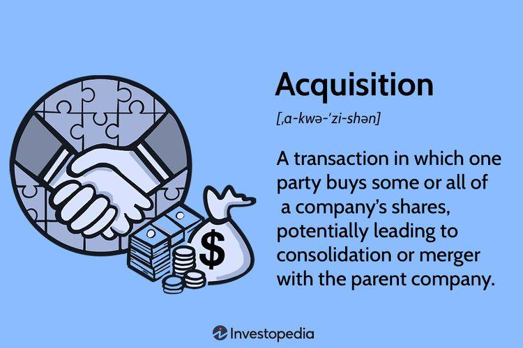

In today’s rapidly evolving business landscape, corporate acquisitions, business acquisitions, and algorithmic trading, commonly known as algo trading, have become essential strategies. These mechanisms are crucial in driving growth, increasing efficiency, and gaining a competitive edge. Corporate acquisitions typically involve one company purchasing another in entirety, allowing for expansion in terms of market share, capabilities, or competitive positioning. Business acquisitions, as a subset of corporate acquisitions, focus on acquiring specific business units or assets, strategically chosen to complement or enhance existing operations.

Algorithmic trading, on the other hand, revolutionizes the financial markets by utilizing complex algorithms to execute trades at speeds and volumes impossible for human traders. This method leverages technology and data to capitalize on trading opportunities, optimize transaction costs, and manage large volumes of trades efficiently.

Understanding these concepts goes beyond merely knowing their definitions; it involves recognizing their strategic implications and how they interplay in the financial ecosystem. For instance, businesses may use acquisitions to bolster their technological infrastructure, thus improving their algo trading capabilities. This synergy between acquisitions and algo trading can enable firms to better navigate market complexities and uncertainties, capitalize on emerging opportunities, and manage risks more effectively.

For businesses and investors, mastering these strategies is not only about gaining immediate advantages but also about ensuring long-term sustainability. Acquisitions can expand a company's reach and resources, while algo trading can introduce new efficiencies and competitive dynamics. By comprehending and utilizing these mechanisms thoughtfully, stakeholders can unlock potential opportunities and mitigate the associated risks inherent in today's fast-paced financial environment.

## Table of Contents

## Understanding Corporate Acquisitions

Corporate acquisitions represent a significant strategy in the business world, enabling companies to enhance their competitive edge, market share, or capabilities by acquiring another company. These acquisitions can drive growth and expansion, leading to increased market presence and more diversified product or service offerings.

Corporate acquisitions are generally categorized into two types: friendly and hostile takeovers. In a friendly takeover, the acquiring company reaches an agreement with the target company's management and board of directors. This mutual agreement typically results in cooperative negotiations and a smoother transition process, as both parties see potential benefits in merging their operations or assets. Friendly takeovers often involve complementary businesses merging to capitalize on synergies, which can lead to cost reductions, increased efficiencies, and enhanced market presence.

On the other hand, hostile takeovers occur when an acquiring company seeks to take control of a target company without the consent or agreement of the target’s management. In such cases, the acquiring firm may bypass the management by purchasing a significant amount of the target company’s shares directly from the shareholders or launching a public tender offer. Hostile takeovers can be contentious, as they may result in management resistance, legal challenges, and cultural clashes if the merger is successful. Despite these potential obstacles, some companies pursue hostile takeovers to gain access to a competitor's strategic assets, eliminate rivals, or influence the market dynamics.

These acquisition strategies are often part of larger growth objectives aimed at diversifying product offerings or expanding geographic presence. For example, a company may acquire a competitor in a new market region to quickly establish a foothold and leverage existing local networks and customer bases. Similarly, a firm might seek to acquire a company that possesses innovative technologies or valuable intellectual property to enhance its product portfolio or improve technological capabilities.

In summary, corporate acquisitions are pivotal for businesses seeking growth and advancement. Whether conducted as a friendly or hostile takeover, these strategies allow companies to fortify their market position, realize synergies, and drive long-term growth by achieving strategic objectives aligned with their broader business vision.

## Types of Business Acquisitions

Business acquisitions, a subset of corporate acquisitions, are strategic maneuvers where companies acquire specific business units or assets to fulfill distinct organizational goals. These acquisitions can be implemented through various structures, each serving particular strategic objectives and offering diverse benefits.

Asset acquisition is a prevalent form where a company purchases certain assets of another entity rather than acquiring the business in its entirety. This type is often employed during bankruptcy proceedings, enabling solvent companies to procure valuable assets at a reduced cost, which minimizes risk by avoiding liabilities associated with the entire company.

Consolidation refers to the merger of two companies to form a new entity, blending resources, technologies, and markets to achieve economies of scale and operational synergies. Consolidations are particularly useful for companies aiming to reduce competition and enhance market share.

Tender offers involve an acquiring company making an offer to purchase some or all of shareholders' shares of a target company at a premium price. This approach allows the acquirer to gain substantial control over the target without requiring management's direct consent, making it a tactical move in hostile takeovers.

Management buyouts (MBOs) are transactions where a company's management team purchases the assets and operations of the business they manage. This type generally aims to rejuvenate a struggling company by aligning management's interests directly with business performance.

Joint ventures are formed when two or more parties agree to pool resources for a specific project or objective, sharing both risks and rewards. This structure stands out by permitting companies to enter new markets or sectors collaboratively, leveraging each other's strengths without a full acquisition.

Each type of business acquisition presents unique opportunities for acquiring technologies, geographic expansion, or achieving operational efficiencies. By selecting the appropriate acquisition type, companies can strategically position themselves to capture competitive advantages and foster long-term growth.

## Algo Trading: Revolutionizing the Financial Market

Algorithmic trading, commonly referred to as algo trading, represents a transformative approach within the financial markets. By employing automated software, trades are executed at velocities beyond the capacity of human traders. This automation is critical in navigating the complexities and demands of modern trading environments.

At its core, algo trading is heavily dependent on the seamless integration of data acquisition and technology. Traders utilize sophisticated platforms that process vast amounts of data in real-time, allowing for precise decision-making and rapid trade execution. The significance of real-time data feeds cannot be overstated, as they provide the necessary insights that algorithms leverage to function effectively.

Algo trading encompasses several strategies, each tailored to capitalize on distinct market dynamics. Market-making is one such strategy, involving the continuous provision of buy and sell quotes to ensure [liquidity](/wiki/liquidity-risk-premium) in the markets. By maintaining a presence on both sides of the [order book](/wiki/order-book-trading-strategies), algorithmic systems capture the spread between buying and selling prices, accruing profits over numerous transactions.

Arbitrage strategies exploit price discrepancies across different markets or instruments. Algorithms swiftly identify and act upon these opportunities by buying low and selling high simultaneously, thus securing risk-free profits. The efficiency of these algorithms in execution is paramount as [arbitrage](/wiki/arbitrage) opportunities often exist for brief moments before market forces correct the disparities.

Trend-following techniques, another hallmark of algo trading, involve analyzing historical data to forecast future price movements. These algorithms identify patterns or trends within the market data, positioning trades in anticipation of continued movement in the identified direction. The approach benefits from trends' persistence, leveraging both upward and downward market [momentum](/wiki/momentum).

The adoption of algo trading is key to managing large volumes of trades, ensuring operational efficiency and exploiting emergent market opportunities. This is particularly relevant in today's high-frequency trading environments, where rapid responses to market changes can dramatically impact profitability. As trading volumes grow, the capacity for instantaneous trade execution offered by algo trading becomes increasingly vital.

In summary, algo trading revolutionizes the financial market by integrating advanced technological solutions with strategic trading methodologies. Its reliance on real-time data and diverse strategies like market-making, arbitrage, and trend-following underscores its role as a cornerstone in contemporary trading practices.

## The Intersection of Acquisitions and Algo Trading

Acquisitions play a crucial role in enhancing a firm's [algorithmic trading](/wiki/algorithmic-trading) (algo trading) capabilities by providing access to essential technologies and skilled personnel. Through strategic acquisitions, companies can secure cutting-edge technological solutions and top-tier talent, which are paramount in optimizing trading algorithms and maintaining a competitive advantage in financial markets.

Firms may specifically target fintech startups or organizations specializing in data analytics to integrate advanced algorithms into their existing systems. Such acquisitions facilitate the development and refinement of sophisticated trading strategies, enabling the firm to process and analyze large datasets efficiently. This is essential for implementing trading strategies such as [market making](/wiki/market-making), arbitrage, and trend-following, which require high-speed execution and precise data analysis.

The convergence of acquisitions and algo trading offers significant competitive advantages. By acquiring companies that specialize in financial technology or data analytics, firms can enhance their technological infrastructure, enabling them to respond swiftly to market changes and capitalize on emerging trading opportunities. This synergy not only bolsters the firm's trading capabilities but also expands its market reach, allowing it to innovate and scale operations more effectively.

Moreover, acquisitions focused on algo trading capabilities can reduce the time and cost associated with developing proprietary solutions in-house. By absorbing specialized firms, a company can fast-track the assimilation of advanced technologies and methodologies directly into its trading operations, fostering increased efficiency and performance. This strategy is particularly beneficial in the rapidly evolving financial landscape, where technological advancements can quickly render existing systems obsolete.

Overall, the intersection of acquisitions and algo trading is a strategic move to secure technological prowess and market agility. By aligning acquisition efforts with the goal of enhancing algo trading capabilities, firms position themselves to navigate the fast-paced financial markets effectively and sustainably.

## Challenges in Acquisitions and Algo Trading

Both acquisitions and algorithmic trading face a set of unique challenges that can significantly impact their effectiveness and success. These challenges primarily include regulatory compliance, technological integration, data quality, and cultural considerations within firms. Addressing these issues requires thorough strategic planning and collaboration across various business functions.

**Regulatory Compliance and Technological Integration**

In corporate and business acquisitions, regulatory compliance is a critical and often complex challenge. Various jurisdictions may have differing rules regarding antitrust regulations, foreign investment restrictions, and reporting requirements. Navigating this regulatory landscape is essential to prevent legal repercussions and ensure smooth transaction processes. Similarly, in algo trading, adherence to financial regulations is crucial, especially those concerning market manipulation and transparency.

Technological integration poses another substantial challenge as firms often acquire companies with different technology infrastructures. This integration involves merging disparate IT systems, ensuring data compatibility, and maintaining cybersecurity standards to protect sensitive data. In algo trading, robust technology platforms are vital as they process vast amounts of data and execute trades at high speeds.

**Importance of Data Quality**

In algorithmic trading, data quality is paramount. Algorithms rely on precise and accurate data for decision-making; therefore, flawed or outdated data can lead to substantial financial losses. Ensuring data integrity involves employing consistent data validation methods and real-time monitoring systems. For instance, traders often use statistical methods to identify anomalies or outliers in data, mitigating the risk of erroneous trades.

**Cultural Integration Post-Acquisition**

Cultural integration is often overlooked but is critical after acquisitions. Differences in corporate culture can lead to employee dissatisfaction, decreased productivity, and talent attrition. Effective cultural integration involves open communication, aligning organizational values, and incorporating inclusive policies that acknowledge and bridge cultural differences among employees. This human element is crucial for realizing the potential benefits of an acquisition.

**Strategic Planning and Collaboration**

Addressing these challenges in acquisitions and algo trading necessitates strategic planning and collaboration across different business functions. Firms must align their strategies with compliance requirements, technological advancements, and cultural considerations. This approach often involves dedicated teams that work closely with legal, IT, and human resources departments to ensure holistic solutions. Employing cross-functional teams can significantly enhance a firm's ability to navigate the complexities of acquisitions and algo trading, ensuring alignment with organizational goals and market demands.

## Future Trends

The integration of [artificial intelligence](/wiki/ai-artificial-intelligence) (AI) and [machine learning](/wiki/machine-learning) (ML) in acquisitions and algorithmic trading is expected to increase significantly. These technologies offer powerful predictive modeling tools that can enhance decision-making processes. Firms are anticipated to prioritize acquiring technological assets and skilled personnel to bolster their capabilities in these areas. For example, advanced algorithms can improve trading strategies by identifying subtle market trends and predicting stock price movements more accurately.

The emphasis on environmental, social, and governance ([ESG](/wiki/esg-investing)) considerations is another notable trend impacting acquisition strategies. Companies are increasingly recognizing the importance of sustainable business practices, driven by regulatory pressures and consumer demand for ethical operations. As a result, acquisitions are expected to focus more on companies demonstrating strong ESG commitments. This trend reflects a broader movement towards responsible investment strategies that value long-term societal impact alongside financial returns.

Furthermore, the exploration and acquisition of digital assets and entry into emerging markets are projected to shape future strategies. Digital assets, such as cryptocurrencies and blockchain technologies, offer new avenues for growth and differentiation in the financial sector. As these technologies evolve, companies are likely to pursue acquisitions that provide expertise and infrastructure in these areas. Additionally, the allure of emerging markets, characterized by rapid economic growth and expanding middle classes, presents opportunities for companies to diversify and enhance their market presence. These regions are expected to attract increasing investment as firms seek to capture the potential upside of early entry into these high-growth areas.

## Conclusion

Corporate and business acquisitions, combined with algorithmic trading, are essential strategies that companies use to attain growth and enhance operational efficiency. These mechanisms enable organizations to expand their capabilities, enter new markets, and maintain a competitive advantage. Mastery of these complex processes requires businesses to align strategic goals with technological advancements and regulatory frameworks. Achieving this alignment allows firms to optimize their operations and capitalize on emerging opportunities.

The future success of utilizing acquisitions and algo trading hinges on the seamless integration of these approaches. The adoption of new technologies is crucial, as it provides the tools necessary for more sophisticated data analysis and trading algorithms. Meanwhile, maintaining compliance with evolving regulations ensures that organizations can operate legally and ethically within the global market landscape. Companies must also prioritize staying informed about industry trends and technological advancements, as adaptability is a key component in leveraging these strategies effectively.

As markets evolve, businesses must be prepared to pivot and implement new tactics. By sustaining an agile approach and continuously investing in innovative solutions, organizations can navigate the challenges of an ever-changing economic environment, thereby securing a sustainable competitive edge. The integration of AI and machine learning into these processes further enhances predictive capabilities, driving more accurate decision-making and ultimately contributing to long-term success.

## References & Further Reading

[1]: Bergstra, J., Bardenet, R., Bengio, Y., & Kégl, B. (2011). ["Algorithms for Hyper-Parameter Optimization."](https://dl.acm.org/doi/10.5555/2986459.2986743) Advances in Neural Information Processing Systems 24.

[2]: ["Advances in Financial Machine Learning"](https://www.amazon.com/Advances-Financial-Machine-Learning-Marcos/dp/1119482089) by Marcos Lopez de Prado

[3]: ["Evidence-Based Technical Analysis: Applying the Scientific Method and Statistical Inference to Trading Signals"](https://www.amazon.com/Evidence-Based-Technical-Analysis-Scientific-Statistical/dp/0470008741) by David Aronson

[4]: ["Machine Learning for Algorithmic Trading"](https://github.com/PacktPublishing/Machine-Learning-for-Algorithmic-Trading-Second-Edition) by Stefan Jansen

[5]: ["Quantitative Trading: How to Build Your Own Algorithmic Trading Business"](https://www.amazon.com/Quantitative-Trading-Build-Algorithmic-Business/dp/1119800064) by Ernest P. Chan