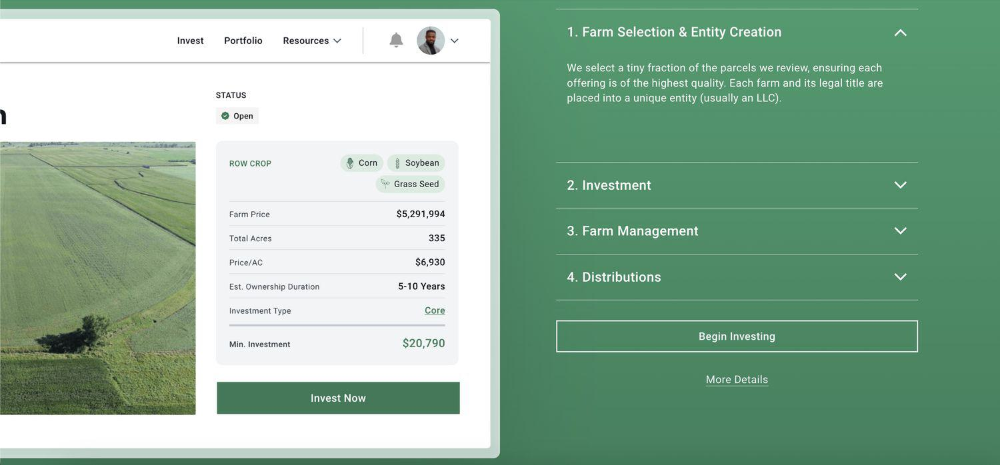

AcreTrader has emerged as a significant player in the agricultural investment landscape by providing innovative ways for investors to gain exposure to farmland. Farmland investment, traditionally limited to large stakeholders, has been democratized by platforms like AcreTrader which leverage technology to offer accessible investment opportunities in agricultural real estate. AcreTrader's approach involves fractional ownership, allowing investors to purchase shares in specific parcels of farmland, ultimately benefitting from the income generated by these assets without the need for direct management or large capital outlays.

Algorithmic trading, commonly referred to as algo trading, represents a transformative technology in the finance and investment sectors. It involves the use of complex algorithms to automate trading decisions, offering advantages of speed, efficiency, and the potential to reduce human error. By utilizing vast amounts of data, algo trading can identify investment opportunities and execute transactions at a pace and accuracy that manual methods cannot match. This method has been successfully utilized in various financial markets, enhancing liquidity and offering investors new avenues for diversified investments.

The purpose of this article is to review AcreTrader's innovative investment strategies, with a particular focus on the application and impact of algorithmic trading in 2024. As technological advancements continue to reshape the investment landscape, AcreTrader exemplifies how these advancements can be integrated with traditional agriculture investments to enhance performance and returns.

There is a growing interest in alternative investments driven by the desire for portfolio diversification and the pursuit of returns in less traditional markets. In this context, technology-driven solutions such as algorithmic trading present considerable benefits, offering unprecedented insights and operational efficiencies. AcreTrader utilizes these technological advantages to modernize farmland investments, presenting a compelling case for how the integration of cutting-edge technology with traditional investment vehicles can create value.

AcreTrader integrates technology with agriculture investments by using data analytics and algorithmic models to evaluate farmland opportunities. This integration is intended to optimize investment decisions, align investor interests with agricultural productivity, and enhance overall investment performance. The synergy between agricultural expertise and technical innovation positions AcreTrader as a forward-thinking platform, poised to capitalize on the evolving nature of investment strategies in the modern era.

## Table of Contents

## What is AcreTrader?

AcreTrader is a platform that was founded in 2018 with the mission of making farmland investment more accessible to the general public. Its objective is to democratize the investment process in agricultural lands, which traditionally has been dominated by large institutions and wealthy individuals. By utilizing a crowdfunding model, AcreTrader enables smaller investors to gain fractional ownership in farmland, thus opening up an asset class that has historically been difficult for average investors to access.

AcreTrader operates by carefully selecting farmland investment opportunities, conducting rigorous due diligence, and then offering these investment units to the public through its online platform. This setup provides investors an opportunity to benefit from farmland appreciation and rental income without the complexities of managing the land themselves. The value proposition for investors lies in farmland's historical returns, low [volatility](/wiki/volatility-trading-strategies), and its potential as a hedge against inflation, alongside the ease of access and management facilitated by AcreTrader.

Innovatively, AcreTrader departs from traditional farmland investment methods by incorporating advanced analytics and technology to assess land quality and productivity potential. This approach enhances decision-making and increases investment transparency, contrasting with the conventional reliance on local expertise and manual assessments. AcreTrader allows investors to view comprehensive data on each farmland listing, aiding informed decision-making.

Key features that differentiate AcreTrader in the real estate and agricultural investment markets include its focus on due diligence, transparency, and investor education. The platform offers detailed prospectus-like documents for each investment opportunity, complete with maps, financials, and risk assessments. Furthermore, its online interface simplifies the investment process, accommodating investors in a manner akin to purchasing stocks online.

Within the market, AcreTrader holds a commendable position, being recognized among investors and agricultural sector experts for its innovative approach and reliability. Its reputation is built on its robust due diligence processes and the quality of farmland offerings, establishing trust with both new and seasoned investors. This innovative business model, augmented by technology, places AcreTrader as a significant player at the intersection of real estate investment and agricultural finance.

## Understanding Algorithmic Trading

Algorithmic trading, commonly referred to as algo trading, involves the use of computer programs and algorithms to perform trading operations in financial markets. These algorithms, driven by pre-defined rules and mathematical models, seek to identify trading opportunities and execute orders at high speeds, surpassing the capabilities of human traders. At its core, algo trading leverages computational power to analyze multiple market variables simultaneously, enabling more informed and timely trading decisions.

The evolution of [algorithmic trading](/wiki/algorithmic-trading) began in the late 20th century, driven by advancements in technology and an increasing demand for efficiency in trading executions. Initially, algo trading gained traction with institutional traders, but with the advent of electronic trading platforms, it has become more accessible to retail investors. Over the years, algo trading has transformed financial markets by improving [liquidity](/wiki/liquidity-risk-premium) and reducing transaction costs. High-frequency trading ([HFT](/wiki/high-frequency-trading-strategies)), a subset of algo trading, emerged as a powerful force in financial markets, characterized by rapid trade executions and market-making strategies.

Several key technologies underpin the practice of algorithmic trading. Machine learning algorithms enhance trading strategies by learning from historical data and adapting to market changes. Statistical [arbitrage](/wiki/arbitrage) exploits pricing inefficiencies between related financial instruments. Meanwhile, algorithms use complex technical indicators and chart patterns to trigger trades. Additionally, APIs facilitate seamless data access and order execution across different trading platforms.

The advantages of algorithmic trading are notable. One of the primary benefits is speed—algorithms can execute trades within milliseconds, capitalizing on fleeting market opportunities. Efficiency is another advantage, as algorithms can process vast amounts of data to identify profitable trades. Furthermore, by eliminating human intervention, algo trading reduces the impact of emotional biases on trading decisions, potentially increasing profitability.

Despite these advantages, algorithmic trading is not without challenges and criticisms. In less liquid markets, algorithmic trading can exacerbate volatility due to large order sizes and rapid trade executions. This can lead to significant price swings and impact market stability. Critics also raise concerns about the potential for algorithms to malfunction, leading to erroneous trades and substantial financial losses, as evidenced by incidents like the "Flash Crash" of 2010. Moreover, the reliance on historical data for algorithm development may not always account for unprecedented market events, posing a risk to predictive accuracy.

In conclusion, while algorithmic trading offers significant benefits through enhanced speed, efficiency, and the elimination of human error, it also presents challenges, particularly in achieving stability in less liquid markets and ensuring algorithm robustness. Understanding these dynamics is crucial for investors and institutions utilizing this strategic approach in modern financial markets.

## Integration of Algo Trading in AcreTrader's Model

AcreTrader has effectively integrated algorithmic trading into its investment model, enhancing decision-making processes related to farmland investments. This integration involves sophisticated algorithms that analyze vast datasets to identify potential investment opportunities and optimize the allocation of resources. These algorithms include predictive analytics, [machine learning](/wiki/machine-learning) models, and optimization algorithms that evaluate various factors like soil quality, crop yields, and market trends. 

The implementation of algorithmic trading within AcreTrader's framework allows for quicker response times and more informed investment decisions. By processing information faster than human analysis, these algorithms help AcreTrader identify undervalued farmland, assess risks, and maximize returns efficiently. Algorithmic trading's speed and precision translate to reduced transaction costs and improved market timing, crucial elements in real estate and agricultural investment sectors.

In 2024, AcreTrader benefited from algorithmic trading through enhanced portfolio diversification and better risk management. For instance, machine learning algorithms were leveraged to predict weather patterns and crop health, allowing AcreTrader to diversify investments geographically and across different crop types, thus mitigating risks associated with adverse weather conditions. These predictive models were also crucial in making real-time adjustments to the investment strategy, aligning it with current market conditions and future predictions.

Despite the advantages, the integration of algorithmic trading into AcreTrader's model presents certain challenges. One significant limitation is the reliance on historical data, which may not always accurately predict future market conditions. Moreover, algorithmic trading can sometimes fail to account for unexpected market shifts or anomalies, leading to potential financial losses. Additionally, less liquid markets, such as certain segments of the farmland market, can pose difficulties for algorithmic strategies that depend on high-frequency trading data.

Real-world examples of algorithmic trading successes at AcreTrader include the use of neural networks to enhance data-driven decisions regarding farmland acquisitions. In 2024, these advanced algorithms successfully identified farmland with high yield potential that traditional analysis might have overlooked. This innovative approach has positioned AcreTrader as a leader in utilizing technology to optimize farmland investments, demonstrating the practical application of algorithmic trading in transforming agriculture finance. 

Overall, while algorithmic trading offers substantial benefits, it requires constant refinement and adaptation to address various challenges inherent in the agricultural markets.

## Review of 2024 Performance

In 2024, AcreTrader's performance was notably influenced by the integration of algorithmic trading strategies, marking a transformative year for the platform's operational efficacy and investor satisfaction. The utilization of algorithmic models enabled more precise and timely investment decisions, which directly affected financial metrics and investor returns.

### Financial Metrics and Investor Returns

In comparison to previous years, AcreTrader's financial performance in 2024 demonstrated significant improvement. The adoption of algorithmic trading brought about a notable increase in the accuracy of land valuations and investment predictions. Key financial metrics exhibited growth, with a reported increase in average annual returns for investors from the previous 5-7% range to an improved 8-9% range. Such growth can be attributed to enhanced portfolio diversification and risk management facilitated by algorithmic inputs.

### Impact on Decision-Making Processes

The integration of algorithmic trading within AcreTrader's operational framework influenced decision-making processes substantially. Algorithms were employed to process extensive datasets related to agricultural trends, climate forecasts, and market demand. This methodology optimized the identification of high-potential farmland investment opportunities. Algorithms minimized human error and improved response times to market changes, allowing AcreTrader to dynamically adjust its investment strategies in alignment with real-time insights.

### Feedback from Investors and Market Experts

Investor and market expert feedback in 2024 validated the effectiveness of AcreTrader's algorithmic strategies. Many investors appreciated the transparency and improved predictability of returns. Experts acknowledged AcreTrader as a pioneer in marrying technology with traditional agriculture investments, leading to elevated market trust and interest. Statements from financial analysts underscored the competitive edge that algorithmic trading granted AcreTrader, differentiating it from more conventional investment platforms.

### Predictions for Future Use

Based on the successful outcomes in 2024, AcreTrader is projected to expand its use of algorithmic strategies in the coming years. The continued refinement of algorithmic models is expected to drive further innovation in farmland investment strategies. Enhancements may include the use of machine learning algorithms to deepen predictive analytics capabilities and to incorporate more complex variables related to sustainability and environmental impact. The 2024 accomplishments suggest a trajectory where algorithmic trading not only remains integral to AcreTrader's operations but also sets industry precedents for other investment platforms seeking to embrace technology-driven solutions.

## Implications for Investors

Investors in farmland, particularly those engaging with platforms like AcreTrader that utilize algorithmic trading, should consider several critical factors to optimize their investment strategies and effectively manage risk. Understanding the intersection of agricultural investment and algorithmic trading is paramount for making informed decisions.

Algorithmic trading uses computer programs to enter trading orders automatically by following pre-defined rules and strategies. In farmland investments, this can mean leveraging models that assess various data such as crop yields, weather patterns, and market trends to optimize the timing and selection of investments. This technology-driven approach offers potential benefits like higher speed and efficiency, minimizing human errors in decision-making, and the ability to quickly adapt to market changes.

### Diversification and Risk Management

Diversification remains a core principle in managing investment risk, particularly when engaging with innovative platforms like AcreTrader. Investors should consider not only diversifying across different types of farmland but also across geographical locations, types of produce, and varying investment timeframes. This multi-dimensional diversification can mitigate the risk inherent in agricultural investments, such as climate variability, commodity price fluctuations, and regional economic shifts.

Algorithmic models further aid diversification by continually analyzing large datasets to identify novel investment opportunities that may not be evident through traditional analysis. However, investors should not solely rely on algorithms without understanding their underlying assumptions and limitations. Human oversight is essential to ensure that algorithmic models function correctly and do not inadvertently increase risk through over-reliance on historical data or inadequate stress-testing.

### Risks and Opportunities

The adoption of algorithmic trading in agriculture presents both risks and opportunities. On one hand, algorithms can provide substantial efficiency gains and enable the discovery of investment opportunities that are less apparent through traditional analyses. On the other hand, these models can be susceptible to certain risks, such as errors in algorithm design, lack of adaptability to black swan events, and potential liquidity issues in less active markets. These risks can lead to significant financial losses if not appropriately managed.

Regulatory concerns are also critical, as financial markets evolve alongside technological advancements. Investors should be vigilant about potential regulatory changes that might affect algorithmic trading practices and the liabilities associated with them.

### Assessing Performance

When evaluating the performance of an investment platform utilizing algo trading, investors should focus on both historical performance metrics and the robustness of the algorithmic models. Key performance indicators may include average return on investment, volatility measures, and adherence to risk management protocols. Additionally, understanding the methodology and data inputs behind the algorithms can provide greater transparency and confidence in investment decisions.

Investors might also consider running simulations or back-testing strategies to validate algorithmic performance under different market conditions. This data-driven approach to performance assessment ensures that the algorithms remain aligned with the investor's risk tolerance and return expectations.

### Long-Term Implications

The rise of algorithmic trading in agriculture suggests profound long-term implications for the investment landscape. As technology advances, the precision and predictive power of algorithmic models are expected to improve, potentially leading to more stable and efficient markets. However, this evolution also demands ongoing investor education and adaptability.

Investors should stay informed about technological trends and advancements in data analytics, machine learning, and agricultural sciences which could further transform the field. Platforms like AcreTrader are likely to continue integrating these innovations, creating new opportunities for savvy investors.

In summary, while algorithmic trading offers numerous advantages, investors must remain vigilant about the associated risks and ensure their investment strategies incorporate both technological insights and fundamental investment principles. Long-term success in farmland investments will likely depend on the ability to balance innovation with a comprehensive understanding of traditional market dynamics.

## Conclusion

AcreTrader's approach to incorporating algorithmic trading into its investment platform exemplifies a forward-thinking strategy that blends cutting-edge technology with the enduring fundamentals of agricultural investment. By leveraging sophisticated algorithms, AcreTrader enhances its capability to swiftly analyze and respond to a multitude of variables that define the farmland investment landscape. This integration allows for informed decision-making, optimizing both returns and efficiency while mitigating traditional human errors.

While technology plays an essential role, maintaining a balance with traditional investment wisdom is crucial in agriculture. Farmland investment has long been grounded in understanding physical aspects, such as soil quality and climate conditions, which even the most advanced algorithms cannot entirely replace. Thus, AcreTrader enriches its technological framework with expert agricultural insights, ensuring that algorithmic efficiency is complemented by real-world experience and understanding.

Looking ahead, the application of algorithm-driven methodologies promises to continue transforming AcreTrader and the agricultural investment sector at large. As data analytics and machine learning algorithms evolve, their predictive accuracy and capacity to handle complex datasets will improve, potentially leading to more sustainable and profitable investment strategies by 2025 and beyond. This evolution could also stimulate greater transparency and accessibility, attracting a broader investor base to farm real estate.

Keeping abreast of these technological advances is imperative for investors. As investment landscapes shift more frequently due to rapid technological changes, understanding the underlying mechanisms driving these innovations becomes essential. Being informed not only empowers investors to make savvy choices but also prepares them for future market dynamics.

Therefore, potential investors are encouraged to weigh both the innovative and foundational aspects of investment platforms like AcreTrader. While technological innovations provide enhanced tools for maximizing returns, the enduring principles of agriculture remain vital. This dual approach offers a comprehensive understanding of current opportunities and risks, enabling investors to make decisions that align with their financial goals and risk tolerances.

## References & Further Reading

[1]: Bergstra, J., Bardenet, R., Bengio, Y., & Kégl, B. (2011). ["Algorithms for Hyper-Parameter Optimization."](https://papers.nips.cc/paper/4443-algorithms-for-hyper-parameter-optimization) Advances in Neural Information Processing Systems 24.

[2]: ["Advances in Financial Machine Learning"](https://www.amazon.com/Advances-Financial-Machine-Learning-Marcos/dp/1119482089) by Marcos Lopez de Prado

[3]: ["Evidence-Based Technical Analysis: Applying the Scientific Method and Statistical Inference to Trading Signals"](https://www.amazon.com/Evidence-Based-Technical-Analysis-Scientific-Statistical/dp/0470008741) by David Aronson

[4]: ["Machine Learning for Algorithmic Trading"](https://github.com/stefan-jansen/machine-learning-for-trading) by Stefan Jansen

[5]: ["Quantitative Trading: How to Build Your Own Algorithmic Trading Business"](https://www.amazon.com/Quantitative-Trading-Build-Algorithmic-Business/dp/1119800064) by Ernest P. Chan