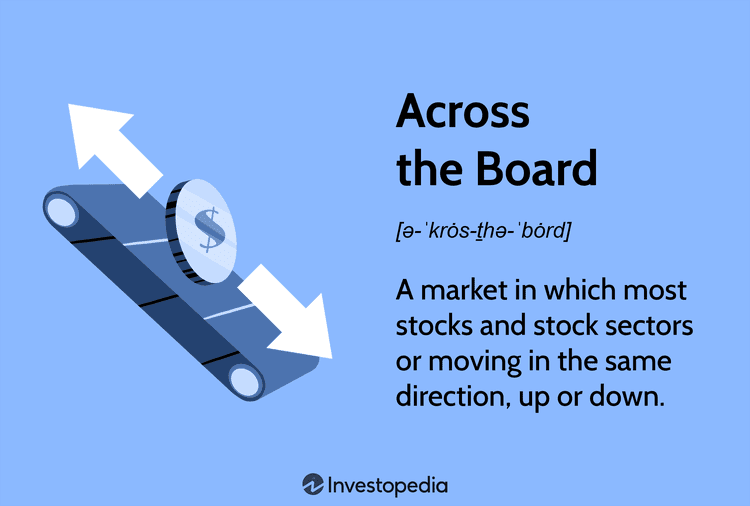

Algorithmic trading, often known as algo trading, has revolutionized the financial markets by allowing traders to perform transactions at unimaginable speeds and frequencies compared to conventional human capabilities. This type of trading entails utilizing sophisticated computer algorithms to automatically execute trades when particular criteria are met. These algorithms can assess multiple market variables simultaneously, thus enabling traders to make quick and informed decisions without human intervention. The shift to automated trading has increased market liquidity and is often credited with reducing trading costs significantly.

One aspect to comprehend when discussing financial trends and market activity is the term 'across the board'. In financial contexts, 'across the board' indicates a uniform movement of various securities or assets in the market, influenced collectively by macroeconomic or geopolitical factors. This term often appears in financial news to describe scenarios where market changes affect almost all sectors or types of assets uniformly. Understanding this term provides essential context about the market dynamics algo trading systems aim to capitalize on.



In exploring algorithmic trading, this article will address several key areas: the advantages it presents such as cost reduction and error minimization, potential drawbacks such as system failures, and the risk of market manipulation. Furthermore, different strategies employed in algorithmic trading will be highlighted, illustrating how these automated systems can exploit opportunities like arbitrage or follow emerging market trends. By examining these elements, readers can gain a detailed understanding of how algorithmic trading has reshaped the financial landscape and learn to identify and interpret market-wide movements that occur 'across the board'.

## Table of Contents

## What Does 'Across the Board' Mean?

'Across the board' is a financial term that denotes a sweeping or uniform movement in financial markets. It refers to situations where a majority, or all, securities in a particular market exhibit concurrent directional movements. This phenomenon is often triggered by overarching macroeconomic or geopolitical factors that influence investor behavior on a large scale, prompting widespread buying or selling.

The origin of the term 'across the board' can be traced back to horse racing, where it described a betting strategy that covered all possible outcomes—win, place, and show—for a particular horse. In financial contexts, the term has been adapted to describe market conditions where uniform trends are observed across various securities or assets.

In financial markets, the concept of 'across the board' movements implies that numerous securities or indices are affected similarly, potentially providing insights into the prevailing market sentiment. For instance, positive macroeconomic data such as strong GDP growth or favorable employment figures could lead to 'across the board' gains in the stock market, as confidence boosts investments. Conversely, geopolitical tensions or unfavorable economic indicators might cause a uniform decline in market indices.

Recent examples in financial news highlight the application of this term. For instance, widespread concerns over an economic recession or changes in monetary policy from central banks can lead to simultaneous declines in stock markets around the world. In September 2023, major indices like the S&P 500, Nasdaq, and Dow Jones all experienced collective downturns, reflecting 'across the board' bearish sentiment due to heightened inflation worries and potential [interest rate](/wiki/interest-rate-trading-strategies) hikes by the Federal Reserve.

This term is critical to understanding market dynamics because it encapsulates the collective reaction of market participants to larger economic narratives. Recognizing 'across the board' trends can be invaluable for traders and investors in gauging the overall market climate and making informed decisions about their portfolios.

## Understanding Algorithmic Trading

Algorithmic trading, commonly known as algo trading, involves the use of computer algorithms to automate trading decisions and executions in financial markets. These algorithms follow a set of predefined instructions, encompassing variables like timing, price, quantity, or any mathematical model. By utilizing [algorithmic trading](/wiki/algorithmic-trading), market participants can execute trades at speeds and volumes unavailable to human traders, ensuring precision and maximizing opportunities for profit.

### How Algorithmic Trading Works

At its core, algorithmic trading leverages technology to scan markets and execute orders far faster than manual trading. The process begins with the development of a trading strategy, which is essentially a set of rules guiding market entry and [exit](/wiki/exit-strategy) points. These can be based on various factors, including technical indicators, price levels, and statistical models. Once formulated, this strategy is transformed into a computer algorithm.

#### Key Elements Enabling Algorithmic Trading

1. **Speed**: Algorithmic trading systems execute orders within milliseconds. This speed is crucial for capitalizing on short-lived opportunities and reducing the impact of latency on trade execution.

2. **Efficiency**: Automating trading processes reduces the potential for manual errors and ensures consistent strategy application without fatigue impacting performance.

3. **Data Analysis**: Algorithms harness vast quantities of historical and real-time data, allowing for back-testing of strategies and quick response to market shifts. This ability to analyze data in real time provides a significant edge in identifying profitable trading opportunities.

4. **Decision-Making Free from Emotions**: Human traders often fall prey to emotions such as fear and greed, which can lead to irrational decisions. Algorithms, however, are devoid of feelings, executing trades based solely on data and predefined rules.

### Technological Infrastructure

Algorithmic trading requires a sophisticated technological infrastructure comprising:

- **Advanced Computing Systems**: High-performance computers to process large datasets and execute trades quickly.
- **Robust Trading Platforms**: Platforms that facilitate direct market access, ensuring rapid order execution.
- **Reliable Data Feeds**: Access to real-time market data and historical data is essential for strategy development and back-testing.

For instance, Python, a popular language among traders for its simplicity and rich library ecosystem, can be used to develop and deploy trading algorithms. A basic example is as follows:

```python
# A simple moving average crossover strategy
import pandas as pd

def moving_average_crossover(data, short_window, long_window):
    signals = pd.DataFrame(index=data.index)
    signals['price'] = data['price']
    signals['short_mavg'] = data['price'].rolling(window=short_window, min_periods=1).mean()
    signals['long_mavg'] = data['price'].rolling(window=long_window, min_periods=1).mean()
    signals['signal'] = 0.0  
    signals['signal'][short_window:] = np.where(signals['short_mavg'][short_window:] 
                                                 > signals['long_mavg'][short_window:], 1.0, 0.0)
    signals['positions'] = signals['signal'].diff()
    return signals
```

This code represents a simple strategy where buy/sell signals are generated based on short-term and long-term moving averages, indicative of potential market entry and exit points.

In conclusion, algorithmic trading harnesses advanced technology to refine trading execution, offering significant advantages over traditional methods. Its blend of speed, efficiency, data-centric analysis, and unemotional decision-making shapes the way modern financial markets operate, propelled by the robust infrastructure that supports these algorithms.

## Advantages and Disadvantages of Algorithmic Trading

Algorithmic trading, often lauded for its efficiency and precision, presents several advantages that have contributed to its widespread adoption in financial markets. One of the most significant benefits of algorithmic trading is the reduction in transaction costs. By automating the trading process, algorithms can execute trades at optimal prices with minimal delay, thus saving on costs that might otherwise accrue due to market inefficiencies. This cost efficiency is particularly advantageous for high-frequency trading ([HFT](/wiki/high-frequency-trading-strategies)), where even the smallest improvements in trade execution timing can have substantial financial impacts.

Another key advantage of algorithmic trading is the ability to back-test trading strategies against historical data. This capability enables traders to evaluate the viability and potential profitability of their strategies in a risk-free environment. By simulating how a strategy would have performed in the past, traders can refine their approaches and optimize them before deploying real capital. To perform back-testing, traders often employ statistical and mathematical tools to assess performance metrics such as Sharpe ratio, drawdown, and returns.

The use of algorithms also significantly reduces human errors and emotional biases. Trading decisions made by human traders are often influenced by emotions such as fear and greed, which can lead to inconsistent and suboptimal outcomes. Algorithms, on the other hand, adhere strictly to predefined rules and criteria, ensuring consistent execution of strategies without emotional interference.

Despite its advantages, algorithmic trading comes with inherent disadvantages that pose challenges to both individual traders and the broader financial system. System failures represent a notable risk, as technical glitches or software malfunctions can lead to unintended trades or significant financial losses. These failures can be due to coding errors, hardware breakdowns, or network issues. To mitigate this risk, traders need robust and well-tested systems, as well as contingency plans such as circuit breakers to halt excessive trading activity during anomalies.

The potential for market manipulation is another disadvantage associated with algorithmic trading. High-frequency traders can sometimes engage in practices such as spoofing and layering, where they place large orders with the intent to cancel them, thereby creating false impressions of supply and demand to manipulate market prices. Regulatory bodies continue to refine their frameworks to combat such manipulative practices and protect market integrity.

Over-reliance on technology is a further concern. As market participants increasingly depend on algorithms, there's a risk that these systems might lack the ability to adapt to unexpected market conditions or black swan events. A market crash could be exacerbated by a cascade of algorithmic trades, leading to significant [volatility](/wiki/volatility-trading-strategies) and instability.

In summary, while algorithmic trading offers undeniable advantages such as efficiency, cost reduction, and objective decision-making, it also introduces risks that necessitate vigilant management and regulatory oversight. Balancing these pros and cons is crucial for maintaining the stability and ethical functioning of financial markets.

## Examples of Algorithmic Trading Strategies

Algorithmic trading strategies have revolutionized the way market participants engage with financial assets, offering tools that increase speed and precision in trading. Below, we discuss common algorithmic trading strategies such as trend-following, [arbitrage](/wiki/arbitrage), and methods for minimizing market impact when executing large orders.

**Trend-Following Strategies**

Trend-following strategies capitalize on market [momentum](/wiki/momentum) by analyzing historical price data to identify patterns and predict future movements. These strategies rely on technical indicators, such as moving averages or the Relative Strength Index (RSI). For example, a simple trend-following algorithm might use a moving average crossover to signal entry and exit points. 

Consider a basic Python example using moving averages to define a trend:

```python
import pandas as pd

def moving_average_trading_strategy(prices, short_window=40, long_window=100):
    signals = pd.DataFrame(index=prices.index)
    signals['price'] = prices['close']
    signals['short_mavg'] = prices['close'].rolling(window=short_window, min_periods=1).mean()
    signals['long_mavg'] = prices['close'].rolling(window=long_window, min_periods=1).mean()

    signals['signal'] = 0.0
    signals['signal'][short_window:] = np.where(signals['short_mavg'][short_window:] > signals['long_mavg'][short_window:], 1.0, 0.0)    
    signals['positions'] = signals['signal'].diff()

    return signals
```

This script compares short and long moving averages to generate buy (1) or sell (0) signals, capitalizing on detected trends.

**Arbitrage Strategies**

Arbitrage strategies exploit price discrepancies of identical or related assets across different markets. This type of strategy is market-neutral, aiming to earn profits with limited risk. A common form is [statistical arbitrage](/wiki/statistical-arbitrage), which involves using pairs trading—buying undervalued and selling overvalued securities. 

An example of this strategy is pairs trading, where a trader identifies two historically correlated stocks, monitors their price spread, and trades to exploit divergence.

In mathematical terms, the profit from an arbitrage opportunity can be denoted as:
$$
\text{Profit} = (P_1 - P_2) - (C_1 + C_2)
$$
where $P_1$ and $P_2$ are the buy and sell prices, and $C_1$ and $C_2$ are associated costs.

**Execution Algorithms for Large Orders**

Large order execution often requires algorithms specifically designed to minimize market impact and reduce costs. Two popular execution strategies are the Volume-Weighted Average Price (VWAP) and Time-Weighted Average Price (TWAP) algorithms.

- **VWAP**: This strategy spreads out order execution over a specified period, targeting a trading price close to the security's VWAP, thus mitigating market impact.
- **TWAP**: Designed to execute orders evenly over time, TWAP minimizes the impact of time-specific market movements.

Both strategies use statistical methods to break large orders into smaller chunks, executed incrementally based on [volume](/wiki/volume-trading-strategy) forecasts and price trends, reducing the impact on the asset's price.

In conclusion, algorithmic trading strategies utilize quantitative models and technological infrastructure to optimize trade execution and capitalize on market inefficiencies. By understanding and employing these strategies, traders can enhance their competitive advantage while managing risks inherent in financial markets.

## Technical Requirements for Algorithmic Trading

Algorithmic trading requires a robust technical foundation that combines several key components, each of which plays a crucial role in successfully implementing trading strategies. These components include proficiency in programming, access to reliable trading platforms, robust data feeds, and the ability to design and test algorithms. Each of these elements presents both challenges and opportunities for market participants, from individuals to large financial institutions.

### Coding Skills

Programming skills are essential for developing the algorithms that drive automated trading strategies. Python is increasingly favored due to its readability and extensive libraries for financial data analysis and [machine learning](/wiki/machine-learning), such as NumPy, pandas, and scikit-learn. A basic understanding of Python might look like this:

```python
import pandas as pd

def simple_moving_average(data, period):
    return data.rolling(window=period).mean()

# Example of usage
data = pd.Series([20, 21, 22, 23, 24, 25])
print(simple_moving_average(data, period=3))
```

This code snippet demonstrates how to calculate a simple moving average, a common component of many trading strategies. Mastery of these skills enables traders to automate decision-making processes and execute trades based on complex strategies without human intervention.

### Trading Platforms

Access to a suitable algorithmic trading platform is indispensable. These platforms provide the infrastructure necessary for executing trades, [backtesting](/wiki/backtesting) algorithms, and managing risk. Popular trading platforms like MetaTrader 4/5, NinjaTrader, and [Interactive Brokers](/wiki/interactive-brokers-api)' Trader Workstation have dedicated APIs that support algorithm development and offer features like paper trading environments for testing strategies without financial risk.

### Robust Data Feeds

The success of algorithmic trading heavily relies on high-quality, real-time market data. Robust data feeds are necessary for accurate strategy execution and risk management. Providers such as Bloomberg, Reuters, and TradingView offer comprehensive datasets, including historical data for backtesting and real-time feeds for live trading. Quality data allows for precise modeling of financial markets and helps in identifying profitable trading opportunities.

### Designing and Testing Algorithms

Once developed, trading algorithms need extensive testing to ensure they perform as intended. This involves backtesting on historical data to verify the algorithm's strategy would have been profitable in past market conditions, and stress testing to evaluate performance under various market scenarios. Backtesting often involves the use of specific metrics such as the Sharpe ratio or maximum drawdown to assess risk and return.

Here's a basic example of backtesting a strategy in Python:

```python
def backtest_strategy(data, strategy):
    data['signal'] = strategy(data)
    returns = data['price'].pct_change()
    strategy_returns = data['signal'].shift(1) * returns
    cumulative_return = (1 + strategy_returns).prod() - 1
    return cumulative_return

# Applying backtest with a simple moving average crossover on sample data
result = backtest_strategy(data, simple_moving_average)
print("Cumulative Return:", result)
```

### Barriers and Opportunities

While these technical requirements present challenges, they also offer new opportunities. Market participants with strong technical skills can potentially gain a competitive edge by creating innovative strategies beyond the reach of traditional trades. However, barriers such as the need for advanced coding proficiency and access to expensive data feeds and platforms can exclude small investors or less technologically savvy traders.

As algorithmic trading continues to grow, it is crucial to navigate these technical requirements effectively to capitalize on the advantages offered by automated and high-frequency trading systems.

## Conclusion

Algorithmic trading has fundamentally reshaped the financial markets by automating and accelerating trading operations. It has enabled traders and institutions to perform high-frequency transactions and conduct complex analyses, significantly impacting trading decisions and market dynamics. The ability to process vast amounts of data rapidly allows for more informed decision-making, which can improve market efficiency and [liquidity](/wiki/liquidity-risk-premium). However, the growing prevalence of computational trading strategies also necessitates a balanced approach that integrates automation with rigorous oversight. This ensures that the potential risks, such as market volatility and ethical concerns related to algorithmic manipulation, are carefully managed.

As algorithmic trading technologies continue to advance, the importance of regulatory frameworks and compliance mechanisms becomes increasingly apparent. These systems must evolve alongside technological innovations to safeguard the integrity and stability of financial markets. Moreover, a comprehensive understanding of terms like 'across the board' is crucial. It allows traders and analysts to contextualize algorithmic developments within the broader economic and market trends, thereby fostering more nuanced and strategic decision-making.

In sum, while algorithmic trading offers substantial benefits through enhanced speed and precision, it is crucial to maintain a vigilant approach to oversee its implementation. Ensuring ethical standards and stable market operations is essential for leveraging the advantages of algorithmic trading while mitigating potential risks.

## FAQs

**Is algorithmic trading legal?**  
Yes, algorithmic trading is legal in most countries that have established financial markets. However, trading activities, including those conducted algorithmically, are subject to regulations to ensure market integrity and prevent unfair practices. Regulatory bodies such as the U.S. Securities and Exchange Commission (SEC) and the Commodity Futures Trading Commission (CFTC) have established guidelines and requirements for algorithmic trading. These regulations often focus on issues like market manipulation, insider trading, and the accuracy of trade reporting. Compliance with these regulations is crucial for traders using algorithmic systems.

**How do I get started with algorithmic trading?**  
Starting with algorithmic trading involves several steps:

1. **Education**: Gain a thorough understanding of financial markets, trading principles, and financial instruments. 
2. **Programming Skills**: Learning programming languages such as Python, R, or C++ is essential. Python is widely popular due to its simplicity and a large number of trading libraries like NumPy, pandas, and TA-Lib.
3. **Developing Strategies**: Formulate and back-test trading strategies using historical market data to ensure their robustness.
4. **Infrastructure Setup**: Select a reliable trading platform that supports algorithmic trading. Platforms like MetaTrader, Interactive Brokers, or custom-built solutions are common choices.
5. **Data Services**: Secure access to real-time and historical market data through services like Bloomberg or QuantConnect.
6. **Risk Management**: Establish risk management protocols to mitigate potential losses.

For beginners, tutorials and online courses can provide foundational knowledge. Collaborating with experienced traders or joining trading forums can offer additional practical insights.

**What are the risks associated with algorithmic trading?**  
Several risks are inherent to algorithmic trading:

- **Technology Risk**: System failures, software bugs, or connectivity issues can lead to incorrect trade executions or missed opportunities.
- **Market Risk**: Algorithms can be exposed to volatile market conditions that surpass their programmed strategies, resulting in significant losses.
- **Operational Risk**: Errors in data input or algorithm coding can occur, leading to unintended trading actions.
- **Regulatory Risk**: Non-compliance with trading regulations can result in penalties or sanctions.

Traders can mitigate these risks by conducting thorough testing, implementing strong risk management protocols, and ensuring constant system monitoring.

**Can individual traders use algorithmic trading systems?**  
Yes, individual traders can utilize algorithmic trading systems. Advances in technology and the availability of affordable computing power and trading platforms have made algorithmic trading accessible to retail traders. Individual traders can develop their own algorithms or use pre-existing platforms that offer algorithmic trading functionalities. They need to consider their capital, the complexity of their trading strategies, and their ability to maintain and update their systems. Adequate knowledge of programming and data analysis is beneficial, enabling traders to develop personalized algorithms and adapt to changing market conditions.

## References & Further Reading

[1]: Bergstra, J., Bardenet, R., Bengio, Y., & Kégl, B. (2011). ["Algorithms for Hyper-Parameter Optimization."](https://dl.acm.org/doi/10.5555/2986459.2986743) Advances in Neural Information Processing Systems 24.

[2]: ["Advances in Financial Machine Learning"](https://www.amazon.com/Advances-Financial-Machine-Learning-Marcos/dp/1119482089) by Marcos Lopez de Prado

[3]: ["Evidence-Based Technical Analysis: Applying the Scientific Method and Statistical Inference to Trading Signals"](https://www.amazon.com/Evidence-Based-Technical-Analysis-Scientific-Statistical/dp/0470008741) by David Aronson

[4]: ["Machine Learning for Algorithmic Trading"](https://github.com/stefan-jansen/machine-learning-for-trading) by Stefan Jansen

[5]: ["Quantitative Trading: How to Build Your Own Algorithmic Trading Business"](https://www.amazon.com/Quantitative-Trading-Build-Algorithmic-Business/dp/1119800064) by Ernest P. Chan