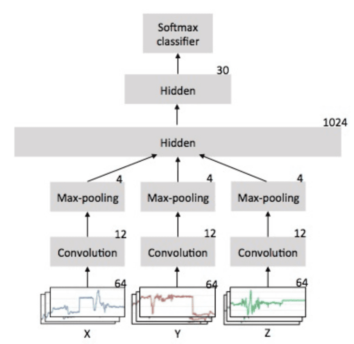

## Table of Contents

## What is action recognition in machine learning?

Action recognition in machine learning is a technology that helps computers understand and identify what actions people are doing in videos or images. It's like teaching a computer to watch a video and then tell you if someone is walking, running, or waving. This is useful in many areas, like making security cameras smarter or helping robots understand human behavior better.

To do action recognition, computers use special math and algorithms to look at the movements and shapes in videos. They break down the video into many small parts and analyze each part to see what's happening. This can be tricky because people move in different ways, and the same action can look different from different angles or in different lighting. But with a lot of practice and data, computers can get pretty good at figuring out what actions they're seeing.

## How do Action Recognition Blocks like TPN and G3D function?

TPN, which stands for Temporal Pyramid Network, is a way to understand actions in videos by looking at different time scales. Imagine watching a video and breaking it down into short, medium, and long clips. TPN does something similar by creating a "pyramid" of time scales. It looks at the video from very short moments to longer sequences, helping it understand both quick actions and those that take more time. By doing this, TPN can better recognize what's happening in the video, even if the action spans across different lengths of time.

G3D, or Graph-based 3D Convolutional Network, takes a different approach by focusing on the relationships between different parts of the body. Think of it like connecting dots on a person's body with lines, creating a "graph" that shows how the body parts move together. G3D uses this graph to analyze the movements in 3D space. It looks at how the joints and limbs interact over time, which helps it recognize complex actions that involve the whole body. By understanding these relationships, G3D can better identify what action is being performed, even if it's a bit unusual or from an odd angle.

## What are the basic components of an Action Recognition Block?

An Action Recognition Block usually has three main parts: the input, the processing part, and the output. The input is the video or images that show the actions. These can be raw video frames or pre-processed data like optical flow, which tracks movement. The processing part is where the magic happens. It uses special math and algorithms to understand what's happening in the video. This part might include things like convolutional neural networks (CNNs) to look at the images, recurrent neural networks (RNNs) to understand sequences, or other fancy methods like TPN or G3D.

The output of an Action Recognition Block is a guess about what action is happening. It could be a label like "walking" or "waving," or it might be a score that shows how sure the computer is about its guess. To make this guess, the block looks at the patterns it found during processing and compares them to what it has learned before. If it sees movements that look like walking, it will say "walking." The whole process is about turning the raw video into a simple answer about what action was seen.

## How does Temporal Pyramid Network (TPN) improve action recognition?

Temporal Pyramid Network (TPN) improves action recognition by looking at videos in different time scales. Imagine watching a video and breaking it down into short, medium, and long clips. TPN does this by creating a "pyramid" of time scales. It looks at the video from very short moments to longer sequences. This helps TPN understand both quick actions, like a person waving, and actions that take more time, like someone walking across a room. By doing this, TPN can better recognize what's happening in the video, even if the action spans across different lengths of time.

The way TPN works is by using special math to break down the video into these different time scales. It then combines the information from all these scales to make a better guess about what action is happening. This approach helps TPN handle variations in how actions are performed or viewed. For example, if someone is walking slowly in one part of the video and quickly in another, TPN can still recognize it as walking because it looks at the action from different time perspectives. This makes TPN more accurate and useful in real-world situations where actions can vary a lot.

## What role does G3D play in enhancing action recognition models?

G3D, which stands for Graph-based 3D Convolutional Network, helps make action recognition better by focusing on how different parts of the body move together. Think of it like connecting dots on a person's body with lines. These lines show how the joints and limbs work together when someone moves. G3D uses this "graph" to look at movements in 3D space. By understanding these relationships, G3D can recognize complex actions that involve the whole body, even if they are a bit unusual or seen from a strange angle.

This approach makes G3D really good at figuring out what action is happening, even in tricky situations. For example, if someone is doing a dance move that involves a lot of twists and turns, G3D can still tell what's going on by looking at how all the body parts are moving together. This makes action recognition models more accurate and useful in real life, where people don't always move in simple, predictable ways.

## Can you explain the architecture of TPN?

The architecture of Temporal Pyramid Network (TPN) is designed to understand actions in videos by looking at them in different time scales. Imagine you're watching a video and you break it down into short, medium, and long clips. TPN does something similar by creating a "pyramid" of time scales. It starts by looking at very short moments in the video, then at slightly longer sequences, and finally at even longer parts. This helps TPN understand both quick actions, like someone waving, and actions that take more time, like someone walking across a room.

To make this happen, TPN uses special math to break down the video into these different time scales. It uses something called a [convolutional [neural network](/wiki/neural-network)](/wiki/convolutional-neural-network) (CNN) to look at the images and a recurrent neural network (RNN) to understand the sequences over time. By combining the information from all these different scales, TPN can make a better guess about what action is happening in the video. This approach helps TPN handle variations in how actions are performed or viewed, making it more accurate and useful in real-world situations.

## How does G3D differ from traditional 3D convolutional networks?

G3D, or Graph-based 3D Convolutional Network, differs from traditional 3D convolutional networks by focusing on the relationships between different parts of the body. Traditional 3D convolutional networks look at videos as a series of 3D cubes, where each cube represents a small part of the video in space and time. They apply the same set of filters across the entire video, trying to capture patterns and movements. In contrast, G3D uses a graph to connect the body's joints and limbs, making it easier to understand how they move together. This graph-based approach allows G3D to focus on the important parts of the body and how they interact, which is especially helpful for recognizing complex actions.

This difference makes G3D better at handling actions that involve the whole body or unusual movements. Traditional 3D convolutional networks might struggle with these because they treat every part of the video the same, without considering the special relationships between body parts. By using a graph, G3D can pay more attention to how the joints and limbs move together, making it more accurate at recognizing actions even when they're seen from different angles or performed in different ways. This makes G3D a powerful tool for action recognition in real-world situations where people don't always move in simple, predictable ways.

## What are the key challenges in implementing Action Recognition Blocks?

Implementing Action Recognition Blocks can be tricky because videos and actions can be very different. One big challenge is that the same action can look different from different angles or in different lighting. For example, waving might look different if the camera is far away or if it's dark. This makes it hard for the computer to always recognize the action correctly. Another challenge is that actions can happen at different speeds. Someone might walk slowly or run quickly, and the computer needs to understand that both are still walking or running. This means the Action Recognition Block needs to be smart enough to handle all these differences.

Another difficulty is that videos can be long and have a lot of information. The computer has to look at all this data and figure out what's important. This can take a lot of time and computer power. Also, sometimes the video might be blurry or have other things moving in the background, which can confuse the computer. To make Action Recognition Blocks work well, they need to be trained on a lot of different videos so they can learn to recognize actions in all sorts of situations. This training can be hard to do because it needs a lot of videos and a lot of time.

## How can TPN and G3D be integrated into existing machine learning frameworks?

Integrating Temporal Pyramid Network (TPN) into existing [machine learning](/wiki/machine-learning) frameworks involves adding its special way of looking at videos in different time scales. TPN uses a pyramid structure to break down videos into short, medium, and long clips. To add TPN to a framework, you would need to include its convolutional neural network (CNN) and recurrent neural network (RNN) parts. These parts help TPN understand the video at different time scales. Once you've added these parts, you can train the whole system with videos that have action labels. This helps the system learn to recognize actions at different speeds and from different angles. You might need to adjust the existing framework to work well with TPN's time pyramid approach, but once it's in, it can make action recognition more accurate.

Adding Graph-based 3D Convolutional Network (G3D) to existing frameworks involves focusing on how different body parts move together. G3D uses a graph to connect the joints and limbs, which helps it understand complex actions. To integrate G3D, you need to include its graph-based approach in the framework. This means adding code that can create and analyze these graphs from video data. Once G3D is part of the framework, you can train it with videos that show different actions. This training helps G3D learn the relationships between body parts and recognize actions even if they're unusual or seen from different angles. Like with TPN, you might need to tweak the existing framework to work smoothly with G3D, but it can make the system better at recognizing complex actions.

## What are the performance metrics used to evaluate Action Recognition Blocks?

To see how well Action Recognition Blocks like TPN and G3D are doing, people use different performance metrics. One common metric is accuracy, which tells you how often the computer guesses the right action. For example, if the computer says "walking" when someone is really walking, that's a correct guess. Another important metric is the confusion matrix, which shows how the computer's guesses match up with what's really happening. It helps you see if the computer often mixes up certain actions, like thinking "running" is "walking."

There are also other metrics like precision and recall. Precision tells you how many of the computer's guesses for a certain action are correct. For example, if the computer says "waving" 100 times and 90 of those times it's right, the precision for "waving" is 90%. Recall, on the other hand, tells you how many times the computer correctly identifies an action out of all the times that action happens. If someone waves 100 times and the computer catches it 90 times, the recall for "waving" is 90%. These metrics help make sure the Action Recognition Blocks are working well and can be improved if needed.

## How do Action Recognition Blocks handle variations in video quality and length?

Action Recognition Blocks like TPN and G3D have to deal with videos that can be different in quality and length. For video quality, these blocks use special math and algorithms to understand the actions even if the video is blurry or dark. They look at the movements and shapes in the video, trying to focus on what's important. For example, TPN breaks down the video into different time scales, so it can still recognize actions even if the video quality changes. G3D uses a graph to connect body parts, which helps it understand actions even if the video is not perfect.

When it comes to video length, Action Recognition Blocks have to handle videos that can be short or long. TPN helps with this by looking at the video in short, medium, and long clips. This way, it can understand actions that happen quickly or take more time. G3D focuses on how body parts move together over time, so it can recognize actions even if the video is longer than usual. Both methods help the computer figure out what's happening in the video, no matter how long it is.

## What advanced techniques can be used to optimize TPN and G3D for specific applications?

To optimize TPN for specific applications, you can use transfer learning. This means you start with a TPN that's already been trained on a lot of videos and then fine-tune it for your specific task. For example, if you want to recognize dance moves, you can take a TPN that knows about general human actions and train it more with videos of dancing. This helps TPN learn the special moves and rhythms of dancing better. Another way to optimize TPN is by adjusting its time scales. If your application needs to recognize very quick actions, you can make the short time scales even shorter. This way, TPN can focus more on fast movements and be better at recognizing them.

For G3D, one advanced technique is to use graph attention mechanisms. This means G3D can pay more attention to the most important body parts for the action you're trying to recognize. For example, if you're trying to recognize hand gestures, G3D can focus more on the hands and less on other parts of the body. Another way to optimize G3D is by using multi-modal data. This means you can combine video data with other types of data, like audio or text, to help G3D understand the action better. For instance, if you're recognizing actions in a sports game, you can use the video along with the sounds of the game to make G3D's guesses more accurate.