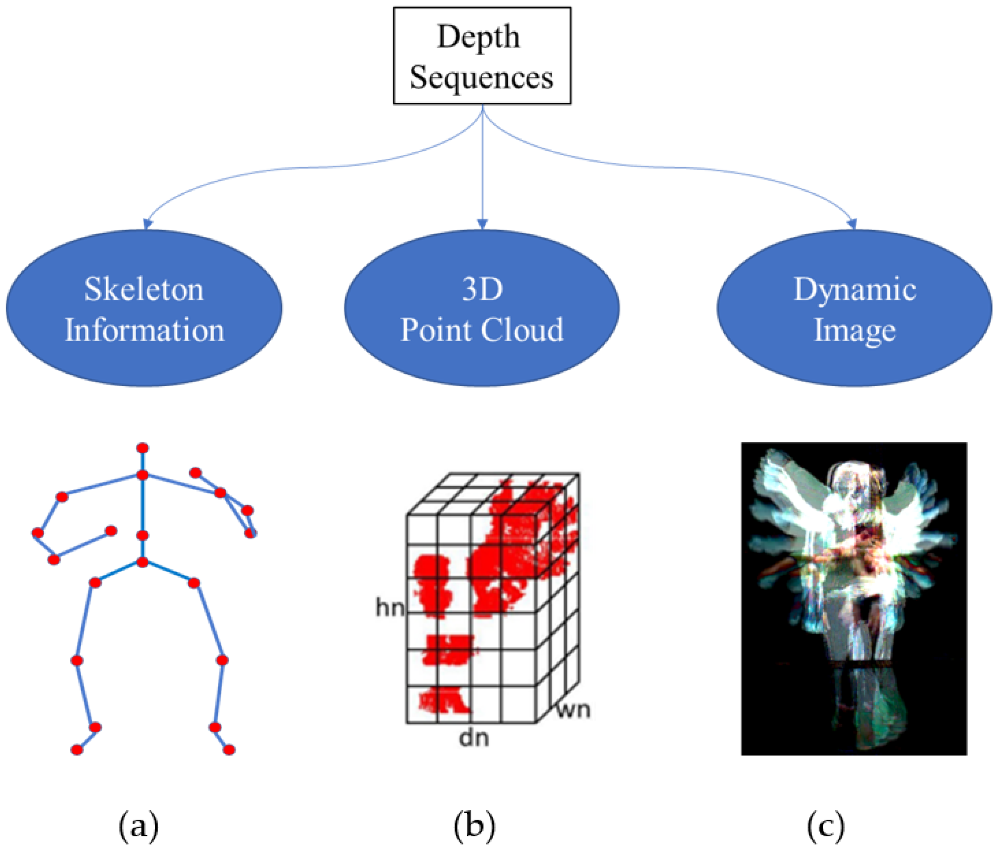

## Table of Contents

## What is action recognition in machine learning?

Action recognition in machine learning is a technology that helps computers understand and identify what actions people are doing in videos or images. It's like teaching a computer to watch a video and say, "Oh, that person is running," or "That person is waving." This is done by training the computer with many examples of different actions, so it can learn to recognize them when it sees new videos or images.

To make action recognition work well, machine learning models use special algorithms that can pick out important details from videos, like how fast someone is moving or the position of their body. These algorithms are trained on large datasets, which means they see a lot of videos showing different actions. Once trained, the model can then look at new videos and guess what action is happening. This technology is used in many places, like in security systems to detect unusual behavior, or in sports to analyze athletes' movements.

## How do action recognition models work?

Action recognition models work by first breaking down videos into individual frames, which are like still pictures. These frames are then fed into a machine learning model, usually a type of neural network called a Convolutional Neural Network (CNN). The CNN looks at each frame and tries to find important features, like the shape of a person or how they are moving. It does this by using layers of calculations to detect edges, shapes, and movements in the images. Once the model finds these features, it combines them to understand the whole action happening in the video.

After the CNN processes the frames, another part of the model, often a Recurrent Neural Network (RNN) or a Long Short-Term Memory (LSTM) network, comes into play. This part looks at the sequence of frames over time to understand how the action develops. For example, it can tell the difference between someone starting to run and someone who has been running for a while. By looking at the sequence, the model can make a final guess about what action is happening. The whole process is like the model watching a video and piecing together clues to figure out the action, getting better at it as it sees more examples.

## What are some common applications of action recognition models?

Action recognition models are used in many places to make life easier and safer. One common use is in security systems. These systems can watch video feeds and spot if someone is doing something unusual, like breaking into a building or fighting. This helps security guards know where to look and respond quickly. Another use is in sports, where action recognition can help coaches and athletes. By analyzing videos of games or practices, the model can see how players move and suggest ways to improve their performance or strategy.

Another important application is in healthcare. Action recognition can help doctors and therapists by watching patients do exercises or physical therapy. The model can check if the patient is doing the movements correctly and give feedback or alerts if something is wrong. This can make therapy more effective and help patients recover faster. Also, in smart homes, action recognition can make life more convenient. For example, the system can see when someone is cooking and turn on the kitchen lights or start the oven, making daily tasks easier and more automatic.

## What is motion disentanglement in action recognition?

Motion disentanglement in action recognition is a way to break down complex movements into simpler parts. Imagine watching someone dance. They might be moving their arms, legs, and body all at the same time. Motion disentanglement helps the computer see these different parts separately, like focusing on just the arm movements or just the leg movements. By doing this, the computer can better understand what is happening in the video and recognize the action more accurately.

This technique is important because it helps the action recognition model deal with variations in how people move. For example, two people might run differently, but if the model can see the basic running motion clearly, it can still recognize that they are running. Motion disentanglement makes the model smarter by teaching it to look past small differences and focus on what really matters in the action. This way, the model becomes better at recognizing actions in all sorts of situations.

## How does the Temporal Difference Network (TDN) approach action recognition?

The Temporal Difference Network (TDN) is a special way to help computers understand what people are doing in videos. It works by looking at how things change from one moment to the next. Imagine watching a video of someone walking. The TDN would look at how the person's position changes between frames to figure out they are walking. This is different from other methods that might just look at each frame by itself. By focusing on these changes, or "temporal differences," the TDN can better tell what action is happening, even if the video is a bit blurry or the lighting is bad.

To make this work, the TDN uses something called a [neural network](/wiki/neural-network). This is like a computer brain that learns from examples. The TDN is trained to look at the differences between frames and use that information to guess the action. It does this by comparing the current frame with the next one and figuring out how things have moved. This helps the TDN understand the flow of the action over time, making it good at recognizing what people are doing in videos, even if they move quickly or in different ways.

## What is the concept of Asynchronous Interaction Aggregation in action recognition models?

Asynchronous Interaction Aggregation is a way to help action recognition models understand videos better by looking at different parts of the video at different times. Imagine watching a video of someone playing soccer. They might kick the ball, then run after it. The model needs to see both actions, but they happen at different times. Asynchronous Interaction Aggregation helps the model look at the kicking and running separately and then put them together to understand the whole action.

This method makes the model smarter because it can focus on important moments in the video, even if they don't happen at the same time. By doing this, the model can better recognize what is happening, even if the video is long or if the action changes quickly. It's like watching a movie and remembering key scenes to understand the story better.

## Can you explain the architecture and functioning of HalluciNet for action recognition?

HalluciNet is a special kind of model used for action recognition that tries to understand what's happening in videos even if some parts of the video are missing or not clear. Imagine you're watching a video of someone dancing, but some frames are blurry or missing. HalluciNet can still figure out the dance moves by guessing what might be happening in those unclear parts. It does this by using something called a "hallucination" process, which means it fills in the gaps with its best guess based on what it has seen before. This makes HalluciNet really good at recognizing actions in videos that might be hard to watch because of bad quality or missing information.

The way HalluciNet works is by breaking down the video into smaller parts and looking at each part carefully. It uses a neural network to analyze each frame and then combines the information from all the frames to understand the whole action. If some frames are missing or unclear, HalluciNet uses its hallucination process to make up for it. It looks at the frames before and after the missing part and guesses what might be happening in between. This helps HalluciNet recognize actions more accurately, even when the video isn't perfect.

## How do action recognition models handle variations in video quality and different viewpoints?

Action recognition models are smart at figuring out what people are doing in videos, even if the videos aren't perfect. Sometimes, videos can be blurry, dark, or shot from weird angles. To deal with this, these models use special tricks. They look at the important parts of the video, like how a person is moving, and ignore things like bad lighting or shaky camera work. By focusing on the key movements, the model can still guess what action is happening, even if the video quality isn't great.

Another way these models handle different viewpoints is by learning from lots of examples. They see videos taken from many different angles, so they get good at recognizing actions no matter how the camera is positioned. This helps the model understand that a person running looks the same from the front, side, or back. By training on a wide variety of videos, the model becomes better at recognizing actions in all sorts of situations, making it very useful for real-world applications.

## What are the challenges faced in training action recognition models, and how can they be addressed?

Training action recognition models can be tough because of a few reasons. One big challenge is having enough good data. These models need to see lots of different videos to learn well, but getting all those videos can be hard. Also, videos can be tricky because they might be blurry, dark, or shot from weird angles. This makes it harder for the model to understand what's happening. Another problem is that people move in all sorts of ways, so the model needs to be smart enough to recognize the same action even if it looks a bit different each time.

To solve these challenges, people use different tricks. For the data problem, they can use something called [data augmentation](/wiki/data-augmentation). This means they take the videos they have and make new ones by changing them a bit, like flipping them or adding noise. This helps the model see more examples without needing tons of new videos. To deal with bad video quality or different viewpoints, models can be trained to focus on the important parts, like how a person is moving, and ignore the rest. They can also use special techniques, like transfer learning, where they start with a model that's already good at recognizing things and then teach it more about actions. By doing these things, the models can get better at understanding what people are doing in videos, even when it's hard.

## How do advanced action recognition models like HalluciNet improve upon traditional methods?

Advanced action recognition models like HalluciNet are better than traditional methods because they can handle videos that are not perfect. Traditional models might get confused if parts of the video are missing or blurry. But HalluciNet uses a special trick called "hallucination" to guess what might be happening in those unclear parts. It looks at the frames before and after the missing part and fills in the gaps with its best guess. This makes HalluciNet really good at understanding actions even when the video quality is bad.

Another way HalluciNet improves on traditional methods is by being smarter about how it looks at videos. Traditional models might just see each frame by itself, but HalluciNet understands how actions change over time. It breaks down the video into smaller parts and combines the information to get a full picture of what's happening. This helps HalluciNet recognize actions more accurately, even if the video is shot from different angles or if people move in different ways. By using these advanced techniques, HalluciNet can do a better job at action recognition than older methods.

## What metrics are used to evaluate the performance of action recognition models?

To check how well action recognition models are doing, people use different ways to measure their performance. One common way is accuracy, which means how often the model guesses the right action. If the model says "running" and the person in the video is really running, that's a correct guess. Another way is called precision and recall. Precision looks at how many of the model's guesses for a certain action are correct. Recall checks how many times the model finds the action when it's actually happening. A good model should have high numbers for both.

Another important measure is the F1 score, which combines precision and recall into one number. The F1 score helps to see how well the model balances guessing right and finding all the actions. It's useful because sometimes a model might guess right a lot but miss some actions, or it might find most actions but guess wrong often. The F1 score gives a single number to show how well the model is doing overall. There are also other measures like the confusion matrix, which shows all the model's guesses and mistakes in a table, helping to see where the model is doing well and where it needs to improve.

## What are the future directions and potential advancements in action recognition technology?

In the future, action recognition technology is expected to get even better at understanding what people are doing in videos. One big area of improvement will be making the models smarter at dealing with different situations. They might learn to recognize actions even if the video is really blurry, dark, or if people are moving in unusual ways. Another exciting direction is using action recognition in more places, like in cars to help with self-driving or in virtual reality to make games more realistic. By seeing what people are doing, these technologies can react better and make life easier and more fun.

Another potential advancement is in making action recognition models smaller and faster. Right now, these models can be big and need a lot of power to work. In the future, they might be able to run on smaller devices, like phones or smart glasses, without slowing down. This would mean that action recognition could be used in more everyday situations, helping people with things like fitness tracking or home security. By getting smaller and faster, these models can be more helpful to more people.

## References & Further Reading

[1]: Zhang, Y., Wang, C., Bao, L., Zhu, X., & Wu, W. (2020). ["Exploring Temporal Preservation Networks for Action Recognition."](https://link.springer.com/article/10.1007/s12274-020-2755-3) Proceedings of the IEEE/CVF Conference on Computer Vision and Pattern Recognition (CVPR).

[2]: Simonyan, K., & Zisserman, A. (2014). ["Two-Stream Convolutional Networks for Action Recognition in Videos."](https://arxiv.org/abs/1406.2199) Advances in Neural Information Processing Systems 27.

[3]: Carreira, J., & Zisserman, A. (2017). ["Quo Vadis, Action Recognition? A New Model and the Kinetics Dataset."](https://arxiv.org/abs/1705.07750) Proceedings of the IEEE Conference on Computer Vision and Pattern Recognition (CVPR).

[4]: Wang, L., Xiong, Y., Wang, Z., Qiao, Y., Lin, D., Tang, X., & Van Gool, L. (2016). ["Temporal Segment Networks: Towards Good Practices for Deep Action Recognition."](https://arxiv.org/abs/1608.00859) Proceedings of the IEEE Conference on Computer Vision and Pattern Recognition (CVPR).

[5]: Yan, S., Xiong, Y., & Lin, D. (2018). ["Spatial Temporal Graph Convolutional Networks for Skeleton-Based Action Recognition."](https://arxiv.org/abs/1801.07455) Proceedings of the IEEE Conference on Computer Vision and Pattern Recognition (CVPR).