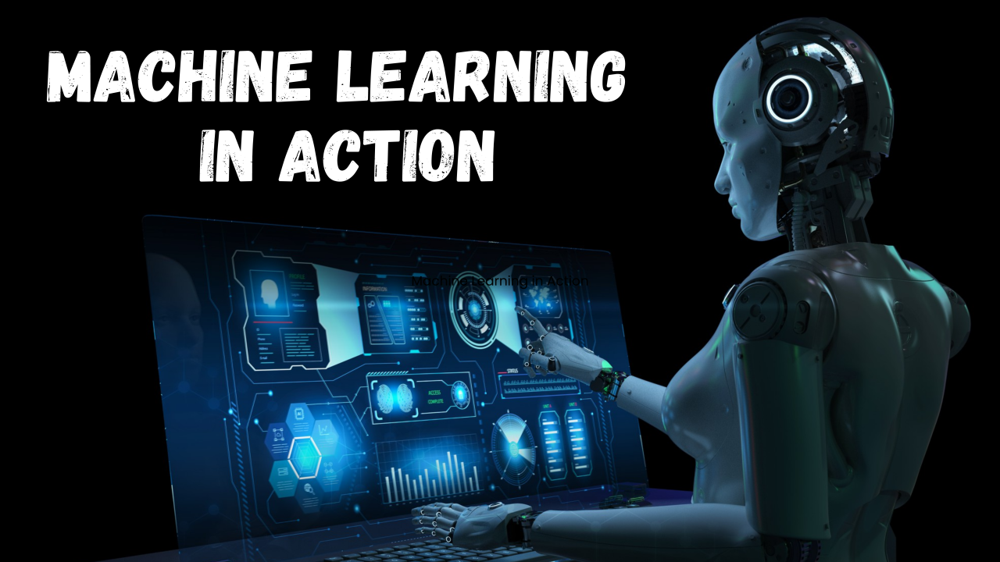

## Table of Contents

## What is action machine learning?

Action machine learning is a type of artificial intelligence where a computer learns to make decisions by doing things and seeing what happens. It's like learning by trial and error. Imagine you're playing a video game for the first time. You try different moves to see which ones help you win. The computer does something similar. It tries different actions, sees the results, and then decides what to do next time to get better results.

This kind of learning is often used in situations where the computer needs to make quick decisions, like in self-driving cars or playing games. The computer uses what it learns from past actions to make better choices in the future. For example, a self-driving car might learn to slow down when it sees a school zone sign because it remembers that doing so helped avoid problems before. This way, the computer gets smarter over time by learning from its own experiences.

## How does action machine learning differ from traditional machine learning?

Action machine learning, also known as reinforcement learning, is different from traditional machine learning because it learns by doing things and getting feedback from the results. Traditional machine learning usually works by looking at a lot of data and finding patterns in it. For example, if you want to teach a computer to recognize cats, you would show it many pictures of cats and tell it which ones are cats. The computer then figures out what makes a cat a cat. In contrast, action machine learning is more like teaching a dog a new trick. You let the dog try different things, and when it does the right thing, you give it a treat. The dog learns to do the trick more often because it wants the treat.

In action machine learning, the computer tries different actions in a situation and learns from the outcomes. If an action leads to a good result, the computer is more likely to do it again. If the result is bad, it will try something different next time. This process is called a feedback loop. Traditional machine learning doesn't have this kind of trial-and-error learning. Instead, it relies on a set of data that's already labeled or categorized. The computer uses this data to make predictions or decisions, but it doesn't change its approach based on new experiences. So, while traditional machine learning is good for tasks where you have a lot of data to start with, action machine learning is better for tasks where the computer needs to adapt and learn from its own actions over time.

## What are some common applications of action machine learning?

Action [machine learning](/wiki/machine-learning) is often used in games where computers need to make smart moves. For example, think about a computer playing chess. It tries different moves and learns which ones help it win. The more it plays, the better it gets at choosing the right moves. Another game where this is used is Go, where computers have become really good at beating human players by learning from their own games.

Another big use of action machine learning is in self-driving cars. These cars need to make quick decisions on the road, like when to slow down or change lanes. They learn from their experiences on the road. If slowing down at a certain spot helps avoid an accident, the car remembers that and does it again next time. This way, the car gets better at driving safely over time.

Action machine learning is also used in robotics. Robots can learn to do tasks like [picking](/wiki/asset-class-picking) up objects or navigating through a room. They try different ways of moving and learn which ones work best. This helps them become more efficient and adaptable to new situations. For example, a robot in a warehouse might learn the best way to pick up and move boxes by trying different approaches and seeing which ones are quickest and most reliable.

## Can you explain the basic components of an action machine learning system?

An action machine learning system has three main parts: the agent, the environment, and the reward system. The agent is like a student who is trying to learn. It does things in the environment, which is like a classroom where the learning happens. For example, if the agent is a robot, the environment might be a room where it moves around. The reward system is like a teacher who gives feedback. When the agent does something good, it gets a reward, and when it does something bad, it might get a penalty. This helps the agent figure out what to do more often and what to avoid.

The way the agent learns is through a process called trial and error. It tries different actions and sees what happens. If an action leads to a good reward, the agent remembers to do it again. If it leads to a bad result, the agent tries something different next time. Over time, the agent gets better at choosing the right actions because it learns from its experiences. This learning process is guided by a set of rules or algorithms that help the agent make decisions based on the rewards it gets. The goal is for the agent to find the best way to act in the environment to get the highest total reward.

## What role does reinforcement learning play in action machine learning?

Reinforcement learning is the key part of action machine learning. It's like a way for a computer to learn by doing things and getting feedback. In [reinforcement learning](/wiki/reinforcement-learning), the computer, called an agent, tries different actions in a setting, called an environment. If an action leads to a good result, the agent gets a reward. If it leads to a bad result, it might get a penalty. This reward or penalty helps the agent learn what to do more often and what to avoid. Over time, the agent gets better at choosing the right actions because it learns from its experiences.

The process of reinforcement learning is guided by a set of rules or algorithms that help the agent make decisions based on the rewards it gets. The main goal is for the agent to find the best way to act in the environment to get the highest total reward. This can be shown with a simple formula: $$R = \sum_{t=0}^{T} \gamma^t r_t$$ where $$R$$ is the total reward, $$r_t$$ is the reward at time step $$t$$, $$T$$ is the total number of time steps, and $$\gamma$$ is a discount [factor](/wiki/factor-investing) that makes future rewards less important than immediate ones. By using this formula, the agent can figure out the best strategy to maximize its rewards over time.

## How do you collect and prepare data for action machine learning models?

Collecting and preparing data for action machine learning models involves setting up an environment where an agent can perform actions and receive feedback. This environment can be a simulation, like a video game, or a real-world setting, like a robot navigating a room. The data is collected by letting the agent try different actions and recording what happens. For example, if the agent is a self-driving car, you might let it drive around and record when it speeds up, slows down, or changes lanes, along with what happens as a result, like getting closer to a destination or avoiding an obstacle. This data is then used to train the agent to make better decisions in the future.

Preparing the data involves cleaning and organizing it so the agent can learn from it effectively. This might mean removing any errors or irrelevant information and making sure the data is in a format that the learning algorithms can use. For instance, the data might need to be turned into numbers that represent different actions and rewards. The goal is to create a clear and consistent set of data that the agent can use to understand the relationship between actions and outcomes. This process helps the agent learn to choose actions that lead to the highest total reward, which can be represented by the formula $$R = \sum_{t=0}^{T} \gamma^t r_t$$, where $$R$$ is the total reward, $$r_t$$ is the reward at time step $$t$$, $$T$$ is the total number of time steps, and $$\gamma$$ is a discount factor.

## What are the key challenges in implementing action machine learning?

Implementing action machine learning can be tricky because it needs a lot of time and computing power. The agent has to try many different actions to learn what works best. This means it might take a long time for the agent to get good at making decisions. Also, the computer needs to be strong enough to handle all the calculations. If the environment is very complex, like a busy city for a self-driving car, it can be hard to set up a good simulation that the agent can learn from.

Another challenge is figuring out the right rewards and penalties. If the rewards are not set up well, the agent might learn the wrong things. For example, if a robot gets a reward for moving quickly but not for being safe, it might learn to move fast in dangerous ways. It's also hard to balance short-term rewards with long-term goals. The agent might focus on getting quick rewards instead of learning to do things that lead to better results over time. This can be shown with the formula $$R = \sum_{t=0}^{T} \gamma^t r_t$$, where $$R$$ is the total reward, $$r_t$$ is the reward at time step $$t$$, $$T$$ is the total number of time steps, and $$\gamma$$ is a discount factor that makes future rewards less important than immediate ones.

## How can action machine learning be used to improve decision-making processes?

Action machine learning can help make better decisions by letting a computer learn from its actions. Imagine you're teaching a robot to clean a room. It tries different ways of moving and picking up things, and you tell it when it does a good job. Over time, the robot gets better at cleaning because it learns which actions work best. This is similar to how action machine learning works. The computer tries different choices and learns from the results, making smarter decisions the more it practices.

This kind of learning is useful in situations where decisions need to be quick and based on what's happening right now. For example, a self-driving car uses action machine learning to decide when to slow down or change lanes. It learns from past drives to make safer and smoother choices on the road. The computer uses a formula like $$R = \sum_{t=0}^{T} \gamma^t r_t$$ to figure out the best actions. Here, $$R$$ is the total reward, $$r_t$$ is the reward at time step $$t$$, $$T$$ is the total number of time steps, and $$\gamma$$ is a discount factor. By using this formula, the car can learn to make decisions that lead to the best overall outcome.

## What advanced techniques are used to optimize action machine learning models?

To make action machine learning models work better, people use some special techniques. One of these is called "deep reinforcement learning." It mixes action machine learning with another kind of learning called [deep learning](/wiki/deep-learning). Deep learning is good at understanding complicated things, like pictures or sounds. By using deep learning, the computer can make better guesses about what action to take next. This helps the model learn faster and make smarter choices. Another technique is called "experience replay." This means the computer remembers old actions and tries them again in different ways. It's like practicing with a deck of cards by reshuffling and playing again. This helps the computer learn from its past mistakes and successes more effectively.

Another way to improve action machine learning is by using "transfer learning." This is when a model that's already good at one thing is used to help learn something new. For example, if a robot has learned to walk, it can use that knowledge to help learn how to run. This saves time because the robot doesn't have to start from scratch. Lastly, there's a technique called "policy gradient methods." These help the computer focus on the best way to act by changing how it makes choices. The computer uses a formula like $$R = \sum_{t=0}^{T} \gamma^t r_t$$ to figure out the best actions. Here, $$R$$ is the total reward, $$r_t$$ is the reward at time step $$t$$, $$T$$ is the total number of time steps, and $$\gamma$$ is a discount factor. By using these methods, the model can get better at making decisions that lead to the best overall outcome.

## How does action machine learning handle real-time decision making?

Action machine learning is really good at making decisions quickly because it learns by doing things and seeing what happens right away. Imagine you're playing a video game where you need to move fast to avoid obstacles. The computer, or agent, tries different moves and learns which ones help it win. If it makes a good move and gets a reward, it remembers to do that move again. If it makes a bad move and gets a penalty, it tries something different next time. This way, the computer can make smart choices in real-time because it keeps learning from its actions.

In real-time decision making, action machine learning uses a formula to figure out the best actions. The formula is $$R = \sum_{t=0}^{T} \gamma^t r_t$$. Here, $$R$$ is the total reward, $$r_t$$ is the reward at time step $$t$$, $$T$$ is the total number of time steps, and $$\gamma$$ is a discount factor that makes future rewards less important than immediate ones. By using this formula, the computer can quickly decide what to do next to get the best overall outcome. This is why action machine learning is used in things like self-driving cars, where quick and smart decisions are needed to drive safely.

## What ethical considerations should be taken into account when using action machine learning?

When using action machine learning, it's important to think about ethical issues. One big concern is fairness. The computer learns from the actions it takes and the rewards it gets. If the rewards are not set up in a fair way, the computer might learn to do things that are not good for everyone. For example, if a self-driving car learns to drive faster to get to a destination quicker but doesn't care about safety, it could cause accidents. So, we need to make sure the rewards encourage the computer to make choices that are fair and safe for everyone.

Another ethical issue is privacy. Action machine learning often needs a lot of data to work well. This data might include information about people, like where they go or what they do. It's important to protect this information and make sure it's not used in ways that could harm people. Also, we need to think about how the computer's decisions might affect society. If a computer learns to make choices that benefit some people more than others, it could lead to unfair treatment. So, we should always check that the computer's actions are helping everyone and not causing harm.

## Can you discuss a case study where action machine learning significantly impacted a business or industry?

A great example of action machine learning impacting a business is how Google used it to improve its data center cooling systems. Data centers are big buildings full of computers that need to stay cool to work properly. Google used action machine learning to help control the cooling systems. They set up an agent that tried different ways to cool the data center and learned from the results. If the agent found a way to cool the center using less energy, it got a reward. Over time, the agent learned the best ways to keep the data center cool while saving a lot of energy. This saved Google a lot of money and helped the environment by using less power.

Another case study is how action machine learning helped Amazon improve its warehouse operations. Amazon uses robots to move things around in its warehouses. These robots need to find the best way to pick up and move items quickly. Amazon used action machine learning to teach the robots. The robots tried different paths and ways of moving items, and they learned from the results. If a robot found a faster way to move an item, it got a reward. Over time, the robots learned the best ways to work, making the warehouse operations faster and more efficient. This helped Amazon deliver items to customers more quickly and saved them money on operations.