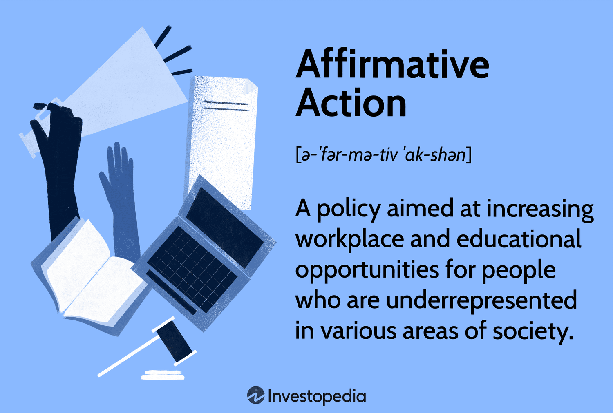

In today's financial markets, algorithmic trading (algo trading) is transforming the industry by leveraging advanced technologies and data-driven strategies. This transformation is characterized by the integration of actionable strategies, meaning functions, and algorithmic models. This synergy enhances the efficiency and opens new opportunities within financial markets.

Actionable strategies in trading are about making informed, timely decisions that can be quickly implemented to seize opportunities and accomplish financial objectives. These strategies are essential for investors and businesses aiming to capitalize on the ever-changing market dynamics and maintain their competitive edge.



Algorithmic trading employs sophisticated computer algorithms to facilitate the execution of trades following predefined criteria, such as timing, price, and volume. By mitigating human error and bias, algo trading offers precision and speed that are crucial for successful trade execution. Through the use of various algorithms designed for trend-following, arbitrage, market-making, and statistical analysis, traders can optimize their performance and trading strategies.

Meaning functions play a pivotal role in algorithmic models, acting as the interpretive logic that enables algorithms to comprehend and act upon market data. These functions transform raw data points into meaningful, actionable insights, leading to improved decision-making and effective trading outcomes.

This article breaks down the core concepts of actionable strategies in business and trading, examines the integration of meaning functions into algorithmic models, and explores the implementation and benefits of algo trading. By understanding how these elements come together, traders can enhance the efficiency of their trading systems, paving the way for continued advancements and success in the financial markets.

## Table of Contents

## What Does 'Actionable' Mean in Trading?

The term "actionable" in trading refers to strategies or decisions that can be readily implemented to achieve specific financial goals. In this context, "actionable" implies the ability to not only identify strategic opportunities but to act upon them with precision and speed. Actionable strategies allow businesses and investors to take advantage of immediate opportunities, potentially leading to the attainment of broader financial objectives.

In the fast-paced world of trading, the ability to quickly identify and act upon actionable market data is crucial for capitalizing on trends and maintaining a competitive edge. This process involves analyzing various data forms—such as price movements, trading volumes, and market sentiment—to derive insights that are directly translatable into trading actions. For example, if a trader identifies a pattern that historically predicts a rise in stock prices, an actionable strategy would be to execute a buy order before the price increase occurs.

The effectiveness of actionable strategies in trading can be enhanced through the use of sophisticated tools and techniques that process large volumes of data in real-time. High-frequency trading, for instance, relies on algorithms capable of executing trades within microseconds, making the identification of actionable insights and subsequent decision-making almost instantaneous.

Consider the following simplified Python example for detecting actionable trends based on a moving average strategy:

```python
def moving_average_strategy(prices, short_window=40, long_window=100):
    short_moving_avg = prices.rolling(window=short_window, min_periods=1).mean()
    long_moving_avg = prices.rolling(window=long_window, min_periods=1).mean()

    signals = (short_moving_avg > long_moving_avg).astype(int).diff()

    buy_signals = signals[signals == 1].index
    sell_signals = signals[signals == -1].index

    return buy_signals, sell_signals
```

In this strategy, a "buy" signal is considered actionable if the short-term moving average exceeds the long-term moving average, indicating a potential upward trend. Conversely, a "sell" signal is generated when the opposite occurs. By automating these signals, traders can swiftly respond to market changes, capitalizing on potential gains or avoiding losses.

In conclusion, actionable strategies in trading require a combination of keen data analysis, timely decision-making, and the ability to swiftly implement actions. This capability to transform insights into immediate trading actions plays a pivotal role in achieving financial goals and sustaining a competitive advantage.

## Algo Trading: An Overview

Algorithmic trading, commonly referred to as algo trading, utilizes computer algorithms to execute trades based on pre-defined criteria such as timing, price, and [volume](/wiki/volume-trading-strategy). These algorithms are designed to automatically trigger orders in financial markets, minimizing the need for human intervention. The use of systematic and quantitative methods in trading aims to optimize outcomes by addressing the intricacies of market dynamics.

The primary advantage of algo trading lies in its ability to eliminate human error and biases. By automating the trading process, algorithms ensure that trade executions are precise and occur at high speed. This facilitates taking advantage of fleeting market opportunities that would be impossible for human traders to capture efficiently. The automation aspect not only increases reliability but also reduces the emotional component of trading decisions, often a source of negative outcomes.

Traders deploy a variety of algorithms to cater to different trading scenarios, enhancing their performance in diverse market situations. Commonly used strategies in algo trading include:

- **Trend-Following:** Algorithms detect and capitalize on sustained movement in asset prices, buying into upward trends and selling during downward trends. These strategies leverage historical data and market indicators like moving averages to make decisions.

- **Arbitrage:** This strategy exploits price differences of the same asset in different markets or forms, anticipating a convergence in spread. Algorithms can identify these discrepancies swiftly and execute trades to gain risk-free profits before the market corrects itself.

- **Market-Making:** In this scenario, algorithms continuously quote buy and sell prices, seeking to capture the spread between them. The aim is to provide liquidity to the market, profiting from the bid-ask spread over numerous transactions.

- **Statistical Analysis:** Strategies based on statistical methods often involve complex models that predict price movements based on historical patterns and market data analysis. Algorithms analyze large datasets to identify statistically favorable trade opportunities.

The integration of advanced analytics and computing power in algo trading models has revolutionized financial markets. Algo trading systems deploy data-driven strategies that are responsive to real-time market conditions, enhancing the overall trading experience by optimizing trade execution and decision accuracy. As a result, traders are equipped to navigate the continuously evolving landscape of financial markets with superior precision and efficiency.

## Integrating Actionable Strategies in Algo Trading

Integrating actionable strategies into [algorithmic trading](/wiki/algorithmic-trading) models enhances their ability to efficiently respond to ever-changing market conditions. The core of this integration lies in the dynamic adjustment of algorithms, allowing them to react promptly to shifts and capitalize on emerging opportunities.

Actionable strategies involve predefined sets of criteria or rules that can dynamically influence trading decisions based on market data. These criteria are used to identify trade signals and adjust positions accordingly. For instance, if a trading algorithm uses a moving average crossover strategy to signal trades, integrating actionable insights would allow the algorithm to adjust its parameters, like time windows for the moving averages, based on current [volatility](/wiki/volatility-trading-strategies) levels or market trends.

Dynamic adjustment is crucial in a volatile market environment. By allowing algorithms to recalibrate their strategies based on incoming data, traders can maintain an edge. Python, a prevalent language in algorithmic trading, can be employed to demonstrate this adaptability:

```python
import pandas as pd
import numpy as np

def dynamic_moving_average(data, short_window=40, long_window=100):
    signals = pd.DataFrame(index=data.index)
    signals['signal'] = 0.0

    # Calculate short and long moving averages
    signals['short_mavg'] = data['price'].rolling(window=short_window, min_periods=1).mean()
    signals['long_mavg'] = data['price'].rolling(window=long_window, min_periods=1).mean()

    # Create signals
    signals['signal'][short_window:] = np.where(signals['short_mavg'][short_window:] 
                                                > signals['long_mavg'][short_window:], 1.0, 0.0)

    # Generate trading orders
    signals['positions'] = signals['signal'].diff()

    return signals
```

This example calculates dynamic moving averages that generate buy signals when a short-term moving average crosses above a long-term moving average. Introducing additional conditions, such as volatility or [momentum](/wiki/momentum) indicators, enhances the strategy's responsiveness to market conditions.

The integration of actionable strategies serves multiple purposes:

1. **Market Opportunities:** By promptly adjusting strategies, traders can identify and act on new market trends or anomalies swiftly. This agility ensures that valuable opportunities are seized promptly, maximizing potential returns.

2. **Risk Management:** Dynamic strategies allow for better risk assessment. By integrating volatility measures, algorithms can mitigate risks by reducing exposure during turbulent periods or scaling up during stable trends.

3. **Optimizing Trade Execution:** Actionable strategies optimize the timing and price of trade executions. This is achieved by continuously evaluating market liquidity and order book depth, thus reducing slippage and execution costs.

Overall, incorporating actionable strategies into algorithmic trading models equips traders with robust tools to tackle complex, high-frequency trading environments. Through continuous assessment and adaptation, these models not only enhance efficiency but also ensure a competitive advantage in financial markets.

## The Function and Benefits of Meaning in Algorithm Design

In algo trading, meaning functions serve as the interpretive logic that algorithms use to comprehend and act upon market data effectively. The essence of these functions lies in their ability to transform raw data into actionable insights, allowing traders to make informed decisions in real-time. Meaning functions typically employ sophisticated models and programming techniques to derive significance from vast arrays of data points, turning them into executable trade decisions.

One primary benefit of employing meaning functions in algorithm design is the enhancement of decision-making clarity and relevance. By accurately interpreting market signals, algorithms can differentiate between noise and significant data, thereby reducing the likelihood of errors. For instance, distinguishing meaningful trends from random market fluctuations is crucial for executing profitable trades. This process often involves statistical analysis and [machine learning](/wiki/machine-learning) techniques, which model the probabilities of various market outcomes based on historical and real-time data.

The implementation of meaning functions can be exemplified through a simple Python function that calculates the moving average of a stock price—a common method to smooth out price data and identify trends:

```python
def moving_average(data, window_size):
    cumsum, moving_aves = [0], []
    for i, x in enumerate(data, 1):
        cumsum.append(cumsum[i-1] + x)
        if i >= window_size:
            moving_avg = (cumsum[i] - cumsum[i-window_size]) / window_size
            moving_aves.append(moving_avg)
    return moving_aves

# Example usage with a window size of 5
stock_prices = [120, 119, 121, 122, 123, 124, 125]
print(moving_average(stock_prices, 5))
```

Such a function aids an algorithm in identifying ongoing trends and making decisions based on them, rather than reacting to short-term volatility. The use of meaning functions also contributes to more effective trading outcomes by enhancing risk management strategies. Algorithms equipped with these functions can dynamically adjust trade parameters in response to changing market conditions, thus optimizing execution and minimizing potential losses.

Furthermore, meaning functions are instrumental in automated trading for reducing human biases and errors. They enable algorithms to consistently apply logical criteria to trading decisions, instead of relying on emotional or subjective judgment. This increased consistency can directly translate into a more stable and predictable trading performance over time.

In summary, meaning functions play a crucial role in algorithm design by providing the necessary interpretive framework for algorithms to act meaningfully upon market data. This leads to superior decision-making, reduced errors, and optimized trading results, forming the backbone of efficient and successful algorithmic trading systems.

## Challenges and Solutions in Algo Trading with Actionable Strategies

Algorithmic trading, while powerful, brings with it distinct challenges that traders must navigate to maintain efficacy and uphold compliance in fluid financial markets. One of the primary challenges is technical failures, which can result from hardware malfunctions, network disruptions, or software bugs. Such failures may lead to significant financial losses due to incorrect or unintended trade executions. To mitigate this, traders should invest in robust, high-speed trading infrastructures capable of handling high volumes of transactions with low latency. Ensuring redundancy through backup systems can also help safeguard against potential system failures.

Another critical challenge is the market impact of algorithmic trades. Large orders executed by algorithms may inadvertently affect market prices, creating slippage that minimizes profitability. By employing advanced order execution algorithms that break down large trades into smaller ones, traders can reduce their market footprint. For example, using tactics such as iceberg orders can help conceal the true size of trades and minimize market impact.

Regulatory compliance presents another layer of complexity in algo trading. Various financial regulatory bodies impose rules to ensure market fairness and stability, such as the SEC's Rule 15c3-5 in the United States, which requires risk management controls for brokers. Trades must be executed within the confines of these regulations, necessitating robust compliance monitoring tools. Algorithms should be constantly monitored and audited for adherence to legal standards, and failure to comply can result in significant legal penalties.

Continuous monitoring and adaptation of algorithms are essential to navigate the rapidly evolving markets. Markets change in response to geopolitical events, economic reports, and trader behavior, requiring algorithms to evolve accordingly. Implementing machine learning frameworks capable of adapting to new patterns by learning from historical data can result in more resilient trading strategies. For example, using Python libraries like TensorFlow or Scikit-learn, traders can develop models that learn market trends and adapt trading strategies dynamically.

In conclusion, while algorithmic trading poses several challenges, the solutions lie in investing in technology infrastructure, employing advanced execution strategies, ensuring regulatory compliance, and utilizing adaptive algorithms. Traders who successfully address these aspects can significantly enhance their trading effectiveness and leverage the benefits of algorithmic trading within a highly competitive financial environment.

## Conclusion

By leveraging actionable strategies and meaning functions, traders can enhance the efficiency and effectiveness of their algo trading approaches. Actionable strategies empower traders to make prompt decisions, optimizing responses to dynamic market conditions. Meaning functions, meanwhile, interpret complex data to provide clarity and guide actionable trade decisions. These capabilities, when effectively integrated, yield an algo trading system that is both agile and accurate, reducing human error and enhancing trade outcomes.

Continual advancements in machine learning and AI promise further enhancements in the sophistication and capabilities of algo trading systems. These technologies enable the development of algorithms that can learn from data, adapt to unforeseen market changes, and uncover hidden patterns. For instance, machine learning models like neural networks can predict price movements based on historical data, while natural language processing can analyze news sentiment, influencing trading strategies.

For traders, mastering these tools offers a potential competitive advantage in the fast-paced and highly complex world of financial markets. Familiarity with programming languages such as Python, which offers libraries like Pandas for data manipulation and TensorFlow for machine learning, can be particularly beneficial. Such knowledge allows traders to develop, test, and refine their own algorithms, providing custom solutions tailored to specific trading goals and styles.

As the financial markets continue to evolve, those who are proficient in utilizing modern tech-driven strategies may find themselves well-positioned to exploit emerging market opportunities. This proficiency not only involves technical know-how but also a strategic mindset to continuously innovate and adapt in the ever-changing landscape of algorithmic trading.

## References & Further Reading

[1]: Bergstra, J., Bardenet, R., Bengio, Y., & Kégl, B. (2011). ["Algorithms for Hyper-Parameter Optimization."](https://dl.acm.org/doi/10.5555/2986459.2986743) Advances in Neural Information Processing Systems 24.

[2]: ["Advances in Financial Machine Learning"](https://www.amazon.com/Advances-Financial-Machine-Learning-Marcos/dp/1119482089) by Marcos Lopez de Prado

[3]: ["Evidence-Based Technical Analysis: Applying the Scientific Method and Statistical Inference to Trading Signals"](https://www.amazon.com/Evidence-Based-Technical-Analysis-Scientific-Statistical/dp/0470008741) by David Aronson

[4]: ["Machine Learning for Algorithmic Trading"](https://github.com/stefan-jansen/machine-learning-for-trading) by Stefan Jansen

[5]: ["Quantitative Trading: How to Build Your Own Algorithmic Trading Business"](https://www.amazon.com/Quantitative-Trading-Build-Algorithmic-Business/dp/1119800064) by Ernest P. Chan