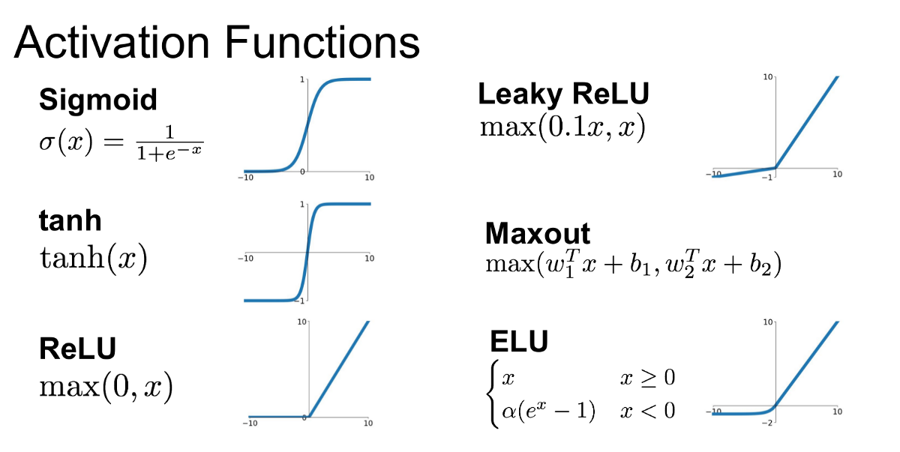

## Table of Contents

## What is an activation function in machine learning?

An activation function in machine learning is a crucial part of a neural network. It helps decide whether a neuron should be activated or not. Think of it as a gatekeeper that controls the flow of information through the network. Without activation functions, neural networks would just be a series of linear operations, and they wouldn't be able to learn complex patterns and relationships in data.

Activation functions introduce non-linearity into the output of a neuron. This non-linearity is what allows neural networks to model and solve complex problems. Common activation functions include the sigmoid, ReLU (Rectified Linear Unit), and tanh. For example, the ReLU function is defined as $$ f(x) = \max(0, x) $$. This simple function helps the network to learn quickly and perform well on a wide range of problems.

In summary, activation functions are essential for the performance of neural networks. They help the network learn from data by introducing non-linear properties, making it possible for the network to approximate any function, given enough neurons and layers.

## Why are activation functions important in neural networks?

Activation functions are super important in neural networks because they help the network learn and make decisions. Imagine a neural network without activation functions; it would just be a bunch of math operations that can't do anything fancy. Activation functions add a twist by making the network able to handle more complex stuff. They do this by introducing non-linearity, which means the network can now learn and represent more than just straight lines and simple patterns.

A common example of an activation function is the ReLU, which stands for Rectified Linear Unit. It's defined as $$ f(x) = \max(0, x) $$. This function is simple but powerful. When the input is positive, it lets it through unchanged, but if the input is negative, it turns it into zero. This helps the network learn faster and work better on many different problems. Without ReLU or other activation functions, the [neural network](/wiki/neural-network) would be limited and not as smart or useful.

## What are the most common types of activation functions?

The most common types of activation functions are the sigmoid, ReLU, and tanh. The sigmoid function is shaped like an S and squashes input values to a range between 0 and 1. It's defined as $$ f(x) = \frac{1}{1 + e^{-x}} $$. This function is great for models that predict probabilities. The ReLU, or Rectified Linear Unit, is super simple and fast. It's defined as $$ f(x) = \max(0, x) $$. If the input is positive, it stays the same; if it's negative, it becomes zero. ReLU is popular because it helps neural networks learn quickly and work well on many problems.

Another common activation function is the tanh, or hyperbolic tangent. It's similar to the sigmoid but squashes input values to a range between -1 and 1. It's defined as $$ f(x) = \frac{e^x - e^{-x}}{e^x + e^{-x}} $$. Tanh is useful when you need the output to be centered around zero. Each of these functions has its own strengths and is chosen based on what the neural network is trying to do. For example, ReLU is often used in hidden layers of deep neural networks because it helps prevent the problem of vanishing gradients, which can slow down learning.

## How does the sigmoid activation function work?

The sigmoid activation function is like a gentle curve that takes any number you give it and turns it into a number between 0 and 1. Imagine you're trying to guess if it might rain or not. The sigmoid function can help by giving you a probability. If you put a big number into the sigmoid function, it will give you a number very close to 1, which means it's very likely to rain. If you put in a small number, you'll get a number close to 0, meaning it's not likely to rain at all. The formula for the sigmoid function is $$ f(x) = \frac{1}{1 + e^{-x}} $$. This formula uses the letter e, which is a special number in math, to make the curve smooth and S-shaped.

The sigmoid function is really helpful in neural networks because it can turn numbers into something that looks like a probability. This is super useful when you want your neural network to make decisions based on how likely something is to happen. For example, if you're trying to predict if an email is spam or not, the sigmoid function can help by giving you a score between 0 and 1. A score close to 1 means the email is very likely to be spam, and a score close to 0 means it's probably not spam. This makes it easier for the neural network to learn and make good guesses.

## What are the advantages and disadvantages of using the ReLU activation function?

The ReLU, or Rectified Linear Unit, activation function is really popular because it's simple and helps neural networks learn fast. It's defined as $$ f(x) = \max(0, x) $$. This means if you give it a positive number, it gives you back the same number, but if you give it a negative number, it turns it into zero. This simplicity makes it easy for computers to calculate, which speeds up training. Also, ReLU helps avoid a problem called the vanishing gradient, where the network can't learn well because the changes it makes are too small. This makes ReLU great for deep neural networks with many layers.

However, ReLU isn't perfect. One big problem is that it can cause "dying ReLU" where neurons can stop learning if they always get negative inputs and turn into zero. Once a neuron becomes a "dead" ReLU, it won't activate anymore, which can hurt the network's performance. Another issue is that ReLU isn't always the best for every kind of problem. For example, if you need the output to be centered around zero, ReLU won't work well because it only gives positive outputs. So, while ReLU is a great choice for many situations, it's important to think about these disadvantages when [picking](/wiki/asset-class-picking) an activation function.

## Can you explain the concept of the tanh activation function?

The tanh, or hyperbolic tangent, activation function is like a cousin to the sigmoid function but with a twist. It takes any number you give it and turns it into a number between -1 and 1. Imagine you're trying to guess how much you like a new ice cream flavor. The tanh function can help by giving you a score. If you put a big number into the tanh function, you'll get a number very close to 1, which means you love the ice cream. If you put in a small number, you'll get a number close to -1, meaning you don't like it at all. The formula for the tanh function is $$ f(x) = \frac{e^x - e^{-x}}{e^x + e^{-x}} $$. This formula uses the letter e, which is a special number in math, to make the curve smooth and S-shaped, but it's centered around zero instead of going from 0 to 1 like the sigmoid.

The tanh function is really helpful in neural networks because it can turn numbers into something that's centered around zero. This is super useful when you want your neural network to make decisions based on how much you like or dislike something. For example, if you're trying to predict how much you'll enjoy a movie, the tanh function can help by giving you a score between -1 and 1. A score close to 1 means you'll probably love the movie, and a score close to -1 means you probably won't like it. This makes it easier for the neural network to learn and make good guesses, especially when the data you're working with has both positive and negative values.

## What is the Leaky ReLU and how does it differ from standard ReLU?

The Leaky ReLU is a variation of the standard ReLU activation function that tries to fix some of its problems. The standard ReLU, defined as $$ f(x) = \max(0, x) $$, can cause neurons to stop learning if they always get negative inputs, turning them into what's called "dead" ReLUs. Leaky ReLU solves this by allowing a small, non-zero gradient when the input is negative. Instead of turning negative inputs into zero, Leaky ReLU multiplies them by a small constant, usually something like 0.01. So, the formula for Leaky ReLU is $$ f(x) = \max(\alpha x, x) $$, where $$ \alpha $$ is that small constant.

This change helps keep all neurons active and learning, even when they receive negative inputs. By allowing a small gradient for negative values, Leaky ReLU prevents the problem of "dying" neurons, making the neural network more robust and able to learn better. While Leaky ReLU is more complex than the standard ReLU, the slight increase in computation is often worth it for the improved performance and stability it brings to the training process.

## How do activation functions affect the training of neural networks?

Activation functions are like the secret sauce that makes neural networks smart. They help the network learn by adding a twist to the numbers it processes. Without activation functions, neural networks would just do simple math and couldn't learn anything fancy. But with activation functions, the network can learn to recognize patterns and make decisions. For example, the ReLU function, which is $$ f(x) = \max(0, x) $$, helps the network learn quickly by letting positive numbers through and turning negative numbers into zero. This makes the network faster and better at learning.

But activation functions can also make training trickier. Different functions have different effects on how the network learns. For instance, the sigmoid function, $$ f(x) = \frac{1}{1 + e^{-x}} $$, can slow down learning in deep networks because it can cause a problem called the vanishing gradient. This means the changes the network makes get smaller and smaller as they go through the layers, making it hard for the network to learn. On the other hand, functions like ReLU and its variations, like Leaky ReLU, help avoid this problem by keeping the gradients from getting too small. So, choosing the right activation function is important for making sure the neural network trains well and performs its best.

## What is the role of the softmax function in classification tasks?

The softmax function is super important when you're trying to classify things with a neural network. It helps turn the raw scores or numbers that come out of the network into something that looks like probabilities. Imagine you're trying to guess what type of fruit is in a picture. The softmax function takes the scores for each fruit type and makes them add up to 1, so you can see which fruit is most likely. The formula for the softmax function is $$ \text{softmax}(x_i) = \frac{e^{x_i}}{\sum_{j} e^{x_j}} $$. This means it uses the letter e, which is a special number in math, to make sure the highest score gets the highest probability.

Using the softmax function is great because it makes it easy to compare the different options. For example, if the network gives high scores to both apples and oranges, the softmax function will turn those scores into probabilities that add up to 100%. This way, you can see that maybe apples have a 60% chance and oranges have a 40% chance. This helps the network make a clear decision and also helps people understand the results better. So, the softmax function is a key part of making classification tasks work well in neural networks.

## How do you choose the right activation function for a specific layer in a neural network?

Choosing the right activation function for a specific layer in a neural network depends on what you want the network to do and where the layer is in the network. For hidden layers, the ReLU function, which is defined as $$ f(x) = \max(0, x) $$, is often a good choice because it's simple and helps the network learn quickly. ReLU is great for deep networks because it prevents a problem called the vanishing gradient, where the network can't learn well because the changes it makes are too small. However, if you're worried about "dying" neurons where some parts of the network stop learning, you might want to use a variation like Leaky ReLU, which lets a small gradient through even for negative inputs.

For the output layer, the choice of activation function depends on the type of problem you're solving. If you're doing binary classification, where you're trying to decide between two options like yes or no, the sigmoid function, defined as $$ f(x) = \frac{1}{1 + e^{-x}} $$, is often used because it turns numbers into probabilities between 0 and 1. For multi-class classification, where you're choosing between more than two options, the softmax function, defined as $$ \text{softmax}(x_i) = \frac{e^{x_i}}{\sum_{j} e^{x_j}} $$, is perfect because it turns the scores into probabilities that add up to 1, making it easy to see which option is most likely. The key is to match the activation function to the task and the layer's position in the network to get the best results.

## What are some advanced activation functions used in deep learning?

In [deep learning](/wiki/deep-learning), some advanced activation functions help make neural networks even smarter. One of these is the ELU, or Exponential Linear Unit, which is a bit like ReLU but smoother. ELU is defined as $$ f(x) = \begin{cases} x & \text{if } x > 0 \\ \alpha (e^x - 1) & \text{if } x \leq 0 \end{cases} $$, where $$ \alpha $$ is a positive constant. This function helps the network learn faster and can make it more accurate because it has a smooth curve for negative inputs, which can help avoid the problem of "dying" neurons that can happen with ReLU.

Another advanced activation function is the Swish function, which is a bit more complex but can help the network perform better, especially in deep networks. Swish is defined as $$ f(x) = x \cdot \text{sigmoid}(\beta x) $$, where $$ \beta $$ is a learnable parameter. This function combines the benefits of ReLU and sigmoid, making it easier for the network to learn and perform well on a wide range of tasks. Both ELU and Swish are great examples of how researchers keep finding new ways to make neural networks even better at learning from data.

## How can the choice of activation function impact the performance and efficiency of a neural network?

The choice of activation function can really change how well and how fast a neural network learns. For example, the ReLU function, which is $$ f(x) = \max(0, x) $$, is simple and helps the network learn quickly. It's great for deep networks because it prevents a problem called the vanishing gradient, where the network can't learn well because the changes it makes are too small. But ReLU can also cause some neurons to stop learning if they always get negative inputs, turning them into what's called "dead" ReLUs. If you use a variation like Leaky ReLU, which lets a small gradient through even for negative inputs, you can avoid this problem and keep the network learning well.

Different activation functions are better for different parts of the network and different types of problems. For the output layer, if you're doing binary classification, the sigmoid function, defined as $$ f(x) = \frac{1}{1 + e^{-x}} $$, is often used because it turns numbers into probabilities between 0 and 1. For multi-class classification, the softmax function, defined as $$ \text{softmax}(x_i) = \frac{e^{x_i}}{\sum_{j} e^{x_j}} $$, is perfect because it turns the scores into probabilities that add up to 1. Choosing the right activation function can make the network more accurate and faster at learning, but it takes some thinking to match the function to the task and the layer's position in the network.