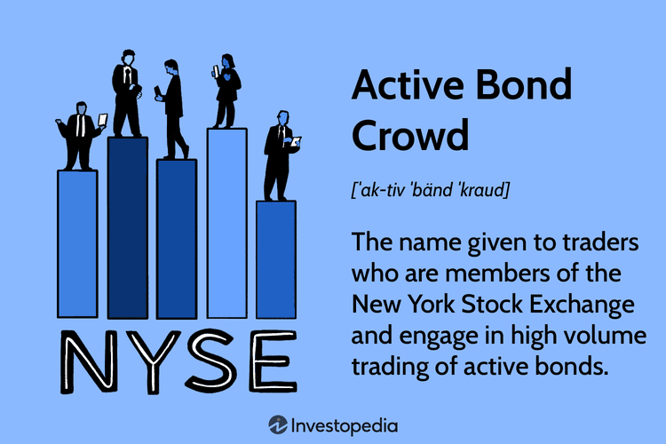

## Table of Contents

## What is an Active Bond Crowd?

An Active Bond Crowd is a group of bond traders who are actively involved in trading bonds on the floor of a stock exchange. These traders are usually members of the exchange and have the authority to buy and sell bonds on behalf of their clients or for their own accounts. They play a crucial role in maintaining liquidity in the bond market by ensuring that there are always buyers and sellers available.

The term "Active Bond Crowd" specifically refers to the traders who are physically present on the trading floor and engage in face-to-face transactions. This is different from electronic trading, where bonds are bought and sold through computer systems. The active bond crowd helps to keep the market efficient by providing immediate feedback on bond prices and quickly responding to changes in market conditions.

## How does the Active Bond Crowd function within the financial markets?

The Active Bond Crowd works on the trading floor of a stock exchange. They are a group of traders who buy and sell bonds for their clients or themselves. These traders are important because they help keep the bond market active. They make sure there are always people ready to buy or sell bonds, which helps keep the market running smoothly. When someone wants to trade a bond, the Active Bond Crowd can quickly find a buyer or seller, making the process faster and easier.

Their presence on the trading floor also helps set bond prices. When traders from the Active Bond Crowd talk to each other, they share information about what bonds are worth. This helps everyone know the current price of bonds. If something changes in the market, like interest rates going up or down, the Active Bond Crowd can react quickly. This quick reaction helps the bond market stay up-to-date and efficient.

## What are the benefits of participating in an Active Bond Crowd?

Participating in an Active Bond Crowd can be really helpful for traders. One big benefit is that it helps them get quick access to the bond market. When you are part of the Active Bond Crowd, you can find buyers and sellers fast. This means you can make trades happen more quickly than if you were trading by yourself or using a computer. Being on the trading floor also lets you talk to other traders face-to-face, which can help you make better trading decisions.

Another benefit is that being part of the Active Bond Crowd gives you a good sense of what's happening in the market right now. You can hear what other traders are saying and see how they are reacting to news or changes in the market. This real-time information can help you understand bond prices better and make smarter trades. Plus, being around other experienced traders can help you learn more about the bond market and improve your trading skills.

## Who typically participates in an Active Bond Crowd?

People who usually join an Active Bond Crowd are bond traders who work for big financial companies like banks or investment firms. These traders are often members of the stock exchange where they trade. They have the special permission to buy and sell bonds right on the trading floor. Being part of the Active Bond Crowd means they can make quick trades and help keep the bond market moving smoothly.

Besides these professional traders, you might also find brokers and dealers in the Active Bond Crowd. Brokers help people buy and sell bonds, while dealers trade bonds for their own accounts. Both groups play important roles in keeping the market active. Being on the trading floor lets them talk to other traders face-to-face, share information, and react quickly to changes in the market.

## What are the risks associated with joining an Active Bond Crowd?

Joining an Active Bond Crowd can be risky. One big risk is the fast pace of trading on the floor. When you are part of the Active Bond Crowd, you have to make quick decisions. If you make a wrong choice, you could lose money. The pressure to act fast can lead to mistakes, especially if you are new to trading or not used to the busy environment of the trading floor.

Another risk is that the bond market can be unpredictable. Even though being part of the Active Bond Crowd gives you good information about what's happening right now, the market can still change quickly. If interest rates go up or down suddenly, or if there is big news that affects the market, it can be hard to react in time. This unpredictability means that even experienced traders can face losses when they are part of the Active Bond Crowd.

## How can someone get started with an Active Bond Crowd?

To get started with an Active Bond Crowd, you need to become a member of a stock exchange where bonds are traded. This usually means working for a financial company like a bank or an investment firm that has membership at the exchange. You will need to learn about bonds and how trading works. It's a good idea to get some training or experience in trading before you join the Active Bond Crowd. Once you are ready, your company can help you get the right permissions to trade on the floor.

Once you are on the trading floor, you will start by watching and listening to other traders. This helps you understand how the Active Bond Crowd works and how to make trades. You will need to be quick and good at talking to other traders to buy and sell bonds. It can be a bit scary at first because everything moves so fast, but with time and practice, you will get better at it. Remember, being part of the Active Bond Crowd means you have to be ready to make quick decisions and learn from your experiences.

## What types of bonds are commonly traded within an Active Bond Crowd?

In an Active Bond Crowd, traders often deal with government bonds. These are bonds issued by the government to raise money. They are seen as safe because the government is less likely to go bankrupt. Common examples include U.S. Treasury bonds, which are very popular because they are backed by the U.S. government. Traders in the Active Bond Crowd might buy and sell these bonds quickly, helping to keep the market active and liquid.

Another type of bond you might see in the Active Bond Crowd is corporate bonds. These are issued by companies to raise money for their business. They can be riskier than government bonds because companies can go bankrupt. But they often offer higher interest rates to attract investors. Traders in the Active Bond Crowd will trade these bonds, looking for good deals and helping to set prices based on how risky the bonds are seen to be.

Sometimes, traders in the Active Bond Crowd also deal with municipal bonds. These are issued by local governments or cities to fund projects like schools or roads. They can offer tax benefits, which makes them attractive to some investors. Like corporate bonds, they can vary in risk, but they are generally seen as safer than corporate bonds. Traders in the Active Bond Crowd help to keep these bonds moving in the market, ensuring there are always buyers and sellers ready to trade.

## How does the Active Bond Crowd impact bond pricing and liquidity?

The Active Bond Crowd helps set bond prices by trading on the floor of the stock exchange. When these traders buy and sell bonds, they share information about what the bonds are worth right now. This means that everyone on the trading floor knows the current price of bonds quickly. If something changes in the market, like interest rates going up or down, the Active Bond Crowd can react fast. This helps keep bond prices accurate and up-to-date.

The Active Bond Crowd also makes the bond market more liquid. Liquidity means there are always people ready to buy or sell bonds. When traders from the Active Bond Crowd are on the trading floor, they make sure there are always buyers and sellers available. This makes it easier and faster for someone to trade a bond. If you want to sell a bond, the Active Bond Crowd can quickly find someone to buy it. This keeps the bond market running smoothly and helps everyone trade bonds more easily.

## What are the key differences between an Active Bond Crowd and other investment crowds?

The Active Bond Crowd is a group of traders who work on the trading floor of a stock exchange, buying and selling bonds face-to-face. This is different from other investment crowds, like those that trade stocks or commodities, because bonds are specific financial instruments that help governments and companies borrow money. The Active Bond Crowd focuses only on bonds, making sure there are always buyers and sellers ready to trade, which keeps the bond market liquid and efficient. Other investment crowds might not have the same level of focus on a single type of investment, and they often use electronic trading platforms instead of trading on the floor.

Another key difference is how the Active Bond Crowd helps set bond prices. Because these traders are physically on the trading floor, they can quickly share information and react to changes in the market, like shifts in interest rates. This helps keep bond prices accurate and up-to-date. In contrast, other investment crowds might rely more on electronic systems and algorithms to set prices, which can sometimes be slower to respond to market changes. The Active Bond Crowd's presence on the trading floor allows for a more immediate and dynamic interaction, which is crucial for the fast-paced nature of bond trading.

## How have technological advancements influenced the operations of Active Bond Crowds?

Technological advancements have changed how Active Bond Crowds work. Before, all trading happened on the trading floor, with traders talking to each other face-to-face. Now, a lot of trading happens on computers using electronic systems. This means that some of the work that Active Bond Crowds used to do can now be done faster and easier online. Even though the Active Bond Crowd still trades on the floor, they also use technology to help them make trades quicker and keep up with what's happening in the market.

These changes have made the bond market more efficient but also brought new challenges. The Active Bond Crowd still plays an important role in setting bond prices and keeping the market liquid. But with more trading happening electronically, they have to use technology to stay competitive. This means learning how to use trading platforms and staying connected to the latest market information. Even though technology has changed how they work, the Active Bond Crowd still helps make sure the bond market runs smoothly by bringing people together to trade on the floor.

## Can you explain the regulatory environment surrounding Active Bond Crowds?

The Active Bond Crowd has to follow rules set by the stock exchange and government agencies. These rules make sure that trading is fair and that everyone follows the same guidelines. For example, the U.S. Securities and Exchange Commission (SEC) oversees the bond market to make sure traders are not doing anything wrong. The stock exchange also has its own rules that the Active Bond Crowd must follow, like how they can trade and what information they need to share.

These regulations help keep the bond market safe and trustworthy. Traders in the Active Bond Crowd need to know these rules well so they can trade without breaking them. If someone breaks the rules, they could face penalties or even be banned from trading. This makes sure that the Active Bond Crowd helps keep the bond market running smoothly and fairly for everyone involved.

## What advanced strategies can experts use within an Active Bond Crowd to maximize returns?

Experts in an Active Bond Crowd can use several advanced strategies to maximize their returns. One strategy is called yield curve trading. This means they look at how the interest rates for different bonds change over time. If they think short-term interest rates will go up faster than long-term rates, they might buy short-term bonds and sell long-term bonds. This can help them make more money if their guess about interest rates is right. Another strategy is called relative value trading, where they compare different bonds to find ones that might be a better deal. They might buy one bond and sell another if they think the price difference between them will change in their favor.

Another important strategy is using market information to their advantage. Since the Active Bond Crowd is right on the trading floor, they can hear what other traders are saying and see how they react to news. This real-time information can help them make quick trades that take advantage of changes in the market. For example, if they hear about a big event that might affect bond prices, they can buy or sell bonds before the rest of the market catches on. By using these advanced strategies, experts in the Active Bond Crowd can try to make more money from their trades.

## References & Further Reading

[1]: Bergstra, J., Bardenet, R., Bengio, Y., & Kégl, B. (2011). ["Algorithms for Hyper-Parameter Optimization."](https://dl.acm.org/doi/10.5555/2986459.2986743) Advances in Neural Information Processing Systems 24.

[2]: ["Advances in Financial Machine Learning"](https://www.amazon.com/Advances-Financial-Machine-Learning-Marcos/dp/1119482089) by Marcos Lopez de Prado

[3]: ["Evidence-Based Technical Analysis: Applying the Scientific Method and Statistical Inference to Trading Signals"](https://www.amazon.com/Evidence-Based-Technical-Analysis-Scientific-Statistical/dp/0470008741) by David Aronson

[4]: ["Machine Learning for Algorithmic Trading"](https://github.com/stefan-jansen/machine-learning-for-trading) by Stefan Jansen

[5]: ["Quantitative Trading: How to Build Your Own Algorithmic Trading Business"](https://www.amazon.com/Quantitative-Trading-Build-Algorithmic-Business/dp/1119800064) by Ernest P. Chan