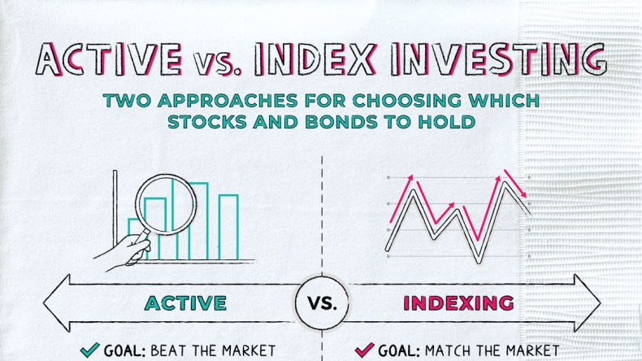

## Table of Contents

## What is an active index fund?

An active index fund is a type of investment fund that tries to beat a specific stock market index, like the S&P 500. Unlike a regular index fund, which just copies the index, an active index fund has a manager who picks and chooses stocks. They aim to do better than the index by making smart choices about which stocks to buy and sell.

These funds often have higher fees because they need to pay the manager for their work. The manager uses their knowledge and research to try and pick stocks that will do better than the average in the index. However, because they are trying to beat the market, there's also a risk that they might not do as well as the index itself. So, while active index funds offer the chance for higher returns, they also come with higher costs and risks.

## How do active index funds differ from passive index funds?

Active index funds and passive index funds are two different ways to invest in the stock market. Active index funds have a manager who tries to pick stocks that will do better than a specific stock market index, like the S&P 500. The manager uses their knowledge and research to choose which stocks to buy and sell, hoping to beat the performance of the index. This means active index funds often have higher fees because they need to pay the manager for their work.

On the other hand, passive index funds simply try to copy the performance of a specific index. They don't have a manager [picking](/wiki/asset-class-picking) stocks; instead, they automatically buy all the stocks in the index in the same proportions. This makes passive index funds cheaper to run because there's no need to pay for a manager's expertise. The goal of a passive index fund is not to beat the index but to match its performance as closely as possible.

In summary, the main difference between active and passive index funds is how they are managed. Active funds aim to outperform the index with the help of a manager, which comes with higher costs and the risk of underperforming. Passive funds aim to match the index's performance at a lower cost, offering a simpler and often less risky way to invest in the market.

## What are the main goals of active index funds?

The main goal of active index funds is to do better than a specific stock market index, like the S&P 500. The fund has a manager who picks and chooses stocks, trying to find ones that will grow more than the average in the index. This means the manager uses their knowledge and research to make smart choices about which stocks to buy and sell. They aim to beat the market by finding the best stocks to invest in.

Because active index funds try to beat the market, they can offer the chance for higher returns than just following the index. However, this also comes with higher costs and more risk. The fees for these funds are usually higher because they need to pay the manager for their work. There's also a chance that the manager might not pick the right stocks, and the fund could end up doing worse than the index. So, while active index funds aim for better performance, they come with both potential rewards and risks.

## Who typically manages active index funds?

Active index funds are usually managed by professional fund managers. These managers work for investment companies and use their knowledge and research to pick the best stocks for the fund. Their job is to choose stocks that they think will do better than the average in the stock market index the fund is trying to beat.

These managers look at a lot of information about companies, like how much money they make, who leads them, and what's happening in the world that could affect them. They use this information to decide which stocks to buy and sell. The goal is to make the fund grow more than the index by picking the right stocks at the right time.

## What are the common strategies used by active index fund managers?

Active index fund managers use different strategies to try to beat the market. One common strategy is stock picking. This means they choose specific stocks they think will do better than others. They look at a lot of information about companies, like their earnings, leadership, and market trends. If they think a company will do well, they buy its stock. If they think it will do badly, they might sell it or avoid it. This way, they try to find the best stocks to make the fund grow more than the index.

Another strategy is sector rotation. This means the managers move money between different parts of the economy, like technology, healthcare, or energy. They try to guess which parts will do well in the future and put more money into those areas. For example, if they think technology will grow a lot, they might buy more tech stocks. If they think energy will struggle, they might sell some energy stocks. By moving money around like this, they hope to take advantage of changes in the market and beat the index.

Some managers also use market timing. This means they try to guess when the whole market will go up or down and change how much they invest based on that. If they think the market will go up, they might buy more stocks. If they think it will go down, they might sell some stocks or hold more cash. This can be risky, but if they get it right, it can help the fund do better than the index.

## How are the performance fees structured in active index funds?

Performance fees in active index funds are extra charges that the fund might have to pay to the manager if the fund does really well. These fees are on top of the regular fees that the fund already charges. The idea is to reward the manager for doing a good job and beating the market. Usually, the performance fee is a percentage of the extra money the fund makes over a certain target, like the return of the index it's trying to beat. For example, if the fund does 2% better than the index, the manager might get a fee based on that 2%.

The way performance fees are set up can be different for each fund. Some funds might only charge a performance fee if they do better than the index by a certain amount, like 1% or 2%. Others might charge the fee every year, while some might only charge it if the fund does well over several years. It's important for people investing in active index funds to understand these fees because they can make the cost of the fund higher if the manager does a good job. But if the fund doesn't beat the index, the investors won't have to pay these extra fees.

## What are the typical costs associated with investing in active index funds?

Investing in active index funds comes with different costs that you should know about. One big cost is the management fee. This is what the fund charges to pay the manager who picks the stocks. Active index funds usually have higher management fees than passive funds because the manager is doing more work trying to beat the market. The management fee is often a percentage of the money you have in the fund, and it can be around 1% or even more each year.

Another cost to think about is the performance fee. This is an extra charge that the fund might have to pay if it does really well and beats the market by a certain amount. The performance fee is usually a percentage of the extra money the fund makes over its target. Not all active index funds have performance fees, but if they do, they can make the fund more expensive. It's good to check if the fund you're looking at has a performance fee and how it works.

Besides these fees, there can be other costs like trading fees. These are the costs of buying and selling stocks inside the fund. Active index funds might trade more often than passive funds because the manager is always trying to pick the best stocks. This can add to the overall cost of the fund. So, when you're thinking about investing in an active index fund, it's important to look at all these costs and see how they might affect your returns.

## Can you explain the tracking error in the context of active index funds?

Tracking error is a way to measure how much an active index fund's performance differs from the index it's trying to beat. It shows how well the fund manager is doing compared to the index. If the tracking error is high, it means the fund's returns are very different from the index's returns. This can be good or bad. If the fund is doing better than the index, a high tracking error might mean the manager is making smart choices and beating the market by a lot. But if the fund is doing worse, a high tracking error might mean the manager's choices are not working out.

Tracking error is important because it helps investors understand the risk they're taking with an active index fund. Since the fund is trying to beat the index, there's always a chance it might not do as well. The tracking error gives investors a way to see how much the fund's performance might swing around compared to the index. If you're okay with the fund's performance being different from the index, a higher tracking error might be fine. But if you want the fund to stay close to the index, you might look for a fund with a lower tracking error.

## What are the tax implications of investing in active index funds?

When you invest in active index funds, you need to think about taxes. These funds might have more taxes than passive funds because they buy and sell stocks more often. Every time the fund sells a stock and makes money, it might have to pay capital gains tax. If the fund does well and beats the market, it could mean more buying and selling, which can lead to more taxes for you. The tax you pay depends on how long the fund held the stocks before selling them. If the stocks were held for less than a year, you might pay a higher short-term capital gains tax. If they were held for more than a year, you might pay a lower long-term capital gains tax.

Also, at the end of the year, the fund might give you some money back, called a distribution. This can happen if the fund made money from selling stocks or got dividends from the companies it owns. You have to pay taxes on these distributions, even if you don't take the money out of the fund. The tax rate on these distributions can be different, depending on if they come from short-term or long-term gains, or from dividends. So, when you're thinking about investing in an active index fund, it's good to know about these taxes and how they might affect your returns.

## How do active index funds perform compared to their benchmarks?

Active index funds try to do better than their benchmarks, like the S&P 500. They have managers who pick stocks they think will grow more than the average in the index. But, it's not easy to beat the market all the time. Some active index funds do better than their benchmarks, but many don't. Studies show that over long periods, like 10 or 20 years, most active index funds don't beat their benchmarks. This means that even though the managers try hard, the market often does better than them.

The performance of active index funds can change a lot from year to year. One year, a fund might do much better than its benchmark. The next year, it might do worse. This is because picking the right stocks is hard, and the market can be unpredictable. If you're thinking about investing in an active index fund, it's good to look at how it has done over many years, not just one or two. This can give you a better idea of whether the fund might beat its benchmark in the future.

## What are the potential limitations and risks of investing in active index funds?

Investing in active index funds comes with some risks and limitations. One big risk is that the fund might not do better than the market. Even though the manager tries to pick the best stocks, it's hard to beat the market all the time. Many active index funds end up doing worse than their benchmarks over long periods. This can be disappointing if you were hoping for higher returns. Also, these funds often have higher fees because they need to pay the manager for their work. These fees can eat into your returns, making it even harder for the fund to beat the market.

Another limitation is that active index funds can be more unpredictable. The manager might buy and sell stocks a lot, trying to find the best ones. This can lead to more taxes if the fund makes money from selling stocks. Plus, the fund's performance can change a lot from year to year. One year it might do great, and the next year it might do poorly. This can make it hard to know what to expect. So, if you're thinking about investing in an active index fund, it's good to understand these risks and think about whether you're okay with the ups and downs.

## How can an investor evaluate the success of an active index fund?

To evaluate the success of an active index fund, an investor should first look at how well the fund has done compared to its benchmark over a long time, like 5 or 10 years. The benchmark is the stock market index the fund is trying to beat, like the S&P 500. If the fund has done better than the benchmark most of the time, it's a good sign that the manager is picking good stocks. But if the fund has done worse than the benchmark, it might mean the manager's choices aren't working out.

Another way to evaluate the fund is to look at the costs. Active index funds usually have higher fees because they need to pay the manager. These fees can make it harder for the fund to beat the market. So, you should check if the extra returns the fund is getting are worth the extra cost. Also, think about the fund's tracking error, which shows how different the fund's performance is from the benchmark. A high tracking error means the fund's returns can be very different from the index, which can be good or bad depending on whether the fund is doing better or worse than the index.

## References & Further Reading

[1]: Bergstra, J., Bardenet, R., Bengio, Y., & Kégl, B. (2011). ["Algorithms for Hyper-Parameter Optimization."](https://papers.nips.cc/paper/4443-algorithms-for-hyper-parameter-optimization) Advances in Neural Information Processing Systems 24.

[2]: ["Advances in Financial Machine Learning"](https://www.amazon.com/Advances-Financial-Machine-Learning-Marcos/dp/1119482089) by Marcos Lopez de Prado

[3]: ["Evidence-Based Technical Analysis: Applying the Scientific Method and Statistical Inference to Trading Signals"](https://www.amazon.com/Evidence-Based-Technical-Analysis-Scientific-Statistical/dp/0470008741) by David Aronson

[4]: ["Machine Learning for Algorithmic Trading"](https://github.com/stefan-jansen/machine-learning-for-trading) by Stefan Jansen

[5]: ["Quantitative Trading: How to Build Your Own Algorithmic Trading Business"](https://www.amazon.com/Quantitative-Trading-Build-Algorithmic-Business/dp/1119800064) by Ernest P. Chan