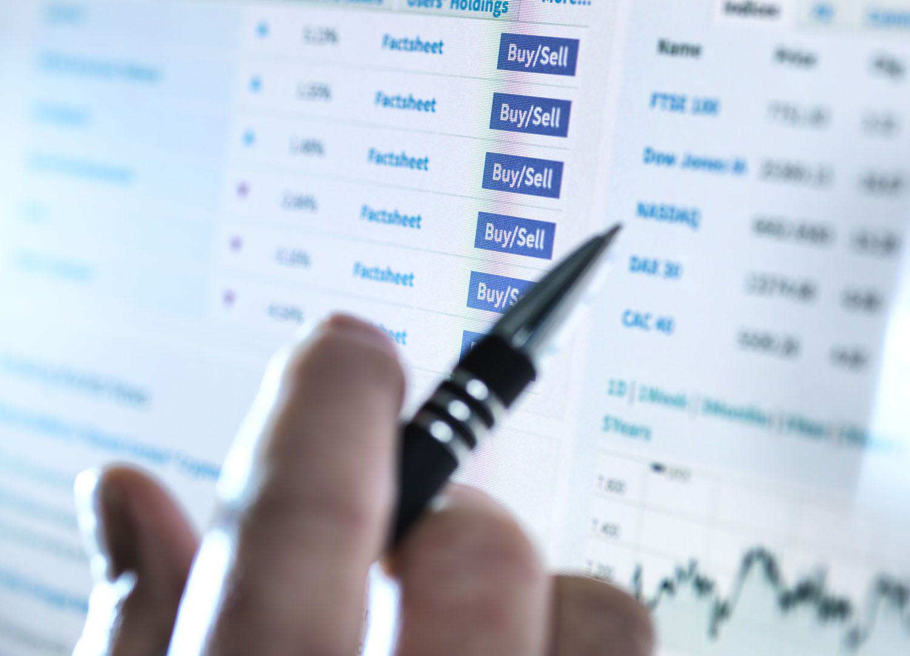

In today's dynamic financial landscape, investors are continually seeking effective strategies to maximize returns while managing risks. Investment strategies have evolved significantly, driven by technological advancements and changing market conditions. Among various approaches, active investing and algorithmic trading have gained significant prominence in recent years.

Active investing is characterized by a proactive approach, where investors actively manage their portfolios by making frequent buy-and-sell decisions based on market trends, economic indicators, and individual stock performance. This hands-on strategy aims to outperform market indices by identifying short-term opportunities, adapting quickly to market changes, and exploiting inefficiencies. The decision-making process in active investing often involves extensive research and market analysis.

Algorithmic trading, also known as algo trading, has transformed traditional approaches to trading and market participation by integrating technology. It employs sophisticated computer algorithms to execute trades based on predefined criteria such as timing, price, and volume. Algorithms can process vast amounts of data far more efficiently than human traders, facilitating rapid decision-making and execution. This approach offers the advantage of eliminating emotional decision-making, enhancing precision, and enabling complex strategies across multiple markets.

The integration of technology in investing has brought about a paradigm shift, allowing investors to harness the power of data and automation. By understanding both active investing and algorithmic trading, investors can better position themselves to capitalize on market opportunities and optimize their financial market activities in the modern era. With the evolving landscape, it is crucial for investors to remain informed and adaptable, leveraging these strategies to navigate the complexities of today's financial markets.

## Table of Contents

## Understanding Investment Strategies

Investment strategies are structured plans designed to achieve specific financial objectives. These strategies vary in their approach and risk tolerance, with options ranging from passive to dynamic and active. These varied strategies reflect the diverse goals and risk profiles of investors seeking to optimize their returns in the financial markets.

Passive strategies, such as the buy-and-hold approach, involve purchasing stocks or other assets with the intention of keeping them over the long term, regardless of market fluctuations. This strategy aims to reduce transaction costs and minimize the impact of market volatility by focusing on the long-term appreciation potential of the investments. Buy-and-hold is often considered lower risk and suitable for investors seeking stable returns over time without the need for frequent market monitoring.

Active investing, conversely, is hands-on and involves regularly buying and selling stocks to take advantage of short-term price movements. Investors employing this strategy analyze market trends and economic indicators to make informed decisions and potentially achieve higher returns. This approach can offer significant gains but also involves higher transaction costs and risks associated with frequent trading. It requires substantial time and expertise, as investors need to stay informed about market developments and adjust their portfolios accordingly.

Algorithmic trading adds another dimension to investment strategies by leveraging technology to execute trades. This method uses advanced computer algorithms to perform trades based on predefined criteria such as timing, price, and [volume](/wiki/volume-trading-strategy). These algorithms can operate at high speeds and volumes, allowing for precise and efficient execution of trading strategies. The use of algorithms eliminates emotional decision-making, delivering consistent results and enabling traders to react swiftly to market changes.

Both active investing and [algorithmic trading](/wiki/algorithmic-trading) serve distinct roles in the financial markets, catering to different investor needs and objectives. Active investing is well-suited for those seeking potentially higher returns through strategic management and analysis, while algorithmic trading appeals to investors looking for efficient execution and the potential to capitalize on high-frequency trading opportunities. Depending on their financial goals and risk tolerance, investors may choose one strategy over the other or a combination of both to best fulfill their investment objectives.

## Active Investing: Overview, Benefits, and Limitations

Active investing is characterized by a proactive management approach, where investment decisions are made based on in-depth analysis of market trends and economic indicators. This investment strategy involves frequent buying and selling, as investors adapt to market movements to maximize profits. 

The primary benefit of active investing is the potential for higher returns. By making informed decisions, investors can take advantage of market inefficiencies and capitalize on short-term price fluctuations. Strategies like swing trading, which involves holding stocks for days or weeks to profit from expected price movements, exemplify how active investors seek to exploit market [volatility](/wiki/volatility-trading-strategies). Active investing also allows for tailored risk management, as investors can swiftly adjust their portfolios in response to current market conditions and economic forecasts.

Despite these potential benefits, active investing has limitations. One significant drawback is the higher transaction costs associated with frequent trading. Each transaction incurs costs such as commissions and taxes, which can eat into profits. Additionally, successful active investing requires extensive market knowledge and a substantial time commitment to analyze data and monitor market developments continuously.

Investors must weigh these benefits and costs to determine if active investing aligns with their financial goals. It requires a careful consideration of one's investment objectives, risk tolerance, and the resources available for research and analysis. Those considering active investing should assess whether the potential for higher returns justifies the increased effort and costs compared to more passive strategies.

## Algorithmic Trading: Definition, Advantages, and Risks

Algorithmic trading, often referred to as algo trading, employs sophisticated computer algorithms to execute trades at rapid speeds with the goal of ensuring precision and efficiency. This trading method leverages the power of technology and mathematical models to make transactions swiftly, thereby seizing market opportunities that present themselves for mere seconds.

One of the primary advantages of algorithmic trading is its speed. The capability of computers to process large volumes of data and execute trades in fractions of a second far surpasses human capabilities. This rapid execution minimizes the impact of latency and can be crucial in high-frequency trading environments where timing is paramount. Additionally, algorithms eliminate the emotional bias often observed in manual trading. Emotional decision-making can lead to inconsistent results, whereas algorithms follow predefined sets of rules, ensuring consistency and potentially improving the reliability of trading outcomes.

Another significant advantage is the ability to execute complex strategies across multiple markets simultaneously. Algorithms can be programmed to monitor several markets and asset classes, allowing for diversification and the potential reduction of risks associated with a concentrated portfolio. This multi-market approach can lead to better risk management and opens opportunities for [arbitrage](/wiki/arbitrage), where traders capitalize on price discrepancies between different markets.

Despite these advantages, algorithmic trading carries inherent risks. Technical failures, including software bugs or hardware malfunctions, can lead to significant financial losses. For instance, a malfunctioning algorithm could execute erroneous trades that result in substantial exposure or losses. Furthermore, regulatory compliance poses a challenge, as algorithmic traders must adhere to stringent market regulations intended to maintain fair and orderly markets.

The risk of over-optimization is another concern in algorithmic trading. Over-optimizing an algorithm on historical data might result in a model that performs well on past data but fails to adapt to future market conditions. This phenomenon, known as overfitting, highlights the importance of robust data analysis and thorough testing before deploying any algorithm in live markets.

To mitigate these risks, market participants should ensure rigorous [backtesting](/wiki/backtesting) and validation of algorithms. This involves simulating the trading strategy using historical data to evaluate its performance and refine its parameters. Additionally, continuous monitoring and regular updates of the algorithms can help adjust to changing market dynamics and maintain efficiency.

In conclusion, while algorithmic trading can offer significant advantages in speed and consistency, it requires careful consideration of technical and regulatory risks. A diligent approach to algorithm testing and risk management is essential for leveraging the benefits of this advanced trading strategy.

## Integrating Active and Algorithmic Strategies

Many sophisticated investors employ a combination of active and algorithmic strategies to enhance their market participation. This hybrid approach allows investors to benefit from the strengths of both methodologies. Active fund managers, in particular, use algorithms not only for optimal execution of trades but also to maintain an active oversight of market trends. By doing so, they can manage large datasets, identify patterns, and execute trades with precision at speeds beyond human capability.

The integration of active and algorithmic strategies offers strategic flexibility. Investors can switch strategies based on evolving market dynamics and specific objectives. For instance, during periods of market volatility, an investor might rely more heavily on algorithmic trading to capitalize on rapid price changes; conversely, in more stable conditions, they may prefer active strategies to fine-tune their portfolios according to in-depth analyses of company fundamentals and economic indicators.

Harnessing the strengths of both approaches allows investors to achieve a more balanced portfolio. Technology is leveraged to perform high-frequency trading and complex arbitrage strategies, while human judgment is applied to interpret broader economic and geopolitical developments that might affect market sentiment. 

A key [factor](/wiki/factor-investing) in the successful integration of active and algorithmic strategies is continuous learning and adaptation. Financial markets are ever-evolving, and so are the technologies and algorithms that support them. Investors need to remain informed about the latest developments in [machine learning](/wiki/machine-learning), data analytics, and real-time processing to continuously refine and enhance their trading strategies. 

Overall, this synergy between human expertise and machine efficiency presents a powerful opportunity for investors to navigate financial markets with greater agility and insight. As technology continues to advance, investors who effectively integrate these strategies are likely to be better positioned in the competitive landscape of modern finance.

## Conclusion

Investment strategies in modern financial markets are increasingly shaped by a synergy of active management and technological innovations. This combination allows investors to adapt quickly to changing market conditions while leveraging systematic approaches to optimize returns. Active investing and algorithmic trading provide distinct advantages, both of which can be customized to meet individual investor needs and broader market expectations.

Active investing enables investors to make informed decisions based on current market trends and economic indicators. This approach offers the agility to exploit short-term opportunities and adjust to unforeseen market events. On the other hand, algorithmic trading capitalizes on computational power to execute trades with precision and speed, minimizing human emotions from the decision-making process. This method facilitates the implementation of complex trading strategies and provides diversification across different markets.

The effectiveness of an investment strategy largely depends on its alignment with the investor's goals, risk tolerance, and technological capacity. Investors must assess whether they are seeking the hands-on, potentially higher-reward approach of active management or the systematic, data-driven advantage offered by algorithmic trading. This alignment ensures that strategies are not only feasible but also efficient in achieving desired financial outcomes.

As financial landscapes evolve, maintaining awareness and adaptability is crucial for investors aiming to leverage new opportunities. The dynamic nature of markets, alongside rapid technological advancements, necessitates a continuous commitment to learning and strategy refinement. Those investors who thoroughly understand the interplay between active management and technological tools are better positioned to navigate the complexities of today's, and tomorrow's, financial environments.

By integrating these strategies, investors can achieve a more balanced portfolio, harnessing the strategic foresight of active management with the operational efficiency of algorithmic trading. This strategic blend not only enhances market participation but also builds investor confidence in managing risks and capitalizing on market opportunities.

## References & Further Reading

[1]: Bergstra, J., Bardenet, R., Bengio, Y., & Kégl, B. (2011). ["Algorithms for Hyper-Parameter Optimization."](https://dl.acm.org/doi/10.5555/2986459.2986743) Advances in Neural Information Processing Systems 24.

[2]: ["Advances in Financial Machine Learning"](https://www.amazon.com/Advances-Financial-Machine-Learning-Marcos/dp/1119482089) by Marcos Lopez de Prado

[3]: ["Evidence-Based Technical Analysis: Applying the Scientific Method and Statistical Inference to Trading Signals"](https://books.google.com/books/about/Evidence_Based_Technical_Analysis.html?id=jbD47VkOHAEC) by David Aronson

[4]: ["Machine Learning for Algorithmic Trading"](https://github.com/stefan-jansen/machine-learning-for-trading) by Stefan Jansen

[5]: ["Quantitative Trading: How to Build Your Own Algorithmic Trading Business"](https://www.amazon.com/Quantitative-Trading-Build-Algorithmic-Business/dp/1119800064) by Ernest P. Chan