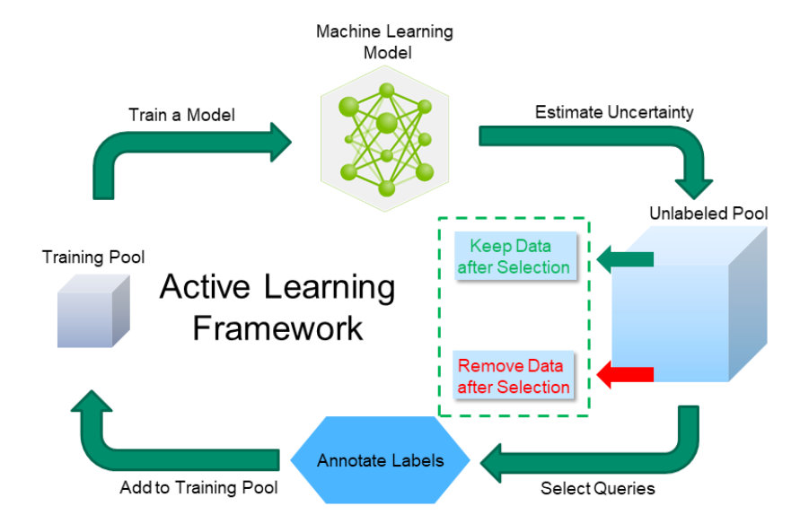

## Table of Contents

## What is Active Learning in the context of machine learning?

Active Learning is a special way of training machine learning models where the model gets to choose which data it wants to learn from. Instead of using all the data available, the model asks for more information about the data it finds hard to understand. This helps the model learn better and faster because it focuses on the most useful information.

In Active Learning, a person or another system helps the model by giving it the specific information it asks for. This can save a lot of time and effort because the model doesn't need to look at data that won't help it improve. It's like a student asking the teacher for help on the hardest problems instead of trying to learn everything at once.

## How does Active Learning differ from traditional supervised learning?

Active Learning and traditional supervised learning are two ways to teach machines, but they work differently. In traditional supervised learning, the machine is given a big pile of data with correct answers. The machine looks at all this data and tries to learn from it. It doesn't get to choose which data to look at; it just goes through everything that's given to it. This can take a lot of time and might include a lot of data that doesn't help the machine learn much.

On the other hand, Active Learning lets the machine pick which data it wants to see. The machine looks at some data and then asks for more information about the parts it finds confusing. This means it can learn faster because it focuses on the most important information. A person or another system helps by giving the machine the specific information it asks for. This way, the machine doesn't waste time on data that won't help it improve.

## What are the main benefits of using Active Learning?

Active Learning helps machines learn faster and better. When a machine uses Active Learning, it can pick the data it needs to understand better. This means it doesn't have to go through a lot of data that isn't very useful. Instead, it can focus on the hard parts and learn more quickly. This saves time and makes the machine smarter because it's learning exactly what it needs.

Another benefit is that Active Learning can save money and effort. In traditional learning, people might have to label a huge amount of data, which can be expensive and time-consuming. With Active Learning, the machine asks for help only when it needs it, so people only need to label the most important data. This makes the whole process more efficient and less costly.

## What types of Active Learning strategies exist?

There are different ways machines can use Active Learning to pick the data they want to learn from. One way is called "uncertainty sampling." In this method, the machine looks at the data it already knows and picks the pieces it's not sure about. It asks for more information about those pieces so it can learn better. Another way is called "query by committee." Here, several different models work together. They vote on which data they think is most important, and the machine asks for more information about the data they disagree on the most.

Another strategy is called "expected model change." In this method, the machine tries to guess how much it will learn from each piece of data. It picks the data that it thinks will help it improve the most. There's also "variance reduction," where the machine tries to pick data that will make its predictions more consistent. Each of these strategies helps the machine focus on the most useful information, so it can learn faster and better.

## Can you explain the concept of uncertainty sampling in Active Learning?

Uncertainty sampling is a way for a machine to choose which data it wants to learn from in Active Learning. Imagine you're studying for a test, and you're not sure about some questions. You'd want to focus on those questions to get better, right? That's what uncertainty sampling does. The machine looks at the data it has and picks the parts it's not sure about. It asks for more information about those parts so it can learn better.

This method helps the machine improve faster because it focuses on the data it finds hard to understand. Instead of going through all the data, which might include a lot of easy stuff, the machine can spend its time on the tricky parts. By doing this, the machine can become smarter and better at its job more quickly.

## How does query-by-committee work in Active Learning?

Query-by-committee is a way for a machine to choose which data it wants to learn from in Active Learning. Imagine you have a group of friends, and you're trying to decide which movie to watch. If your friends all agree on one movie, you might not need to think about it much. But if they all have different opinions, you'd want to find out more about the movie they disagree on. That's what query-by-committee does. It uses several different models, like a committee of friends, and they vote on which data is most important. The machine then asks for more information about the data that the models disagree on the most.

This method helps the machine learn better because it focuses on the data that's hard to understand. When the models disagree, it means the data is tricky, and the machine needs more information to get it right. By asking for help on these tricky parts, the machine can improve faster and become smarter at its job.

## What role does the oracle play in Active Learning?

In Active Learning, the oracle is like a helpful teacher for the machine. The machine asks the oracle for more information about the data it finds hard to understand. The oracle can be a person or another system that knows the correct answers. When the machine is unsure about something, it tells the oracle, and the oracle gives it the right information. This helps the machine learn faster because it focuses on the most important data.

The role of the oracle is very important because it makes Active Learning work well. Without the oracle, the machine wouldn't know which data to ask about. The oracle helps by giving the machine exactly what it needs to improve. This saves time and effort because the machine doesn't have to look at data that won't help it learn. By working together, the machine and the oracle can make the learning process more efficient and effective.

## How can Active Learning be applied to reduce labeling costs in large datasets?

Active Learning can help save money and time when you have a big pile of data to label. In traditional ways, you might need to label all the data, which can be expensive and take a long time. But with Active Learning, the machine picks the data it's not sure about and asks for help only on those parts. This means you don't have to label everything, just the most important bits that the machine needs to learn from. This way, you can save a lot of money because you're not paying people to label data that the machine doesn't need.

The machine in Active Learning works smarter, not harder. It looks at the data and decides which parts are the trickiest. Then, it asks the oracle, which could be a person or another system, to label just those tricky parts. This makes the whole process more efficient because the machine is focusing on what it needs to get better. By doing this, you can label less data but still help the machine learn a lot, which saves both time and money.

## What are some common challenges faced when implementing Active Learning?

One big challenge when using Active Learning is figuring out which data the machine should ask about. The machine needs to pick the right pieces of data to learn from, but this can be hard. If it picks the wrong data, it might not learn as well as it could. Also, the machine might ask for too much help, which can make the process slow and expensive. Finding the right balance is tricky and can take a lot of time to get right.

Another challenge is making sure the oracle, or the person helping the machine, can give good answers quickly. If the oracle is slow or doesn't know the right answers, the machine won't learn as fast as it should. This can make the whole Active Learning process less effective. It's important to have a good oracle that can keep up with the machine's questions and give accurate information.

Lastly, Active Learning can be hard to set up and use, especially if you're not used to it. It needs special tools and ways of working that might be different from what you're used to. This can make it harder to start using Active Learning and can take time to learn how to do it well. But once you get the hang of it, Active Learning can be a great way to help machines learn faster and better.

## How do you evaluate the performance of an Active Learning system?

Evaluating the performance of an Active Learning system means checking how well it's doing its job. You want to see if the machine is learning faster and better than it would with regular learning. One way to do this is by looking at how accurate the machine's answers are. You can compare the machine's answers to the right answers and see how often it gets things right. Another way is to see how quickly the machine improves. If the machine is asking for help on the right data and getting better fast, that's a good sign.

Another thing to think about is how much time and money the Active Learning system is saving. You can compare how much it costs to label data with Active Learning to how much it would cost without it. If Active Learning is saving a lot of time and money, that's a big plus. You can also look at how often the machine needs help from the oracle. If it's asking for help less often but still improving, that means it's working well. By looking at these things, you can tell if the Active Learning system is doing a good job.

## Can you discuss advanced techniques like multi-class Active Learning?

Multi-class Active Learning is a way to help machines learn when they have to tell apart more than two things. Imagine you're sorting different kinds of fruit like apples, oranges, and bananas. In regular Active Learning, the machine might focus on telling apples from not-apples. But in multi-class Active Learning, the machine tries to figure out if something is an apple, an orange, or a banana. It picks the data it's not sure about for all these different kinds of fruit and asks for help on those parts. This way, the machine can learn to tell all the fruits apart faster and better.

One challenge with multi-class Active Learning is that it can be hard for the machine to know which data to ask about. There are more choices, so the machine needs to be smart about [picking](/wiki/asset-class-picking) the right data to learn from. It might use special ways like looking at how unsure it is about each kind of fruit or asking a group of models to help decide. By doing this, the machine can focus on the most important information and improve its ability to sort all the different kinds of fruit correctly.

## What are the future trends and research directions in Active Learning?

In the future, Active Learning might get even better at picking the right data to learn from. Researchers are working on new ways for machines to decide which data is most important. They're looking at using special math and computer tricks to help machines learn faster. They also want to make Active Learning work well with new kinds of data, like pictures and sounds. This could help machines understand the world around them better and make them more useful in things like self-driving cars or smart home devices.

Another big thing in Active Learning research is making it easier to use. Right now, setting up an Active Learning system can be hard and take a lot of time. But researchers are trying to make tools that are easier to use, so more people can try Active Learning. They're also looking at how to make Active Learning work well with other smart computer tricks, like [deep learning](/wiki/deep-learning). By putting these things together, machines might be able to learn even faster and better, and help us solve more problems in the future.

## References & Further Reading

[1]: Settles, B. (2011). ["Active Learning Literature Survey."](https://burrsettles.com/pub/settles.activelearning.pdf) University of Wisconsin-Madison.

[2]: Lopez de Prado, M. (2018). ["Advances in Financial Machine Learning."](https://books.google.com/books/about/Advances_in_Financial_Machine_Learning.html?id=oU9KDwAAQBAJ) Wiley.

[3]: Jansen, S. (2020). ["Machine Learning for Algorithmic Trading: Predictive models to extract signals from market and alternative data for systematic trading strategies with Python, 2nd Edition."](https://www.amazon.com/Machine-Learning-Algorithmic-Trading-alternative/dp/1839217715) Packt Publishing.

[4]: Aronson, D. (2007). ["Evidence-Based Technical Analysis: Applying the Scientific Method and Statistical Inference to Trading Signals."](https://www.amazon.com/Evidence-Based-Technical-Analysis-Scientific-Statistical/dp/0470008741) Wiley.

[5]: Chan, E. (2009). ["Quantitative Trading: How to Build Your Own Algorithmic Trading Business."](https://github.com/ftvision/quant_trading_echan_book) Wiley.

[6]: Freund, Y., & Schapire, R. E. (1997). ["A Decision-Theoretic Generalization of on-Line Learning and an Application to Boosting."](https://www.sciencedirect.com/science/article/pii/S002200009791504X) Journal of Computer and System Sciences.

[7]: Broderick, T., Boyd, N., Wibisono, A., Wilson, A. C., & Jordan, M. I. (2013). ["Streaming Variational Bayes."](https://arxiv.org/abs/1307.6769) Advances in Neural Information Processing Systems 26.