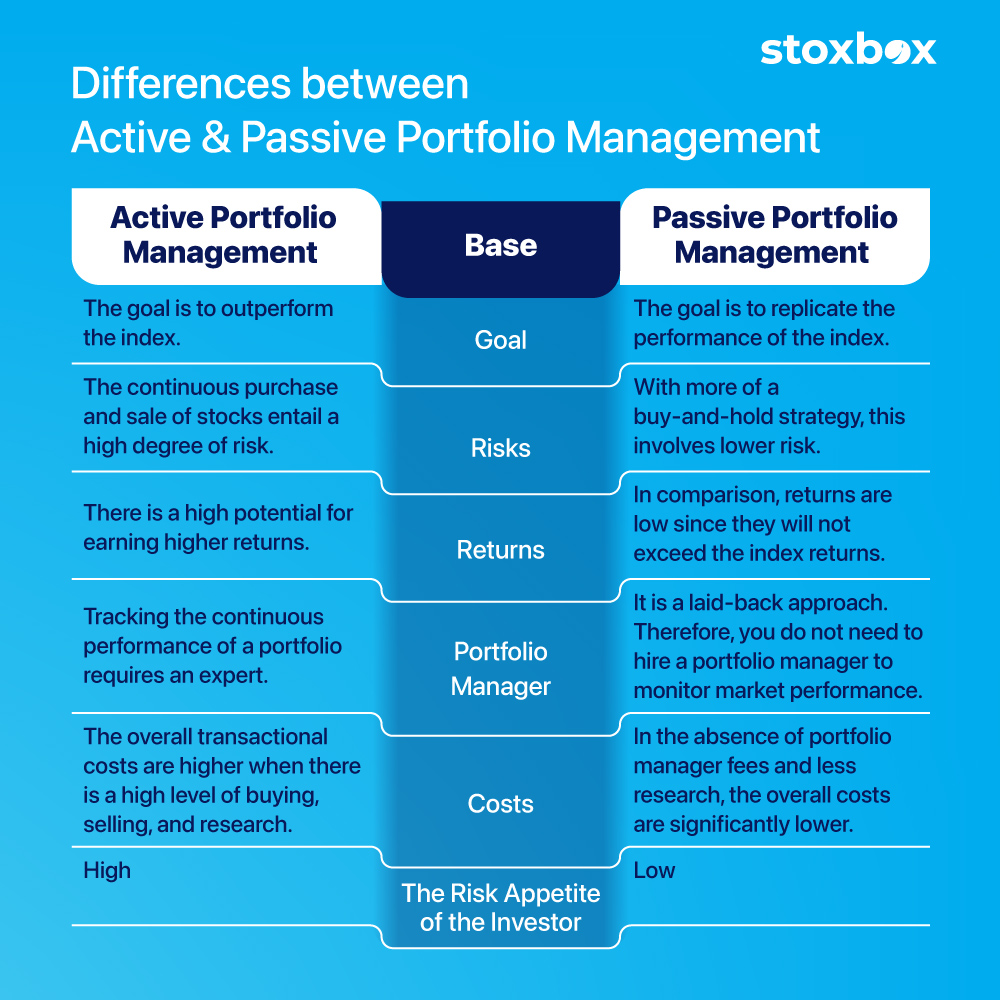

## Table of Contents

## What is active management in investment?

Active management in investment is when a person or a team, called a portfolio manager, actively makes decisions about which stocks, bonds, or other investments to buy or sell. They do this to try to beat the market or achieve better returns than a standard benchmark, like the S&P 500. This approach requires a lot of research, analysis, and sometimes quick decision-making to take advantage of market opportunities or to avoid risks.

The goal of active management is to outperform a passive investment strategy, where investments are simply held in an index fund that tracks the market. Active managers use their expertise and knowledge to pick investments they believe will do better than the overall market. However, this approach can be more expensive due to higher management fees and trading costs, and it doesn't always guarantee better returns.

## How does active management differ from passive management?

Active management and passive management are two different ways to handle investments. Active management means that a person or a team, called a portfolio manager, is always working to pick the best stocks, bonds, or other investments. They do a lot of research and make changes to the portfolio often, trying to do better than the overall market. This can cost more because of the fees for the manager's work and the costs of buying and selling investments.

Passive management is simpler and usually costs less. Instead of trying to beat the market, passive management follows it. This is often done by investing in index funds, which are baskets of investments that match a market index like the S&P 500. The idea is to get the same returns as the market, not more. Because passive management doesn't need as much work, the fees are lower, and there's less buying and selling of investments.

The main difference between the two is their goal and how they work. Active management tries to beat the market by making smart choices, while passive management aims to match the market's performance with less effort and cost. Both approaches have their own benefits and risks, and which one is better can depend on what an investor wants and how much they're willing to pay.

## What are the main goals of active management?

The main goal of active management is to beat the market. This means that the people managing the investments, called portfolio managers, try to pick stocks, bonds, or other investments that will do better than the overall market. They use their knowledge and research to find these investments and hope to get higher returns for the people who invest with them.

Another goal of active management is to take advantage of market opportunities and avoid risks. Portfolio managers watch the market closely and make quick decisions to buy or sell investments. They think they can do better than just following the market by being active and making changes to the portfolio when needed. This approach can be more exciting but also more costly because of the fees and the work involved.

## Who typically uses active management strategies?

People who use active management strategies are often those who want to try to get more money from their investments than what the market usually gives. These can be rich people who have a lot of money to invest, or it can be big groups like pension funds or insurance companies that need to grow their money. They believe that by paying for someone smart to pick the best investments, they can do better than just following the market.

Also, some investors who like to take more risks might choose active management. They enjoy the excitement of trying to beat the market and are okay with the higher costs that come with it. These investors might change their investments a lot, hoping to find the best opportunities and avoid big losses. Active management can be a good fit for them because it matches their way of investing and their goals.

## What are the common techniques used in active management?

In active management, portfolio managers use several techniques to try to beat the market. One common technique is stock [picking](/wiki/asset-class-picking), where they choose specific stocks they believe will do better than others. They do a lot of research to find companies that might grow a lot or are undervalued. Another technique is market timing, where managers try to predict when the market will go up or down and make changes to their investments based on these predictions. They might buy more stocks when they think the market will go up or sell them when they think it will go down.

Another technique is sector rotation, where managers move money from one part of the market to another. They might put more money into technology stocks if they think that sector will do well, and less into energy stocks if they think that sector will struggle. Managers also use risk management strategies to protect the portfolio. This can include using options or other financial tools to limit losses if the market goes down. All these techniques require a lot of work and knowledge, but the goal is to do better than just following the market.

## How do active managers select securities?

Active managers select securities by doing a lot of research. They look at many different things like how much money a company makes, how fast it is growing, and if its stock price is a good deal. They also pay attention to what is happening in the world and how it might affect different companies. By understanding all these details, they try to find stocks or other investments that they think will do better than the overall market. They might pick a company because they believe it will grow a lot or because they think its stock price is too low and will go up soon.

Another way active managers choose securities is by using special tools and strategies. They might use computers to help them find patterns in how stock prices move or to predict what might happen next. Some managers also use financial products like options to protect their investments from big drops in the market. They might also decide to put more money into certain types of businesses, like technology or health care, if they think those areas will do well in the future. All these methods help active managers try to pick the best investments and do better than just following the market.

## What are the risks associated with active management?

Active management comes with several risks. One big risk is that it might not beat the market. Even though active managers do a lot of work to pick the best investments, they can still make mistakes. If they choose the wrong stocks or make bad predictions about the market, the investments might not do as well as just following the market. This means that the extra work and higher fees might not be worth it if the returns are not better.

Another risk is the cost. Active management usually costs more than passive management because of the fees for the managers' work and the costs of buying and selling investments often. These higher costs can eat into the returns, making it harder to do better than the market. If the returns are only a little bit better, or not better at all, the extra costs can make active management a worse choice than a cheaper, passive approach.

There's also the risk of making quick decisions. Active managers often need to act fast to take advantage of opportunities or to avoid risks. But quick decisions can lead to mistakes, especially if the market changes suddenly. If a manager sells too soon or buys at the wrong time, it can hurt the portfolio's performance. This risk of making errors in a fast-moving market is something investors need to think about when choosing active management.

## How can the performance of active management be measured?

The performance of active management can be measured by comparing the returns of the actively managed portfolio to a benchmark, like the S&P 500. If the portfolio does better than the benchmark, the active management is considered successful. For example, if the S&P 500 goes up by 10% in a year, but the actively managed portfolio goes up by 12%, the manager has beaten the market. This comparison helps investors see if the extra work and higher costs of active management are worth it.

Another way to measure performance is by looking at risk-adjusted returns. This means seeing how much risk the manager took to get those returns. A common measure for this is the Sharpe Ratio, which looks at the return of the portfolio compared to a risk-free investment, like a government bond, and adjusts it for the amount of risk taken. A higher Sharpe Ratio means the manager did a good job of getting good returns without taking too much risk. By using these measures, investors can better understand if the active management strategy is working well for them.

## What are the costs involved in active management?

Active management costs more than passive management. One big cost is the management fee, which is what you pay the portfolio manager for their work. These fees can be higher because active managers spend a lot of time doing research and making decisions about which investments to buy or sell. Another cost is trading fees, which come from buying and selling investments often. Active managers trade more than passive managers, so these costs can add up.

Another cost to think about is the cost of not doing as well as the market. If the active manager doesn't beat the market, the extra fees and costs might make your returns worse than if you had just followed the market with a cheaper, passive approach. So, even though you're paying more for active management, you might end up with less money if the manager doesn't do a good job. It's important to weigh these costs against the possible benefits when deciding if active management is right for you.

## How does market efficiency impact the success of active management?

Market efficiency is about how well the prices of stocks and other investments show all the information that's out there. If a market is very efficient, it means that prices quickly change to reflect new news or data. This makes it hard for active managers to find stocks that are priced too low or too high because the market already knows a lot. So, in a very efficient market, active managers might struggle to beat the market because they can't find those special deals as easily.

But if a market is not so efficient, active managers might have a better chance. In less efficient markets, prices might not change as quickly or completely to new information. This gives active managers more opportunities to find stocks that are undervalued or overvalued. They can use their research and skills to pick these stocks and maybe do better than the market. So, the level of market efficiency can really affect how well active management works.

## Can you provide examples of successful active management strategies?

One example of successful active management is the strategy used by Warren Buffett at Berkshire Hathaway. Buffett is famous for picking stocks that he thinks are undervalued and holding them for a long time. He looks for companies that have strong businesses and good management. Over the years, his strategy has beaten the market many times. For example, from 1965 to 2022, Berkshire Hathaway's stock grew much faster than the S&P 500. This shows that active management can work well if you pick the right stocks and are patient.

Another example is the strategy used by the Fidelity Magellan Fund under Peter Lynch. From 1977 to 1990, Lynch managed the fund and did very well. He used a strategy called "growth at a reasonable price," where he looked for companies that were growing but still had a good price. He also paid a lot of attention to what was happening in the world and how it might affect different companies. During his time, the fund beat the market a lot, showing that active management can be successful if you do your research and make smart choices.

## What advanced tools and technologies are used by expert active managers?

Expert active managers use advanced tools like computers and special software to help them pick the best investments. These tools can look at a lot of information very quickly, like how stock prices move or what people are saying about a company online. They use this information to find patterns and make predictions about what might happen next in the market. Some managers also use something called "big data," which means they look at huge amounts of information from many different places to find hidden opportunities. These tools help managers make better decisions and try to beat the market.

Another important technology that active managers use is called [algorithmic trading](/wiki/algorithmic-trading). This is when they use computers to buy and sell investments based on rules they set up. The computers can do this very fast, sometimes in just a few seconds, which can help managers take advantage of small changes in the market. Active managers also use other financial tools like options and futures to protect their investments from big drops in the market. These advanced technologies and tools help active managers work smarter and try to get better returns for their investors.

## References & Further Reading

[1]: Bergstra, J., Bardenet, R., Bengio, Y., & Kégl, B. (2011). ["Algorithms for Hyper-Parameter Optimization."](https://dl.acm.org/doi/10.5555/2986459.2986743) Advances in Neural Information Processing Systems 24.

[2]: ["Advances in Financial Machine Learning"](https://www.amazon.com/Advances-Financial-Machine-Learning-Marcos/dp/1119482089) by Marcos Lopez de Prado

[3]: ["Evidence-Based Technical Analysis: Applying the Scientific Method and Statistical Inference to Trading Signals"](https://www.amazon.com/Evidence-Based-Technical-Analysis-Scientific-Statistical/dp/0470008741) by David Aronson

[4]: ["Machine Learning for Algorithmic Trading"](https://github.com/stefan-jansen/machine-learning-for-trading) by Stefan Jansen

[5]: ["Quantitative Trading: How to Build Your Own Algorithmic Trading Business"](https://www.amazon.com/Quantitative-Trading-Build-Algorithmic-Business/dp/1119800064) by Ernest P. Chan