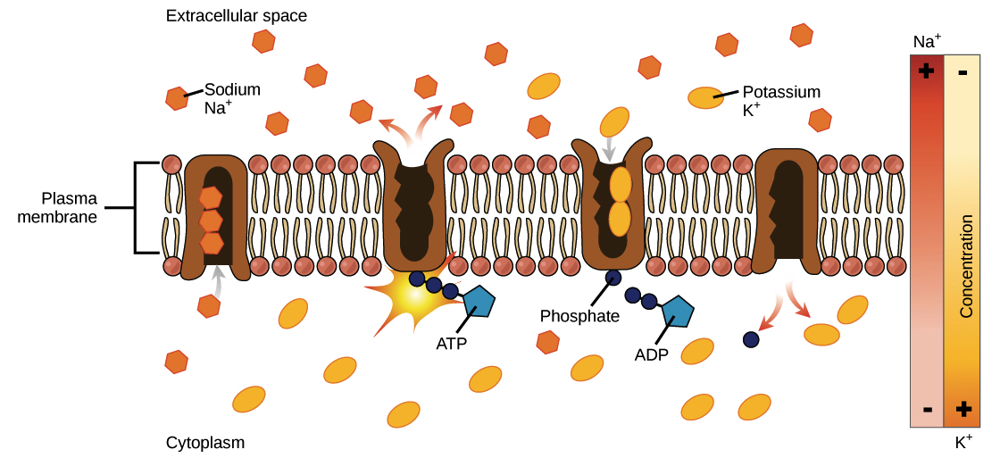

## Table of Contents

## What is active return?

Active return is the difference between the return of an investment portfolio and the return of a benchmark index. It shows how much better or worse a portfolio is doing compared to a standard like the S&P 500. If a portfolio's return is higher than the benchmark, the active return is positive. If it's lower, the active return is negative.

This measure is important for investors who want to see if their fund manager is adding value. By looking at active return, they can decide if the extra costs of active management are worth it. For example, if a portfolio has an active return of 2%, it means it did 2% better than the benchmark. This helps investors make better choices about where to put their money.

## How is active return calculated?

Active return is calculated by taking the return of an investment portfolio and subtracting the return of a benchmark index from it. For example, if your portfolio made a 10% return and the benchmark index made an 8% return, the active return would be 10% minus 8%, which equals 2%. This 2% is the extra return you got from your portfolio compared to the benchmark.

This calculation helps investors see if their portfolio is doing better or worse than a standard like the S&P 500. If the active return is positive, it means the portfolio did better than the benchmark. If it's negative, the portfolio did worse. Knowing the active return is important because it shows if the extra effort and costs of managing an active portfolio are worth it.

## What is the difference between active return and total return?

Active return and total return are two different ways to measure how well an investment is doing. Total return is the full amount of money you make from an investment, including any interest, dividends, and changes in the price of the investment. It shows the overall performance of your investment over a certain time. For example, if you bought a stock for $100 and it's now worth $110, plus you got $5 in dividends, your total return would be 15%.

Active return, on the other hand, compares your investment's performance to a benchmark, like the S&P 500. It tells you how much better or worse your investment did compared to this standard. To find the active return, you take your investment's total return and subtract the benchmark's return. If your investment's total return was 15% and the benchmark's return was 10%, your active return would be 5%. This helps you see if your investment choices are beating the market.

## Why is active return important for investors?

Active return is important for investors because it shows how well their investment choices are doing compared to a standard like the S&P 500. If an investor's portfolio has a positive active return, it means their investments are doing better than the benchmark. This can help them feel confident that their investment strategy is working well. On the other hand, if the active return is negative, it means their investments are not doing as well as the benchmark, which might make them think about changing their strategy.

Knowing the active return also helps investors decide if it's worth paying extra for active management. Active management means someone is actively choosing and managing investments, which can cost more than just following a benchmark. If the active return is high, it might be worth the extra cost because the portfolio is doing much better than the benchmark. But if the active return is low or negative, the extra costs might not be worth it, and the investor might be better off with a cheaper, passive investment that just follows the benchmark.

## Can you explain the concept of a benchmark in relation to active return?

A benchmark is like a standard that investors use to see how well their investments are doing. It's usually a well-known index, like the S&P 500, which represents a big part of the market. When investors want to know if their portfolio is doing well, they compare it to this benchmark. If their portfolio does better than the benchmark, they're happy because it means their investments are beating the market.

Active return is all about this comparison. It's the difference between the return of your portfolio and the return of the benchmark. If your portfolio's return is higher than the benchmark's return, you have a positive active return, which means you're doing better than the market. If it's lower, you have a negative active return, meaning you're not keeping up with the market. This helps investors see if their choices and the extra costs of managing their investments are worth it.

## How does active management contribute to active return?

Active management is when someone, like a fund manager, actively picks and manages investments to try to do better than a benchmark, like the S&P 500. They look at different stocks, bonds, or other investments and decide which ones to buy or sell. The goal is to make more money than if you just followed the benchmark. This active choosing and managing can lead to a higher active return if the manager makes good choices.

If the active manager picks investments that do better than the benchmark, the portfolio's return will be higher, leading to a positive active return. But, active management costs more because you're paying someone to do all this work. So, investors need to see if the extra money they're spending on active management is worth it. If the active return is high enough, it might be worth the extra cost. But if the active return is low or negative, it might be better to just follow the benchmark and save on costs.

## What are the common strategies used to achieve a positive active return?

One common strategy to achieve a positive active return is stock [picking](/wiki/asset-class-picking). This is when a fund manager looks at lots of different companies and tries to find the ones that will do better than the market. They might look at a company's financial health, how it's growing, and what's happening in the world that could affect it. If they pick stocks that do well, the portfolio's return can be higher than the benchmark's return, leading to a positive active return.

Another strategy is sector rotation. This means moving money between different parts of the economy, like technology or healthcare, based on what's happening in the world. If a fund manager thinks one part of the economy will do better than others, they might put more money into that part. If they guess right, the portfolio can do better than the benchmark, giving a positive active return.

A third strategy is market timing. This involves trying to guess when the market will go up or down and making investment choices based on that. If a fund manager thinks the market will go up, they might buy more stocks. If they think it will go down, they might sell stocks or buy safer investments. If they time the market well, their portfolio can beat the benchmark, leading to a positive active return.

## What are the risks associated with pursuing high active returns?

Trying to get high active returns can be risky. One big risk is that the investments might not do as well as expected. If a fund manager picks stocks that don't do well, the portfolio's return could be lower than the benchmark's return. This means the active return could be negative, and the investor could lose money. Also, active management costs more because you're paying someone to choose and manage the investments. If the active return isn't high enough, these extra costs can eat into the investor's profits.

Another risk is that the strategies used to get high active returns might not work. For example, if a manager tries to time the market and gets it wrong, the portfolio could lose value quickly. The same goes for sector rotation; if the manager puts money into a part of the economy that doesn't do well, the portfolio could suffer. These strategies can be hard to get right, and if they fail, the investor could end up with a lower return than if they had just followed the benchmark.

## How can active return be used to evaluate the performance of a portfolio manager?

Active return is a key way to see how well a portfolio manager is doing their job. It shows the difference between the return of the portfolio they manage and the return of a benchmark, like the S&P 500. If the active return is positive, it means the portfolio manager's choices are making more money than the market. This can help investors feel good about paying extra for the manager's work. But if the active return is negative, it means the portfolio isn't doing as well as the market, and investors might think about finding a new manager.

Using active return to evaluate a portfolio manager also helps investors see if the extra costs of active management are worth it. Active management can be expensive because the manager is actively choosing and managing investments. If the active return is high enough, these costs might be worth it because the portfolio is doing much better than the benchmark. But if the active return is low or negative, the extra costs might not be worth it, and investors might be better off with a cheaper, passive investment that just follows the benchmark.

## What role does market efficiency play in the potential for active return?

Market efficiency is about how well prices in the market reflect all the information available. If a market is very efficient, it means that the prices of stocks and other investments are already showing all the information people know. This makes it hard for portfolio managers to find stocks that are undervalued or overvalued because the prices are already right. So, in a very efficient market, it's tough to get a high active return because the market is hard to beat.

But if a market is not very efficient, there might be more chances to get a high active return. In these markets, prices might not show all the information, so a good portfolio manager could find stocks that are priced wrong. If they can pick these stocks well, their portfolio could do better than the benchmark, giving a positive active return. So, the level of market efficiency can really affect how easy or hard it is to get a high active return.

## How do different asset classes affect the possibilities for active return?

Different asset classes can change how easy or hard it is to get a high active return. Stocks, bonds, real estate, and commodities all have their own ways of behaving in the market. For example, the stock market can be very efficient, especially for big, well-known companies. This means it's hard to find stocks that are priced wrong, making it tough to get a high active return. But in less efficient markets, like small company stocks or some types of bonds, there might be more chances to find good deals and beat the benchmark.

Another thing to think about is how much information is available for each asset class. For stocks, there's a lot of information out there, so prices usually show what people know. This makes it harder to beat the market. But for asset classes like real estate or some commodities, there might not be as much public information. This can make these markets less efficient, giving active managers more chances to find investments that are priced wrong and get a high active return. So, the type of asset class can really affect how likely it is to beat the benchmark.

## What advanced statistical measures are used to analyze active return?

One advanced statistical measure used to analyze active return is the Information Ratio. This measure helps investors see how much better a portfolio is doing compared to a benchmark, while also taking into account how much the portfolio's returns move around. The Information Ratio is calculated by dividing the active return by the tracking error, which is how much the portfolio's returns differ from the benchmark's returns. A higher Information Ratio means the portfolio manager is doing a good job of beating the benchmark without taking too much risk.

Another measure is the Sharpe Ratio, which looks at the total return of a portfolio compared to a risk-free investment like a Treasury bond. While it doesn't directly measure active return, it helps investors understand if the extra return they're getting from their portfolio is worth the extra risk they're taking. By comparing the Sharpe Ratio of a portfolio to that of a benchmark, investors can see if the active management is adding value in terms of risk-adjusted returns. Both these measures help investors make smarter choices about their investments.

## What is Understanding Active Return?

Active return is a key measure in financial analysis that evaluates how well an investment performs compared to a benchmark index, like the S&P 500. It signifies the effectiveness of the investment's management, highlighting the extent to which strategic decisions contribute to outperforming the market. This measure is integral for fund managers to assess the success of their investment approaches, and it provides investors with insight into the added value of active management over passive investment strategies.

### Calculation of Active Return

Active return is calculated by subtracting the return of a benchmark from the return of the investment. If $R_i$ is the return on the investment, and $R_b$ is the benchmark return, then:

$$
\text{Active Return} = R_i - R_b
$$

There are two primary components of active return: security selection return and asset allocation return. 

**Security Selection Return:** This component assesses the effectiveness of choosing specific securities within a portfolio. It examines whether the chosen securities have outperformed those in the benchmark. Consider a scenario where a portfolio manager focuses on selecting technology stocks that outperform the technology segment of a benchmark index. The security selection return would measure the excess return attributed to these selections.

**Asset Allocation Return:** This evaluates the effectiveness of the distribution of assets across different categories, such as equities, bonds, or commodities, in comparison to the benchmark's allocation. For instance, if a fund manager overweighted equities relative to a benchmark during a rising market, the resulting outperformance would be captured in the asset allocation return.

### Significance in Evaluating Fund Managers

For fund managers, active return is a critical metric. It quantifies the value they create beyond what could be achieved by merely tracking the benchmark. Fund managers aim to deliver consistent positive active returns, which signal their adeptness at making strategic decisions, selecting winning securities, and appropriately allocating assets. Investors use active return to evaluate fund managers' proficiency and predict their future performance. Persistently high active returns increase a manager’s reputation and justify management fees.

### Practical Examples and Case Studies

To illustrate the application of active return, consider a mutual fund that achieved a 12% annual return, while the S&P 500 returned 9% over the same period. The active return for this fund would be 3%. This positive active return suggests effective management strategies and could indicate a successful security selection or asset allocation.

In another case, a [hedge fund](/wiki/hedge-fund-trading-strategies) might use quantitative models to adjust its portfolio dynamically, generating an active return of 4% over a high-yield bond index. Here, the active return could be attributed to timely asset allocation changes in response to [interest rate](/wiki/interest-rate-trading-strategies) fluctuations.

By analyzing both hypothetical and real-world examples, investors and analysts can recognize patterns in active returns and infer the impact of specific investment strategies.

In conclusion, understanding active return and its calculation is vital for assessing investment performance. It provides a detailed view of how well fund managers employ strategic management decisions to outperform standard benchmarks, offering valuable insights for investors aiming to enhance their portfolios.

## What is the Financial Analysis of Investment Performance?

Investment performance is evaluated using a range of metrics, each providing insight into different aspects of risk and return relative to a benchmark. Active return is often a focal point in this analysis, as it indicates how much an investment has outperformed or underperformed a chosen benchmark. However, comprehensive performance analysis also relies on several other key metrics, such as the Sharpe Ratio, beta, and standard deviation.

The Sharpe Ratio is a measure of risk-adjusted return, calculated by subtracting the risk-free rate from the portfolio's return and dividing the result by the standard deviation of the portfolio’s excess return. The formula is as follows:

$$
\text{Sharpe Ratio} = \frac{\text{Portfolio Return} - \text{Risk-Free Rate}}{\text{Standard Deviation of Portfolio's Excess Return}}
$$

This ratio helps determine how much excess return a portfolio (or investment) generates for each unit of risk taken. A higher Sharpe Ratio indicates better risk-adjusted performance, making it a valuable tool for comparing the risk-reward relationships of different investments or portfolios.

Beta, on the other hand, measures an investment's sensitivity to movements in the overall market. A beta greater than 1 indicates that the investment is expected to be more volatile than the market, while a beta less than 1 indicates lower [volatility](/wiki/volatility-trading-strategies). By assessing beta, investors can gauge the market risk associated with an investment, which aids in portfolio construction to meet specific risk preferences.

Standard deviation is another critical metric that gauges the amount of variation or [dispersion](/wiki/dispersion-trading) of a set of investment returns. A higher standard deviation indicates a wider range of potential investment returns, signifying higher volatility. By using standard deviation, investors can understand the variability of returns, which is crucial for risk assessment and management.

These metrics are interrelated in providing a holistic view of investment performance. For instance, a high-return investment might seem attractive but can have high volatility or correlation with the market, which are revealed by analyzing its Sharpe Ratio, standard deviation, and beta. By incorporating these metrics, financial analysts perform a nuanced evaluation that informs decision-making and strategy refinement. They help analysts identify strengths and weaknesses in investment portfolios, optimize asset allocation, and strategize for enhanced performance.

Financial analysts use these tools to perform comprehensive analyses that support informed decision-making, aiding investors in refining their strategies to maximize returns while controlling for risk. This detailed assessment facilitates the alignment of investment outcomes with the investor's risk tolerance and financial goals, ensuring a more sophisticated approach to portfolio management.

## How can we assess algorithmic trading performance?

Assessing [algorithmic trading](/wiki/algorithmic-trading) performance involves a detailed examination of various key performance metrics and the processes that contribute to the evaluation of trading strategies. Among the most frequently used metrics are the Sharpe Ratio, maximum drawdown, win rate, and profit [factor](/wiki/factor-investing). Each of these metrics sheds light on different facets of algorithmic trading, providing a comprehensive view of an algorithm's effectiveness.

The Sharpe Ratio is a measure of risk-adjusted return. It is calculated as:

$$
\text{Sharpe Ratio} = \frac{E[R_p - R_f]}{\sigma_p}
$$

where $E[R_p]$ is the expected return of the portfolio, $R_f$ is the risk-free rate, and $\sigma_p$ is the standard deviation of the portfolio's excess return. A higher Sharpe Ratio indicates a more desirable risk-adjusted performance.

Maximum drawdown represents the largest peak-to-trough loss observed in the portfolio's value before a new peak is achieved. It is crucial for understanding the worst-case scenario an algorithm might face and helps quantify the potential downside risk.

Win rate is the ratio of profitable trades to total trades. While a high win rate is generally desirable, it should be considered in conjunction with other metrics, such as profit factor, which is the ratio of gross profit to gross loss. A robust algorithm ideally demonstrates a high profit factor, indicating that profits significantly surpass losses.

Continuous evaluation of trading algorithms is vital for maintaining their viability. Algorithms must be monitored and adjusted as market conditions evolve. This process involves [backtesting](/wiki/backtesting) and forward testing. Backtesting involves applying a trading strategy to historical data to evaluate its potential effectiveness without risking actual capital. Here is a basic example using Python's pandas and numpy libraries:

```python
import pandas as pd
import numpy as np

# Assuming 'data' is a pandas DataFrame with daily returns in the column 'returns'
def calculate_sharpe_ratio(data):
    risk_free_rate = 0.01
    excess_return = data['returns'] - risk_free_rate / 252
    sharpe_ratio = np.mean(excess_return) / np.std(excess_return)
    annual_sharpe_ratio = sharpe_ratio * np.sqrt(252)
    return annual_sharpe_ratio

data = pd.DataFrame({'returns': np.random.randn(252) / 100})
print("Annual Sharpe Ratio:", calculate_sharpe_ratio(data))
```

Forward testing, or paper trading, applies the algorithm to real-time data without executing trades with actual capital. It serves as a bridge between backtesting and live trading, enabling traders to observe how an algorithm performs in current market conditions.

Tools and technologies play an essential role in monitoring and refining algo trading strategies. Platforms like QuantConnect, MetaTrader, and algo trading-specific software allow for the implementation and backtesting of strategies. These platforms often provide automated monitoring tools that help identify deviations in expected performance, facilitating timely adjustments to strategies.

The continuous evaluation and adjustment of algorithmic trading strategies ensure that they align with dynamic market conditions and optimize investment performance while managing risk effectively.

## References & Further Reading

[1]: Bergstra, J., Bardenet, R., Bengio, Y., & Kégl, B. (2011). ["Algorithms for Hyper-Parameter Optimization."](https://dl.acm.org/doi/10.5555/2986459.2986743) Advances in Neural Information Processing Systems 24.

[2]: ["Advances in Financial Machine Learning"](https://www.amazon.com/Advances-Financial-Machine-Learning-Marcos/dp/1119482089) by Marcos Lopez de Prado

[3]: ["Evidence-Based Technical Analysis: Applying the Scientific Method and Statistical Inference to Trading Signals"](https://www.amazon.com/Evidence-Based-Technical-Analysis-Scientific-Statistical/dp/0470008741) by David Aronson

[4]: ["Machine Learning for Algorithmic Trading"](https://github.com/stefan-jansen/machine-learning-for-trading) by Stefan Jansen

[5]: ["Quantitative Trading: How to Build Your Own Algorithmic Trading Business"](https://www.amazon.com/Quantitative-Trading-Build-Algorithmic-Business/dp/1119800064) by Ernest P. Chan