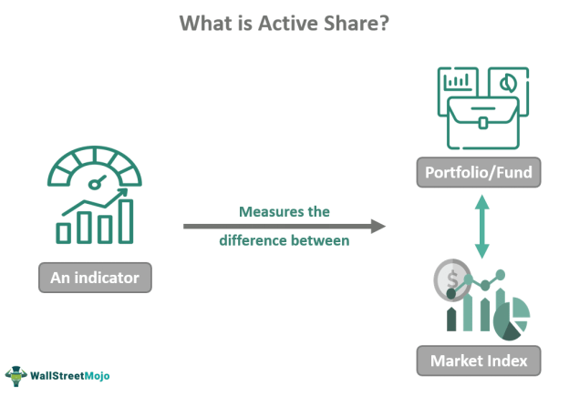

## Table of Contents

## What is active risk and why is it important in investment management?

Active risk, also known as tracking error, is the level of risk that an investment portfolio takes on by deviating from a benchmark index. It measures how much the portfolio's returns differ from the returns of the benchmark. When a portfolio manager chooses to invest in a way that's different from the benchmark, they are taking on active risk. This can happen by choosing different stocks, adjusting the weight of investments, or using different strategies.

Active risk is important in investment management because it helps investors understand the potential extra returns they might get, as well as the extra risk they are taking. If a portfolio has a high active risk, it means the returns could be very different from the benchmark, either better or worse. This information helps investors decide if they are comfortable with the level of risk and if the potential for higher returns is worth it. Managing active risk carefully can lead to better performance and more satisfied investors.

## How does active risk differ from total risk?

Active risk and total risk are two different ways to measure risk in investing. Active risk looks at how much a portfolio's performance might differ from a benchmark, like the S&P 500. It's about the extra risk taken by choosing different investments or strategies than the benchmark. If a portfolio manager picks different stocks or changes how much they invest in certain areas, that's active risk. It's important because it shows how much the portfolio might outperform or underperform the benchmark.

Total risk, on the other hand, is a broader measure that looks at all the risk in a portfolio. It includes everything that could make the portfolio's value go up or down, like market movements, economic changes, or company-specific events. Total risk is often measured by something called standard deviation, which shows how much the portfolio's returns might vary from its average return. While active risk focuses on the risk compared to a benchmark, total risk gives a complete picture of all the risks involved in the investment.

## What are the key components that contribute to active risk?

Active risk comes from a few main things that a portfolio manager does differently from a benchmark. One big part is the choices of what to invest in. If a manager picks different stocks or bonds than what's in the benchmark, that adds to active risk. Another part is how much they invest in each thing. If they put more money into some stocks and less into others compared to the benchmark, that's another way active risk grows. Also, the timing of when they buy or sell investments can matter. If they trade at different times than the benchmark, it can make the portfolio's performance different.

Another thing that adds to active risk is the style of investing the manager uses. For example, if they focus more on small companies or on companies that are expected to grow a lot, and the benchmark doesn't, that adds risk. Sector choices are important too. If the manager puts a lot of money into one industry, like technology, and the benchmark is more spread out, that can make the portfolio's performance very different from the benchmark. All these choices together make up the active risk, showing how much the portfolio might do better or worse than the benchmark.

## How is active risk measured and what are the common metrics used?

Active risk is measured by looking at how different a portfolio's performance is from a benchmark over time. The most common way to measure it is by using something called tracking error. Tracking error is like a score that tells you how much the portfolio's returns go up and down compared to the benchmark's returns. To find the tracking error, you first figure out the difference between the portfolio's returns and the benchmark's returns for each period, like each month or year. Then, you take the standard deviation of these differences. The bigger the tracking error, the more the portfolio's performance is bouncing around compared to the benchmark.

Another way to measure active risk is by looking at the information ratio. This metric compares the extra returns you get from taking active risk to the amount of active risk you're taking. It's like figuring out if the extra risk you're taking is worth it. To find the information ratio, you take the difference between the portfolio's returns and the benchmark's returns (this is called the active return) and divide it by the tracking error. A higher information ratio means that the portfolio is doing a good job of getting more returns for the extra risk it's taking. Both tracking error and information ratio help investors understand and manage the active risk in their portfolios.

## Can you explain the concept of tracking error in relation to active risk?

Tracking error is a way to measure active risk. It shows how much a portfolio's performance goes up and down compared to a benchmark, like the S&P 500. Imagine you have a portfolio and you want to know how different it is from the benchmark. You look at the difference between your portfolio's returns and the benchmark's returns for each period, like every month or year. Then, you find the standard deviation of these differences. The bigger the tracking error, the more your portfolio's performance is bouncing around compared to the benchmark. This tells you how much active risk you're taking by choosing different investments or strategies than the benchmark.

Tracking error is important because it helps investors understand if the extra risk they're taking is worth it. If your portfolio has a high tracking error, it means your returns could be a lot better or a lot worse than the benchmark. This can be good if you're trying to beat the benchmark, but it also means you could fall behind by a lot. By knowing the tracking error, you can decide if you're comfortable with how much your portfolio might differ from the benchmark. It's a key tool for managing active risk and making sure you're happy with the balance between risk and potential reward.

## What role does the benchmark play in calculating active risk?

The benchmark is really important when you're figuring out active risk. It's like a yardstick that you use to see how different your portfolio is from a standard way of investing. For example, if you're comparing your portfolio to the S&P 500, the S&P 500 is the benchmark. You look at how your portfolio's returns go up and down compared to the S&P 500's returns. This helps you see how much extra risk you're taking by choosing different investments or strategies than what's in the benchmark.

When you calculate active risk, you need the benchmark to find the tracking error. Tracking error shows how much your portfolio's performance bounces around compared to the benchmark. You find the difference between your portfolio's returns and the benchmark's returns for each period, like every month or year. Then, you take the standard deviation of these differences. The bigger the tracking error, the more your portfolio is different from the benchmark. So, the benchmark is key because it gives you something to compare your portfolio against, helping you understand the active risk you're taking.

## How can an investor or fund manager control or manage active risk?

An investor or fund manager can control or manage active risk by carefully choosing what to invest in and how much to invest. They can look at the stocks or bonds they pick and see how different they are from the benchmark. If they want less active risk, they can choose investments that are more like what's in the benchmark. They can also change how much they put into each investment. If they put more money into things that are very different from the benchmark, that can make active risk go up. By keeping an eye on these choices and making them more like the benchmark, they can lower the active risk.

Another way to manage active risk is by using tools like tracking error and the information ratio. Tracking error shows how much the portfolio's returns go up and down compared to the benchmark. If the tracking error is too high, the manager can adjust the portfolio to make it more like the benchmark. The information ratio helps too. It shows if the extra risk is worth it by comparing the extra returns to the tracking error. If the information ratio is low, it might mean the active risk isn't paying off, and the manager can change things to get a better balance between risk and reward. By using these tools and making smart choices, investors and fund managers can keep active risk at a level they're comfortable with.

## What are some strategies to minimize active risk while still achieving desired returns?

One way to minimize active risk while still trying to get the returns you want is by sticking close to the benchmark. This means [picking](/wiki/asset-class-picking) investments that are a lot like what's in the benchmark. For example, if you're using the S&P 500 as your benchmark, you might choose stocks that are in the S&P 500 or are very similar to them. You can also adjust how much you put into each investment to match the benchmark more closely. This way, your portfolio won't be too different from the benchmark, which keeps the active risk low. At the same time, you can still try to do a bit better than the benchmark by carefully picking the best stocks within the same group.

Another strategy is to use tools like tracking error and the information ratio to keep an eye on your active risk. Tracking error tells you how much your portfolio's performance bounces around compared to the benchmark. If it's too high, you can make changes to bring it down. The information ratio helps you see if the extra risk you're taking is worth it by comparing the extra returns to the tracking error. If the ratio is low, it might mean you're not getting enough reward for the risk, so you can tweak your investments. By using these tools, you can find a good balance between keeping active risk low and still aiming for the returns you want.

## Can you provide a simple example of how to calculate active risk for a portfolio?

Let's say you have a portfolio and you want to know how much active risk you're taking compared to the S&P 500. First, you need to look at the returns of your portfolio and the S&P 500 for the same time periods, like every month for a year. For example, if your portfolio went up 2% in January and the S&P 500 went up 1%, the difference is 1%. You do this for every month, so you have a list of differences: 1%, -0.5%, 0.8%, and so on.

Next, you take the standard deviation of these differences. Standard deviation is a way to see how much the numbers in your list bounce around. If the standard deviation is big, it means your portfolio's performance is bouncing around a lot compared to the S&P 500, which means you have high active risk. If it's small, your portfolio is pretty close to the S&P 500, so your active risk is low. This standard deviation is called the tracking error, and it's how you measure active risk.

## How do advanced statistical models enhance the calculation of active risk?

Advanced statistical models help make the calculation of active risk more accurate and detailed. These models can look at a lot of data at once and find patterns that simpler methods might miss. For example, they can use things like regression analysis to see how different parts of the portfolio affect its performance compared to the benchmark. This helps in understanding which investments are causing the most active risk. By using these models, investors and fund managers can get a better picture of their active risk and make smarter choices about their investments.

These models also let you look at active risk over different time periods and in different situations. They can use something called Monte Carlo simulations to see how the portfolio might do in many different possible futures. This helps in planning for different outcomes and managing risk better. By using advanced statistical models, you can get a deeper understanding of your active risk and adjust your portfolio to keep it at a level you're comfortable with while still trying to beat the benchmark.

## What are the implications of high active risk on portfolio performance?

High active risk means your portfolio's performance might be very different from the benchmark. This can be good or bad. If your portfolio does a lot better than the benchmark, you might get higher returns. But if it does a lot worse, you could lose more money than if you had just followed the benchmark. So, high active risk can lead to big wins, but it also means there's a bigger chance of big losses. It's like trying to hit a home run in baseball - you might score a lot of points, but you might also strike out.

Because of this, high active risk can make your portfolio's returns go up and down a lot. This can be stressful if you don't like a lot of ups and downs in your investments. It might also make it harder to plan for the future because you can't be sure how your portfolio will do compared to the benchmark. If you're okay with the extra risk and the potential for bigger rewards, high active risk might be fine for you. But if you want a more stable and predictable return, you might want to keep your active risk lower.

## How does active risk relate to the concept of alpha in performance evaluation?

Active risk and alpha are two important ideas in investing, and they're connected. Active risk is about how much a portfolio's performance might be different from a benchmark, like the S&P 500. It shows the extra risk you take by choosing different investments or strategies than the benchmark. Alpha, on the other hand, is about how much better your portfolio does compared to the benchmark, after you take away the risk you took. It's like a score that shows if the extra risk you took was worth it. If your portfolio does better than the benchmark, you have positive alpha. If it does worse, you have negative alpha.

When you look at active risk and alpha together, you can see if the extra risk you're taking is paying off. If you have high active risk but also high alpha, it means you're getting good rewards for the extra risk. But if you have high active risk and low or negative alpha, it means the extra risk isn't worth it because your portfolio isn't doing better than the benchmark. So, active risk tells you how much extra risk you're taking, and alpha tells you if that risk is helping you beat the benchmark. By understanding both, you can make smarter choices about your investments.

## What is Defining Active Risk?

Active risk, often referred to as tracking error, is a measure of the risk inherent in the deviations of a portfolio’s returns compared to a benchmark index. This deviation is a result of the active management decisions made by portfolio managers, encompassing factors like security selection and market timing.

### Understanding Active Risk

Active risk quantifies how actively managed portfolios differ from their benchmark indices, attributing these differences to the manager’s skill in selecting investments. The aim is to achieve returns surpassing the benchmark, with active risk reflecting the uncertainty of achieving these excess returns. It is often measured as the standard deviation of the differences between the portfolio returns and the benchmark returns. Mathematically, it is expressed as:

$$
\text{Active Risk} = \sqrt{\frac{1}{N-1} \sum_{i=1}^{N} (R_{p,i} - R_{b,i} - \alpha)^2}
$$

Where:
- $N$ is the number of observations.
- $R_{p,i}$ is the portfolio return at time $i$.
- $R_{b,i}$ is the benchmark return at time $i$.
- $\alpha$ is the average excess return (or active return).

### Components of Active Risk

1. **Security Selection**: This process involves choosing stocks or assets that a manager believes will outperform the benchmark securities. Success in this area is measured by the degree to which these selections lead to better returns than those of the benchmark.

2. **Market Timing**: This refers to strategic decisions about the timing of buying and selling activities in anticipation of market fluctuations. For example, a manager might increase the portfolio’s exposure to equities if they anticipate a bull market.

A portfolio manager’s goal is often to optimize the balance between active risk and expected return. While higher active risk might mean more potential for higher returns, it also increases the likelihood of deviation from the benchmark, not always favorably.

Active risk is crucial in evaluating the skills of portfolio managers, assisting investors in understanding the trade-offs between potential returns and the accompanying risks. It encapsulates a central tenet of active portfolio management, where calculated deviations from benchmarks are executed with the aim of achieving superior returns.

## What are Investment Performance Metrics?

Investment performance metrics are vital tools for gauging the efficacy and risk profile of investment strategies. These metrics provide insights into the potential risks and returns associated with different investment vehicles, helping investors make informed decisions. Understanding these metrics is crucial for evaluating how well a strategy performs relative to the risk involved.

Beta is a widely used metric that measures an investment's sensitivity to market movements. It is calculated as:

$$
\beta = \frac{\text{Cov}(R_i, R_m)}{\text{Var}(R_m)}
$$

where $R_i$ is the return of the investment, $R_m$ is the return of the market, $\text{Cov}(R_i, R_m)$ is the covariance between the investment and the market returns, and $\text{Var}(R_m)$ is the variance of the market returns. A beta greater than 1 indicates that the investment is more volatile than the market, while a beta less than 1 means it is less volatile.

Standard deviation is another critical metric, reflecting the amount of variation or [dispersion](/wiki/dispersion-trading) of a set of values. In the context of investment performance, it represents the investment's [volatility](/wiki/volatility-trading-strategies), providing an estimate of its risk. The standard deviation is calculated as:

$$
\sigma = \sqrt{\frac{1}{N-1} \sum_{i=1}^{N} (R_i - \bar{R})^2}
$$

where $N$ is the number of observations, $R_i$ is each individual return, and $\bar{R}$ is the average return over the period. A higher standard deviation indicates greater volatility, suggesting higher risk.

The Sharpe Ratio is a comprehensive metric that evaluates an investment's return relative to its risk, effectively balancing return against risk. It is calculated as:

$$
\text{Sharpe Ratio} = \frac{R_p - R_f}{\sigma_p}
$$

where $R_p$ is the expected portfolio return, $R_f$ is the risk-free rate, and $\sigma_p$ is the standard deviation of the portfolio's returns. A higher Sharpe Ratio indicates a more attractive risk-adjusted return, which is crucial for assessing the efficiency of a trading strategy.

These metrics collectively offer a detailed understanding of investment performance in relation to risk. They enable investors to evaluate whether the returns justify the risks taken, allowing for optimized portfolio management. By leveraging these metrics, investors can better navigate market complexities, aligning investment strategies with their risk tolerance and financial goals.

## What are Risk Management Strategies to Enhance Performance?

In trading, effective risk management strategies are crucial for enhancing performance and sustaining long-term portfolio health. Key strategies include diversification, position sizing, and stress testing, all of which address both systematic and unsystematic risks.

Diversification involves spreading investments across various financial instruments, industries, and geographies to reduce the impact of a poor-performing asset on the overall portfolio. By not putting all capital into a single asset class or sector, traders can mitigate unsystematic risk, which is specific to a company or industry. The formula for calculating the risk of a diversified portfolio, which illustrates the benefits of diversification, is:

$$
\sigma_p = \sqrt{\sum_{i=1}^n w_i^2 \sigma_i^2 + \sum_{i=1}^n \sum_{j=i+1}^n 2w_i w_j \sigma_i \sigma_j \rho_{ij}}
$$

where $\sigma_p$ is the portfolio standard deviation, $w_i$ and $w_j$ are the weights of assets $i$ and $j$, $\sigma_i$ and $\sigma_j$ are the standard deviations, and $\rho_{ij}$ is the correlation between asset $i$ and $j$.

Position sizing determines the amount of capital invested in a particular asset or trading position. Optimal position sizing helps to balance potential returns against risk exposure. Traders use the Kelly Criterion to determine the ideal size of each position:

$$
f^* = \frac{bp - q}{b}
$$

where $f^*$ is the fraction of the portfolio to bet, $b$ is the odds received on the wager (net odds), $p$ is the probability of winning, and $q$ is the probability of losing ($1-p$).

Stress testing evaluates how a trading portfolio might perform under extreme market conditions. By simulating adverse scenarios such as market crashes or significant [interest rate](/wiki/interest-rate-trading-strategies) hikes, stress testing helps identify vulnerabilities and prepare risk mitigation tactics. This proactive approach not only protects against potential large-scale losses but also assists in optimizing asset allocation strategies.

Implementing these risk management strategies offers robust protection for trading portfolios. By managing both systematic risks (market-wide risks) and unsystematic risks, traders improve their odds of maintaining sustainable and profitable investment portfolios over time.

## References & Further Reading

[1]: Treleaven, P., Galas, M., & Lalchand, V. (2013). ["Algorithmic trading review."](https://www.researchgate.net/publication/262239006_Algorithmic_Trading_Review) Journal of Financial Markets, 16(2), 201-210.

[2]: Black, F., & Litterman, R. (1992). ["Global Portfolio Optimization."](https://people.duke.edu/~charvey/Teaching/BA453_2006/Black_Litterman_Global_Portfolio_Optimization_1992.pdf) Financial Analysts Journal, 48(5), 28-43.

[3]: Grinold, R. C., & Kahn, R. N. (2000). ["Active Portfolio Management: A Quantitative Approach for Producing Superior Returns and Controlling Risk."](https://www.amazon.com/Active-Portfolio-Management-Quantitative-Controlling/dp/0070248826) McGraw-Hill.

[4]: Chan, E. P. (2013). ["Algorithmic Trading: Winning Strategies and Their Rationale."](https://github.com/ftvision/quant_trading_echan_book) Wiley.

[5]: Kissell, R. (2013). ["The Science of Algorithmic Trading and Portfolio Management."](https://www.sciencedirect.com/book/9780124016897/the-science-of-algorithmic-trading-and-portfolio-management) Academic Press.