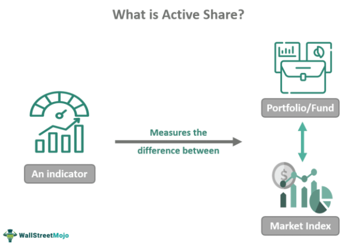

In the dynamic world of finance, effective portfolio management plays a vital role in maximizing returns while minimizing risks. At the forefront of contemporary strategies, active portfolio management and algorithmic trading have gained significant traction due to their potential to enhance investment outcomes. This article seeks to provide a comprehensive overview of key financial strategies, including portfolio management, investment analysis, active share, and the role of algorithmic trading in optimizing these strategies.

Active portfolio management involves actively making investment decisions to outperform a specific market index. This approach often requires sophisticated analysis and market insight to exploit inefficiencies and capitalize on emerging opportunities. In this context, algorithmic trading offers a powerful tool. By utilizing computer algorithms to execute trades based on predefined criteria, investors can achieve higher precision and execution speed, thus optimizing their portfolio management practices.



Moreover, the concept of active share is pivotal in evaluating the degree of active management within a fund. A higher active share indicates that a fund's portfolio significantly deviates from its benchmark index, suggesting proactive decision-making that aims for superior performance. Understanding how active share correlates with fund performance is crucial for investors to gauge the effectiveness of their management strategies.

The integration of these concepts—portfolio management, investment analysis, active share, and algorithmic trading—offers a robust framework for achieving superior financial outcomes. These elements interact synergistically, contributing to successful investment strategies in an ever-evolving market landscape. As the financial sector continues to innovate, understanding and leveraging these advanced strategies will be pivotal for investors looking to navigate this complex terrain effectively.

## Table of Contents

## Understanding Portfolio Management

Portfolio management is a vital process in finance that focuses on selecting and overseeing a collection of investments to achieve specific long-term financial goals. Its primary objective is to balance risk against performance to maximize returns for investors.

Active portfolio management is a strategy that involves actively making decisions to attempt to outperform a market index. This requires continuous market analysis and proactive decisions based on these analyses. Portfolio managers employing this approach seek to leverage market inefficiencies through informed decisions, including when to buy or sell assets. They actively monitor financial news, economic indicators, and corporate performance to make informed decisions.

Key components of portfolio management include:

1. **Asset Selection**: This involves choosing the right mix of investment vehicles, such as stocks, bonds, or real estate, that will yield the best returns relative to the level of acceptable risk. 

2. **Diversification**: To minimize risk, diversification involves spreading investments across different asset classes or sectors. It ensures that poor performance in one area does not excessively impact the overall portfolio.

3. **Risk Management**: Understanding and managing the risks associated with investments is crucial. This can involve assessing the volatility of assets, monitoring changes in the economic environment, and setting risk limits.

4. **Periodic Rebalancing**: This is an essential practice to maintain the desired asset allocation over time. As markets fluctuate, the portfolio may deviate from its original allocation. Regular rebalancing helps realign the portfolio with the investor's goals, selling overperforming assets to buy underperforming ones to maintain balance.

By dynamically adjusting asset allocations, portfolio managers can exploit market inefficiencies and enhance returns. These adjustments are often informed by quantitative models that analyze current market conditions and forecast future trends. Sophisticated algorithms might assist in this process, evaluating vast amounts of data at high speeds to recommend optimal investment strategies. Here's a simple example in Python to rebalance a portfolio:

```python
def rebalance_portfolio(current_allocation, target_allocation, total_value):
    rebalanced_allocation = {}
    for asset, target_percent in target_allocation.items():
        rebalanced_allocation[asset] = total_value * target_percent
    return rebalanced_allocation

current_allocation = {'Stocks': 0.60, 'Bonds': 0.30, 'Real Estate': 0.10}
target_allocation = {'Stocks': 0.50, 'Bonds': 0.40, 'Real Estate': 0.10}
total_value = 100000

new_allocation = rebalance_portfolio(current_allocation, target_allocation, total_value)
print(new_allocation)
```

Ultimately, effective portfolio management requires not just precision in selecting the right assets, but also agility in strategy and execution to adapt to evolving market conditions. Through active engagement with the market, portfolio managers aim to deliver superior returns while managing the underlying risks effectively.

## Investment Analysis and Active Share

Investment analysis involves evaluating potential investment opportunities to achieve desired financial outcomes. It is a critical step in crafting a portfolio that not only meets but exceeds performance expectations. This analysis employs various financial metrics and indicators to ensure informed decision-making and optimal asset allocation.

Active share is a metric that quantifies the extent to which a fund's portfolio diverges from its benchmark index. It serves as an indicator of active management within the portfolio. A portfolio with a higher active share indicates more active management, suggesting a greater deviation from the benchmark and a higher potential for outperforming it. This deviation reflects unique investment decisions that could lead to better financial outcomes compared to more passive approaches.

The relationship between active share and fund performance is crucial for evaluating portfolio management strategies. A higher active share often correlates with a greater potential for outperforming the benchmark, as it implies more strategic asset selection and an intentional divergence from traditional index-mimicking funds. A nuanced understanding of this relationship enables investors to tailor their strategies for maximizing returns. 

Consider a Python function to calculate active share:

```python
def calculate_active_share(portfolio_weights, benchmark_weights):
    """
    Calculate the active share between a portfolio and its benchmark.

    Parameters:
    portfolio_weights (dict): Weights of the assets in the portfolio.
    benchmark_weights (dict): Weights of the assets in the benchmark.

    Returns:
    float: Active share percentage.
    """

    # Ensure both inputs have the same assets
    assets = set(portfolio_weights.keys()) | set(benchmark_weights.keys())
    active_share = sum(abs(portfolio_weights.get(asset, 0) - benchmark_weights.get(asset, 0)) for asset in assets)

    # Active share is half of the absolute differences sum
    return active_share / 2 * 100

# Example usage:
portfolio = {'Asset_A': 0.3, 'Asset_B': 0.4, 'Asset_C': 0.3}
benchmark = {'Asset_A': 0.25, 'Asset_B': 0.5, 'Asset_C': 0.25}
print("Active Share:", calculate_active_share(portfolio, benchmark), "%")
```

This code illustrates calculation of active share, providing a quantitative basis for understanding how much a portfolio differs from its benchmark. By examining active share alongside other performance metrics, investors can better assess the potential and risks associated with their portfolio strategies, thereby making more informed investment decisions. As such, active share becomes a valuable tool in the process of investment analysis and optimization for reaching superior financial goals.

## Algorithmic Trading in Portfolio Management

Algorithmic trading, a method employing computer algorithms for executing trades, has transformed portfolio management by optimizing trade execution in terms of speed and accuracy. The integration of [algorithmic trading](/wiki/algorithmic-trading) into portfolio management provides significant enhancements in diversification, risk management, and execution efficiency.

### Benefits of Algorithmic Trading in Portfolio Management

1. **Diversification and Risk Management**: Algorithmic trading allows for greater diversification by analyzing vast amounts of market data in real time. This capability enables investors to efficiently spread investments across various assets, sectors, and geographic locations, mitigating unsystematic risk. Moreover, algorithms are capable of identifying correlations and variances among different market instruments, facilitating informed risk management decisions.

2. **Execution Efficiency**: Algorithms are designed to execute trades at the most opportune moments, benefiting from market movements that human traders might miss due to latency. This high-frequency trading capability means the difference of milliseconds can result in significant profit or loss. Algorithmic trading systems can also optimize order sizes and route orders through the best market channels to reduce transaction costs.

3. **Reaction to Market Changes**: The ability to swiftly react to market changes is one of the core advantages of using algorithms. Traditional trading methods may not match the speed and precision offered by algorithms, which can execute complex strategies instantaneously. By monitoring market conditions continuously, these systems can adapt strategies on-the-fly without human intervention.

### Challenges of Algorithmic Trading

While algorithmic trading offers numerous benefits, certain challenges and risks must be addressed:

- **System Reliability**: The reliance on technology means that any system downtime or error can lead to missed opportunities or unintended trades. Robust and reliable systems require significant investment in both software and infrastructure.

- **Market Impact**: High-frequency trades executed by algorithms can cause spikes in trading volumes which may lead to market impacts such as liquidity disruption or increased price volatility, creating a feedback loop that could destabilize the market.

- **Regulatory Compliance**: Algorithmic trading is subject to stringent regulatory requirements designed to prevent market manipulation and ensure transparency. Compliance with these regulations necessitates sophisticated systems for monitoring and reporting trades.

### Implementation Example

To illustrate the implementation of algorithmic trading in portfolio management, let’s consider a simple Python script using `pandas` and `numpy` to simulate a [momentum](/wiki/momentum) strategy:

```python
import pandas as pd
import numpy as np

# Load historical price data
prices = pd.read_csv('historical_prices.csv', index_col='Date', parse_dates=True)

# Calculate returns and moving averages
returns = prices.pct_change().mean(axis=1)
short_window = returns.rolling(window=20).mean()
long_window = returns.rolling(window=50).mean()

# Generate trading signals: Buy when short window exceeds long window
signals = (short_window > long_window).astype(int)

# Shift signals to represent trade execution on the next day
signals = signals.shift(1)

# Back-test strategy
portfolio_returns = signals * returns
cumulative_returns = (1 + portfolio_returns).cumprod()

# Output portfolio performance
print(cumulative_returns)
```

This basic script computes the short and long moving averages of stock returns and generates buy signals when the short-term average exceeds the long-term average, demonstrating how algorithms can automate trading decisions based on predefined criteria.

In conclusion, algorithmic trading in portfolio management enhances investment precision and responsiveness while presenting challenges that require careful system design and regulatory adherence. By leveraging technology, investors can achieve more efficient portfolio management strategies that adapt dynamically to market fluctuations.

## Strategies for Enhancing Portfolio Performance

Active portfolio management and algorithmic trading are pivotal in refining portfolio performance through a variety of strategies. One primary approach is multi-asset diversification. This strategy aims to spread investments across multiple asset classes, such as equities, bonds, commodities, and real estate, to reduce risk and enhance returns. By diversifying, investors can mitigate the impact of market [volatility](/wiki/volatility-trading-strategies) on their portfolios, as the poor performance of one asset class can be offset by gains in another. This approach is supported by the Modern Portfolio Theory, which emphasizes the benefits of holding diversified portfolios to achieve optimal risk-return trade-offs.

Sector rotation is another strategy employed to capitalize on varying economic cycles. This involves reallocating investments towards sectors expected to outperform based on macroeconomic indicators. For instance, during economic expansions, cyclical sectors like technology and consumer discretionary may offer better returns, whereas defensive sectors such as utilities and healthcare might perform well in downturns. By predicting these economic shifts, portfolio managers can adjust their asset allocation to take advantage of emerging opportunities.

Market timing seeks to optimize entry and [exit](/wiki/exit-strategy) points in investment markets to maximize returns. This strategy relies on predicting short-term market movements and involves buying low and selling high. However, it requires precise timing and is often challenging, as it necessitates a deep understanding of market conditions and investor psychology. Although controversial, some investors employ technical analysis tools and trading signals to make informed market timing decisions.

Arbitrage involves exploiting price differentials of the same asset across different markets or forms. This strategy requires quick execution and large volumes to profit from small price discrepancies and is often employed in algorithmic trading. By leveraging technology and speed, traders can conduct complex [arbitrage](/wiki/arbitrage) strategies that are otherwise difficult to execute manually.

The use of quantitative models and technical indicators is integral in identifying market opportunities and honing decision-making. By analyzing historical data and market trends, these models can forecast potential price movements and assess risk. For example, indicators such as moving averages, Bollinger Bands, and the Relative Strength Index (RSI) provide insights into market momentum and price reversals.

Integrating these strategies within an algorithmic framework facilitates continuous optimization and risk adjustment. Algorithms can handle vast amounts of data swiftly, execute trades at optimal prices, and adapt to dynamic market conditions. This automation not only enhances execution efficiency but also allows for sophisticated risk management techniques. Python, being a versatile programming language, is commonly used to develop these algorithms. Below is a simple example of a Python script utilizing the Moving Average Convergence Divergence (MACD) indicator for trading decisions:

```python
import pandas as pd
import numpy as np

# Assuming 'data' is a pandas DataFrame with a 'Close' column for stock prices
def calculate_macd(data, short_window=12, long_window=26, signal_window=9):
    data['EMA12'] = data['Close'].ewm(span=short_window, adjust=False).mean()
    data['EMA26'] = data['Close'].ewm(span=long_window, adjust=False).mean()
    data['MACD'] = data['EMA12'] - data['EMA26']
    data['Signal'] = data['MACD'].ewm(span=signal_window, adjust=False).mean()
    data['Buy_Signal'] = np.where(data['MACD'] > data['Signal'], 1, 0)
    data['Sell_Signal'] = np.where(data['MACD'] < data['Signal'], -1, 0)

    return data

# Example usage
data = pd.read_csv('stock_data.csv')
macd_data = calculate_macd(data)
```

This code calculates the MACD and signal line, generating buy and sell signals based on their crossovers. Such indicators enable traders to refine their strategies by highlighting potential buying or selling opportunities.

In conclusion, effectively integrating active management strategies and leveraging algorithmic trading frameworks empowers investors to enhance portfolio performance. These methods not only bolster decision-making but also facilitate coping with shifting market dynamics, ultimately driving superior financial outcomes.

## Risk Management and Performance Evaluation

Effective risk management is critical to ensure sustained portfolio performance, especially in volatile markets. The primary objective is to protect investments from unforeseen market downturns while still achieving desired returns. Several techniques are utilized to mitigate potential losses, each offering unique benefits and challenges.

**Diversification** is a fundamental risk management strategy, involving the distribution of investments across various asset classes, geographic regions, and sectors. By not putting all investments in a single basket, the overall risk is spread out, minimizing the impact of a poor-performing asset on the entire portfolio. Diversification reduces unsystematic risk, which is specific to individual investments, but it does not eliminate systematic risk, or market risk, which affects all securities.

**Hedging** is another critical technique used to offset potential losses. This involves taking a position in a related security to counterbalance potential adverse price movements. Common hedging instruments include derivatives like options and futures contracts. For example, an investor holding stocks might purchase put options to guard against a decline in stock prices. While hedging can significantly reduce risk, it may also reduce potential gains.

**Stop-loss orders** are a risk management tool that automatically sells a security when its price falls to a predetermined level. This mechanism prevents further loss by exiting the position early, especially useful in rapidly changing markets. However, stop-loss orders must be set carefully to avoid untimely sell-offs triggered by normal market fluctuations.

Performance evaluation in portfolio management involves the assessment of actual returns against predefined benchmarks. This process aids investors and managers in understanding their performance relative to the market or specific indices. Common benchmarks include market indices like the S&P 500 or specific commodity indices depending on the investment focus.

Risk-adjusted measures such as the **Sharpe ratio** are vital for performance evaluation. The Sharpe ratio assesses how well the return of an investment compensates the investor for the risk taken. It is calculated as:

$$
\text{Sharpe Ratio} = \frac{R_p - R_f}{\sigma_p}
$$

where $R_p$ is the portfolio return, $R_f$ is the risk-free rate, and $\sigma_p$ is the standard deviation of the portfolio's excess return. A higher Sharpe ratio indicates better risk-adjusted performance.

Ongoing performance assessment is crucial for identifying areas of improvement and ensuring the investment strategy remains aligned with the investor's long-term goals. This iterative process involves regularly comparing performance metrics, adjusting strategies, and implementing changes to maintain a competitive advantage in the market. Continuous strategy refinement, informed by thorough data analysis and market insights, enables investors to adapt to evolving market conditions and optimize portfolio returns.

## Conclusion

The integration of portfolio management, investment analysis, active share, and algorithmic trading constitutes a powerful toolkit for investors striving to optimize their financial portfolios. These components collectively facilitate the development of investment strategies that are both adaptive and robust, capable of withstanding the volatility and rapid evolution of today's financial markets. As technology advances and market dynamics shift, it becomes increasingly important for investors to remain informed and leverage these advanced strategies to maintain competitiveness.

Portfolio management serves as the foundation, providing a structured approach to selecting and overseeing investments to achieve specific financial objectives. Complementing this, investment analysis enables investors to assess various opportunities critically, tailoring decisions to match anticipated financial returns. Active share acts as an indicator of the level of active management within a portfolio, providing insights into potential to outperform standard benchmarks by differentiating from passive funds.

Algorithmic trading further enhances the capabilities of investors by offering speed, precision, and efficiency in executing trades. By automating decision-making processes, it allows for swift reactions to market fluctuations and the implementation of complex strategies without manual intervention. This technology-driven approach promotes diversification and risk management, key factors in sustaining portfolio performance.

As the financial landscape continues to evolve, embracing innovation and refining investment methodologies are essential for those seeking superior returns. Investors must not only utilize existing tools and strategies but also remain open to new advancements in technology and analytics that can provide a competitive edge. By fostering a mindset of continual learning and adaptation, investors can better navigate the complexities of the financial world and achieve long-term investment success.

## References & Further Reading

[1]: Cremers, M., & Petajisto, A. (2009). ["How Active is Your Fund Manager? A New Measure That Predicts Performance."](https://papers.ssrn.com/sol3/papers.cfm?abstract_id=891719) The Review of Financial Studies, 22(9), 3329-3365.

[2]: Carhart, M. M. (1997). ["On Persistence in Mutual Fund Performance."](https://onlinelibrary.wiley.com/doi/full/10.1111/j.1540-6261.1997.tb03808.x) The Journal of Finance, 52(1), 57-82.

[3]: Frazzini, A., Friedman, J., & Pomorski, L. (2016). ["Deactivating Active Share."](https://papers.ssrn.com/sol3/papers.cfm?abstract_id=2597122) Financial Analysts Journal, 72(2), 14-21.

[4]: Lopez de Prado, M. (2018). ["Advances in Financial Machine Learning."](https://www.amazon.com/Advances-Financial-Machine-Learning-Marcos/dp/1119482089) John Wiley & Sons.

[5]: Chan, E. P. (2009). ["Quantitative Trading: How to Build Your Own Algorithmic Trading Business."](https://github.com/ftvision/quant_trading_echan_book) John Wiley & Sons.

[6]: J.P. Morgan Asset Management. ["Guide to the Markets."](https://am.jpmorgan.com/us/en/asset-management/adv/insights/market-insights/guide-to-the-markets/) 

[7]: Markowitz, H. (1952). ["Portfolio Selection."](https://onlinelibrary.wiley.com/doi/abs/10.1111/j.1540-6261.1952.tb01525.x) The Journal of Finance, 7(1), 77-91.