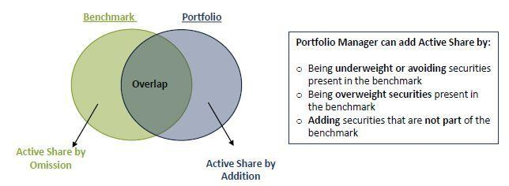

## Table of Contents

## What is Active Share?

Active Share is a measure that shows how different a mutual fund or portfolio is from its benchmark index. It tells you how much the fund manager is actively making their own choices, instead of just following the index. A high Active Share means the fund's holdings are very different from the benchmark, while a low Active Share means the fund is more like the index.

This measure is important because it helps investors understand if they are getting what they expect from an actively managed fund. If you pay extra for active management, you want the fund to be different from the index. Active Share can help you see if the fund manager is really trying to beat the market by making different choices, or if they are just closely following the index.

## How is Active Share calculated?

Active Share is calculated by comparing the holdings of a fund to those of its benchmark index. You start by looking at each stock in the fund and the index. If a stock is in the fund but not in the index, or if it's in the index but not in the fund, that adds to the Active Share. If a stock is in both but the amount held is different, that also counts towards the Active Share, but less than if the stock was completely different.

To get the final Active Share number, you add up all these differences and divide by two. This gives you a percentage that shows how much the fund differs from the index. A higher percentage means the fund is more different from the index, and a lower percentage means it's more similar.

## Why is Active Share important for investors?

Active Share is important for investors because it helps them see if a fund manager is really trying to do something different from the market. When you pay more for an actively managed fund, you expect the manager to pick different stocks than what's in the index. Active Share tells you how much the fund's choices are different from the index. If the Active Share is high, it means the manager is making big, different choices, which could lead to better returns if they pick the right stocks.

On the other hand, if the Active Share is low, it means the fund is very similar to the index. This might make you wonder why you're paying extra for active management if the fund is just copying the index. Knowing the Active Share helps you decide if the fund is worth the extra cost. It's a simple way to check if the fund manager is working hard to beat the market or just going along with it.

## What does a high Active Share indicate?

A high Active Share means that a fund's investments are very different from the benchmark index it is compared to. This shows that the fund manager is making big, different choices when [picking](/wiki/asset-class-picking) stocks. They are not just following what's in the index, but are trying to find stocks that they think will do better than the market.

When a fund has a high Active Share, it suggests that the manager believes they can beat the market by choosing different stocks. This can be good for investors who want to pay more for a chance at higher returns. But it also means the fund could do worse than the market if the manager's choices don't work out. So, a high Active Share shows a fund that's trying hard to be different, which can be both a risk and a chance for bigger rewards.

## What does a low Active Share indicate?

A low Active Share means that a fund's investments are very similar to the benchmark index it is compared to. This shows that the fund manager is not making many different choices from what's in the index. Instead, they are mostly following the same stocks and in similar amounts as the index.

When a fund has a low Active Share, it suggests that the manager isn't trying very hard to beat the market. They are sticking close to what the index does. This can be good if you want a fund that acts a lot like the market, but it might make you wonder why you're paying extra for active management if the fund is just copying the index.

## How does Active Share differ from tracking error?

Active Share and tracking error are both ways to see how different a fund is from its benchmark index, but they measure different things. Active Share looks at how different the stocks in a fund are from the stocks in the index. It tells you the percentage of the fund's holdings that are different from the index. If the Active Share is high, it means the fund manager is picking very different stocks than what's in the index.

Tracking error, on the other hand, measures how much a fund's returns go up and down compared to the index's returns. It's all about how much the fund's performance can be different from the index over time. A high tracking error means the fund's returns can be a lot different from the index, either better or worse. So, Active Share is about what stocks are picked, and tracking error is about how the fund's performance moves compared to the index.

## Can Active Share be used to evaluate all types of funds?

Active Share can be used to evaluate many types of funds, but it works best for stock funds that are compared to a specific index. It tells you how different the stocks in the fund are from the stocks in the index. This is really helpful for funds that say they are actively managed, meaning the manager picks stocks they think will do better than the market. If you see a high Active Share, it means the manager is making different choices, which could lead to better returns if they pick the right stocks.

However, Active Share might not be as useful for other types of funds, like bond funds or funds that invest in many different things. These funds might not have a clear index to compare to, so Active Share can't show how different they are. Also, for funds that are meant to closely follow an index, like index funds, Active Share isn't very important because these funds are supposed to be similar to the index, not different.

## What are the limitations of using Active Share as a performance metric?

Active Share has some limits when you use it to see how well a fund is doing. It only tells you how different a fund's stocks are from an index, but it doesn't say if those different choices are good or bad. A high Active Share means the manager is picking different stocks, but those stocks could still lose money. So, Active Share can't tell you if the fund will do better or worse than the market; it just shows that the manager is trying something different.

Another problem is that Active Share doesn't work well for all types of funds. It's best for stock funds that have a clear index to compare to. But for bond funds or funds that invest in many different things, it's hard to find a good index to compare them to. Also, for funds that are meant to follow an index closely, like index funds, Active Share isn't very useful because these funds are supposed to be similar to the index, not different.

## How has the concept of Active Share evolved since its introduction?

Since Active Share was first introduced, it has become a popular way for investors to see how different a fund is from its benchmark index. It was created by researchers Martijn Cremers and Antti Petajisto in 2009. They wanted to help investors understand if they were getting what they paid for with actively managed funds. Over time, more and more people started using Active Share to check if fund managers were really trying to beat the market by picking different stocks. It became a key tool for investors who wanted to see if their fund was worth the extra cost of active management.

The idea of Active Share has also led to more research and discussions about how to measure a fund's performance. People started looking at other ways to see if a fund was doing a good job, like tracking error, which measures how much a fund's returns can be different from the index. But Active Share stayed important because it's simple and easy to understand. It helps investors see if a fund manager is making big, different choices, even if it doesn't tell them if those choices will lead to better returns. As time went on, Active Share became a standard part of how investors think about and choose funds.

## What are some real-world examples of funds with high and low Active Share?

A real-world example of a fund with a high Active Share is the ARK Innovation [ETF](/wiki/etf-trading-strategies) (ARKK). This fund, managed by Cathie Wood, focuses on companies that are leading in areas like [artificial intelligence](/wiki/ai-artificial-intelligence), robotics, and DNA sequencing. ARKK has an Active Share of around 80%, which means it's very different from its benchmark, the S&P 500. The fund's manager picks stocks that she believes will grow a lot, even if they're not in the S&P 500. This high Active Share shows that ARKK is trying to do something different and aims to beat the market by choosing unique stocks.

On the other hand, a fund with a low Active Share is the Vanguard 500 Index Fund (VFIAX). This fund tries to match the performance of the S&P 500 by holding the same stocks in the same amounts as the index. VFIAX has an Active Share close to 0%, which means it's almost the same as the S&P 500. The fund's goal is not to beat the market but to follow it closely. A low Active Share like this shows that the fund is not trying to do anything different from the index, making it a good choice for investors who want a simple, low-cost way to invest in the market.

## How can Active Share be integrated into a broader investment strategy?

Active Share can be a helpful tool when you're planning your investments. It helps you see if a fund manager is really trying to pick different stocks than what's in the index. If you want to pay more for a chance at higher returns, you might look for funds with a high Active Share. These funds are trying to beat the market by choosing unique stocks. But remember, a high Active Share doesn't mean the fund will do better; it just means the manager is trying something different. So, you should use Active Share along with other things like past performance, fees, and how much risk you're okay with taking.

When you're building your investment plan, you can mix funds with high and low Active Share to balance your risks and rewards. For example, you might put some money in a fund like the ARK Innovation ETF, which has a high Active Share and is trying to beat the market. But to keep things safe, you could also invest in a fund like the Vanguard 500 Index Fund, which has a low Active Share and follows the market closely. By using Active Share as part of your strategy, you can choose funds that fit what you want from your investments, whether it's trying to grow your money fast or keeping it safe and steady.

## What are the academic and industry critiques of Active Share as a measure of fund management skill?

Some people in academia and the investment world have pointed out problems with using Active Share to measure how good a fund manager is. One big issue is that Active Share only shows how different a fund's stocks are from the index, but it doesn't tell you if those different choices are good or bad. A high Active Share means the manager is picking different stocks, but those stocks could still lose money. So, Active Share can't tell you if the fund will do better or worse than the market; it just shows that the manager is trying something different. Another problem is that Active Share might not work well for all types of funds. It's best for stock funds that have a clear index to compare to, but it's harder to use for bond funds or funds that invest in many different things.

Critics also say that Active Share can be misleading because it doesn't look at how the fund's performance moves compared to the index. For that, you need to use something called tracking error, which shows how much a fund's returns can be different from the index's returns. Active Share doesn't tell you anything about this, so it's not a complete way to see how well a fund manager is doing. Some people argue that a fund with a high Active Share might take more risks to look different from the index, but that doesn't mean the manager is skilled. They might just be taking bigger chances, which could lead to bigger losses.

## How does Risk Management relate to Performance Evaluation?

Effective risk management is critical to ensure sustained portfolio performance, especially in volatile markets. The primary objective is to protect investments from unforeseen market downturns while still achieving desired returns. Several techniques are utilized to mitigate potential losses, each offering unique benefits and challenges.

**Diversification** is a fundamental risk management strategy, involving the distribution of investments across various asset classes, geographic regions, and sectors. By not putting all investments in a single basket, the overall risk is spread out, minimizing the impact of a poor-performing asset on the entire portfolio. Diversification reduces unsystematic risk, which is specific to individual investments, but it does not eliminate systematic risk, or market risk, which affects all securities.

**Hedging** is another critical technique used to offset potential losses. This involves taking a position in a related security to counterbalance potential adverse price movements. Common hedging instruments include derivatives like options and futures contracts. For example, an investor holding stocks might purchase put options to guard against a decline in stock prices. While hedging can significantly reduce risk, it may also reduce potential gains.

**Stop-loss orders** are a risk management tool that automatically sells a security when its price falls to a predetermined level. This mechanism prevents further loss by exiting the position early, especially useful in rapidly changing markets. However, stop-loss orders must be set carefully to avoid untimely sell-offs triggered by normal market fluctuations.

Performance evaluation in portfolio management involves the assessment of actual returns against predefined benchmarks. This process aids investors and managers in understanding their performance relative to the market or specific indices. Common benchmarks include market indices like the S&P 500 or specific commodity indices depending on the investment focus.

Risk-adjusted measures such as the **Sharpe ratio** are vital for performance evaluation. The Sharpe ratio assesses how well the return of an investment compensates the investor for the risk taken. It is calculated as:

$$
\text{Sharpe Ratio} = \frac{R_p - R_f}{\sigma_p}
$$

where $R_p$ is the portfolio return, $R_f$ is the risk-free rate, and $\sigma_p$ is the standard deviation of the portfolio's excess return. A higher Sharpe ratio indicates better risk-adjusted performance.

Ongoing performance assessment is crucial for identifying areas of improvement and ensuring the investment strategy remains aligned with the investor's long-term goals. This iterative process involves regularly comparing performance metrics, adjusting strategies, and implementing changes to maintain a competitive advantage in the market. Continuous strategy refinement, informed by thorough data analysis and market insights, enables investors to adapt to evolving market conditions and optimize portfolio returns.

## References & Further Reading

[1]: Cremers, M., & Petajisto, A. (2009). ["How Active is Your Fund Manager? A New Measure That Predicts Performance."](https://papers.ssrn.com/sol3/papers.cfm?abstract_id=891719) The Review of Financial Studies, 22(9), 3329-3365.

[2]: Carhart, M. M. (1997). ["On Persistence in Mutual Fund Performance."](https://onlinelibrary.wiley.com/doi/full/10.1111/j.1540-6261.1997.tb03808.x) The Journal of Finance, 52(1), 57-82.

[3]: Frazzini, A., Friedman, J., & Pomorski, L. (2016). ["Deactivating Active Share."](https://papers.ssrn.com/sol3/papers.cfm?abstract_id=2597122) Financial Analysts Journal, 72(2), 14-21.

[4]: Lopez de Prado, M. (2018). ["Advances in Financial Machine Learning."](https://www.amazon.com/Advances-Financial-Machine-Learning-Marcos/dp/1119482089) John Wiley & Sons.

[5]: Chan, E. P. (2009). ["Quantitative Trading: How to Build Your Own Algorithmic Trading Business."](https://github.com/ftvision/quant_trading_echan_book) John Wiley & Sons.

[6]: J.P. Morgan Asset Management. ["Guide to the Markets."](https://am.jpmorgan.com/us/en/asset-management/adv/insights/market-insights/guide-to-the-markets/) 

[7]: Markowitz, H. (1952). ["Portfolio Selection."](https://onlinelibrary.wiley.com/doi/abs/10.1111/j.1540-6261.1952.tb01525.x) The Journal of Finance, 7(1), 77-91.