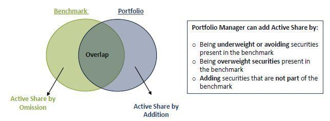

## Table of Contents

## What is Active Share in investment management?

Active Share is a measure used in investment management to show how different a mutual fund or portfolio is from its benchmark index. It tells you how much the fund's holdings vary from the index's holdings. A high Active Share means the fund is very different from the index, while a low Active Share means it's very similar. This helps investors understand how actively the fund is being managed.

Active Share is important because it can affect how well a fund performs compared to its benchmark. If a fund has a high Active Share, it might have a better chance of beating the index, but it also comes with more risk. On the other hand, a fund with a low Active Share might perform more like the index, which could be safer but less likely to outperform it. By looking at Active Share, investors can make better choices about which funds to invest in based on their goals and how much risk they're willing to take.

## How is Active Share calculated?

Active Share is calculated by looking at how different a fund's holdings are from the benchmark index's holdings. First, you find out what percentage of the fund's money is in each stock. Then, you compare this to the percentage of the benchmark index's money in the same stocks. You add up all the differences between these percentages. If a stock is in the fund but not in the index, or vice versa, you count the full percentage of the fund's money in that stock.

After adding up all these differences, you divide the total by two. This gives you the Active Share, which is a number between 0 and 100. A higher number means the fund is more different from the index, and a lower number means it's more similar. For example, if the Active Share is 80, it means 80% of the fund's holdings are different from the index.

## Why is Active Share important for investors?

Active Share is important for investors because it shows how much a fund's investments are different from a benchmark index. This difference tells investors how actively the fund is being managed. If a fund has a high Active Share, it means the fund manager is making choices that are very different from the index. This could mean the fund has a better chance of doing better than the index, but it also comes with more risk. On the other hand, a low Active Share means the fund is very similar to the index, which might be safer but less likely to beat the index.

Knowing the Active Share helps investors pick the right fund for their goals and how much risk they are willing to take. If someone wants to try to beat the market and is okay with more risk, they might choose a fund with a high Active Share. But if someone wants a safer investment that follows the market closely, they might pick a fund with a low Active Share. By understanding Active Share, investors can make smarter choices about where to put their money.

## What does a high Active Share indicate about a portfolio?

A high Active Share means that a portfolio is very different from its benchmark index. It shows that the fund manager is making big choices that don't follow the index closely. This means the portfolio might have a better chance to do better than the index because it's not just copying what the index does.

But, having a high Active Share also means more risk. Since the portfolio is different from the index, it might not do as well if the manager's choices don't work out. So, a high Active Share can be good for people who want to try to beat the market and are okay with more risk, but it might not be the best choice for everyone.

## Can you explain the difference between Active Share and tracking error?

Active Share and tracking error are two ways to measure how a fund is doing compared to its benchmark index, but they look at different things. Active Share tells you how different a fund's investments are from the index. It's a number between 0 and 100, where a higher number means the fund is more different. If a fund has a high Active Share, it means the fund manager is choosing to invest in different things than the index, which could help the fund do better but also makes it riskier.

Tracking error, on the other hand, measures how much a fund's returns go up and down compared to the index's returns. It's usually shown as a percentage, and a higher tracking error means the fund's performance is more different from the index's performance. While Active Share looks at the difference in what the fund owns, tracking error looks at how the fund's performance moves compared to the index. Both are useful for investors, but they give different information about how a fund is being managed and how it might do in the future.

## How does Active Share relate to portfolio performance?

Active Share can tell you a lot about how a portfolio might do compared to its benchmark index. If a portfolio has a high Active Share, it means the fund manager is choosing to invest in different things than the index. This could mean the portfolio has a better chance to do better than the index because it's not just copying what the index does. But, it also means more risk. If the manager's choices don't work out, the portfolio might not do as well.

On the other hand, a portfolio with a low Active Share is very similar to the index. This can be safer because it follows the market closely, but it's less likely to beat the index. So, if you want to try to beat the market and are okay with more risk, a high Active Share portfolio might be good for you. But if you want a safer investment that follows the market, you might choose a portfolio with a low Active Share. Knowing the Active Share helps you pick the right portfolio for your goals and how much risk you're willing to take.

## What are the potential benefits of a portfolio with a high Active Share?

A portfolio with a high Active Share can offer the chance to do better than the market. When a fund manager chooses to invest in different things than the index, they might pick stocks or other investments that do really well. This means the portfolio could go up more than the index, helping investors make more money. If you're someone who wants to try to beat the market and are okay with taking more risk, a high Active Share portfolio might be a good choice for you.

But, having a high Active Share also means more risk. Because the portfolio is different from the index, it might not do as well if the manager's choices don't work out. The portfolio could go down more than the index if the investments don't perform well. So, while a high Active Share can be good for people looking for higher returns, it's important to think about how much risk you're willing to take. If you're okay with that risk, a high Active Share portfolio could help you reach your investment goals.

## Are there any risks associated with high Active Share portfolios?

High Active Share portfolios come with more risk because they are different from the benchmark index. If the fund manager's choices don't work out, the portfolio could lose more money than the index. This means you could see bigger ups and downs in the value of your investment. If the market goes down, a high Active Share portfolio might go down even more because it's not following the safer path of the index.

Also, high Active Share portfolios need a good fund manager to pick the right investments. If the manager doesn't do a good job, the portfolio might not do well. This makes it important to trust the person managing the fund. If you're not okay with this extra risk and the chance that the portfolio might not beat the market, a high Active Share portfolio might not be the best choice for you.

## How can investors use Active Share to evaluate fund managers?

Investors can use Active Share to see how different a fund manager's choices are from the benchmark index. If a fund has a high Active Share, it means the manager is picking different investments than the index. This shows the manager is being very active and trying to do better than the market. If the fund does well and beats the index, it could mean the manager is good at picking investments. But if the fund does worse than the index, it might mean the manager's choices were not good.

On the other hand, a low Active Share means the manager is sticking close to the index. This can be safer because it follows the market, but it's less likely to beat the market. If an investor wants to see if a manager can really add value and beat the market, looking at the Active Share can help. A high Active Share shows the manager is trying hard to be different, which could lead to better results if they are good at their job. But it also comes with more risk, so investors need to think about how much risk they want to take.

## What is considered a 'good' level of Active Share for different investment strategies?

A 'good' level of Active Share depends on what kind of investment strategy you are using. If you're looking for a strategy that tries to beat the market, like an active management strategy, a high Active Share is often seen as good. A high Active Share, usually above 60%, means the fund manager is picking different investments than the index. This can give the fund a better chance to do better than the market, but it also comes with more risk. So, if you want to try to beat the market and are okay with taking more risk, a high Active Share might be good for you.

For strategies that want to follow the market closely, like passive or index-tracking strategies, a low Active Share is better. A low Active Share, usually below 60%, means the fund is very similar to the index. This can be safer because it follows the market, but it's less likely to beat the market. If you want a safer investment that doesn't try to do better than the market, a low Active Share might be what you're looking for. In the end, what's a 'good' level of Active Share depends on your investment goals and how much risk you're willing to take.

## How has the concept of Active Share evolved in the investment management industry?

The concept of Active Share was first introduced in 2006 by researchers Martijn Cremers and Antti Petajisto. They wanted to find a way to measure how different a fund's investments are from the index it's compared to. Before Active Share, people used other ways to see how active a fund was, like looking at how much the fund's returns went up and down compared to the index. But Active Share gave investors a new tool to see if a fund manager was really trying to pick different stocks or if they were just following the index.

Since then, Active Share has become more important in the investment world. More and more investors are using it to see how active their fund managers are and to pick the right funds for their goals. It's helped people understand that just because a fund says it's actively managed, it doesn't mean it's very different from the index. Active Share has also led to more talk about how much risk people are willing to take and how to balance that with trying to beat the market.

## Can you discuss any empirical studies that have analyzed the impact of Active Share on fund performance?

Researchers Martijn Cremers and Antti Petajisto did a big study in 2009 on Active Share. They looked at how well mutual funds did compared to their indexes from 1980 to 2003. They found that funds with a high Active Share did better than the market. The funds with the highest Active Share, over 60%, did the best. This showed that when fund managers picked very different stocks than the index, they had a better chance of beating the market. But, these funds also had more ups and downs, which means more risk.

Another study by Petajisto in 2013 looked at Active Share and fund fees. He found that funds with a high Active Share often had higher fees. But, if the fund did well and beat the market, the higher fees could be worth it. This study showed that investors need to think about both the Active Share and the fees when picking a fund. If a fund has a high Active Share and does well, the extra cost might be okay. But if the fund doesn't do well, the higher fees can make things worse.

## What is Active Share and how is it used in portfolio management?

Active Share is a crucial metric in investment portfolio management, specifically designed to measure the extent to which a portfolio diverges from its benchmark index. Developed by financial economists Martijn Cremers and Antti Petajisto, Active Share serves as a tool for evaluating the degree of active management exercised by fund managers.

The calculation of Active Share involves comparing the weights of securities in the portfolio to their weights in the benchmark index. It is expressed as a percentage, representing the proportion of a portfolio's holdings that are different from its benchmark:

$$
\text{Active Share} = \frac{1}{2} \sum_{i=1}^{n} | w_{i,p} - w_{i,b} |
$$

In this formula, $w_{i,p}$ is the weight of the $i^{th}$ asset in the portfolio, $w_{i,b}$ is the weight of the $i^{th}$ asset in the benchmark index, and $n$ is the total number of assets. A higher Active Share denotes a substantial deviation from the index, suggesting that the fund manager is actively selecting investments rather than closely mirroring the benchmark.

A key benefit of using Active Share lies in its ability to identify so-called 'closet indexers'. These are fund managers who claim to actively manage portfolios but, in reality, maintain portfolios that closely resemble their benchmarks. Such managers often result in low value-added post fees due to minimal active decision-making. Identifying these managers is crucial for investors seeking genuine active management, as high Active Share levels generally correlate with improved post-fee performance.

Investors can leverage Active Share to discern truly active managers and align their investment choices with their risk and return expectations. By focusing on portfolios with high Active Share, investors improve their chances of achieving superior returns relative to traditional index-bound investments, especially when actively managed strategies outperform specific market conditions. This focus on genuine active management allows investors to better capture market opportunities that static, benchmark-hugging strategies may overlook.

## What is the Role of Active Share in Algorithmic Trading?

Combining active share metrics with algorithmic trading provides a robust framework for enhancing portfolio management. Active share measures the extent to which a portfolio's holdings deviate from its benchmark, providing critical insights for constructing a more strategic portfolio. By integrating active share into algorithmic trading systems, investors can dynamically adjust their positions to better capture deviations from benchmark index movements. 

Active share is a numerical representation that quantifies the percentage of a portfolio that does not overlap with the benchmark index. It can be defined mathematically by the formula:

$$
\text{Active Share} = \frac{1}{2} \sum_{i=1}^{N} |w_{i} - b_{i}|
$$

where $w_{i}$ represents the weight of asset $i$ in the portfolio and $b_{i}$ denotes the weight of asset $i$ in the benchmark. A greater active share indicates a higher divergence from the benchmark, suggesting potential for portfolio performance independent of benchmark trends.

Algorithmic trading allows these insights to be capitalized on swiftly. Algorithms can be designed to monitor active share metrics continuously, enabling them to execute trades immediately upon identifying significant active share changes. This integration supports dynamic and responsive portfolio adjustments, improving the agility at which a portfolio adapts to market movements.

In practice, these algorithms might utilize threshold-based systems triggered when the active share reaches certain levels, prompting reallocations to align more closely with the desired portfolio strategy. The use of Python in programmatically implementing these adjustments can be demonstrated through a simple pseudo-code snippet:

```python
def adjust_portfolio(portfolio_weights, benchmark_weights, threshold):
    active_share = calculate_active_share(portfolio_weights, benchmark_weights)
    if active_share > threshold:
        # rebalance portfolio
        new_weights = rebalance(portfolio_weights)
        execute_trades(new_weights)
    return

def calculate_active_share(portfolio_weights, benchmark_weights):
    return 0.5 * sum(abs(p - b) for p, b in zip(portfolio_weights, benchmark_weights))
```

By leveraging active share data, algorithmic trading can optimize portfolio adjustments aimed at maximizing risk-adjusted returns. This combination ensures that the portfolio maintains a strategic position in the market relative to the chosen benchmark, allowing investors to potentially exceed market returns while keeping risks in check. 

Overall, integrating active share with algorithmic trading offers investors a powerful method to enhance portfolio returns by systematically leveraging both quantitative metrics and automated execution techniques.

## References & Further Reading

[1]: Cremers, M., & Petajisto, A. (2009). ["How Active Is Your Fund Manager? A New Measure That Predicts Performance."](https://papers.ssrn.com/sol3/papers.cfm?abstract_id=891719) The Review of Financial Studies, 22(9), 3329-3365.

[2]: De Prado, M. L. (2018). ["Advances in Financial Machine Learning."](https://www.amazon.com/Advances-Financial-Machine-Learning-Marcos/dp/1119482089) Wiley.

[3]: Aronson, D. R. (2007). ["Evidence-Based Technical Analysis: Applying the Scientific Method and Statistical Inference to Trading Signals."](https://www.amazon.com/Evidence-Based-Technical-Analysis-Scientific-Statistical/dp/0470008741) John Wiley & Sons.

[4]: Jansen, S. (2020). ["Machine Learning for Algorithmic Trading."](https://github.com/stefan-jansen/machine-learning-for-trading) Packt Publishing.

[5]: Chan, E. P. (2009). ["Quantitative Trading: How to Build Your Own Algorithmic Trading Business."](https://github.com/ftvision/quant_trading_echan_book) Wiley.