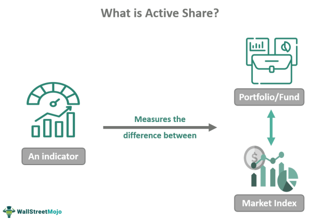

Investment portfolio management is a critical aspect of financial planning, aimed at maximizing returns while minimizing risks. This discipline involves the strategic allocation of assets, balancing both growth and security, to achieve specific financial goals. Two advanced methodologies have emerged as significant contributors to optimal portfolio performance: active share and algorithmic trading. 

Active share is a metric measuring the divergence of a portfolio's holdings from its benchmark index. Developed by financial scholars Martijn Cremers and Antti Petajisto, active share is utilized to assess the extent of active management within investment funds. It provides investors with insight into how much a fund's holdings differ from the benchmark, thus helping identify truly active managers as opposed to "closet indexers" who mimic benchmark indices while charging higher active management fees.



Algorithmic trading, often referred to as algo trading, involves using computer algorithms to execute trades at high speeds and volumes based on pre-set criteria. This approach helps in exploiting market inefficiencies by operating without human emotional biases, ensuring seamless and systematic trade execution. Common strategies within algorithmic trading include trend following, arbitrage, and market-making, each offering distinct mechanisms to capitalize on market movements.

Exploring the intersection of active share and algorithmic trading reveals their complementary nature in portfolio management. While active share provides insights into the active management of funds, algorithmic trading ensures efficient and emotion-free trade execution. Investors equipped with knowledge of both these methodologies can significantly enhance their portfolio strategies, achieving a robust balance between risk management and return optimization. Understanding the implications of active share and algorithmic trading is essential for investors seeking to harness the full potential of these modern financial tools.

## Table of Contents

## Understanding Active Share in Portfolio Management

Active Share is a crucial metric in investment portfolio management, specifically designed to measure the extent to which a portfolio diverges from its benchmark index. Developed by financial economists Martijn Cremers and Antti Petajisto, Active Share serves as a tool for evaluating the degree of active management exercised by fund managers.

The calculation of Active Share involves comparing the weights of securities in the portfolio to their weights in the benchmark index. It is expressed as a percentage, representing the proportion of a portfolio's holdings that are different from its benchmark:

$$
\text{Active Share} = \frac{1}{2} \sum_{i=1}^{n} | w_{i,p} - w_{i,b} |
$$

In this formula, $w_{i,p}$ is the weight of the $i^{th}$ asset in the portfolio, $w_{i,b}$ is the weight of the $i^{th}$ asset in the benchmark index, and $n$ is the total number of assets. A higher Active Share denotes a substantial deviation from the index, suggesting that the fund manager is actively selecting investments rather than closely mirroring the benchmark.

A key benefit of using Active Share lies in its ability to identify so-called 'closet indexers'. These are fund managers who claim to actively manage portfolios but, in reality, maintain portfolios that closely resemble their benchmarks. Such managers often result in low value-added post fees due to minimal active decision-making. Identifying these managers is crucial for investors seeking genuine active management, as high Active Share levels generally correlate with improved post-fee performance.

Investors can leverage Active Share to discern truly active managers and align their investment choices with their risk and return expectations. By focusing on portfolios with high Active Share, investors improve their chances of achieving superior returns relative to traditional index-bound investments, especially when actively managed strategies outperform specific market conditions. This focus on genuine active management allows investors to better capture market opportunities that static, benchmark-hugging strategies may overlook.

## Algorithmic Trading: An Overview

Algorithmic trading, commonly referred to as algo trading, involves the use of computers to automate trading processes based on pre-established criteria. These criteria can range from simple conditions to complex mathematical models, allowing for the systematic execution of trades at speeds and frequencies far exceeding human capabilities. The primary objective of [algorithmic trading](/wiki/algorithmic-trading) is to leverage market inefficiencies, capturing opportunities that arise due to price variances, temporal market functions, or [volume](/wiki/volume-trading-strategy) discrepancies.

Central to the appeal of algorithmic trading is its capacity to operate devoid of human emotional biases, which often lead to irrational decision-making in trading. By relying on quantitative data and pre-programmed strategies, algorithms execute trades with precision, responding to market movements without hesitation. This systematic approach ensures consistency and can significantly reduce the risks associated with emotional trading.

Algorithmic trading encompasses a variety of strategies, each designed to exploit different market conditions:

1. **Trend Following**: This strategy capitalizes on market trends without predicting future prices. By following the momentum, it buys securities when prices are on an upward trend and sells them when they start to decline.

2. **Arbitrage**: Arbitrage strategies seek to profit from price discrepancies of identical or similar financial instruments across different markets or platforms. This requires substantial computational power to quickly identify and execute trades on these temporary price differences.

3. **Market-Making**: Employed mainly by broker-dealers, this strategy entails continuously buying and selling securities to provide liquidity to the market. Algorithms help in setting bid and ask prices, ensuring transactions occur smoothly and efficiently, especially in volatile markets.

Despite its advantages, the deployment of algorithmic trading presents several challenges. To successfully implement algo trading, one must possess profound technical and market knowledge. Developing, testing, and maintaining the algorithms requires expertise in quantitative analysis, programming skills, and a thorough understanding of market dynamics. Additionally, [backtesting](/wiki/backtesting) on historical data is vital to evaluate the algorithm's potential performance and adjust strategies accordingly.

While algorithmic trading can elevate trading efficiency and profitability, it is not without risk. Algorithmic errors, such as coding mistakes or unexpected external events, can lead to significant financial loss. Hence, a rigorous validation process and robust risk management practices are indispensable in mitigating such risks. Ultimately, while algorithmic trading offers substantial benefits, it necessitates a substantial investment in both knowledge and technological infrastructure.

## The Role of Active Share in Algorithmic Trading

Combining active share metrics with algorithmic trading provides a robust framework for enhancing portfolio management. Active share measures the extent to which a portfolio's holdings deviate from its benchmark, providing critical insights for constructing a more strategic portfolio. By integrating active share into algorithmic trading systems, investors can dynamically adjust their positions to better capture deviations from benchmark index movements. 

Active share is a numerical representation that quantifies the percentage of a portfolio that does not overlap with the benchmark index. It can be defined mathematically by the formula:

$$
\text{Active Share} = \frac{1}{2} \sum_{i=1}^{N} |w_{i} - b_{i}|
$$

where $w_{i}$ represents the weight of asset $i$ in the portfolio and $b_{i}$ denotes the weight of asset $i$ in the benchmark. A greater active share indicates a higher divergence from the benchmark, suggesting potential for portfolio performance independent of benchmark trends.

Algorithmic trading allows these insights to be capitalized on swiftly. Algorithms can be designed to monitor active share metrics continuously, enabling them to execute trades immediately upon identifying significant active share changes. This integration supports dynamic and responsive portfolio adjustments, improving the agility at which a portfolio adapts to market movements.

In practice, these algorithms might utilize threshold-based systems triggered when the active share reaches certain levels, prompting reallocations to align more closely with the desired portfolio strategy. The use of Python in programmatically implementing these adjustments can be demonstrated through a simple pseudo-code snippet:

```python
def adjust_portfolio(portfolio_weights, benchmark_weights, threshold):
    active_share = calculate_active_share(portfolio_weights, benchmark_weights)
    if active_share > threshold:
        # rebalance portfolio
        new_weights = rebalance(portfolio_weights)
        execute_trades(new_weights)
    return

def calculate_active_share(portfolio_weights, benchmark_weights):
    return 0.5 * sum(abs(p - b) for p, b in zip(portfolio_weights, benchmark_weights))
```

By leveraging active share data, algorithmic trading can optimize portfolio adjustments aimed at maximizing risk-adjusted returns. This combination ensures that the portfolio maintains a strategic position in the market relative to the chosen benchmark, allowing investors to potentially exceed market returns while keeping risks in check. 

Overall, integrating active share with algorithmic trading offers investors a powerful method to enhance portfolio returns by systematically leveraging both quantitative metrics and automated execution techniques.

## Advantages and Challenges of Active Share and Algo Trading

Active Share and algorithmic trading each offer distinct advantages that can significantly enhance investment outcomes when properly implemented. Active Share is a valuable tool for evaluating the degree of active management within a portfolio. This measure aids investors in distinguishing between genuinely active managers and those who closely mirror their benchmark indices, often referred to as 'closet indexers.' By promoting transparency, Active Share encourages more informed investment decisions and potentially higher post-fee returns.

On the other hand, algorithmic trading provides several benefits rooted in technological advancements. It enables trades to be executed with speed and precision, enhancing efficiency and market accessibility. Moreover, algorithmic trading eliminates human emotional biases, ensuring that trades are conducted based on predefined rules and data-driven strategies. Common strategies like [trend following](/wiki/trend-following), [arbitrage](/wiki/arbitrage), and market-making capitalize on algorithmic efficiency to exploit market inefficiencies swiftly.

However, these methodologies are not without challenges. The implementation of algorithmic trading demands substantial technical expertise. Developing effective trading algorithms requires a deep understanding of both programming and financial markets, and there's a significant risk associated with algorithmic errors. These errors can lead to substantial financial losses if not appropriately addressed. Thus, rigorous testing and validation are necessary to ensure reliability and performance.

Furthermore, the success of algorithmic trading hinges on a comprehensive understanding of historical data and meticulous backtesting. Accurate historical data analysis is indispensable for detecting patterns and testing strategies under various market conditions. Backtesting algorithms across diverse scenarios helps in refining models and enhancing their robustness.

Despite these potential limitations, the integration of Active Share and algorithmic trading strategies can considerably boost investment success. Their combined application provides a comprehensive framework for dynamic and informed portfolio management, promoting the pursuit of enhanced returns while mitigating risks. As technology continues to shape the financial landscape, these tools will likely play an increasingly crucial role in modern investment strategies.

## Strategies for Implementing Successful Portfolio Management

Incorporating active share analysis into portfolio management is vital for identifying credible active managers who can outperform benchmark indices. Active share measures the degree to which a portfolio's holdings differ from a benchmark, with higher values indicating more significant divergence. By utilizing active share, investors can discern "truly active" managers from "closet indexers" who merely track indices while claiming active management. Investors should consider favoring managers with a high active share, suggesting a proactive approach to achieving superior risk-adjusted returns.

Algorithmic trading is a robust tool that allows for rapid trade execution and access to new market opportunities, based on predefined criteria and models. The use of algorithms helps exploit market inefficiencies without the interference of human emotions. This technological approach focuses on speed and precision. For effective portfolio management, leveraging algorithms that can quickly interpret market data and execute trades can lead to increased efficiency and cost-effectiveness. For instance, algorithmic strategies such as Trend Following—where trades are executed based on observed market patterns—can be programmed for portfolios aiming at capturing market shifts.

Diversification strategies like [statistical arbitrage](/wiki/statistical-arbitrage) and sector rotation are pivotal for reducing portfolio risk and enhancing potential returns. Statistical arbitrage involves using statistical models to exploit price discrepancies among related financial instruments, capitalizing on the theory that these anomalies will eventually correct themselves. Meanwhile, sector rotation focuses on allocating assets to different sectors based on economic cycles, improving exposure to outperforming areas while minimizing losses in underperforming ones. These strategies aid in maintaining a balanced and diversified portfolio capable of weathering various market conditions.

Continuous monitoring and adjustment of portfolios are crucial for adaptability and optimization. Financial markets are dynamic, and portfolios must be adjusted in real-time to reflect changing market conditions, regulatory environments, and economic indicators. This ongoing process involves reassessing assets, rebalancing portfolios, and updating algorithmic models to ensure alignment with evolving market trends and investment goals.

Lastly, aligning algorithms with your investment objectives and risk appetite is essential. Algorithms should be carefully calibrated to reflect investor goals, be it growth, value, income, or a hybrid strategy. This includes setting appropriate risk parameters and ensuring the selected algorithmic strategies correspond with the investor's tolerance levels. Robust backtesting of these algorithms using historical data is necessary to validate their efficacy and reliability before implementing them in a live trading environment.

By following these strategies, investors can employ a comprehensive approach to portfolio management, blending traditional financial analysis with modern technological advancements, thus maximizing potential returns while effectively managing risks.

## Conclusion

The synergy between active share and algorithmic trading provides a robust framework for effective portfolio management. By integrating these methodologies, investors have the potential to achieve enhanced returns while reducing associated risks. This combination allows for a more responsive and adaptive approach to investing, leveraging the strengths of both active management and automated trading systems.

Staying informed about advancements in active share analysis and algorithmic trading is crucial for capitalizing on their full benefits. The financial markets are continually evolving, and understanding the latest developments in these areas can significantly impact an investor's success. Educating oneself about new algorithmic strategies, technological innovations, and market dynamics is essential for maintaining a competitive edge. 

Utilizing these tools effectively requires a deep comprehension of both market behavior and technological systems. The successful implementation of active share insights and algorithmic strategies demands not only a theoretical understanding but also practical expertise in coding and data analysis. Investors and fund managers need to possess the skills to develop, test, and implement complex trading algorithms that can adapt to changing market conditions.

The future of portfolio management lies in the integration of modern strategies with tried-and-true investment principles. While active share and algorithmic trading provide advanced techniques for gaining an edge, they should be balanced with traditional approaches to investment, such as diversification and risk management. This balance ensures that portfolios are not only optimized for performance but also resilient to market fluctuations. Embracing this hybrid approach will likely define successful investment strategies in the years to come.

## References & Further Reading

[1]: Cremers, M., & Petajisto, A. (2009). ["How Active Is Your Fund Manager? A New Measure That Predicts Performance."](https://papers.ssrn.com/sol3/papers.cfm?abstract_id=891719) The Review of Financial Studies, 22(9), 3329-3365.

[2]: De Prado, M. L. (2018). ["Advances in Financial Machine Learning."](https://www.amazon.com/Advances-Financial-Machine-Learning-Marcos/dp/1119482089) Wiley.

[3]: Aronson, D. R. (2007). ["Evidence-Based Technical Analysis: Applying the Scientific Method and Statistical Inference to Trading Signals."](https://www.amazon.com/Evidence-Based-Technical-Analysis-Scientific-Statistical/dp/0470008741) John Wiley & Sons.

[4]: Jansen, S. (2020). ["Machine Learning for Algorithmic Trading."](https://github.com/stefan-jansen/machine-learning-for-trading) Packt Publishing.

[5]: Chan, E. P. (2009). ["Quantitative Trading: How to Build Your Own Algorithmic Trading Business."](https://github.com/ftvision/quant_trading_echan_book) Wiley.