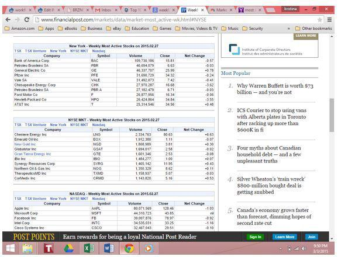

Investing in the stock market often sparks interest and curiosity among both novice and experienced investors. The dynamic interplay of active stocks and algorithmic trading constitutes a significant portion of the current trading landscape, driving the attention of traders and analysts alike. Active stocks, characterized by high trading volumes, provide a window into market sentiments, offering potential insights into liquidity and price movements. These stocks, frequently discussed within financial circles, include names such as Apple, Microsoft, and Amazon, which dominate lists of most actively traded stocks.

Within this environment, algorithmic trading, or algo trading, has emerged as a groundbreaking approach, leveraging computer algorithms to execute trades based on predefined criteria. This method reduces the emotional aspect of trading, adopting a data-driven strategy to optimize outcomes. By employing strategies such as trend-following and arbitrage, algorithmic trading facilitates high-frequency transactions with precision and speed that are humanly unattainable.



As we navigate through the article, we will explore the advantages and considerations of these strategies, focusing on aspects like high liquidity and cutting-edge technology. The aim is to unravel the intricacies of investing by understanding how active stocks can provide timely market insights and how algorithmic trading can enhance decision-making processes. This comprehensive analysis aims to equip investors with the knowledge to capitalize on opportunities within the ever-evolving world of active stocks and algorithmic trading.

## Table of Contents

## Understanding Active Stocks

Active stocks are characterized by high trading volumes, capturing the interest of both individual and institutional traders due to the potential for significant price movements and liquidity. High trading volumes suggest a high level of activity and interest in a particular stock, which often translates into volatility and opportunities for profit. The liquidity of active stocks means that transactions can be executed quickly without significantly affecting the stock's price, which is particularly beneficial for traders seeking to enter and exit positions swiftly.

Another attribute of active stocks is the large number of outstanding shares, which typically leads to a lower bid-ask spread. A narrower spread indicates that the price buyers are willing to pay is closer to what sellers are asking, highlighting the stock’s liquidity and making it attractive for high-frequency trading strategies. 

Major companies like Apple, Microsoft, and Amazon frequently appear among the most actively traded stocks. These corporations not only dominate in terms of market capitalization but also benefit from substantial trading activity driven by both speculative and institutional demand. Awareness of active stocks allows investors to interpret market sentiments and movements. For instance, sudden increases in trading [volume](/wiki/volume-trading-strategy) might suggest news, events, or shifts in speculative sentiment, making these stocks vital indicators of broader market trends.

By tracking active stocks, investors can make informed decisions about timing their trades, optimizing their strategy to leverage the [liquidity](/wiki/liquidity-risk-premium) and [momentum](/wiki/momentum) these stocks provide. This understanding is crucial for responsive and effective engagement with rapidly changing market conditions.

## Algorithmic Trading: A Revolution in Investment

Algorithmic trading, often referred to as algo trading, employs sophisticated computer programs to execute trades based on a set of predefined criteria. This technological innovation is transforming the trading environment by mitigating the influence of human emotions on trading decisions. By relying on data-driven strategies, [algorithmic trading](/wiki/algorithmic-trading) provides a more structured approach to market participation.

One of the primary advantages of algo trading is its ability to implement a variety of strategies with high efficiency. Common strategies include:

1. **Trend-Following**: This strategy involves identifying market trends using historical data and executing trades accordingly. The core concept is to capitalize on market momentum by buying securities when prices are rising and selling when prices are falling. 

2. **Arbitrage**: Arbitrage strategies exploit price differences of the same asset across different markets or forms. By simultaneously buying and selling an asset in different markets, traders can lock in profits from the temporary inefficiencies in pricing.

3. **Mean Reversion**: Based on the statistical concept that asset prices tend to revert to a long-term mean or average level, this strategy identifies securities that have deviated from their historical mean and executes trades with the expectation that prices will return to this historical norm.

These strategies are typically implemented through high-frequency trading ([HFT](/wiki/high-frequency-trading-strategies)), which involves executing a large number of orders at extremely fast speeds. The ability of algorithms to analyze vast amounts of data and execute trades within fractions of a second provides a competitive edge that is beyond human capability.

Despite the substantial benefits of automation and speed, algo trading necessitates continuous vigilance to manage technological and market risks effectively. Technological failures, such as algorithm errors or system outages, can have significant adverse effects, while market conditions can rapidly change, impacting the defined strategies.

Traders engaged in algo trading must therefore ensure robust systems are in place, with continuous monitoring and adaptation of strategies to changing markets. Furthermore, understanding regulatory environments and maintaining compliance is crucial, as the landscape of algo trading is subject to stringent oversight to preserve market stability and integrity. 

Algorithmic trading remains a key driver of modern financial markets, offering unmatched precision and efficiency, yet it requires a comprehensive grasp of both technology and market behavior to harness its full potential effectively.

## Active Stocks vs. Algorithmic Trading

Active stocks and algorithmic trading are two distinct yet complementary elements in modern investment strategies. Active stocks are characterized by high trading volumes, often driven by market conditions and investor sentiment. These stocks offer significant liquidity, which enables investors to quickly enter and [exit](/wiki/exit-strategy) positions. Investors focusing on active stocks closely monitor market reactions and liquidity to capitalize on short-term price movements and opportunities arising from market dynamics.

In contrast, algorithmic trading employs technology, specifically computer algorithms, to execute trades based on pre-set criteria. These algorithms analyze vast amounts of data to predict market trends and execute trades at a speed and precision unattainable by human traders. Common strategies in algorithmic trading include trend-following, [arbitrage](/wiki/arbitrage), and mean reversion, each designed to leverage specific patterns in market data.

The key distinction lies in the approach: active stock investors depend on immediate market reactions, while algo traders rely on rapid execution and data-driven decision-making. This raises an important consideration for investors: balancing the insight gained from active stocks with the precision of algorithmic execution can significantly enhance portfolio performance.

Integrating both strategies offers a robust approach, allowing investors to navigate market [volatility](/wiki/volatility-trading-strategies) while seizing short-term opportunities. For instance, active stocks can inform traders of current market sentiments that could be quickly exploited using algorithmic strategies. The fusion of these approaches supports a more comprehensive risk management and opportunity capturing framework, crucial in today's fast-paced financial markets. By employing a combined strategy, investors can better position themselves to absorb shocks from market fluctuations and optimize returns.

## Implementing Algo Trading: Challenges and Considerations

Successful algorithmic trading is a multifaceted endeavour that hinges on the integration of technology, data, and strategic insights. The backbone of effective algo trading includes advanced technological infrastructure, access to reliable data feeds, and thorough [backtesting](/wiki/backtesting) capabilities.

Firstly, technology infrastructure is paramount. This includes not just powerful computing hardware but also sophisticated software solutions capable of executing trades at lightning speeds. High-frequency trading strategies, for instance, may require processing large volumes of data in real time and executing trades within microseconds to capitalize on fleeting market opportunities. The use of programming languages like Python is prevalent in this domain, thanks to its extensive libraries and frameworks for data analysis, such as NumPy and pandas.

A rudimentary Python script for backtesting a simple moving average crossover strategy could look like this:

```python
import pandas as pd

# Load historical data
data = pd.read_csv('historical_stock_prices.csv')
data['SMA_50'] = data['Close'].rolling(window=50).mean()
data['SMA_200'] = data['Close'].rolling(window=200).mean()

# Generate trading signals
data['Signal'] = 0
data.loc[data['SMA_50'] > data['SMA_200'], 'Signal'] = 1
data.loc[data['SMA_50'] < data['SMA_200'], 'Signal'] = -1

# Calculate returns
data['Market_Returns'] = data['Close'].pct_change()
data['Strategy_Returns'] = data['Market_Returns'] * data['Signal'].shift(1)

# Calculate cumulative returns
cumulative_returns = (1 + data['Strategy_Returns']).prod() - 1
print(f"Cumulative Strategy Returns: {cumulative_returns:.2%}")
```

Besides technology, access to high-quality, real-time data feeds is critical. These feeds must provide accurate and timely information to ensure the algorithm's output is relevant. Discrepancies in data or delays can lead to missed opportunities or erroneous trades.

Robust backtesting capabilities are another cornerstone, enabling traders to simulate strategies against historical data to evaluate their potential viability. This process involves historical data analysis to understand how a strategy would have performed in different market conditions.

However, the implementation of algorithmic trading is fraught with challenges. Technology failures can occur, and even minor disruptions can result in significant financial losses. Traders also face market disruptions that can render algorithms ineffective, highlighting the need for constant strategy refinement and adaptation.

Moreover, algo trading often requires a substantial initial investment in technology, with additional costs incurred to maintain compliance with ever-evolving regulatory standards. Organizations must stay abreast of regulatory changes to avoid legal pitfalls, which often necessitate dedicated resources or personnel.

Despite these challenges, the advantages of algorithmic trading—such as precision and the elimination of emotional decision-making—often surpass the difficulties involved. For those who navigate these barriers effectively, the potential for enhanced trading performance and risk management makes algorithmic trading a compelling choice.

## Conclusion: The Future of Investing with Active Stocks and Algo Trading

The synergy between active stocks and algorithmic trading represents a significant frontier in modern finance and investing. Active stocks, known for their high liquidity and dynamic market behavior, offer numerous opportunities for investors to harness market momentum and sentiment. Algorithmic trading complements this by providing precise, data-driven execution strategies that can operate at speeds and efficiencies unattainable by human traders alone. 

For investors, the ability to adapt to both liquidity-driven decisions and algorithm-driven execution will define future success. As financial markets become increasingly interconnected and complex, the speed and accuracy of algorithmic trading offer a distinct advantage. By utilizing algorithms, traders can execute large volumes of trades with minimal market impact, optimize transaction costs, and quickly adjust to new information or trends.

Ongoing education and adaptation are essential as market conditions and technologies continue to evolve. Investors must be vigilant in keeping up-to-date with both the latest market developments and advancements in trading technologies. This involves continuous learning to understand new algorithmic strategies and to critically assess the evolving market landscape for active stocks. The use of [machine learning](/wiki/machine-learning) and [artificial intelligence](/wiki/ai-artificial-intelligence) within algorithmic trading is expected to increase, providing even more sophisticated tools for identifying and capitalizing on market opportunities.

By staying informed and leveraging these tools effectively, investors can maximize their potential gains and minimize risks in the ever-changing stock market landscape. Proper integration of active stock knowledge with algorithmic trading capabilities not only enhances decision-making but also provides a framework to mitigate risks associated with volatility and unforeseen market shifts. Successful investors will be those who can seamlessly blend liquidity insights from active stocks with the precision offered by algorithms, creating a diversified and resilient investment strategy.

## References & Further Reading

[1]: Bergstra, J., Bardenet, R., Bengio, Y., & Kégl, B. (2011). ["Algorithms for Hyper-Parameter Optimization"](https://dl.acm.org/doi/10.5555/2986459.2986743). Advances in Neural Information Processing Systems.

[2]: ["Advances in Financial Machine Learning"](https://www.amazon.com/Advances-Financial-Machine-Learning-Marcos/dp/1119482089) by Marcos Lopez de Prado.

[3]: ["Evidence-Based Technical Analysis: Applying the Scientific Method and Statistical Inference to Trading Signals"](https://www.amazon.com/Evidence-Based-Technical-Analysis-Scientific-Statistical/dp/0470008741) by David Aronson.

[4]: ["Machine Learning for Algorithmic Trading: Predictive Models to Extract Signals from Market and Alternative Data for Systematic Trading Strategies"](https://www.amazon.com/Machine-Learning-Algorithmic-Trading-alternative/dp/1839217715) by Stefan Jansen.

[5]: ["Quantitative Trading: How to Build Your Own Algorithmic Trading Business"](https://github.com/LucindaYa/quant-resources/blob/master/Quantitative%20Trading%20How%20to%20Build%20Your%20Own%20Algorithmic%20Trading%20Business.pdf) by Ernest P. Chan.

[6]: Aldridge, I. (2013). ["High-Frequency Trading: A Practical Guide to Algorithmic Strategies and Trading Systems"](https://books.google.com/books/about/High_Frequency_Trading.html?id=6l0DDQAAQBAJ). Wiley.

[7]: Narang, R. K. (2013). ["Inside the Black Box: A Simple Guide to Quantitative and High-Frequency Trading"](https://onlinelibrary.wiley.com/doi/book/10.1002/9781118662717). Wiley.