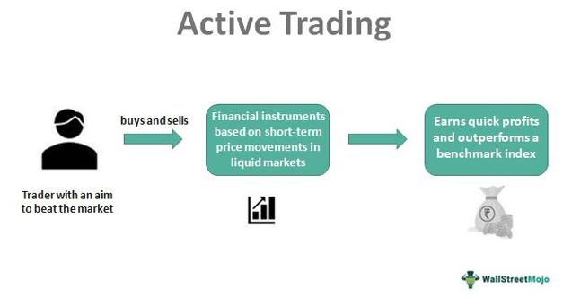

In the ever-evolving financial markets, investment strategies are crucial for maximizing returns and mitigating risks. Investors worldwide continuously seek methods to enhance their portfolios by employing a variety of trading techniques tailored to their goals. This article examines various trading strategies, with a particular focus on active trading and algorithmic trading—commonly known as algo trading. These strategies represent distinctive approaches to engaging with the market, each offering unique methods to capitalize on financial opportunities.

Active trading involves a hands-on approach where investors aim to benefit from short-term price fluctuations through frequent buying and selling of securities. Its success relies heavily on understanding market trends and timing trades accurately. In contrast, algorithmic trading leverages computer algorithms to execute trades based on predefined criteria. This method promises greater speed and accuracy, removing emotional biases that can affect trading decisions.



By exploring fundamental concepts and strategies, this article aims to shed light on the advantages and limitations of each approach and their significance in modern investing. This examination provides valuable insights to help investors make informed decisions. By understanding different techniques, investors can tailor their strategies to match their financial objectives and risk tolerance.

In contemporary investing, the importance of selecting an appropriate strategy cannot be understated, as it is intrinsically linked to achieving desired financial outcomes. Consequently, a comprehensive understanding of active and algorithmic trading strategies is essential for any investor looking to optimize their returns while effectively managing risk. Through this exploration, investors are encouraged to continually refine their approaches, adapting to the ever-changing landscape of global markets.

## Table of Contents

## Understanding Active Trading

Active trading is a strategy characterized by the frequent buying and selling of securities, aiming to capitalize on short-term price fluctuations. Unlike passive investing, which focuses on a buy-and-hold approach, active trading involves more continuous market participation and significant transaction activity, allowing traders to potentially benefit from small market movements. 

Several types of active trading exist, each with its distinct time frames and strategies:

1. **Day Trading**: This involves executing multiple trades within a single day, with positions closed by the end of the trading session. Traders aim to profit from small intraday price movements, and they typically utilize the leverage provided by brokers to amplify their gains. Minimal overnight risk is a hallmark of day trading.

2. **Swing Trading**: Positions are held for several days or even weeks. Swing traders aim to capture medium-term price patterns or "swings" in the market, and they rely heavily on technical analysis to spot trading opportunities. This method bridges the gap between day trading and long-term investing.

3. **Scalping**: Scalping focuses on making numerous small profits throughout the day by holding positions for seconds or minutes. Scalpers believe that more frequent trading allows them to accumulate significantly greater profits over time, despite each trade’s small individual profit margin.

Active traders utilize technical analysis, which involves the study of past market data, primarily price and [volume](/wiki/volume-trading-strategy). By examining historical data, traders identify patterns and trends that suggest future movements. Commonly used technical indicators include moving averages, oscillators, and Fibonacci retracement levels, which help traders make informed entry and [exit](/wiki/exit-strategy) decisions.

Key characteristics of active trading include high trade volume, short holding periods, and a focus on technical indicators. The success of active trading strategies relies significantly on the trader’s ability to make quick decisions and respond to market changes. High trade volumes result from the rapid buying and selling involved, while short holding periods minimize exposure to market risks and overnight events.

Traders engaging in active trading seek superior returns through skillful market timing and strategic decision-making. These strategies are not without challenges, such as the need for speed, significant transaction costs, and the potential for substantial losses if market predictions are incorrect. Despite these challenges, active trading remains a viable option for those looking to harness market [volatility](/wiki/volatility-trading-strategies) to their advantage.

## Popular Active Trading Strategies

Active trading strategies are designed to capitalize on short-term market movements, utilizing various approaches to maximize returns. Below, we explore some of the most popular strategies utilized by active traders: [day trading](/wiki/day-trading-spy), [scalping](/wiki/gamma-scalping), swing trading, and [momentum](/wiki/momentum) trading.

### Day Trading

Day trading is characterized by the execution of multiple trades within a single trading day. Traders aim to exploit small price movements to make profits, closing all positions before the market closes. This strategy demands a significant time commitment, as traders need to constantly monitor the markets and react quickly to price changes. 

#### Advantages
- **Liquidity**: Day traders typically focus on highly liquid stocks, ensuring quick transactions.
- **Risk Management**: No overnight risk as all positions are closed at the end of the day.

#### Challenges
- **High Transaction Costs**: Frequent trading can lead to higher brokerage fees.
- **Time-Intensive**: Constant monitoring and fast decision-making are essential, making it a suitable strategy for those who can dedicate their days to trading.

### Scalping

Scalping involves making numerous small profits by holding positions for very short periods, sometimes just seconds or minutes. The main objective is to achieve a high volume of trades with minimal price changes leading to small gains that accumulate over time.

#### Advantages
- **Minimal Exposure**: Limited market exposure reduces the risk of negative news affecting positions.
- **High Win Ratio**: Many trades result in small profits, which accumulate over time.

#### Challenges
- **Execution Speed**: Rapid decision-making and high-speed trading platforms are crucial.
- **Higher Costs**: Like day trading, frequent transactions lead to increased transaction costs.

### Swing Trading

Swing trading involves holding positions for several days to take advantage of medium-term price patterns or market swings. This strategy relies on technical analysis to identify trends and potential price reversals.

#### Advantages
- **Flexibility**: Traders can work on swing trading strategies without needing to monitor the market constantly.
- **Balanced Risk**: Holding stocks for days allows capturing more meaningful price movements while mitigating some intraday volatility.

#### Challenges
- **Overnight Risk**: Positions are exposed to overnight market risks, such as after-hours news or economic reports.
- **Requires Technical Knowledge**: Proficient use of technical indicators and chart patterns is essential for success.

### Momentum Trading

Momentum trading capitalizes on the continuance of existing market trends. Traders buy stocks experiencing upward trends or short-sell those in downward trends. The strategy assumes that securities with high momentum will continue on their trajectory.

#### Advantages
- **Strong Potential Returns**: Riding high momentum stocks can lead to significant gains.
- **Clear Entry/Exit Signals**: Traders rely on momentum indicators, such as the Moving Average Convergence Divergence (MACD) or the Relative Strength Index (RSI), for clear signals.

#### Challenges
- **Trend Reversal Risk**: Sudden market reversals can lead to significant losses.
- **Requires Quick Adaptation**: Adjusting to changing market conditions swiftly is essential for maintaining profitability.

Active trading strategies offer various paths for traders to achieve their financial objectives, each with its unique set of advantages and challenges. Successful traders often combine multiple strategies and continuously adapt to market conditions to optimize their trading outcomes.

## Insights into Algorithmic Trading

Algorithmic trading, often referred to as algo trading, is a method of executing trades through the use of computer algorithms that follow pre-defined instructions and strategies. This approach significantly enhances trading efficiency by removing human emotions from decision-making processes, thus relying solely on automated, quantitative analysis. Unlike manual trading, where decisions are influenced by emotions such as fear or greed, algorithms make decisions based on logical and consistent criteria.

One of the primary benefits of [algorithmic trading](/wiki/algorithmic-trading) is its speed and precision. Algorithms can process market data and execute trades much faster than any human trader. This speed is crucial in today's fast-paced financial markets, where the slightest delay can have significant implications. Additionally, algorithmic trading enables [backtesting](/wiki/backtesting) of strategies using historical data. Backtesting involves the application of trading strategies to historical market data to assess their viability before implementation. This ability reduces the risk of potential losses and increases the probability of success by refining strategies based on empirical results.

Common use cases for algorithmic trading include [arbitrage](/wiki/arbitrage), [market making](/wiki/market-making), and high-frequency trading ([HFT](/wiki/high-frequency-trading-strategies)). Arbitrage involves exploiting price discrepancies of the same asset across different markets, a task well-suited for algorithms due to their speed in identifying and acting on these opportunities. Market making provides [liquidity](/wiki/liquidity-risk-premium) to the markets by buying and selling at public quotes. Automated systems can quickly update these quotes following market conditions, enhancing market efficiency. HFT involves executing a large number of orders at extremely high speeds, capturing minuscule price differentials. Algorithms are particularly advantageous in HFT, as they can execute trades in milliseconds.

Implementing algorithmic trading strategies requires robust tools and platforms. Python has emerged as a popular programming language for deploying such strategies due to its extensive libraries and ease of use. Libraries like Pandas and NumPy facilitate data handling and manipulation, while Matplotlib and Seaborn offer powerful data visualization capabilities. Machine learning libraries, such as Scikit-learn and TensorFlow, enable the integration of predictive models that can enhance trading strategies through data-driven insights.

Platforms like MetaTrader and [Interactive Brokers](/wiki/interactive-brokers-api) API provide the infrastructure for executing algorithmic trades. These platforms allow traders to script their algorithms, test them in simulated environments, and, eventually, deploy them in live markets. Additionally, these platforms possess features like advanced charting, risk management tools, and extensive historical data access, which are crucial for developing sophisticated trading strategies.

In conclusion, algorithmic trading represents a leap forward in trading efficiency, accuracy, and execution speed. By automating the trading process, investors can capitalise on functional opportunities that arise from short-lived market conditions, integrating quantitative analysis with technological advancements to achieve optimal trading outcomes.

## Top Algorithmic Trading Strategies

Algorithmic trading involves the use of sophisticated algorithms to automate investment decisions, aiming to capitalize on market opportunities with precision and speed. Here, we explore some of the prominent algorithmic trading strategies, highlighting their principles, advantages, and challenges.

### Trend Following

Trend following is a strategy where algorithms identify and act upon persistent market trends over a predetermined period. The underlying principle is based on the hypothesis that asset prices exhibit inertia and will continue in their current trajectory rather than reverse. Trend following can be applied by analyzing technical indicators such as moving averages, momentum indicators, or price channels.

Mathematically, traders often utilize moving average crossovers to signal trades. For instance, a common method is the dual moving average crossover, where a short-term moving average (SMA) crossing above a long-term moving average signals a buy, while the opposite indicates a sell.

```python
import pandas as pd

def moving_average_cross_strategy(data, short_window, long_window):
    """Implement a simple moving average crossover strategy."""
    data['Short_MA'] = data['Close'].rolling(window=short_window, min_periods=1).mean()
    data['Long_MA'] = data['Close'].rolling(window=long_window, min_periods=1).mean()

    data['Signal'] = 0
    data['Signal'][short_window:] = np.where(data['Short_MA'][short_window:] > data['Long_MA'][short_window:], 1, -1)
    data['Position'] = data['Signal'].diff()

    return data
```
### Mean Reversion

Mean reversion strategies are predicated on the idea that asset prices will revert to their historical mean over time. Such strategies become beneficial when assets deviate significantly from their average values, signaling a potential buying or selling opportunity.

A classic tool for implementing mean-reversion strategies is the Bollinger Bands, which applies standard deviations above and below a moving average to identify overbought or oversold conditions.

```python
def compute_bollinger_bands(data, window, num_sd):
    """Calculate Bollinger Bands using rolling mean and standard deviation."""
    data['Rolling_Mean'] = data['Close'].rolling(window=window).mean()
    data['Rolling_Std'] = data['Close'].rolling(window=window).std()
    data['Upper_Band'] = data['Rolling_Mean'] + (data['Rolling_Std'] * num_sd)
    data['Lower_Band'] = data['Rolling_Mean'] - (data['Rolling_Std'] * num_sd)

    return data
```

### Statistical Arbitrage

Statistical arbitrage involves using quantitative models to exploit price inefficiencies among related financial instruments. Pairs trading is a common approach, where the strategy involves identifying two historically correlated assets and taking long and short positions depending on the deviation from their mean price ratio.

Statistical arbitrage heavily relies on statistical tests and [machine learning](/wiki/machine-learning) models to identify co-integrated pairs and to automate decision-making processes.

### Machine Learning Models in Trading

Machine learning models in trading use advanced data analytics techniques to predict future price movements based on historical patterns and relationships. These models can deal with vast amounts of data and complex relationships, which traditional approaches might overlook.

Models such as random forests, support vector machines, and neural networks have been particularly successful in developing predictive trading algorithms.

```python
from sklearn.ensemble import RandomForestRegressor
from sklearn.model_selection import train_test_split

# Assuming data is a Pandas DataFrame with relevant features
def train_random_forest_model(data, target):
    """Train a Random Forest model for trading predictions."""
    features = data.drop(columns=[target])
    target_values = data[target]

    X_train, X_test, y_train, y_test = train_test_split(features, target_values, test_size=0.2, random_state=42)

    model = RandomForestRegressor(n_estimators=100)
    model.fit(X_train, y_train)
    predictions = model.predict(X_test)

    return model, predictions
```

Each of these strategies has its advantages and trade-offs, often determined by their implementation, market conditions, and the complexity of the algorithmic models used. Understanding these strategies enables investors to harness the power of technology in constructing portfolios that match their risk and return objectives.

## Comparing Active Trading and Algorithmic Trading

Active trading and algorithmic trading represent two distinct approaches to engaging in financial markets, each with its own set of advantages and limitations. Understanding these differences is crucial for investors seeking to align their strategy with personal financial goals and market conditions.

Active trading relies significantly on the trader's intuition and ability to respond to short-term market movements. This approach often involves strategies such as day trading and swing trading, where decisions are made based on real-time technical analysis and market sentiment. Active traders typically deal with high trade volumes and need to remain constantly informed about market changes to capitalize on fleeting opportunities. One of the primary advantages of active trading is the potential for high returns in a short period. Moreover, the adaptability and quick decision-making enabled by human intuition can sometimes outpace algorithmic responses in unexpected market conditions.

However, active trading has its limitations, particularly concerning cost and speed. Frequent trading incurs high transaction costs, including brokerage fees and taxes, which can erode profits. Additionally, the reliance on human decisions introduces the risk of emotional bias, which can lead to suboptimal trading outcomes. As active trading requires constant monitoring of the markets, it can also be time-consuming and stressful for individual traders.

In contrast, algorithmic trading uses computer algorithms to execute trades without human intervention. These algorithms follow pre-programmed rules based on quantitative analysis, removing the emotional component from trading decisions. The primary advantage of algorithmic trading lies in its speed and precision. Algorithms can process vast amounts of data and execute orders much faster than a human trader, which is crucial in markets where price differences last for fractions of a second. Moreover, algorithms can operate 24/7, taking advantage of opportunities that arise outside of standard trading hours.

Risk management is another area where algorithmic trading typically excels. Algorithms can be backtested using historical data to assess their performance and adjust parameters to optimize outcomes. This capability allows for more robust and disciplined risk management compared to active trading.

Nonetheless, algorithmic trading has its challenges. The development and maintenance of effective algorithms require significant technical expertise and resources, which may not be accessible to all investors. Additionally, while algorithms are excellent at executing specific predefined strategies, they may struggle in markets where conditions change rapidly or unpredictably, as they lack the human intuition to adapt on the fly.

When comparing both approaches in terms of costs, speed, risk management, and the role of technology, a few clear differences emerge. Active trading is generally more cost-intensive due to higher transaction fees and tax implications, while algorithmic trading incurs initial and ongoing costs related to technology and data analysis. Speed is a defining characteristic of algorithmic trading, capable of executing trades in milliseconds, whereas active trading relies on human reflexes and decision-making speed. In risk management, algorithmic trading's ability to quantify and evaluate strategies provides a systematic approach, whereas active trading depends on the trader's subjective assessment and experience.

In conclusion, the choice between active trading and algorithmic trading should be guided by the investor's goals, risk tolerance, investment horizon, and available resources. While active trading offers flexibility and the potential for substantial short-term gains, it demands time, attention, and tolerance for risk. On the other hand, algorithmic trading provides efficiency, scalability, and disciplined risk management but requires significant upfront investment in technology and expertise. Ultimately, an investor's preference for either strategy will hinge on their unique circumstances and financial objectives.

## Conclusion

Investment strategies in trading necessitate a comprehensive understanding of both market dynamics and an investor's personal financial goals. Active trading and algorithmic trading present distinct methodologies for leveraging market movements, each with its set of benefits and challenges.

Active trading characteristically involves a hands-on approach, where traders rely on their intuition and analysis to make quick decisions within short time frames. This strategy can be particularly appealing to those who thrive in fast-paced environments and have higher risk tolerance. Active traders must stay abreast of market trends and news, requiring significant time and commitment.

In contrast, algorithmic trading offers a more systematic approach, utilizing computer algorithms to execute trades based on predefined criteria without human intervention. This strategy relies heavily on speed, accuracy, and the ability to process and analyze large volumes of data swiftly. Algorithmic trading can be attractive to those with a more analytical mindset or those who wish to conduct trading with minimal emotional influence.

Choosing the right strategy is contingent upon several factors, including risk tolerance, investment horizon, and available resources. Investors with a higher risk tolerance and shorter investment horizons might gravitate towards active trading techniques, while those seeking a less hands-on approach with potentially longer horizons may prefer algorithmic trading.

Continual learning and adaptation are vital in the ever-evolving financial markets. Market conditions are in constant flux, influenced by global events, technological advancements, and economic changes. By staying informed and adaptable, investors can effectively navigate these changes and maintain a competitive edge.

In conclusion, investors should consider exploring a variety of trading strategies to enhance their market proficiency. By understanding and leveraging different techniques, investors can tailor their approach to align with their financial goals and risk appetite, potentially achieving better outcomes in their investment endeavors.

## References & Further Reading

[1]: Bergstra, J., Bardenet, R., Bengio, Y., & Kégl, B. (2011). ["Algorithms for Hyper-Parameter Optimization."](https://dl.acm.org/doi/10.5555/2986459.2986743) Advances in Neural Information Processing Systems 24.

[2]: ["Advances in Financial Machine Learning"](https://www.amazon.com/Advances-Financial-Machine-Learning-Marcos/dp/1119482089) by Marcos Lopez de Prado

[3]: ["Evidence-Based Technical Analysis: Applying the Scientific Method and Statistical Inference to Trading Signals"](https://www.amazon.com/Evidence-Based-Technical-Analysis-Scientific-Statistical/dp/0470008741) by David Aronson

[4]: ["Machine Learning for Algorithmic Trading"](https://github.com/stefan-jansen/machine-learning-for-trading) by Stefan Jansen

[5]: ["Quantitative Trading: How to Build Your Own Algorithmic Trading Business"](https://www.amazon.com/Quantitative-Trading-Build-Algorithmic-Business/dp/1119800064) by Ernest P. Chan