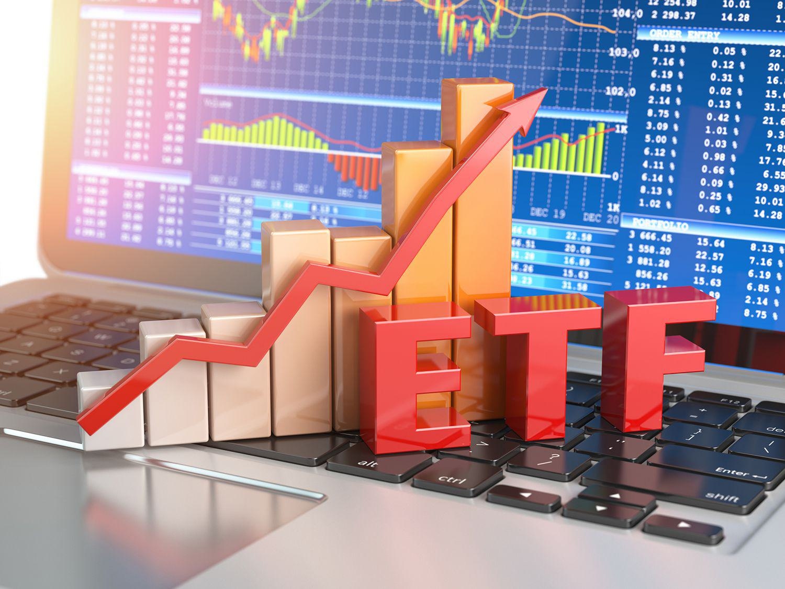

## Table of Contents

## What is an actively managed ETF?

An actively managed ETF is a type of exchange-traded fund where a professional manager or a team of managers actively makes decisions about which investments to buy and sell. Unlike passively managed ETFs, which simply track an index like the S&P 500, actively managed ETFs aim to beat the market by using the manager's expertise and strategies. This means the fund's holdings can change frequently based on the manager's decisions.

These ETFs often have higher fees compared to passively managed funds because of the costs associated with active management, such as research and trading expenses. However, investors might be willing to pay these higher fees if they believe the fund manager can achieve better returns than the market. Actively managed ETFs can be a good choice for investors who want professional management and the potential for higher returns, but they should be aware of the increased costs and risks involved.

## How do actively managed ETFs differ from passively managed ETFs?

Actively managed ETFs and passively managed ETFs are two different ways to invest in the stock market. Actively managed ETFs have a person or a team of people who decide what stocks or other investments to buy and sell. They try to pick investments that will do better than the overall market. This means the investments in the ETF can change a lot, depending on what the managers think is best.

On the other hand, passively managed ETFs are designed to follow a specific index, like the S&P 500. They don't try to beat the market; instead, they aim to match the performance of the index they track. The investments in a passively managed ETF don't change much, except when the index itself changes. Because they don't need people to actively make decisions, passively managed ETFs usually have lower fees than actively managed ETFs.

The main differences between the two are the way they are managed and their costs. Actively managed ETFs might have higher fees because they need to pay for the managers' time and research. But, some people are willing to pay more if they think the managers can pick investments that will do better than the market. Passively managed ETFs are cheaper and simpler, but they won't outperform the market; they just aim to keep up with it.

## What are the main goals of actively managed ETFs?

The main goal of actively managed ETFs is to beat the market. This means they try to do better than indexes like the S&P 500. To do this, the people who manage the ETF make choices about which stocks or other investments to buy and sell. They use their knowledge and research to pick investments they think will go up in value more than the overall market.

Because actively managed ETFs need people to make these decisions, they usually cost more than passively managed ETFs. Investors pay higher fees for the managers' time and the research they do. But, some people are okay with paying more if they believe the managers can pick investments that will make them more money than just following the market.

## Who typically manages an actively managed ETF?

An actively managed ETF is run by a professional manager or a team of managers. These people use their knowledge and experience to decide which investments to buy and sell. They do a lot of research to find the best stocks or other assets that they think will do well.

The goal of these managers is to make the ETF do better than the overall market. They try to pick investments that will go up in value more than average. Because of all the work they do, actively managed ETFs usually have higher fees than other types of ETFs.

## What are the common strategies used in actively managed ETFs?

Actively managed ETFs use different strategies to try and beat the market. One common strategy is called stock picking. This means the managers choose specific stocks they think will do well. They look at things like company earnings, how the industry is doing, and what's happening in the world to decide which stocks to buy. They might also sell stocks if they think those companies won't do as well in the future.

Another strategy is called sector rotation. This means the managers move money into different parts of the market based on what they think will do well at different times. For example, they might put more money into technology stocks if they think tech will grow a lot, or into healthcare stocks if they think that sector will do better. This way, they try to take advantage of trends in the market.

Some actively managed ETFs also use risk management strategies. This means they try to protect the value of the ETF by using things like options or futures. These are special types of investments that can help limit losses if the market goes down. By using these tools, the managers try to keep the ETF's value steady even when the market is not doing well.

## How is the performance of actively managed ETFs measured?

The performance of actively managed ETFs is measured by looking at how well they do compared to the market or a specific index, like the S&P 500. People who invest in these ETFs want to see if the managers can pick stocks or other investments that do better than just following the market. To check this, investors look at the ETF's returns over time. They compare these returns to what they would have gotten if they had invested in a similar index. If the ETF does better, it means the managers made good choices.

Another way to measure performance is by looking at the ETF's risk and reward. This means checking how much the ETF's value goes up and down, and whether the gains are worth the risk. Investors also look at other things like how much the ETF costs to own, because higher fees can eat into the returns. By putting all these pieces together, investors can see if the actively managed ETF is a good choice for their money.

## What are the fees associated with actively managed ETFs compared to other investment vehicles?

Actively managed ETFs usually have higher fees than other types of investment vehicles, like passively managed ETFs or index funds. This is because they need people to make decisions about which stocks or other investments to buy and sell. These people, called managers, do a lot of research to try and pick the best investments. Because of all this work, the fees for actively managed ETFs can be higher. For example, while a passively managed ETF might have a fee of about 0.1% to 0.2%, an actively managed ETF might charge 0.5% to 1% or even more.

Compared to mutual funds, the fees for actively managed ETFs can be similar or sometimes a bit lower. Mutual funds also have managers who pick investments, and their fees can range from 0.5% to over 1% depending on the fund. But, actively managed ETFs can be cheaper than mutual funds because they often have lower trading costs and don't have some of the extra fees that mutual funds might have, like sales loads. So, even though actively managed ETFs have higher fees than passively managed ones, they might still be a good choice for people who want professional management and are willing to pay a bit more for it.

## Can you provide examples of successful actively managed ETFs?

One example of a successful actively managed ETF is the ARK Innovation ETF (ARKK). This ETF is managed by Cathie Wood and focuses on companies that are innovating in areas like technology, genomics, and artificial intelligence. ARKK has done really well over the years, often beating the market. It's popular with investors who want to invest in the future of technology and are okay with the higher fees that come with an actively managed fund.

Another example is the JPMorgan Equity Premium Income ETF (JEPI). This ETF is managed by JPMorgan and aims to give investors a good income while also trying to grow their money. JEPI uses a strategy called covered call writing to generate extra income. It has been successful in providing steady returns and is a good choice for people who want both income and growth from their investments. Even though it has higher fees, many investors think it's worth it because of the income and performance.

## What are the potential risks and drawbacks of investing in actively managed ETFs?

One big risk of investing in actively managed ETFs is that they can be more expensive than other types of investments. Because they have people making decisions about what to buy and sell, the fees can be higher. These fees can eat into the money you make from the ETF. If the managers don't pick the right investments, the higher fees might not be worth it. So, even if the ETF does okay, you might end up with less money after paying the fees than if you had invested in a cheaper option.

Another drawback is that actively managed ETFs might not always do better than the market. Even though the managers try to pick the best stocks, they can still make mistakes. Sometimes, the market as a whole might do better than the ETF. This can be disappointing for investors who are paying more for the chance to beat the market. Also, because the managers are making active choices, the ETF can be riskier. The value of the ETF might go up and down more than a passively managed one, which can be scary for some people.

## How do actively managed ETFs adapt to market changes?

Actively managed ETFs change with the market because they have people, called managers, who watch the market closely. These managers can quickly buy or sell stocks based on what they see happening. For example, if they think a certain industry will do well because of new laws or technology, they can put more money into that industry. This means the ETF can switch its investments to try and take advantage of what's happening right now in the market.

But, this way of changing with the market can also be risky. If the managers make the wrong choices, the ETF might not do as well as expected. They might sell stocks too early or buy into a trend that doesn't last. Because they are always making decisions, the value of the ETF can go up and down a lot more than a passively managed one. So, while actively managed ETFs can be good at adapting to market changes, it's important for investors to understand the risks that come with this approach.

## What role does research and analysis play in the management of actively managed ETFs?

Research and analysis are super important for managing actively managed ETFs. The people who manage these ETFs, called managers, use research to find out which stocks or other investments might do well. They look at things like how much money a company makes, what's happening in the industry, and what's going on in the world. By doing all this research, they try to pick the best investments that will help the ETF beat the market.

Because of all the work they do, managers can change what the ETF invests in based on what they learn. If they find out that a certain company is doing really well, they might buy more of its stock. Or, if they see that an industry is not doing so great, they might sell those stocks. This way, the ETF can adapt to what's happening in the market. But, it's not always easy, and sometimes they might get it wrong. That's why research and analysis are so key—they help the managers make the best choices they can.

## How do regulatory environments affect the operations and effectiveness of actively managed ETFs?

Regulatory environments can have a big impact on how actively managed ETFs work and how well they do. Rules set by places like the Securities and Exchange Commission (SEC) in the U.S. can change what the managers of these ETFs are allowed to do. For example, there might be rules about how much they can invest in certain stocks or how often they can trade. These rules are there to protect investors, but they can also make it harder for managers to make quick decisions or use certain strategies. If the rules are too strict, it might be tough for the ETF to beat the market.

Also, changes in regulations can affect the costs of running an actively managed ETF. If new rules mean more paperwork or higher fees for the managers, those costs might get passed on to investors. This can make the ETF more expensive to own, which might eat into the returns. On the other hand, if regulations help make the market more fair and transparent, it could actually help the ETF do better by giving managers better information to work with. So, the regulatory environment is a big deal for actively managed ETFs, and it can change how they operate and perform.

## What is the Performance Analysis of Actively Managed ETFs?

Evaluating the performance of actively managed ETFs involves a comprehensive analysis that incorporates both quantitative and qualitative measures. Quantitative metrics such as returns, volatility, and Sharpe ratios often serve as the primary indicators of an ETF's performance. Returns are straightforward; they represent the gain or loss of an investment over a specified period. The volatility of an ETF helps to measure the price variability, providing insights into the potential risks associated with the investment. The Sharpe ratio further refines performance evaluation by adjusting returns based on the level of risk taken. It is calculated as follows:

$$
\text{Sharpe Ratio} = \frac{R_p - R_f}{\sigma_p}
$$

where $R_p$ is the portfolio return, $R_f$ is the risk-free rate, and $\sigma_p$ is the standard deviation of the portfolio's excess return.

Comparing these metrics against benchmarks like the S&P 500 or relevant indices allows investors to assess whether actively managed ETFs deliver enhanced returns over passive portfolios. Empirical evidence suggests that while some actively managed ETFs have outperformed benchmarks, the degree of success is often contingent on market conditions and the specific sector focus of the ETF. For example, during volatile market conditions, skilled fund managers might leverage algorithmic trading to identify [arbitrage](/wiki/arbitrage) opportunities, potentially leading to superior performance over passive counterparts.

The qualitative aspect of performance assessment involves evaluating the skills and strategies of the fund managers. The ability of managers to make informed decisions based on market insights and data-driven analytics is central to the success of actively managed ETFs. Algorithmic trading plays a pivotal role here, enhancing decision-making by analyzing vast datasets and executing trades at optimal times. This approach can mitigate transaction costs and improve liquidity, offering a competitive edge in achieving desired outcomes.

Moreover, algorithmic trading strategies can adjust to market changes swiftly, enabling actively managed ETFs to maintain a strategic posture even during unforeseen economic shifts. The alignment of algorithmic strategies with the fund's objectives ensures that the ETF remains responsive and adaptable in a dynamic financial environment.

In conclusion, understanding the multifaceted performance dynamics of actively managed ETFs is crucial. While quantitative metrics provide a foundation for evaluation, the qualitative factors—particularly the integration of algorithmic trading and the expertise of fund managers—play a significant role in achieving success. Investors seeking an active versus passive approach should consider these elements carefully, aligning their choices with their individual risk tolerance and investment aspirations.

## References & Further Reading

[1]: ["Actively Managed ETFs: The New Frontier for Advisors" (Research Article)](https://www.forbes.com/advisor/investing/best-actively-managed-etfs/) - Financial Analysts Journal

[2]: ["Active Portfolio Management: A Quantitative Approach for Producing Superior Returns and Selecting Superior Returns" (Book)](https://archive.org/details/activeportfoliom0000grin) by Richard C. Grinold and Ronald N. Kahn

[3]: Krail, R., & Lutz, C. (2020). ["The Role of Algorithmic Trading in Investment Strategies" (Research Paper)](https://www.sciencedirect.com/science/article/pii/S1319157824001046)

[4]: ["ETF Trading and the Value of Liquidity" (Journal Article)](https://papers.ssrn.com/sol3/papers.cfm?abstract_id=3561531) - Journal of Financial Markets

[5]: ["Quantitative Equity Portfolio Management: An Active Approach to Portfolio Construction and Management" (Book)](https://archive.org/details/quantitativeequi0000chin) by Ludwig B. Chincarini and Daehwan Kim

[6]: ["The Impact of ETFs on the Market" (Research Paper)](https://www.researchgate.net/publication/339569326_The_effect_of_ETFs_on_financial_markets_a_literature_review) - Bank for International Settlements

[7]: ["Exploiting Arbitrage Opportunities in ETFs Using Algorithmic Trading" (Research Article)](https://www.tandfonline.com/doi/full/10.1080/0015198X.2020.1865694) - IEEE Xplore Digital Library

[8]: ["Algorithmic and High-Frequency Trading" (Book)](https://assets.cambridge.org/97811070/91146/frontmatter/9781107091146_frontmatter.pdf) by Álvaro Cartea, Sebastian Jaimungal, and José Penalva