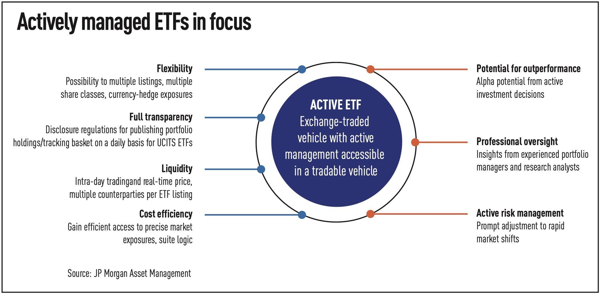

## Table of Contents

## What is an actively managed ETF?

An actively managed ETF is a type of exchange-traded fund where a professional manager or team actively makes decisions about which investments to buy and sell. Unlike passively managed ETFs, which simply track an index like the S&P 500, an actively managed ETF aims to beat the market by making strategic investment choices. The manager uses their expertise and research to try to achieve better returns than a standard index.

These ETFs often have higher fees because of the active management involved. The manager's goal is to find undervalued stocks or other assets and buy them before their value goes up, or to sell assets that they think will go down in value. While there is no guarantee that an actively managed ETF will outperform the market, many investors choose them hoping to get better returns than they would from a passive investment strategy.

## How do actively managed ETFs differ from passively managed ETFs?

Actively managed ETFs and passively managed ETFs are different in how they are run and what they try to do. Actively managed ETFs have a person or a team who picks the investments. They try to do better than the market by choosing stocks or other things they think will go up in value. This means they are always buying and selling to try to get the best returns. Because someone is actively making these choices, these ETFs usually cost more in fees.

On the other hand, passively managed ETFs just follow an index, like the S&P 500. They don't try to beat the market; they just try to match it. So, they buy all the stocks in the index in the same amounts as the index. Since no one is making active choices, these ETFs have lower fees. People who invest in them are happy if their investments grow at the same rate as the market, without the extra costs of active management.

## What are the typical investment strategies used by actively managed ETFs?

Actively managed ETFs use different ways to try to do better than the market. One common way is called "stock [picking](/wiki/asset-class-picking)." This is when the manager of the [ETF](/wiki/etf-trading-strategies) looks for companies that they think are good investments. They might choose companies that are not very well known yet but could grow a lot. They look at things like how much money the company makes, who runs it, and what's happening in the world that could help the company.

Another strategy is called "sector rotation." This means the ETF manager tries to guess which parts of the economy, like technology or health care, will do well at different times. They move the ETF's money into these parts to try to make more money. They might sell stocks in one sector and buy in another if they think it will do better soon.

Some actively managed ETFs also use "market timing." This is when the manager tries to guess when the whole market will go up or down. If they think the market will go down, they might sell some stocks or buy things that go up when the market goes down, like certain bonds. If they think the market will go up, they will buy more stocks. This can be risky, but if they guess right, it can help the ETF do better than the market.

## Who are the key players in the actively managed ETF market?

In the actively managed ETF market, some big names stand out. ARK Invest, led by Cathie Wood, is well-known for its focus on disruptive innovation. They have ETFs like ARKK that try to pick stocks in areas like tech and health care that could grow a lot. Another key player is JPMorgan, which offers actively managed ETFs that cover different areas, like stocks and bonds. They use their big team of experts to try to beat the market.

PIMCO is also a big name in this space. They are known for their expertise in bonds and offer ETFs that try to do better than bond indexes. They look at things like interest rates and the economy to make their choices. Lastly, there's Dimensional Fund Advisors (DFA), which uses a lot of research to pick stocks and bonds. They try to find good investments that might be missed by others. These companies all have different ways of trying to beat the market, but they all use active management to do it.

## What are the potential benefits of investing in actively managed ETFs?

One big benefit of investing in actively managed ETFs is the chance to do better than the market. Since the people running these ETFs are always looking for good investments, they might find stocks or other things that could go up a lot in value. This means you could make more money than if you just put your money in an ETF that follows the market. Another benefit is that the managers can change what they invest in based on what's happening in the world. If they think a certain part of the market will do well, they can move money into it, which could help your investment grow more.

Also, actively managed ETFs can give you a more personalized investment plan. If you like a certain way of investing, like focusing on tech companies or green energy, you can find an actively managed ETF that does that. This can be more fun and interesting than just picking a regular index fund. But remember, these ETFs can cost more because someone is always working on them. If the extra cost is worth it for the chance to do better, then an actively managed ETF might be a good choice for you.

## What are the costs associated with actively managed ETFs?

Actively managed ETFs usually cost more than passively managed ETFs. The main cost is called the expense ratio. This is a yearly fee that comes out of the money you have in the ETF. The expense ratio can be higher for actively managed ETFs because there's a person or team working to pick the best investments. They do a lot of research and make decisions, and that costs money. So, you might pay around 0.5% to 1% or even more of your investment each year, while a passively managed ETF might only cost you around 0.05% to 0.2%.

Another cost to think about is trading costs. Since the managers of actively managed ETFs are always buying and selling investments, they might have to pay fees to do that. These trading costs can add up and make the ETF a bit more expensive. But, you don't see these costs directly; they're just part of how the ETF works. So, when you're thinking about investing in an actively managed ETF, remember that the higher fees might be worth it if the ETF does better than the market, but it's something to keep in mind.

## How do the performance metrics of actively managed ETFs compare to their benchmarks?

The performance of actively managed ETFs can be a bit of a mixed bag when compared to their benchmarks. Some actively managed ETFs do better than their benchmarks, which means they beat the market they're trying to do better than. This can happen because the managers are good at picking the right investments at the right time. But, not all actively managed ETFs do better. Sometimes they do the same as the benchmark, or even worse. It's hard to know ahead of time which ones will do well, so it's a bit of a gamble.

Over the long term, studies show that most actively managed ETFs don't beat their benchmarks after you take out the extra costs. The higher fees for active management can eat into the returns, making it harder for these ETFs to do better than the market. That's why it's important to look at how much an ETF costs and think about if the chance of doing better than the market is worth the extra money.

## What are the tax implications of investing in actively managed ETFs?

When you invest in actively managed ETFs, you might have to pay more in taxes than with passively managed ETFs. This is because the managers of actively managed ETFs are always buying and selling investments. Every time they sell something for a profit, it can create what's called a capital gain. If the ETF makes a lot of these gains, it has to give some of that money to you as a taxable event at the end of the year. So, you might have to pay taxes on these gains even if you didn't sell any of your ETF shares yourself.

The good news is that ETFs are generally more tax-efficient than mutual funds because of how they work. When an ETF needs to sell something, it can often do it in a way that doesn't create a taxable event for you right away. But, because actively managed ETFs trade more often, they still might create more taxable events than a passively managed ETF that just follows an index. So, if you're worried about taxes, it's something to think about when choosing between an actively managed and a passively managed ETF.

## How does the transparency of actively managed ETFs affect investment decisions?

The transparency of actively managed ETFs can affect how people decide to invest. These ETFs have to tell everyone what they're investing in, but they don't have to do it as often as passively managed ETFs. This means you might not know exactly what's in the ETF every day. Some people like this because it lets the managers keep their strategies secret and try to do better than the market. But others might not like it because they want to know exactly what they're investing in all the time.

Because of this, some investors might choose actively managed ETFs if they trust the managers to pick good investments, even if they don't know all the details right away. They might think the chance to do better than the market is worth not knowing everything about the ETF's holdings every day. On the other hand, if someone really wants to know what they're investing in at all times, they might pick a passively managed ETF instead. It's all about what's more important to the investor: the potential for higher returns or knowing exactly what they own.

## What are the regulatory considerations for actively managed ETFs?

Actively managed ETFs have to follow rules set by groups like the Securities and Exchange Commission (SEC) in the U.S. These rules make sure that the ETFs are honest and fair to everyone who invests in them. One big rule is that the ETFs have to tell everyone what they're investing in, but they don't have to do it as often as other types of funds. This means they can share their list of investments every quarter instead of every day. This gives the managers some privacy to try to do better than the market.

Another important rule is about how the ETFs are run. The SEC wants to make sure that the people running the ETFs are doing a good job and not taking too much risk. They have to follow rules about how they buy and sell investments, and they have to be careful not to do anything that could hurt the investors. So, even though actively managed ETFs have more freedom to pick their investments, they still have to follow a lot of rules to keep everything safe and fair.

## What are the limitations and challenges faced by actively managed ETFs?

Actively managed ETFs face some challenges. One big challenge is that it's hard to do better than the market all the time. Even though the managers try their best to pick good investments, they don't always guess right. This can make it tough for the ETF to beat the market, especially when you think about the higher fees they charge. These fees can eat into the money you make, making it even harder for the ETF to come out ahead.

Another challenge is that actively managed ETFs have to tell everyone what they're investing in, but they don't have to do it as often as other types of funds. This means they can keep their strategies a bit secret, which some people like. But it can also make it harder for investors to know exactly what they're putting their money into all the time. This might make some people nervous, especially if they really want to know what's going on with their investments every day.

## How might future trends impact the growth and evolution of actively managed ETFs?

Future trends could really change how actively managed ETFs grow and work. One big trend is that more people are using technology to help them invest. This means that actively managed ETFs might start using smart computer programs to help pick their investments. These programs can look at a lot of information very quickly and might be able to find good investments that people might miss. This could make actively managed ETFs better at beating the market, which might make more people want to invest in them.

Another trend is that people are getting more interested in things like green energy and social responsibility. So, actively managed ETFs might start focusing more on these areas. They could try to pick companies that are good for the environment or that treat their workers well. If more people want to invest in these kinds of companies, actively managed ETFs that focus on them could grow a lot. But, it's hard to know for sure what will happen, because the future is always changing.

## References & Further Reading

[1]: Poterba, J., & Shoven, J. (2002). ["Exchange-Traded Funds: A New Investment Option for Taxable Investors."](https://economics.mit.edu/sites/default/files/publications/Exchange-Traded%20Funds%20A%20New%20Investment%20Option.pdf) American Economic Review.

[2]: Agapova, A. (2011). ["Conventional Mutual Index Funds versus Exchange-Traded Funds."](https://www.sciencedirect.com/science/article/pii/S138641811000042X) Journal of Financial Markets, 14(2), 323-343.

[3]: Gastineau, G. (2004). ["The Benchmark Index ETF Performance Problem."](https://www.researchgate.net/publication/247905884_The_Benchmark_Index_ETF_Performance_Problem) Journal of Portfolio Management.

[4]: Hendershott, T., Jones, C. M., & Menkveld, A. J. (2011). ["Does Algorithmic Trading Improve Liquidity?"](https://onlinelibrary.wiley.com/doi/full/10.1111/j.1540-6261.2010.01624.x) Journal of Finance.

[5]: Hill, J. M., Nadig, D., & Hougan, M. (2015). ["A Comprehensive Guide to Exchange-Traded Funds (ETFs)"](https://papers.ssrn.com/sol3/papers.cfm?abstract_id=2616223) by John Wiley & Sons.

[6]: Stein, J. C. (2009). ["Presidential Address: Sophisticated Investors and Market Efficiency."](https://scholar.harvard.edu/files/stein/files/presidential-address-jf-final.pdf) Journal of Finance.

[7]: ETF.com. ["What is an Actively Managed ETF?"](https://www.etf.com/sections/etf-basics/actively-managed-etfs-what-investors-need-know) 

[8]: BlackRock iShares. ["Understanding Tracking Error and ETFs."](https://www.etf.com/sections/etf-basics/understanding-tracking-difference-and-tracking-error?force_isolation=true) 

[9]: Madhavan, A. (2012). ["Exchange-Traded Funds, Market Structure, and the Flash Crash."](https://rpc.cfainstitute.org/en/research/financial-analysts-journal/2012/exchange-traded-funds-market-structure-and-the-flash-crash) Review of Financial Studies, 25(5), 1547-1563.