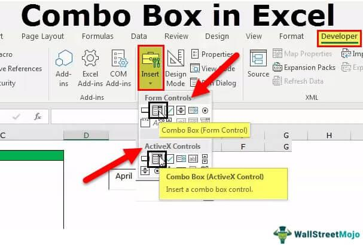

In the digital age, computer security is a paramount concern, particularly when it comes to web technologies that interface directly with users. The rapid evolution of the internet has ushered in profound technological advancements that have significantly shaped both individual and organizational activities. Among these advancements, ActiveX, a software framework developed by Microsoft, stands out for its role in enhancing web browser functionalities. Despite its contributions to improved multimedia experiences and interactive content delivery, ActiveX also introduces specific security challenges that demand attention and vigilance from users and developers alike.

ActiveX operates by enabling applications to run on web browsers, enhancing the user's multimedia and interactive web experience. However, this same capability also opens avenues for security vulnerabilities if improperly managed. Issues such as unauthorized access, malware propagation, and system exploits remain critical threats when ActiveX controls are not adequately secured. As a result, understanding and addressing these security implications have become essential for maintaining safe digital environments.



Concurrently, the rise of algorithmic trading has transformed financial markets, leveraging technology for automated and efficient trading strategies. Algorithmic trading employs complex algorithms to execute orders based on pre-defined criteria, allowing traders to capitalize on market inefficiencies with speed and precision. This technological augmentation has increased market liquidity and efficiency but also brings its own set of security concerns. Protecting algorithmic trading systems from hacking, data breaches, and other cyber threats is crucial to safeguarding financial stability and integrity.

This article explores the intersection of these technologies, highlighting their impact on security and trading. By examining the dual nature of technological advancement in both web functionalities and financial markets, it underlines the importance of integrating robust security measures to fortify against potential vulnerabilities. Understanding these dynamics is essential to leveraging technology safely and effectively in the continually evolving digital landscape.

## Table of Contents

## Understanding ActiveX and Its Security Implications

ActiveX, a software framework created by Microsoft, was first introduced in the mid-1990s as part of an effort to enhance interactivity on the World Wide Web. Its primary function was to allow software components known as ActiveX controls to be embedded into web pages, enabling a richer multimedia experience. These controls could harness the power of Windows applications directly through web browsers, thus allowing functionalities like video streaming, interactive games, and other dynamic content.

The initial adoption of ActiveX was widespread, primarily due to its seamless integration with Microsoft’s Internet Explorer, which was among the most popular browsers at the time. This integration allowed web developers to leverage powerful Windows-based application capabilities directly from web pages without additional plugins. However, the inherent design of ActiveX introduced significant security risks, which led many browsers to gradually move away from it.

One of the fundamental security issues with ActiveX was its level of access. ActiveX controls, once installed, could operate with the same privileges as the user who installed them. This meant that malicious controls could, theoretically, access sensitive files, modify system settings, and even install other software without explicit user consent. The design decision to provide such deep system access stemmed from the need to offer robust functionality, but it inadvertently opened up a vector for attacks.

The potential threats posed by ActiveX include the installation of spyware, viruses, and other forms of malware. These malicious entities could exploit vulnerabilities in poorly coded controls or user systems not kept up to date with the latest security patches. Given these risks, verifying the source of an ActiveX control before installation became crucial. Microsoft and other cybersecurity experts recommended that users only install controls from trusted and well-known publishers.

Over time, the security landscape evolved, and many browsers adopted more stringent security models. Technologies such as JavaScript and HTML5, which offered similar functionality without exposing users to significant security risks, became favored choices. These newer technologies provided the capability to run sophisticated web applications safely, without the necessity for system-level access that ActiveX required, thus reducing the attack surface substantially.

In conclusion, while ActiveX was influential in advancing web interactivity, its design made it particularly susceptible to security threats. This led to a decline in its use as web standards evolved to prioritize user safety. Developers and users were encouraged to implement vigilant practices and utilize alternative technologies that offered more secure environments for executing web-based applications.

## ActiveX in the Modern Web Environment

ActiveX, despite its diminished prominence, continues to hold relevance in specific environments, most notably within Microsoft's Internet Explorer and various legacy applications. ActiveX controls were initially designed to enhance the functionality of web applications by allowing interactive content, such as multimedia, to be embedded directly within web pages. However, advancements in web technologies have introduced more secure and flexible alternatives, such as JavaScript and HTML5, which are now commonly employed to perform similar functions without the inherent security risks associated with ActiveX.

JavaScript, a versatile scripting language widely used in web development, allows dynamic content and interactive features within web applications without relying on browser-specific extensions like ActiveX. Its universality and security enhancements have gradually reduced the dependency on ActiveX. Moreover, HTML5, the modern web standard, natively supports rich media content, offering extensive capabilities such as audio and video playback, graphical rendering through Canvas and SVG, and offline storage capabilities through local storage, thereby eliminating the need for ActiveX controls.

Businesses still utilizing ActiveX must address associated security concerns by developing and implementing comprehensive security strategies. This includes maintaining up-to-date software, applying strict authentication protocols, and enforcing policies limiting the execution of unsigned or untrusted ActiveX controls. 

User education is essential in mitigating risks associated with ActiveX. Organizations should train users to recognize potential security threats and understand the importance of not executing untrusted controls. By fostering an environment of informed usage and advancing towards more secure technologies, businesses can continue to leverage the residual benefits of ActiveX while minimizing its risks.

## Algorithmic Trading: An Overview

Algorithmic trading, commonly known as algo trading, involves the use of computer programs to execute trading strategies at speeds and frequencies that are beyond the capability of human traders. This approach utilizes algorithms—a precise set of instructions—to identify trading opportunities across various markets and execute trades accordingly. Key components of [algorithmic trading](/wiki/algorithmic-trading) include data analysis, strategy formulation, and execution.

Technology has played a pivotal role in transforming trading practices through algorithmic trading. Advances in computer power and network speeds have enabled traders to process vast amounts of market data in real-time and make informed decisions instantly. These capabilities allow for the execution of systematic and automated trading strategies, increasing efficiency and accuracy while minimizing manual intervention and emotional biases inherent to human trading.

Algorithmic trading employs various strategies, each designed to achieve specific objectives. High-frequency trading ([HFT](/wiki/high-frequency-trading-strategies)) is one such strategy, characterized by executing a large number of trades at extremely fast speeds, exploiting minute price discrepancies that exist for very short periods. HFT strategies cover market-making, where algorithms provide [liquidity](/wiki/liquidity-risk-premium) by placing and adjusting buy and sell orders, capturing the spread.

Arbitrage strategies seek to capitalize on price differences of the same or related financial instruments across different markets by simultaneously buying and selling to make a risk-free profit. This form of trading requires sophisticated algorithms to detect and act on pricing inefficiencies rapidly before they disappear.

Trend-following strategies, a more long-term approach compared to HFT and [arbitrage](/wiki/arbitrage), aim to identify and exploit persistent movements in asset prices. These algorithms analyze historical data to identify patterns and signals indicative of trends, such as moving averages or relative strength indicators, and generate buy or sell signals based on these patterns.

Overall, the integration of technology in algorithmic trading provides traders with robust tools for efficient market participation, leveraging automated processes to execute complex strategies with precision.

## Security Concerns in Algorithmic Trading

Algorithmic trading, which leverages automated systems for executing orders in financial markets, necessitates stringent cybersecurity measures to safeguard sensitive data and maintain the integrity of trading operations. As these platforms handle vast volumes of transactions at extraordinary speeds, they present lucrative targets for cyber attackers aiming to exploit system vulnerabilities.

**Importance of Cybersecurity**

The cybersecurity of algorithmic trading platforms is paramount to protecting against various threats, including hacking, data breaches, and unauthorized access. A breach of security can result in substantial financial loss due to unauthorized trades or manipulations and potentially disrupt market equilibrium, leading to wider financial instability. Ensuring cybersecurity involves creating barriers against intrusions and instituting comprehensive measures for threat detection and mitigation.

**Measures to Enhance Security**

Several techniques are essential to fortifying the security of algorithmic trading systems:

1. **Encryption**: Employing strong encryption protocols is vital for securing data transactions. Encryption helps protect sensitive trading data from being intercepted and misused by unauthorized entities.

2. **Secure Networks**: Establishing and maintaining secure network infrastructures is critical. This includes deploying firewalls, using Virtual Private Networks (VPNs), and implementing Intrusion Detection and Prevention Systems (IDPS) to monitor and neutralize threats promptly.

3. **Regular Audits**: Conducting frequent security audits allows organizations to identify and remedy vulnerabilities. These audits should involve rigorous penetration testing to simulate potential attack vectors and evaluate the resilience of the security framework.

4. **Access Controls**: Implementing robust access controls ensures that only authorized personnel have access to critical trading systems and data. This can be achieved through multi-factor authentication (MFA) and role-based access control (RBAC).

**Potential Impacts of Security Breaches**

The ramifications of security breaches in algorithmic trading can be extensive:

- **Financial Loss**: Unauthorized access can result in fraudulent transactions, leading to substantial financial losses. These losses can occur from direct theft or from actions that disturb market prices.

- **Market Destabilization**: Security breaches may trigger abnormal trading patterns or manipulations, causing significant market disruptions. The cascading effects of such disturbances can affect market participants beyond the parties initially involved.

- **Reputational Damage**: Companies may suffer severe damage to their reputations, eroding trust among clients and investors, which might affect their business operations in the long term.

Maintaining robust cybersecurity practices is, therefore, not just an operational necessity but a fundamental responsibility as algorithmic trading continues to shape global financial markets.

## Integrating ActiveX and Algo Trading: Challenges and Opportunities

ActiveX technology, despite its phased decline in mainstream web applications due to security vulnerabilities, still finds relevance in specific niche environments such as algorithmic trading platforms. These platforms often rely on legacy systems where integration with ActiveX components may enhance the functionality and execution speed. However, the use of ActiveX in this context presents notable security challenges that must be appropriately managed to leverage its potential benefits.

The primary challenge in integrating ActiveX with algorithmic trading systems is the inherent security risk associated with ActiveX controls. These controls can execute powerful operations within a user's system, which makes them susceptible to exploitation if not properly secured. To mitigate these risks, trading platforms utilizing ActiveX must implement robust security protocols. This includes ensuring that all ActiveX components are sourced from verified suppliers, enforcing strict access controls, and regularly updating software to patch any security vulnerabilities.

Additionally, the coexistence of old and new technologies in trading environments demonstrates a strategic blend necessary for optimizing operations. For example, while newer web technologies such as HTML5 and JavaScript offer safer and more versatile alternatives for web interfaces, ActiveX can still provide superior performance in running complex algorithms when properly sandboxed and managed. Such coexistence necessitates a dual approach to system architecture, involving both backward compatibility for legacy systems and integration pathways for modern technologies.

There are instances where ActiveX has been successfully integrated into trading systems. One notable example lies in certain custom-built proprietary trading platforms that required real-time data processing capabilities offered by ActiveX controls. These systems often benefited from the ability to execute precise, low-latency trades, which was crucial for high-frequency trading strategies. In these cases, comprehensive security measures were imperative to protect against unauthorized access and potential malware threats. 

Moreover, developers integrating ActiveX within algorithmic trading frameworks might implement additional layers of security through code reviews and audits, using languages like Python to create wrappers that limit and monitor ActiveX interactions. Below is an example of a simplified Python wrapper concept that can be used to control ActiveX execution:

```python
import comtypes.client

class ActiveXWrapper:
    def __init__(self, prog_id):
        self.control = comtypes.client.CreateObject(prog_id)

    def execute_safe(self, method, *args):
        # Implement security checks here
        if self._is_method_allowed(method):
            try:
                return getattr(self.control, method)(*args)
            except Exception as e:
                print(f"Error executing {method}: {e}")
        else:
            print(f"Method {method} is not allowed.")

    def _is_method_allowed(self, method):
        # Define method whitelist
        allowed_methods = ['secureMethod1', 'secureMethod2']
        return method in allowed_methods

# Usage example
activex_component = ActiveXWrapper('Some.ActiveXControl')
result = activex_component.execute_safe('secureMethod1', param1, param2)
```

As the financial industry evolves, adopting both legacy and cutting-edge technologies concurrently can be advantageous. However, it is imperative that organizations are vigilant about security and continuously update their strategic approach to technology integration, ensuring robust safeguards are in place to protect sensitive trading operations.

## Future Trends in Web Technologies and Trading Security

Emerging technologies such as [artificial intelligence](/wiki/ai-artificial-intelligence) (AI) and [machine learning](/wiki/machine-learning) are poised to significantly enhance security and innovation within trading practices. AI and machine learning algorithms can analyze vast amounts of trading data to identify patterns and predict trends, enabling more informed and timely trading decisions. For instance, machine learning models can be trained to detect anomalies and fraudulent activities by continually learning from market data and historical trading patterns. This proactive approach to threat detection is crucial in safeguarding the integrity of trading platforms.

The Internet of Things (IoT) plays a pivotal role in improving trading security and transparency by offering real-time data collection and analysis. IoT devices can provide traders with instantaneous access to market conditions, thereby facilitating rapid response to market fluctuations. This real-time information flow supports high-frequency trading, where speed and accuracy are essential. However, the integration of IoT in trading systems necessitates robust security measures to protect sensitive trading data from unauthorized access and interception.

Blockchain technology, known for its decentralized and immutable ledger, offers an opportunity to enhance transparency and security in trading. By providing a tamper-proof record of transactions, blockchain can mitigate the risks of data manipulation and fraud. Smart contracts, which are self-executing contracts with the terms of the agreement directly written into code, can automate and secure trading processes, reducing the need for intermediaries and increasing transaction efficiency.

The financial industry's continuous embrace of technology introduces both challenges and opportunities. On one hand, advanced technologies can streamline operations and reduce costs; on the other hand, they present regulatory challenges. Regulators are tasked with developing frameworks that ensure these technologies are used responsibly, balancing innovation with consumer protection. The rapid pace of technological advancement may outstrip existing regulatory mechanisms, necessitating agile and adaptive regulatory responses.

Opportunities lie in the potential for technologies to create more resilient and transparent markets. As the industry evolves, collaboration between tech companies, financial institutions, and regulators will be critical to harnessing the full potential of these innovations while ensuring a secure trading environment. Embracing technology with a focus on security and compliance will allow the financial sector to achieve both functionality and trustworthiness in an increasingly digital landscape.

## Conclusion

In an increasingly interconnected digital landscape, the interplay between computer security and web technologies like ActiveX is crucial for safeguarding algorithmic trading systems. As these technologies continue to shape the financial sector, ensuring robust security measures is vital to protect against a myriad of cyber threats. ActiveX, despite its security challenges, demonstrates the intricate balance required between leveraging existing technologies and adopting newer, safer alternatives. Though ActiveX facilitated advancements in web functionality, its security vulnerabilities necessitate careful management, particularly in environments where algorithmic trading is employed.

The dynamic nature of algorithmic trading requires a proactive approach to security. Staying ahead in the security landscape involves not only understanding potential vulnerabilities within technologies like ActiveX but also anticipating emerging threats. This proactive stance includes regular software updates, user education, and adopting advanced security protocols, such as encryption and secure network configurations. Failure to prioritize these measures could result in significant financial losses and disruption to market operations.

Embracing technology with caution is crucial for achieving a balance between security and functionality. As financial institutions continue to leverage technological advancements, it is imperative to integrate security as a foundational aspect of system design and operation. Future innovations in AI and machine learning will likely further enhance trading security, but they also require vigilant management to ensure these new technologies do not introduce unforeseen vulnerabilities. 

In conclusion, while technologies like ActiveX have paved the way for enhanced web functionalities, their role in secure algorithmic trading environments requires a cautious and informed approach. A commitment to continuously advancing security strategies is essential to both protect and innovate within the trading landscape, ensuring the resilience and effectiveness of financial technologies in a rapidly evolving digital era.

## References & Further Reading

[1]: ["Understanding ActiveX Controls: Security Risks and Best Practices"](https://www.techtarget.com/searchsecurity/answer/How-to-prevent-ActiveX-security-risks) - Microsoft Support

[2]: Soros, G. (2003). ["The Alchemy of Finance"](https://www.amazon.com/Alchemy-Finance-George-Soros/dp/0471445495). John Wiley & Sons.

[3]: Williams, P., King, P. (2000). ["ActiveX Controls Inside Out"](https://www.amazon.com/ActiveX-Controls-Inside-Out-CD/dp/1572313501) - Microsoft Press

[4]: Aldridge, I. (2009). ["High-Frequency Trading: A Practical Guide to Algorithmic Strategies and Trading Systems"](https://www.ahmetbeyefendi.com/wp-content/uploads/2020/07/High-Frequency-Trading-Irene-Aldridge.pdf). John Wiley & Sons.

[5]: Butterill, J. et al. (2017). ["Secure Coding Practices for ActiveX and COM"](https://arxiv.org/pdf/1709.09970). Micro Focus.