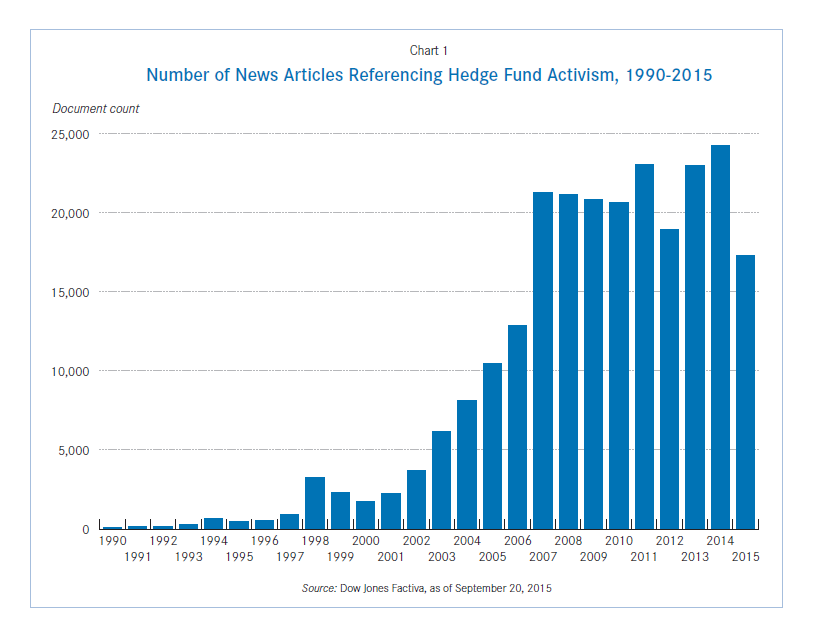

## Table of Contents

## What is an activist hedge fund?

An activist hedge fund is a type of investment fund that buys a big part of a company's stock and then tries to change how the company is run. They do this because they think the company can do better and make more money if it changes. The people who run the hedge fund, called activists, might want the company to sell some parts of its business, buy back its own stock, or change its leaders.

These activist hedge funds often get attention because they can shake things up. They might talk to the company's leaders, or if that doesn't work, they might try to get other shareholders to vote for their ideas at meetings. This can lead to big changes in the company, which can be good for the stock price if the changes work out well. But it can also be risky and cause arguments between the activists and the company's current leaders.

## How do activist hedge funds differ from traditional hedge funds?

Activist hedge funds and traditional hedge funds both aim to make money for their investors, but they go about it in different ways. Traditional hedge funds usually focus on making money by buying and selling stocks, bonds, or other investments. They might use complicated strategies like betting that a stock will go down in value, or they might use borrowed money to try to make bigger profits. Their goal is to beat the market, but they don't usually try to change how the companies they invest in are run.

On the other hand, activist hedge funds take a more hands-on approach. They buy a big stake in a company and then try to influence its management and strategy. They believe that by making changes, like selling off parts of the business or changing the company's leaders, they can make the company more valuable and boost its stock price. This active involvement sets them apart from traditional hedge funds, which usually stay out of the company's day-to-day operations.

## What are the main goals of an activist hedge fund?

The main goal of an activist [hedge fund](/wiki/hedge-fund-trading-strategies) is to make money for its investors by changing how a company works. They do this by buying a lot of the company's stock and then pushing for changes they think will make the company worth more money. These changes might include selling off parts of the business that aren't doing well, buying back the company's own stock, or even changing who runs the company. The idea is that if the company does better, its stock price will go up, and the hedge fund will make a profit.

Another important goal for activist hedge funds is to shake things up at companies that they think are not being run as well as they could be. They believe that by getting involved and making their voices heard, they can fix problems and make the company more successful. This can be good for everyone who owns the company's stock, not just the hedge fund. But it can also lead to disagreements with the company's current leaders, who might not like the changes the activists are pushing for.

## How do activist hedge funds influence the companies they invest in?

Activist hedge funds influence the companies they invest in by buying a big part of the company's stock. Once they own enough shares, they can talk to the company's leaders and suggest changes. These changes might be things like selling parts of the business that aren't doing well, or changing who is in charge. The hedge fund thinks these changes will make the company more valuable and make its stock price go up.

If the company's leaders don't agree with the changes the hedge fund wants, the activists might try to get other shareholders on their side. They can do this by writing letters, talking to the media, or even starting a vote at the company's shareholder meeting. If enough other shareholders agree with the hedge fund, they can force the company to make the changes. This can be a big deal and can really shake things up at the company.

## What strategies do activist hedge funds use to increase profitability?

Activist hedge funds try to make more money by getting involved with the companies they invest in. They buy a lot of the company's stock and then suggest changes they think will make the company more valuable. These changes might include selling parts of the business that aren't doing well, or buying back the company's own stock. The hedge fund believes that if the company makes these changes, its stock price will go up, and they will make a profit.

If the company's leaders don't want to make the changes the hedge fund suggests, the activists might try to get other shareholders to agree with them. They can do this by writing letters, talking to the media, or starting a vote at a shareholder meeting. If enough shareholders agree with the hedge fund, they can force the company to make the changes. This can be a big deal and can really shake things up at the company, but it's all about trying to make the company more profitable.

## Can you explain the role of shareholder activism in enhancing company performance?

Shareholder activism is when people who own part of a company, called shareholders, try to change how the company works. They think that if the company does things differently, it can make more money and be worth more. So, they might suggest selling parts of the business that aren't doing well, or changing who runs the company. This can help the company do better because it gets rid of things that aren't working and brings in new ideas.

Sometimes, the people in charge of the company don't want to make these changes. When that happens, the shareholders might talk to other people who own the company and try to get them to agree. They can write letters, talk to the news, or even vote at meetings to make their point. If enough shareholders agree, they can force the company to change. This can make the company more successful and make its stock price go up, which is good for everyone who owns part of the company.

## What are some historical examples of successful activist hedge fund campaigns?

One famous example of a successful activist hedge fund campaign is when Carl Icahn took on Apple in 2013. Icahn bought a lot of Apple's stock and then told the company to buy back more of its own shares. He thought this would make Apple's stock price go up. At first, Apple's leaders didn't want to do it, but Icahn kept pushing. In the end, Apple agreed to buy back $90 billion worth of its own stock. This made the stock price go up, and Icahn and other shareholders made a lot of money.

Another good example is when Bill Ackman's hedge fund, Pershing Square, got involved with Canadian Pacific Railway in 2012. Ackman thought the company was not doing well because of bad management. He bought a lot of the company's stock and then pushed to change the CEO. After a big fight, Ackman got his way, and a new CEO was brought in. The new CEO made a lot of changes, and the company started doing much better. The stock price went up a lot, and Ackman and other shareholders made a big profit.

These examples show how activist hedge funds can make big changes in companies. By buying a lot of stock and pushing for changes, they can make companies more valuable and make money for themselves and other shareholders. But it's not always easy, and sometimes they have to fight hard to get what they want.

## How do activist hedge funds measure the success of their interventions?

Activist hedge funds measure the success of their interventions by looking at the stock price of the company they are involved with. If the stock price goes up after they push for changes, they think their ideas worked. They also look at how the company is doing overall. If the company makes more money or gets rid of parts that weren't doing well, the hedge fund sees that as a success. They want to see real changes that make the company better and more valuable.

Another way activist hedge funds measure success is by seeing if their suggestions get put into action. If the company agrees to buy back its own stock, sell off parts of the business, or change its leaders, the hedge fund feels like they have made a difference. They also pay attention to what other shareholders think. If other shareholders vote for the hedge fund's ideas at meetings, it shows that the activists have support and are making an impact.

## What are the potential risks and challenges faced by companies targeted by activist hedge funds?

When a company is targeted by an activist hedge fund, it faces several risks and challenges. One big risk is that the changes the hedge fund wants might not be good for the company in the long run. For example, selling off parts of the business might make the stock price go up right away, but it could hurt the company's ability to grow in the future. Another risk is that the fight with the hedge fund can be distracting. The company's leaders might spend a lot of time arguing with the activists instead of running the business, which can make things worse.

There are also challenges in dealing with the pressure from the hedge fund. The company might have to spend a lot of money on lawyers and other experts to fight back against the activists. This can be expensive and take away from the money the company could use to grow. Plus, the fight can make the company look bad in the news, which can scare away customers and other investors. It's a tough situation for the company, and it has to be careful about how it handles the activist hedge fund's demands.

## How do regulatory environments affect the operations of activist hedge funds?

Regulatory environments can make it harder or easier for activist hedge funds to do their work. In some countries, the rules are strict about how much of a company's stock a hedge fund can own before it has to tell everyone. This can slow down the hedge fund because they have to wait until they own enough shares before they can start pushing for changes. Also, some places have rules about how hedge funds can talk to other shareholders or what they can say in the news. If the rules are too tight, it can be hard for the hedge fund to get other shareholders on their side.

On the other hand, in countries where the rules are more relaxed, activist hedge funds might find it easier to shake things up. They can buy a lot of stock quickly and start talking to other shareholders right away. This can help them push for changes faster. But even in places with fewer rules, hedge funds still have to be careful. If they break the rules, they can get in big trouble, which can hurt their reputation and make it harder to do business in the future. So, understanding and following the rules is always important for activist hedge funds.

## What impact do activist hedge funds have on long-term versus short-term profitability?

Activist hedge funds can help a company make more money in the short term by pushing for quick changes. They might tell the company to sell parts of the business that aren't doing well or to buy back its own stock. These changes can make the stock price go up right away, which is good for the hedge fund and other shareholders who want to make money fast. But sometimes, these quick fixes can hurt the company in the long run. For example, selling off parts of the business might mean the company loses important resources it needs to grow later.

In the long term, the impact of activist hedge funds can be more mixed. If the changes they push for are good ones, like bringing in new leaders who know how to make the company better, the company might do well over time. The stock price could keep going up, and the company could become more successful. But if the hedge fund only cares about making money quickly, the company might struggle later. It's all about whether the changes the hedge fund wants are good for the company's future, not just for making a quick profit.

## How can companies prepare for and respond effectively to activist hedge fund campaigns?

Companies can get ready for activist hedge fund campaigns by keeping an eye on who owns their stock. They should know if a hedge fund is buying a lot of shares and be ready to talk to them. It's also a good idea for the company to have a plan for what to do if an activist comes knocking. This plan might include talking to other shareholders to get them on the company's side or being ready to explain why the company is doing well the way it is. The company should also make sure it's doing a good job running the business so it can show the hedge fund that things are going well.

When an activist hedge fund starts a campaign, the company should listen to what the hedge fund wants and think about if those changes could be good. Sometimes, the hedge fund might have good ideas that could help the company. But if the company doesn't agree with the changes, it should explain why to the hedge fund and other shareholders. The company might need to spend money on lawyers or other experts to help fight back against the activists. It's important for the company to keep talking to everyone involved and to keep running the business well, even while dealing with the hedge fund.

## References & Further Reading

[1]: Bebchuk, L. A., Brav, A., & Jiang, W. (2015). ["The Long-Term Effects of Hedge Fund Activism."](https://papers.ssrn.com/sol3/papers.cfm?abstract_id=2291577) Columbia Business School Research Paper No. 13-66.

[2]: Lopez de Prado, M. (2018). ["Advances in Financial Machine Learning."](https://www.amazon.com/Advances-Financial-Machine-Learning-Marcos/dp/1119482089) Wiley.

[3]: Jansen, S. (2022). ["Machine Learning for Algorithmic Trading."](https://github.com/stefan-jansen/machine-learning-for-trading) Packt Publishing.

[4]: Chan, E. P. (2009). ["Quantitative Trading: How to Build Your Own Algorithmic Trading Business."](https://github.com/ftvision/quant_trading_echan_book) Wiley Trading.

[5]: Brav, A., Jiang, W., Partnoy, F., & Thomas, R. (2008). ["Hedge Fund Activism, Corporate Governance, and Firm Performance."](https://onlinelibrary.wiley.com/doi/full/10.1111/j.1540-6261.2008.01373.x) Review of Financial Studies, 22(10), 3275-3328.

[6]: Kwan, M., & Pohlman, L. (2010). ["Activist Hedge Funds and the Corporate Governance Mosaic."](https://www.jstor.org/stable/25094488) Business Lawyer, 65, 143.

[7]: Narang, R. K. (2013). ["Inside the Black Box: A Simple Guide to Quantitative and High-Frequency Trading."](https://onlinelibrary.wiley.com/doi/book/10.1002/9781118662717) Wiley.