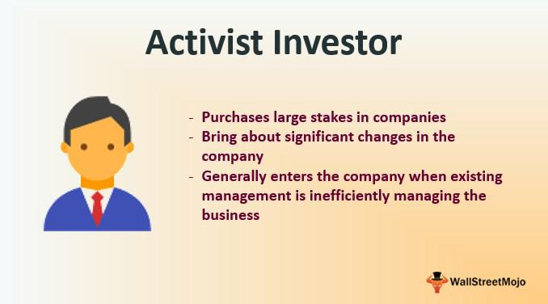

In the world of finance, there are various investment strategies that cater to different types of investors. These strategies range widely and serve distinct investment objectives and risk tolerances. Among the most impactful approaches are those employed by activist investors, notable figures in the investment community, and practitioners of algorithmic trading. Each of these areas embodies unique methodologies that continue to shape financial markets.

Activist investors differentiate themselves by actively seeking to influence management and improve company performance to enhance shareholder value. Their involvement often leads to significant corporate changes, optimizing business strategies and governance. On the other end of the spectrum are notable investors like Warren Buffett and Ray Dalio, who have established themselves with strategies centered on fundamental analysis and macroeconomic trends. Their investment decisions, grounded in value investing and diversification principles, offer insightful case studies on deploying capital effectively.

In contrast, algorithmic trading stands as a hallmark of modern finance, utilizing algorithms to execute trades with speed and precision nearly impossible for human traders. This approach leverages advanced technologies, large datasets, and quantitative models to capitalize on fleeting market opportunities. Understanding these strategies provides valuable insights that can assist both novice and seasoned investors in enhancing their investment decision-making processes.

This article will systematically explore these investment strategies, highlight some notable figures within each domain, and discuss their impact on the financial markets. Through this examination, investors can gain a broader perspective on the diverse tactics available to optimize their portfolios and navigate the complexities of global finance.

## Table of Contents

## Investment Strategies: An Overview

Investment strategies are carefully crafted plans and actions designed to achieve specific financial objectives. These strategies can be broadly classified based on the investor's risk tolerance, desired return, and time horizon.

Conservative strategies prioritize capital preservation and steady income generation. These approaches typically involve investing in fixed-income securities such as bonds, dividend-paying stocks, and other low-risk assets. The primary goal is to protect the principal amount while ensuring modest returns, making this strategy appealing to risk-averse investors or those nearing retirement.

Aggressive strategies, in contrast, aim for high capital appreciation over a certain period. This typically involves investing in high-[growth stocks](/wiki/growth-stocks), emerging markets, or other volatile assets with the potential for significant returns. While these strategies [carry](/wiki/carry-trading) higher risk, they also offer the possibility of substantial gains, attracting investors with a higher risk tolerance and a longer investment horizon.

Prominent investment strategies include value investing, growth investing, and contrarian investing. Value investing focuses on identifying undervalued securities with strong fundamentals that the market has overlooked. Investors employing this strategy, like Warren Buffett, seek to purchase these assets at a discount and hold them over the long term, expecting their true value to be recognized eventually.

Growth investing, on the other hand, targets companies expected to grow at an above-average rate compared to their industry or the overall market. This strategy typically involves investing in technology or innovative sectors, where the potential for growth is undeniable but often comes with higher [volatility](/wiki/volatility-trading-strategies) and risk.

Contrarian investing involves taking positions against prevailing market trends by buying assets that are currently out of favor with the majority of investors. Contrarians believe that the market overreacts to news and events, creating opportunities to buy undervalued assets and sell overvalued ones. This strategy requires patience and a strong conviction in the chosen investments.

The decision to adopt a particular investment strategy depends largely on the investor's risk appetite, financial goals, and market perspective. A well-structured strategy, aligned with the investor's objectives, can optimize financial outcomes over time.

## Notable Investors and Their Approaches

Successful investors often create strategies that align with their financial philosophies, leading to distinct and effective investment approaches. Notable among these investors is Warren Buffett, who is renowned for his commitment to value investing. Buffett's strategy revolves around identifying and acquiring undervalued companies with strong fundamentals. This approach emphasizes thorough financial analysis and a long-term perspective, allowing Buffett to build a portfolio that leverages market inefficiencies. By focusing on companies with manageable debt levels, consistent earnings growth, and sound management, Buffett aims to generate significant returns over time through both capital appreciation and dividends.

Another influential figure in the investment landscape is Ray Dalio, who emphasizes macroeconomic trends and diversification through his All-Weather Portfolio approach. Dalio's strategy involves understanding how various economic cycles impact asset classes and creating a balanced portfolio to mitigate risks. This involves diversifying investments across different assets such as equities, bonds, commodities, and inflation-protected securities. The goal is to achieve a stable performance regardless of economic conditions. Dalio's philosophy underscores the importance of quantitative analysis and economic forecasting, allowing for data-driven adjustments that accommodate shifting global financial landscapes.

Studying the methodologies of these esteemed investors provides valuable insights into prudent investment decision-making. While Buffett's focus is largely on intrinsic value and company-specific factors, Dalio's strategy highlights a broader perspective, considering macroeconomic indicators and global market dynamics. By examining their approaches, investors can learn to tailor strategies that align with individual financial goals and market environments, enhancing their ability to generate sustainable financial growth. These lessons underscore vital principles such as patience, thorough analysis, and adapting to evolving market conditions.

## The Role of Activist Investors

Activist investors are individuals or groups who acquire significant stakes in publicly traded companies with the primary aim of effecting change to enhance shareholder value. These investors seek to influence a company's operations, strategic direction, and governance by leveraging their substantial ownership to engage with management and board members. Their influence can lead to a variety of changes, ranging from minor operational tweaks to significant shifts in corporate strategy.

A key characteristic of activist investors is their proactive approach to asset management. They typically focus on unlocking potential value that they believe is not being realized under the current management or strategic approach. Activist investors might push for restructuring initiatives, mergers, asset sales, or improved operational efficiency to achieve higher returns for shareholders.

Carl Icahn and Bill Ackman are prominent figures in the world of activist investing. Carl Icahn's strategy often involves targeting undervalued companies where he sees opportunities for significant operational improvements. By purchasing a large enough stake, Icahn can exercise pressure on management to pursue strategic alternatives that could increase stock price and, consequently, shareholder value. Similarly, Bill Ackman, through Pershing Square Capital Management, has been known for his highly publicized activist campaigns, which have included advocating for changes in leadership and strategy to catalyze company performance increases.

The interventions by activist investors can result in increased scrutiny from the media, regulators, and the investment community. This environment of heightened oversight often leads to detailed negotiations with company boards. Many companies, in response to activist interventions, undertake initiatives to preemptively address shareholder concerns or engage directly with activists to reach mutually beneficial outcomes. While the presence of activist investors can spark controversy or concern over hostile takeovers, it can also lead to positive changes, improved efficiencies, and greater returns for stakeholders.

In conclusion, activist investors play a significant role in the financial markets by pushing for changes that they believe will unlock shareholder value. These interventions can be beneficial not only for the activist investors themselves but also for other shareholders and the companies involved. The influence of these investors underscores the dynamic nature of modern capitalism, where shareholder empowerment can lead to substantive changes within corporate structures.

## Algorithmic Trading: The Modern Investment Frontier

Algorithmic trading utilizes computer algorithms to automate trading decisions and execute trades at optimal conditions based on pre-set criteria. This approach facilitates high-frequency trading and enables swift reactions to market changes, capitalizing on small price movements that might not be noticeable in traditional trading methods. By leveraging computational power and vast data sets, [algorithmic trading](/wiki/algorithmic-trading) strategies can analyze and process numerous variables simultaneously to identify profitable trading opportunities.

One of the pioneers of quantitative investing is Jim Simons, whose work has significantly advanced algorithmic trading. Simons founded Renaissance Technologies, a [hedge fund](/wiki/hedge-fund-trading-strategies) that employs sophisticated mathematical models to drive its trading decisions. The success of Renaissance Technologies, particularly its Medallion Fund, underscores the potential of data-driven algorithms to yield substantial returns.

Algorithmic trading typically involves several components, including:

1. **Data Collection and Analysis**: Continuous data feeds from multiple sources—such as stock prices, trading volumes, and economic indicators—are gathered and analyzed. The algorithms use historical and real-time data to detect trends and patterns.

2. **Signal Generation**: Based on the analysis, the algorithm generates buy or sell signals. These signals are contingent on pre-specified criteria and often involve complex computations that evaluate indicators like moving averages, momentum, or volume spikes.

3. **Execution**: Once a signal is generated, the algorithm executes the trade. This step requires integration with trading platforms to ensure that transactions are conducted efficiently and without significant delay.

Algorithmic trading offers several advantages, including the ability to process a large number of trades at speeds unattainable by human traders. This speed can be particularly beneficial in high-frequency trading ([HFT](/wiki/high-frequency-trading-strategies)), where thousands of trades might occur in seconds, taking advantage of small price inefficiencies.

However, implementing algorithmic trading necessitates significant technological infrastructure. Traders must invest in high-speed internet connections, powerful computing hardware, and software capable of handling extensive data processing and real-time analysis. Furthermore, developing robust algorithms requires expertise in mathematics, [statistics](/wiki/bayesian-statistics), and programming, often necessitating collaboration between traders and quantitative analysts or data scientists.

Despite its potential for high returns, algorithmic trading carries inherent risks. Market anomalies, unexpected events, or errors in algorithm design can result in significant losses. Therefore, continuous monitoring, testing, and refinement of trading algorithms are crucial to mitigate risks and adapt strategies to changing market conditions.

In conclusion, algorithmic trading represents a modern frontier in investment strategy, driven by technological advancements and the availability of vast data resources. While offering opportunities for considerable gains, it demands a sophisticated understanding of both finance and technology to navigate its complexities effectively.

## Integrating Various Strategies for Diverse Portfolios

Investors often integrate various investment strategies to diversify their portfolios, aiming to achieve a balanced risk-return profile. By blending approaches such as value investing with algorithmic trading, investors can potentially stabilize returns while benefiting from market growth. Value investing focuses on finding undervalued stocks with strong fundamentals, providing portfolio stability through long-term investments in financially robust companies. Algorithmic trading, on the other hand, allows for rapid response to market fluctuations, enhancing growth potential by executing trades based on predetermined criteria.

A key element in this integration is understanding market cycles and economic indicators. Market cycles, consisting of phases such as expansion, peak, contraction, and trough, influence asset prices and investment decisions. Economic indicators, including GDP growth rates, unemployment rates, and inflation, provide insights into market conditions. Investors who monitor these elements can make informed decisions about when to adjust their strategies, ensuring they are aligned with current market environments.

Adaptability and continuous learning are essential for optimizing investment outcomes. Financial markets are dynamic, with constant changes in economic conditions, technological advancements, and regulatory environments. Investors must be prepared to adjust their strategies to reflect these changes. Continuous learning through studying market trends, attending financial seminars, and analyzing research reports equips investors with the knowledge needed to make strategic decisions.

In summary, integrating diverse strategies allows investors to balance risk and reward effectively. By leveraging the stability of value investing and the growth prospects of algorithmic trading, and by staying attuned to market signals, investors can enhance their portfolio performance. This holistic approach requires constant learning and adaptability, ensuring that investment strategies remain relevant and effective in achieving financial goals.

## Conclusion

Navigating the investment landscape involves understanding and applying different strategies. Mastering the intricacies of investment approaches can significantly enhance portfolio performance. For instance, studying the strategies of notable investors like Warren Buffett and Ray Dalio provides valuable insights into prudent decision-making. Buffett's value investing emphasizes identifying undervalued assets with strong fundamentals, while Dalio's macroeconomic focus offers lessons on achieving balance through diversification.

Activist investors such as Carl Icahn and Bill Ackman play a critical role in reshaping corporations to unlock shareholder value. Their influence often leads to increased scrutiny and negotiation, emphasizing the power of strategic intervention in corporate governance and operations. Understanding these dynamics allows investors to appreciate the potential impact of activism on their holdings.

Leveraging technology through algorithmic trading represents a cutting-edge avenue for investors seeking precision and efficiency. Innovations in quantitative investing, spearheaded by figures like Jim Simons, demonstrate how data-driven strategies can revolutionize trading and yield significant returns. The complexity of algorithmic trading demands substantial investment in technology and expertise, yet offers opportunities to capitalize on market fluctuations with unprecedented speed.

Success in investing requires a tailored approach that aligns with individual goals and market conditions. Integrating diverse strategies, such as combining value investing with algorithmic trading, provides a balanced framework capable of navigating both growth and stability. Recognizing market cycles and economic indicators enhances an investor's ability to select and adjust strategies effectively.

Staying informed and adaptive is crucial for thriving in the ever-evolving world of finance. Continuous learning and flexibility ensure that investors remain responsive to emerging trends and challenges. By cultivating a comprehensive understanding of various investment strategies and adapting them to their unique circumstances, investors are well-equipped to achieve their financial objectives.

## References & Further Reading

[1]: ["The Warren Buffett Way"](https://en.wikipedia.org/wiki/The_Warren_Buffett_Way) by Robert G. Hagstrom

[2]: Dalio, R. (2011). ["Principles for Navigating Big Debt Crises."](https://www.amazon.com/Principles-Navigating-Big-Debt-Crises/dp/1668009293) Principles

[3]: ["Activist Investing: Institutional Investors, Governance, and Engagement"](https://www.tandfonline.com/doi/full/10.1080/14735970.2021.1965338) edited by William W. Bratton and Joseph A. McCahery

[4]: Chambers, D., & Dimson, E. (2013). ["The Triumph of David over Goliath: Activist Investors in a Global Context."](https://www.semanticscholar.org/paper/Keynes-the-Stock-Market-Investor%3A-A-Quantitative-Chambers-Dimson/f479aa3f84b9838d53c44152bc0d932bb64e16f0) Journal of Applied Corporate Finance, 25(3), 77-85.

[5]: Narang, R. (2009). ["Inside the Black Box: The Simple Truth About Quantitative Trading."](https://onlinelibrary.wiley.com/doi/book/10.1002/9781118267738) Wiley.