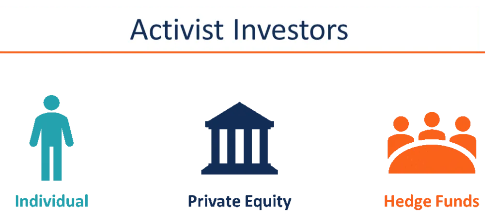

## Table of Contents

## What is an activist investor?

An activist investor is someone who buys a lot of shares in a company and then tries to make big changes in how the company is run. They think the company can do better and want to help it improve. They might want the company to make more money for shareholders, change its leaders, or do something different with its business.

These investors often speak up at shareholder meetings and try to get other shareholders to agree with them. They might even start campaigns to get their ideas heard. Sometimes, they work with the company's leaders to make changes, but other times, they might fight against them. Their goal is always to make the company better and more profitable.

## What are the primary goals of activist investors?

Activist investors mainly want to make the companies they invest in better and more profitable. They buy a big part of a company's shares and then try to make changes. They believe that by changing how the company works, it can make more money for everyone who owns shares. This could mean getting the company to pay out more money to shareholders, changing who runs the company, or making the company focus on different things.

Sometimes, activist investors work together with the company's leaders to make these changes. They might suggest new ideas and help the company grow. Other times, they might disagree with the leaders and start campaigns to get other shareholders to support their ideas. They might even try to replace the leaders if they think it's necessary. Their main goal is always to improve the company and make it more successful.

## How do activist investors influence a company?

Activist investors influence a company by buying a big part of its shares and then trying to make changes. They might think the company is not doing well enough and want to help it improve. They do this by talking to other shareholders and trying to get them to agree with their ideas. Sometimes, they start campaigns to make their voices heard. They might also go to shareholder meetings and speak up about what they think should be different.

These investors can work with the company's leaders to make changes. They might suggest new ways for the company to make more money or grow. But if they don't agree with the leaders, they might fight against them. They could try to get other shareholders to vote out the current leaders and put in new ones who agree with their plans. Their main goal is to make the company better and more profitable, which they believe will help everyone who owns shares.

## What strategies do activist investors typically use?

Activist investors use different ways to influence companies. One way is by talking to other shareholders to get them to support their ideas. They might start campaigns to make their voices heard and go to shareholder meetings to speak up. They believe that by working together with other shareholders, they can push the company to make changes that will make it better and more profitable.

Another strategy they use is working with the company's leaders. They might suggest new ideas to help the company grow or make more money. If the leaders agree, they can work together to make these changes happen. But if they don't agree, activist investors might fight against the leaders. They could try to get other shareholders to vote out the current leaders and bring in new ones who agree with their plans.

Sometimes, activist investors might also try to change what the company does. They might want the company to focus on different things or sell off parts of the business that are not doing well. By making these big changes, they hope to make the company more successful and increase the value of their shares.

## Can you name some well-known activist investors?

Some well-known activist investors are Carl Icahn, Bill Ackman, and Nelson Peltz. Carl Icahn is famous for buying big parts of companies like Apple and Netflix and pushing for changes. He often tries to get companies to pay more money to shareholders or change their leaders. Bill Ackman is known for his big bets on companies like Herbalife and his fights with their leaders. He also started a campaign to help companies during the COVID-19 crisis. Nelson Peltz is another famous activist who has worked with companies like Procter & Gamble and Wendy's. He often tries to make companies more efficient and profitable.

These investors have different ways of working. Carl Icahn might start big fights with company leaders if he doesn't agree with them. Bill Ackman often uses research and public campaigns to push for changes. Nelson Peltz usually tries to work with company leaders to make changes happen. All of them want to make the companies they invest in better and more successful, which they believe will help everyone who owns shares in those companies.

## What are some famous cases of activist investing?

One famous case of activist investing is when Carl Icahn got involved with Apple in 2013. He bought a lot of Apple's shares and then pushed the company to buy back more of its own stock. Icahn thought this would make the value of Apple's shares go up. At first, Apple's leaders did not agree with Icahn, but they later decided to buy back more stock. This made Icahn happy and showed how activist investors can influence big companies.

Another well-known case is when Bill Ackman took on Herbalife in 2012. Ackman said Herbalife was a bad company and bet a lot of money that its stock price would go down. He started a big campaign against Herbalife, saying it was like a pyramid scheme. Herbalife fought back, and the fight between Ackman and Herbalife went on for years. This case showed how activist investors can start big public fights with companies they think are doing wrong.

A third example is when Nelson Peltz got involved with Procter & Gamble in 2017. Peltz wanted a seat on P&G's board so he could help the company make more money. At first, P&G's leaders did not want Peltz on the board, and they fought against him. But after a long battle, Peltz finally got a seat. This case showed how activist investors can work hard to get a say in how a company is run, even if the company's leaders do not want them there.

## How do companies respond to activist investors?

When activist investors come to a company, the leaders might react in different ways. Sometimes, the company's leaders agree with the activist investors and work with them to make changes. They might see the investors' ideas as good for the company and want to make it better together. For example, if the activist investor suggests a new way to make more money, the leaders might try it out and see if it works.

But other times, the company's leaders might not like what the activist investors want. They might think the investors' ideas are bad for the company or that the investors just want to make quick money. In these cases, the leaders might fight against the activist investors. They could try to convince other shareholders that the investors' ideas are not good. This can lead to big fights and even votes at shareholder meetings to see who wins.

## What are the potential benefits of activist investing for shareholders?

Activist investing can help shareholders by making the company better and more profitable. When activist investors buy a lot of shares and push for changes, they often want the company to make more money. This can mean the company pays out more money to shareholders or makes the value of the shares go up. If the company listens to the activist investors and makes good changes, everyone who owns shares can benefit.

But activist investing is not always good for shareholders. Sometimes, the changes the investors want can be risky or not work out. If the company tries new things and they fail, the value of the shares might go down instead of up. Also, the fights between activist investors and the company's leaders can be distracting and make it hard for the company to focus on its work. So, while activist investing can bring benefits, it also comes with risks that shareholders need to think about.

## What are the potential risks or downsides of activist investing?

Activist investing can have some downsides for companies and shareholders. One big risk is that the changes the activist investors want might not work out. If the company tries new things and they fail, it could lose money and the value of its shares might go down. This means shareholders could end up losing money instead of making more. Also, the fights between activist investors and the company's leaders can be distracting. If the company spends a lot of time fighting instead of focusing on its work, it might not do as well as it could.

Another downside is that activist investors might only care about making quick money. They might push for changes that make the company's shares go up right away, but hurt the company in the long run. This can be bad for shareholders who want the company to do well over many years. Also, the costs of dealing with activist investors can be high. The company might have to spend a lot of money on lawyers and other people to fight against the investors. This can take money away from other important things the company needs to do.

## How does activist investing impact corporate governance?

Activist investing can change how a company is run. When activist investors buy a lot of shares, they often want to have a say in who runs the company and how decisions are made. They might push for new leaders or different ways of making decisions. This can make the company's leaders more careful about what they do, because they know the investors are watching them closely. If the investors think the leaders are not doing a good job, they might try to get other shareholders to vote them out.

But activist investing can also cause problems for how a company is run. The fights between activist investors and the company's leaders can be distracting. Instead of focusing on making the company better, the leaders might spend a lot of time fighting with the investors. This can slow down the company and make it harder for it to do well. Also, if the activist investors only care about making quick money, they might push for changes that are good for them but bad for the company in the long run. This can make it hard for the company to plan for the future and do what is best for all shareholders.

## What role do activist investors play in environmental, social, and governance (ESG) issues?

Activist investors are now focusing more on environmental, social, and governance ([ESG](/wiki/esg-investing)) issues. They buy big parts of companies and then push them to be better at things like reducing pollution, treating workers fairly, and having good leaders. These investors think that companies that do well on ESG issues can be more successful in the long run. They might start campaigns to get other shareholders to agree with them or work with the company's leaders to make changes. For example, they might want a company to use less energy or pay workers more.

But activist investing on ESG issues can also be hard. Sometimes, the changes the investors want can be expensive or risky for the company. If the company tries to do new things and they don't work out, it might lose money. Also, the fights between activist investors and the company's leaders can be distracting. Instead of focusing on making the company better, the leaders might spend a lot of time fighting with the investors. This can make it hard for the company to do well and plan for the future.

## How have regulatory environments affected activist investing strategies?

The rules that governments make can change how activist investors do their work. In some places, the rules make it easier for activist investors to buy a lot of shares and push for changes in companies. For example, if the rules let investors buy shares quickly and easily, they can start their campaigns faster. But in other places, the rules might make it harder. If the rules say investors have to wait a long time before they can buy more shares or start a campaign, it can slow them down. So, activist investors have to know the rules in each place they work and plan their strategies around them.

Also, the rules can affect how activist investors talk to other shareholders. In some countries, the rules let investors talk to other shareholders freely and try to get them to agree with their ideas. This can help activist investors start big campaigns and make changes happen. But in other places, the rules might limit how much investors can talk to other shareholders. This can make it harder for activist investors to get support for their ideas. So, the rules can change how activist investors work and what they can do to make companies better.

## References & Further Reading

[1]: ["The Warren Buffett Way"](https://en.wikipedia.org/wiki/The_Warren_Buffett_Way) by Robert G. Hagstrom

[2]: Dalio, R. (2011). ["Principles for Navigating Big Debt Crises."](https://www.amazon.com/Principles-Navigating-Big-Debt-Crises/dp/1668009293) Principles

[3]: ["Activist Investing: Institutional Investors, Governance, and Engagement"](https://www.tandfonline.com/doi/full/10.1080/14735970.2021.1965338) edited by William W. Bratton and Joseph A. McCahery

[4]: Chambers, D., & Dimson, E. (2013). ["The Triumph of David over Goliath: Activist Investors in a Global Context."](https://www.semanticscholar.org/paper/Keynes-the-Stock-Market-Investor%3A-A-Quantitative-Chambers-Dimson/f479aa3f84b9838d53c44152bc0d932bb64e16f0) Journal of Applied Corporate Finance, 25(3), 77-85.

[5]: Narang, R. (2009). ["Inside the Black Box: The Simple Truth About Quantitative Trading."](https://onlinelibrary.wiley.com/doi/book/10.1002/9781118267738) Wiley.