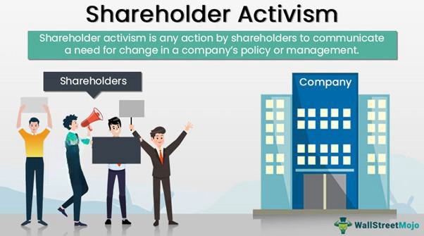

Shareholder activism has become a significant force in shaping corporate behavior and governance dynamics. As companies face increasing pressure from stakeholders to enhance value and accountability, activist shareholders have emerged as a powerful catalyst for change. These individuals or groups typically acquire a substantial equity stake in a corporation to influence its management and strategic direction. The growing relevance of shareholder activism can be attributed to its ability to effect tangible changes within companies, promote transparency, and align corporate actions with shareholder interests.

Corporate governance refers to the system of rules, practices, and processes by which a firm is directed and controlled. It involves balancing the interests of a company's stakeholders, such as shareholders, management, customers, suppliers, financiers, government, and the community. Effective corporate governance ensures that there is a framework for attaining a company's objectives, and it encompasses practically every sphere of management, from action plans and internal controls to performance measurements and corporate disclosure.

Activist shareholders are typically investors who use their equity stake to push for changes within a company. Their objectives often include improving financial performance, modifying corporate policies, or altering the composition of the board of directors. This form of activism can lead to increased accountability and performance by bringing forward the concerns of minority investors that might otherwise be overlooked.

The integration of algorithmic trading in modern shareholder activism represents a significant shift in how activist strategies are executed. Algorithmic trading involves the use of complex algorithms to make trades at speeds and volumes beyond the capability of human traders. By leveraging technology, activist investors can effectively gather and analyze large datasets, identify potential targets based on specific financial indicators, and execute precise entry and exit strategies to influence market outcomes in their favor.

This article aims to explore the interplay between shareholder activism, corporate governance, and the infusion of technology. Understanding how these elements interact is essential for grasping the evolving landscape of corporate governance. The subsequent sections will delve into the specifics of shareholder activism, examine the crucial role of corporate governance, and discuss activist strategies. Furthermore, the article will assess the impact of algorithmic trading on activism, highlight global trends, and provide insights into the future trajectory of shareholder activism and its implications for corporate governance.

## Table of Contents

## Understanding Shareholder Activism

Shareholder activism is a form of corporate engagement whereby shareholders use their equity stake in a corporation to put pressure on its management. The primary focus of shareholder activism is to drive changes aimed at improving financial performance and governance practices within a company. Activist shareholders can be individuals, institutional investors, or hedge funds, and their actions often involve advocating for changes in management strategies, operational efficiencies, or financial restructuring.

### Objectives of Activist Shareholders

Activist shareholders pursue various objectives, notably enhancing shareholder value and improving corporate governance. These objectives might include advocating for strategic shifts, such as mergers or divestitures, demanding changes in the company’s capital structure like share buybacks or dividend increases, and pushing for executive leadership changes. Some activist investors also focus on environmental, social, and governance ([ESG](/wiki/esg-investing)) issues, promoting more sustainable and ethical business practices.

### Forms of Shareholder Activism

Shareholder activism has evolved to manifest in different forms, each impacting corporate governance in distinct ways:

1. **Engagement:** Activists engage directly with management and the board of directors to propose changes. This form is often collaborative and seeks to influence strategies more amicably.

2. **Public Campaigns:** When private negotiations fail, activists might resort to public campaigns, using media and shareholder communications to influence broader opinion among stakeholders.

3. **Proxy Fights:** Activists might initiate proxy contests to replace some or all members of the board of directors if management is unwilling to act on their demands. Proxy fights are one of the most confrontational forms of activism.

4. **Litigation:** As a last resort, activists might pursue legal actions to enforce rights or influence corporate direction.

### Impact on Corporate Governance

The impact of shareholder activism on corporate governance is multifaceted. Activism can lead to more accountability in corporate governance structures, as boards and management become more responsive to shareholder concerns. Additionally, it can drive companies to adopt more transparent financial reporting and ethical business practices. However, not all effects are positive; some critics argue that short-term financial goals pursued by activists might undermine long-term growth and sustainability.

### Evolution of Shareholder Activism

Shareholder activism has evolved significantly over the decades. Initially, it was driven mostly by individuals or small groups advocating for ethical issues. However, in the late 20th century and early 21st century, larger institutional investors and hedge funds became more involved, using substantial resources to sway corporate management.

Technological advancements, such as data analytics and social media, have also played a crucial role in the evolution, enabling activists to disseminate information rapidly and rally support. Furthermore, the rise of ESG-related activism marks a shift from traditional financial objectives to a broader agenda that includes social and environmental considerations. This evolution reflects a growing trend where shareholder activism aligns financial performance with global sustainability goals, reshaping not only corporate strategies but also broader market practices. 

In summary, shareholder activism is a dynamic force in corporate governance, characterized by diverse objectives, strategies, and evolving methodologies, significantly impacting how companies operate and engage with their stakeholders.

## Corporate Governance: The Role of Shareholders

The relationship between shareholders and corporate governance is central to understanding how companies are directed and controlled. Shareholders, as the owners of a corporation, wield significant power through their voting rights and the ability to influence the board of directors. Corporate governance refers to the system of rules, practices, and processes by which a company is directed and controlled, and shareholders play a pivotal role in shaping these systems.

Shareholder activism has become a formidable force in influencing corporate decision-making processes. This form of activism involves shareholders using their equity stake to push for changes within a company, which can range from financial restructuring to demanding more sustainable business practices. Activist shareholders, especially those holding substantial equity or representing larger groups, can pressure management and the board to adopt policies that align with their interests. Active engagement can lead to enhanced corporate performance, as it often urges management to focus on long-term value creation rather than short-term gains.

Recent years have seen several high-profile case studies where activist shareholders have significantly reshaped corporate governance. One notable example is the campaign by Carl Icahn at Apple Inc. Icahn, known for his aggressive activist strategies, pressured Apple to increase its share buyback program, arguing that the company was undervalued and should return more capital to shareholders. This activism led to significant share repurchases and a better alignment of Apple's capital allocation with shareholder interests.

Another example is the influence of Third Point LLC, led by activist investor Daniel Loeb, on the reorganization of Sony Corporation. Third Point demanded strategic changes, including the spin-off of Sony's entertainment division, to enhance shareholder value. Although Sony did not spin off its entertainment division, the company's decision to increase transparency and optimize its portfolio was influenced significantly by the activist pressure.

These case studies illustrate how shareholder activism can drive significant changes in corporate governance structures and decision-making processes, often holding management accountable and ensuring that shareholder interests are prioritized. As activism continues to evolve, shareholders are likely to remain powerful [agents](/wiki/agents) in shaping the future of corporate governance.

## Activist Shareholder Strategies

Activist shareholders employ a variety of strategies to influence corporate management and steer strategic decisions. These strategies can range from private negotiations to public confrontations. A common approach is engaging in dialogue with the company's board or management to propose changes. Shareholders may seek actions such as restructuring business units, initiating share buybacks, or replacing executives and board members. When private negotiations fail, activists often resort to public campaigns, using media and investor relations to garner support for their agenda.

Shareholder meetings and voting are pivotal components of activist strategies. Activists utilize these meetings to propose resolutions, advocate for board memberships or strategic shifts, and gather support from other stakeholders. Proxy fights are a tactical application where activists attempt to replace company directors with those more aligned with their vision. These battles highlight the strength of collective voting power in pressuring companies to consider activist demands.

Examples of successful activist campaigns are abundant. Carl Icahn's involvement with Apple Inc. is notable, where he pushed for a substantial share repurchase program, ultimately returning billions to shareholders. Similarly, the activist fund Elliott Management influenced AT&T to divest non-core assets and reassess spending strategies, leading to a more focused business approach and increased shareholder value.

Such campaigns demonstrate the efficacy of well-coordinated activist strategies in reshaping corporate governance structures and realigning company management with shareholder interests.

## The Integration of Algo Trading in Shareholder Activism

Algorithmic trading, or algo trading, is increasingly being utilized in activist investing. This method uses algorithms to execute trading strategies based on predefined criteria, enabling investors to make decisions with high speed and precision. In the context of shareholder activism, [algorithmic trading](/wiki/algorithmic-trading) offers significant advantages and poses certain challenges.

### Utilization in Activist Investing

Activist investors leverage algorithmic trading to rapidly acquire or divest shares, achieve optimal pricing, and detect anomalies in trading patterns that may signal shifts in corporate governance. Algorithms can be programmed to identify undervalued companies or specific traits that activist shareholders target, such as poor management performance or potential for restructuring. This capability allows activist investors to quickly establish a foothold and exert influence on company management and policies.

### Benefits of Algo Trading

The primary benefit of algorithmic trading in activist investing is efficiency. Algorithms can process vast amounts of data much faster than human analysts, providing activists with timely insights and more responsive trading actions. This efficiency translates to more strategic buy or sell decisions, minimizing market impact and maximizing shareholder value.

Algo trading also reduces costs associated with manual trading processes. By automating trades, activist investors can decrease transaction costs, which is crucial when executing high-[volume](/wiki/volume-trading-strategy) trades or implementing strategies that involve intricate trading patterns.

Additionally, algorithmic trading introduces objectivity into investment decisions by removing human emotion from the process. This objectivity helps activate shareholders by focusing on quantitative criteria and potentially leading to more disciplined investment strategies.

### Challenges of Algo Trading

Despite its benefits, algorithmic trading in activist investing is not without challenges. One major concern is the complexity and resources required to develop and maintain effective algorithms. Designing algorithms specific to activist goals involves substantial research and the integration of numerous data sources, which can be costly and require ongoing adjustments.

Another challenge is the risk of technological failures or market anomalies, which can disrupt trading strategies. Algorithms operate based on historical data, and sudden market changes or black swan events may lead to significant financial losses if the algorithms are not equipped to handle such situations.

Lastly, regulatory hurdles pose a challenge, as different jurisdictions have distinct rules governing algorithmic trading. Activist shareholders must navigate these complexities to ensure compliance while pursuing their investment strategies.

### Impact of Technology on Shareholder Activism

The introduction of technology, particularly algorithmic trading, has transformed shareholder activism by facilitating more strategic and rapid responses to corporate governance issues. With access to real-time data analytics, activists can better monitor company performance and swiftly engage in campaigns to effect change.

Technological advancements also enable more comprehensive engagement strategies. Activists can leverage data-driven insights to craft tailored messages and influence broader shareholder opinions, thereby enhancing their ability to sway corporate governance decisions.

Overall, algorithmic trading, coupled with technological progress, is reshaping dynamics in shareholder activism. It empowers activists with tools to wield greater influence over corporate governance, demanding increased transparency and accountability from company management. As these technologies continue to evolve, they will likely drive more sophisticated and impactful activism tactics in the future.

## Global Trends in Shareholder Activism

Shareholder activism manifests differently across regions, influenced by varied economic, cultural, and regulatory environments. In the United States, activism is widely prevalent, characterized by assertive engagement often targeting underperforming or undervalued companies. Here, shareholder campaigns may focus on strategic business shifts, cost-cutting measures, or changes in management structures to boost shareholder value. The framework in the U.S. is often supportive of activism due to regulations that encourage transparency and shareholder rights.

In contrast, shareholder activism in Europe tends to focus more on collaborative engagement rather than confrontational approaches. European activists often work with company managements to drive long-term changes, with increasing emphasis on environmental, social, and governance (ESG) factors. The rise of ESG-focused activism has gained [momentum](/wiki/momentum) globally, but it is particularly notable in Europe where regulations and investor demand encourage sustainable and socially responsible business practices. The European Union’s stringent guidelines on sustainability reporting bolster this trend, making it imperative for companies to align with ESG criteria to satisfy activist investors.

Asia presents a mixed picture, with shareholder activism still emerging as a significant force. In Japan, corporate governance reforms have facilitated a gradual rise in activism. The establishment of the Japanese Stewardship Code and the Corporate Governance Code has enhanced investor rights, leading to increased shareholder engagement. However, cultural factors, such as the traditional emphasis on harmony and respect for hierarchical corporate structures, can temper aggressive activism. Elsewhere in Asia, such as in China and India, activism is relatively nascent, constrained by regulatory environments and cultural norms that do not always support robust shareholder engagement.

The global trend towards incorporating ESG into shareholder activism is driven by the growing awareness of the impacts of business activities on the environment and society. Investors increasingly recognize that sustainable business practices can lead to long-term financial performance and risk mitigation. Activists worldwide have thus begun to demand more transparency and accountability from corporations regarding their ESG practices.

Cultural and regulatory factors play significant roles in shaping shareholder activism. In regions with strong investor protection laws, such as the U.S. and Europe, activism thrives due to secure channels for expression and recourse. In contrast, in markets with weaker regulatory frameworks, activists might face greater challenges in voicing their concerns and effectuating change. Cultural elements, such as the emphasis on consensus in Asia, can either inhibit or modify the nature of activism, leading to more subtle approaches compared to the direct tactics seen in Western countries.

In conclusion, while there are common threads in shareholder activism globally—such as the increasing importance of ESG considerations—distinct regional characteristics are largely dictated by local regulatory and cultural environments. Understanding these variations is essential for predicting how activism will evolve and shape corporate governance in different markets.

## The Future of Shareholder Activism and Corporate Governance

The evolving landscape of shareholder activism and corporate governance is being shaped by a confluence of factors, primarily driven by advancements in technology and increasing global connectivity. Over the next decade, these elements are expected to significantly influence how shareholder activism unfolds and how corporate governance frameworks adapt.

### Predictions for the Evolution of Shareholder Activism

1. **Increased Use of Data Analytics and AI**:
   The incorporation of data analytics and [artificial intelligence](/wiki/ai-artificial-intelligence) (AI) into shareholder activism strategies is anticipated to grow. Shareholders and activist investors are likely to leverage AI for predictive analytics, identifying market trends, and assessing company performance. This could lead to more targeted and efficient activism campaigns, as AI provides insights that were previously unattainable through manual analysis.

2. **Rise of Virtual Shareholder Meetings**:
   Technological advancements will continue to support the rise of virtual shareholder meetings. These platforms enable broader participation from shareholders across the globe, reducing geographic and economic barriers. This democratization of access is likely to empower more retail investors to engage in activism, thereby diversifying the voices that influence corporate strategies.

3. **Enhanced Transparency and Real-time Engagement**:
   Global connectivity allows for instantaneous communication and dissemination of information. This transparency ensures that shareholders, including activists, can engage with corporate management in real-time, hold them accountable, and push for immediate changes. Companies might be pressured to maintain higher standards of transparency and adapt their governance models to accommodate this level of scrutiny.

### Implications for Future Corporate Governance Frameworks

1. **Stronger Emphasis on ESG (Environmental, Social, and Governance) Factors**:
   Driven by both investors' values and regulatory pressures, companies are expected to integrate ESG considerations more deeply into their governance frameworks. Shareholder activism focused on ESG issues will likely drive companies to establish more robust ESG policies and practices, aligning corporate operations with sustainable and ethical standards.

2. **Development of Predictive Governance Models**:
   With the application of [machine learning](/wiki/machine-learning) in governance, predictive models can be developed to foresee potential governance risks and opportunities. These models could assist boards in proactive decision-making, ensuring strategies are aligned with the evolving expectations of the shareholder base.

3. **Adaptation to Dynamic Regulatory Environments**:
   As regulatory landscapes evolve globally, influenced by increasing activism and technological advancements, corporate governance frameworks will need to be adaptable. Companies might need to adopt flexible, principle-based governance structures that can quickly respond to regulatory changes and shareholder demands.

4. **Increased Collaboration Amongst Shareholders**:
   Technology facilitates collaborations among shareholders, allowing them to form coalitions more easily. This collective strategy might be employed to exert greater influence over corporate governance decisions, pressuring companies to consider a wider range of shareholder views.

In summary, the future of shareholder activism and corporate governance is set to be increasingly dynamic, influenced by technological advancements and global connectivity. Companies will need to proactively engage with these changes to thrive in an environment where shareholder voices are more diverse and influential than ever before. As these trends unfold, companies that embrace technological innovation and transparency are likely to be more resilient and successful in navigating the demands of modern governance.

## Conclusion

Shareholder activism significantly influences corporate governance and financial markets. This article explored how activist shareholders seek to influence corporate strategies and management decisions to enhance shareholder value. Understanding these dynamics is crucial for companies aiming to navigate and succeed in an evolving business environment.

Our analysis highlighted the multifaceted nature of shareholder activism, including the various strategies employed by activist shareholders and the tangible impacts on corporate governance. Activist shareholders often pursue objectives such as operational improvements, governance reforms, or strategic redirection, leveraging tools like shareholder meetings and voting to initiate changes.

Moreover, the integration of algorithmic trading into shareholder activism showcases the convergence of technology and finance. This development provides new opportunities for activist shareholders to efficiently execute investment strategies but also presents challenges related to market dynamics and regulatory considerations.

Global trends underscore the diverse manifestations of shareholder activism, with cultural and regulatory influences shaping its practices across regions. The rise of ESG-focused activism exemplifies a shift toward sustainable and socially responsible investing, reflecting broader societal shifts.

As technology and globalization continue to drive changes in corporate governance, it is imperative for companies to understand and engage with shareholders proactively. Embracing shareholder engagement not only aids in aligning interests but also potentially enhances corporate resilience and long-term success.

For companies and investors, developing a nuanced understanding of shareholder activism and its implications is no longer optional—it's essential for navigating the complexities of the contemporary corporate world. Adapting to these dynamics will be crucial in shaping effective corporate governance frameworks in the future.

## References & Further Reading

[1]: Davis, S. J., Kim, S., & Oh, J. (2020). ["Shareholder Activism and Corporate Governance in the United States."](https://link.springer.com/referenceworkentry/10.1007/978-1-349-74173-1_352) The World Bank Economic Review, 34(1), 95-125.

[2]: López de Silanes, F., Laeven, L., & Claessens, S. (2008). ["Investor Protection and Corporate Governance: Firm-Level Evidence Across Countries."](https://www.semanticscholar.org/paper/Corporate-Ownership-Around-the-World-Porta-Silanes/350e36315dacca36c0c8cc7b77a0d8d46e4256e6) Review of Financial Studies, 22(6), 2185-2220.

[3]: Kahan, M., & Rock, E. B. (2007). ["Hedge Funds in Corporate Governance and Corporate Control."](https://papers.ssrn.com/sol3/papers.cfm?abstract_id=919881) University of Pennsylvania Law Review, 155(5), 1021-1093.

[4]: Coffee, J. C. (2018). ["Corporate Governance: Promises Kept, Promises Broken."](https://www.jstor.org/stable/j.ctt7szn5) Oxford University Press.

[5]: Lowry, M. (2017). ["The Role of Proxy Advisors in Stockholder Voting."](https://www.researchgate.net/publication/268504580_The_Role_of_Proxy_Advisory_Firms_Evidence_from_a_Regression-Discontinuity_Design) Journal of Financial Economics, 125(2), 183-198.