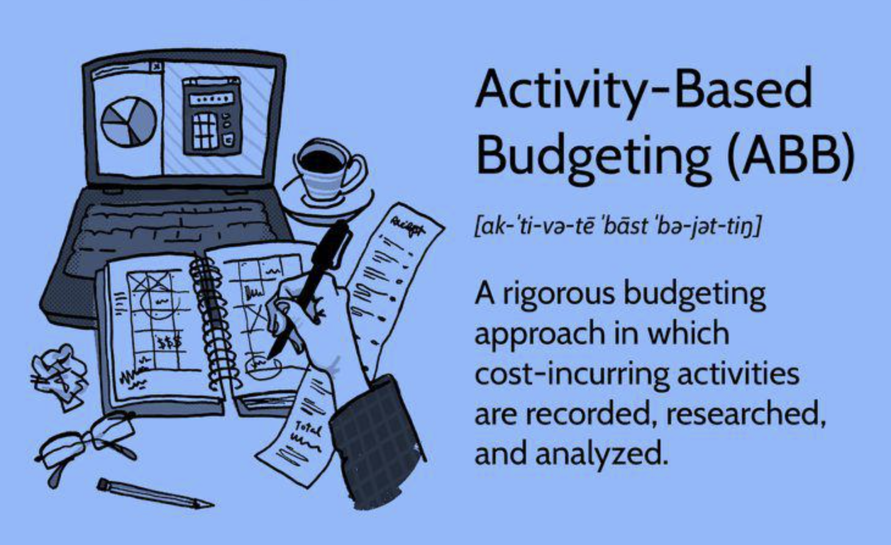

## Table of Contents

## What is Activity-Based Budgeting (ABB)?

Activity-Based Budgeting (ABB) is a way of making a budget by looking at the activities or tasks that a business does. Instead of just guessing how much money to spend, ABB looks at what the business needs to do to reach its goals. For example, if a company wants to make more products, ABB would figure out all the steps and costs involved in making those products. This helps the business plan better and spend money more wisely.

Using ABB can help a company see where it might be wasting money. By focusing on activities, the business can find out which ones are important and which ones are not really needed. This can lead to saving money and working more efficiently. For instance, if a company finds out that it spends a lot of money on a task that doesn't help much, it can decide to spend less on that task or stop doing it altogether.

## How does Activity-Based Budgeting differ from traditional budgeting methods?

Activity-Based Budgeting (ABB) and traditional budgeting methods are different in how they approach planning and spending money. Traditional budgeting usually starts with last year's budget and makes small changes for the new year. It often focuses on departments or cost centers, and the budget is based on what happened in the past. For example, if a department spent a certain amount last year, it might ask for a little more this year, even if the activities or needs of the department have changed.

On the other hand, ABB looks at the activities or tasks that a business needs to do to reach its goals. Instead of starting with last year's numbers, ABB starts with the activities and figures out the costs from there. This means that ABB can help a business see if it's spending money on things that don't really help it reach its goals. For instance, if a company wants to increase sales, ABB would look at all the steps needed to do that and budget money for those specific activities, rather than just giving more money to the sales department without understanding what they will do with it.

In summary, traditional budgeting is more about maintaining the status quo and making small adjustments, while ABB is about understanding and funding the specific activities that drive the business forward. This makes ABB more flexible and focused on what the business really needs to do to succeed, rather than just continuing to do things the way they've always been done.

## What are the key components of Activity-Based Budgeting?

The key components of Activity-Based Budgeting start with identifying the activities that a business needs to do to reach its goals. This means figuring out all the steps and tasks, like making products, selling them, or providing customer service. Once these activities are clear, the next step is to find out how much each activity costs. This includes looking at things like materials, labor, and any other expenses that are needed to do the activity. By understanding the costs of each activity, a business can see where it's spending money and if those activities are helping it reach its goals.

Another important part of Activity-Based Budgeting is linking the activities to the business's overall goals. This means making sure that the money spent on activities is helping the business grow or improve in the ways it wants to. For example, if a business wants to improve customer satisfaction, it might spend money on activities that make customer service better. By connecting activities to goals, ABB helps a business plan its budget in a way that supports what it wants to achieve. This makes the budgeting process more focused and effective, as it's based on what the business actually needs to do to succeed.

## What are the steps involved in implementing Activity-Based Budgeting?

Implementing Activity-Based Budgeting starts with figuring out what activities your business needs to do to reach its goals. This means looking at all the tasks, like making products, selling them, or helping customers. You need to talk to people in different parts of the business to understand what they do and why it's important. Once you know the activities, you can start to see how they fit together to help the business succeed.

Next, you need to find out how much each activity costs. This includes things like materials, labor, and other expenses that are needed to do the activity. By understanding the costs, you can see where the business is spending money and if those activities are really helping it reach its goals. After you know the costs, you can start making a budget that focuses on the activities that matter most. This means spending money on the things that will help the business grow or improve in the ways it wants to.

Finally, you need to keep checking and adjusting the budget. As the business changes, the activities and costs might change too. By regularly reviewing the budget and seeing how well the activities are working, you can make changes to keep the business on track. This way, Activity-Based Budgeting helps the business stay flexible and focused on what's important.

## How do you identify and categorize activities in ABB?

To identify and categorize activities in Activity-Based Budgeting, you start by talking to people in different parts of the business. You ask them about the tasks they do every day and why those tasks are important. This helps you understand what activities are needed to reach the business's goals. For example, if a business wants to make more products, you would find out all the steps involved in making those products, like buying materials, assembling parts, and testing the final product.

Once you know what activities are happening, you can start to group them into categories. You might put activities that are similar together, like all the tasks related to making products in one group and all the tasks related to selling products in another. This makes it easier to see how each group of activities helps the business reach its goals. By understanding and organizing the activities this way, you can figure out how much money to spend on each group to make sure the business is successful.

## What are the benefits of using Activity-Based Budgeting?

Using Activity-Based Budgeting can help a business spend its money more wisely. Instead of just guessing how much money to spend, ABB looks at what the business needs to do to reach its goals. This means the business can see which activities are important and which ones are not really needed. By focusing on the activities that matter most, the business can save money and work more efficiently. For example, if a company finds out it spends a lot on a task that doesn't help much, it can decide to spend less on that task or stop doing it altogether.

Another benefit of ABB is that it helps the business stay flexible and focused on what's important. Traditional budgeting often just makes small changes to last year's budget, but ABB looks at the activities and costs from scratch. This means the business can adjust its budget as things change, making sure it's always spending money on the right things. By regularly checking and updating the budget, the business can keep moving towards its goals in the best way possible.

## What are the potential challenges and limitations of Activity-Based Budgeting?

One challenge of using Activity-Based Budgeting is that it can take a lot of time and effort to set up. You need to talk to people in different parts of the business to find out all the activities and figure out how much each one costs. This can be hard, especially if the business is big or if people are not used to thinking about their work in terms of activities. It also means the business needs to have good systems for tracking and recording costs, which can be tricky if those systems are not already in place.

Another limitation of ABB is that it might not work well for businesses that have a lot of fixed costs, like rent or salaries, that don't change much from month to month. ABB is better for businesses where costs are more directly linked to activities, like making products or providing services. If a business has a lot of fixed costs, it might be hard to see how those costs relate to specific activities, which can make ABB less useful. Also, ABB needs everyone in the business to understand and support it, so if people are not on board, it can be hard to make it work well.

## How can Activity-Based Budgeting improve cost management and efficiency?

Activity-Based Budgeting can help a business manage costs better by focusing on the activities that matter most. Instead of just looking at last year's budget and making small changes, ABB starts by figuring out all the tasks needed to reach the business's goals. This means the business can see where it's spending money and if those activities are really helping it succeed. For example, if a company finds out it's spending a lot on a task that doesn't help much, it can decide to spend less on that task or stop doing it altogether. By understanding which activities are important, the business can save money and use it more wisely.

ABB also helps improve efficiency by making sure the business is doing the right things to reach its goals. Because ABB looks at activities and costs from scratch, the business can adjust its budget as things change. This means the business can stay focused on what's important and keep working towards its goals in the best way possible. Regularly checking and updating the budget helps the business stay flexible and efficient, making sure it's always spending money on the activities that will help it grow and improve.

## Can you provide an example of how Activity-Based Budgeting is applied in a real-world scenario?

Imagine a small bakery that wants to use Activity-Based Budgeting to improve its business. The owner starts by talking to the bakers, the sales team, and the delivery people to find out all the tasks they do every day. They figure out that the main activities are baking bread, decorating cakes, selling products in the store, and delivering orders to customers. The owner then looks at how much each activity costs, like the cost of flour and sugar for baking, the time spent decorating cakes, and the fuel used for deliveries. By understanding these costs, the bakery can see where it's spending money and if those activities are helping it make more money.

For example, the owner finds out that delivering orders is costing a lot of money because the delivery truck is old and needs a lot of repairs. They decide to spend some money on a new truck, which will save money on repairs in the long run. They also see that decorating cakes takes a lot of time, but it's a popular service that brings in a lot of money. So, they decide to hire another decorator to help out, which will let them make more cakes and earn more money. By using ABB, the bakery can focus its budget on the activities that will help it grow and be more successful.

## How does Activity-Based Budgeting integrate with other management systems like ERP?

Activity-Based Budgeting can work well with other management systems like ERP (Enterprise Resource Planning) by using the data and information that ERP systems collect. ERP systems keep track of all kinds of information in a business, like how much materials cost, how long tasks take, and how much money is spent on different things. ABB uses this information to figure out the costs of activities and make a budget that focuses on what the business needs to do to reach its goals. For example, if an ERP system shows that the cost of materials for making a product has gone up, ABB can use that information to adjust the budget and make sure the business is still spending money wisely.

By integrating ABB with an ERP system, a business can keep its budget up to date and make better decisions about where to spend money. The ERP system can provide real-time data that ABB can use to see if activities are costing more or less than expected. This helps the business stay flexible and adjust its budget as needed. For instance, if the ERP system shows that a certain activity is taking longer than planned, ABB can help the business decide whether to spend more money on that activity or find a way to do it faster. This way, ABB and ERP work together to help the business manage costs and work more efficiently.

## What metrics and KPIs should be monitored when using Activity-Based Budgeting?

When using Activity-Based Budgeting, it's important to keep an eye on certain metrics and KPIs to make sure the business is doing well. One key metric is the cost per activity, which shows how much money each task is using. By watching this, the business can see if it's spending too much on activities that don't help much. Another important KPI is the activity's contribution to the business's goals, which helps the business understand if the activities are helping it grow or improve. For example, if an activity is supposed to increase sales, the business should check if sales are actually going up because of that activity.

Other important metrics include the time spent on each activity and the efficiency of the activities. Time spent on an activity can show if it's taking too long and if the business needs to find a faster way to do it. Efficiency measures how well the business is using its resources to complete activities. If an activity is not efficient, the business might need to change how it's done or spend less money on it. By keeping track of these metrics and KPIs, the business can make sure it's using Activity-Based Budgeting to spend money wisely and reach its goals.

## How can organizations ensure the accuracy and reliability of data used in Activity-Based Budgeting?

To make sure the data used in Activity-Based Budgeting is accurate and reliable, organizations need to have good systems for collecting and checking information. This means setting up clear ways to track costs and activities, like using software or spreadsheets that everyone in the business understands and uses correctly. It's also important to train people on how to record data properly, so they know what to include and how to do it. Regular checks and audits can help find any mistakes or problems with the data, making sure it's as accurate as possible.

Another way to ensure data accuracy is by using technology like ERP systems, which can automatically gather and organize data from different parts of the business. This helps reduce the chance of human error and makes the data more reliable. It's also a good idea to have different people look at the data and agree on it, so there's less chance of one person making a mistake. By being careful and thorough with data collection and checking, organizations can trust that their Activity-Based Budgeting is based on solid, accurate information.

## References & Further Reading

[1]: Kaplan, R. S., & Cooper, R. (1998). ["Cost & Effect: Using Integrated Cost Systems to Drive Profitability and Performance"](https://books.google.com/books/about/Cost_Effect.html?id=SP4ziJkv3yQC) Harvard Business Review Press.

[2]: Player, S. (2007). ["Activity-Based Budgeting: A Practitioner’s Guide"](https://www.academia.edu/9189522/Activity_Based_Budgeting_Creating_a_Nexus_between_Workload_and_Costs_INTRODUCTION) Wiley.

[3]: ["Activity-Based Costing and Management"](https://corporatefinanceinstitute.com/resources/management/activity-based-management-abm/) by Cambridge University Press.

[4]: Turney, P. B. B. (2005). ["Common Cents: How to Succeed with Activity-Based Costing and Activity-Based Management"](https://archive.org/details/commoncentshowto0000turn) McGraw-Hill.

[5]: Arora, A., & Roehl-Anderson, J. (2010). ["Implementing Activity-Based Management in Daily Operations."](https://archive.org/details/implementingacti00mill) HarperCollins.