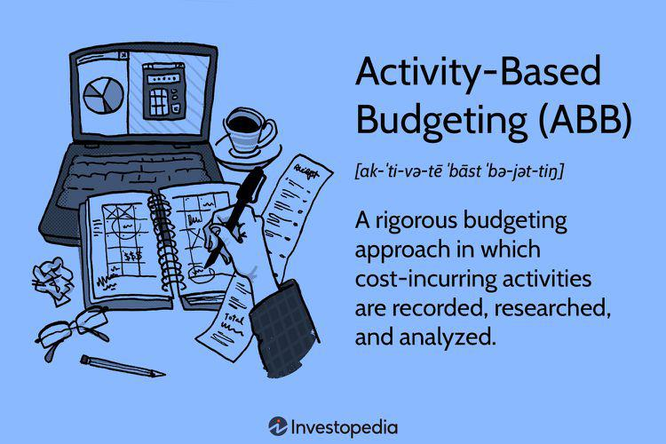

In today's dynamic financial landscape, organizations are constantly seeking strategies to improve cost efficiency and align resource allocation with strategic objectives. One methodology that has gained prominence is Activity-Based Budgeting (ABB). ABB is a budgeting technique that emphasizes the importance of budgeting based on activities that incur costs, rather than relying solely on historical data. Traditional budgeting methods often focus on adjusting past budgets, mainly accounting for expected inflation and growth. In contrast, ABB provides a comprehensive approach by focusing on understanding and analyzing the activities that contribute to costs.

This approach offers several advantages. By identifying and examining the specific activities that drive costs, businesses gain a clearer understanding of the underlying cost structures. This detailed insight helps organizations to identify cost drivers, which are the elements that directly influence the cost of activities. Consequently, ABB enables organizations to make informed decisions that enhance financial management. For example, by analyzing cost drivers, businesses can identify inefficient activities that do not add value and reallocate resources to more strategically significant areas. This not only improves cost efficiency but also ensures that strategic objectives are met through optimal resource allocation.



Moreover, ABB allows for better adaptability to changes in business environments. Since it is activity-focused, businesses can adjust their budgets more flexibly in response to changes in activities or cost drivers. This adaptability is crucial in volatile market conditions, where swift responses to changing circumstances are necessary for maintaining competitive advantage.

Overall, ABB represents a shift towards a more analytical and activity-centric budgeting process. By prioritizing activities that generate costs and understanding their implications, organizations can enhance their financial management capabilities, ensuring that resources are judiciously allocated to support strategic goals.

## Table of Contents

## Understanding Activity-Based Budgeting

Activity-Based Budgeting (ABB) involves a process of identifying the specific activities within an organization that incur costs, thereby enabling a more granular understanding of cost generation. This method places a strong emphasis on the relationship between activities and the resources they consume, contrasting with traditional budgeting methods that primarily rely on historical financial data to forecast and allocate budgets.

Central to the ABB process is the detailed analysis of activities and their associated costs. This begins with identifying all activities that occur within a business, categorizing them based on their function and contribution to the organization’s objectives. Once these activities are outlined, the next step involves assessing the cost drivers for each activity. Cost drivers are the factors that cause an activity to incur expense, such as the amount of labor, materials, or machine hours required.

For example, consider a manufacturing company where the production line activities may include assembly, painting, and quality control. Each of these activities will have different cost drivers. Assembly might be driven by labor hours, painting might involve material costs, and quality control could depend on the number of inspections conducted. By understanding these drivers, businesses can accurately allocate resources and justify budget allocations.

The insights from ABB empower organizations to pinpoint inefficiencies and areas for improvement. By shifting the focus to specific activities, businesses can distinguish between those that add significant value and those that do not contribute meaningfully to objectives. This clarity facilitates better resource allocation, ensuring that investments are made in activities that align with strategic goals.

Furthermore, the detailed nature of ABB means it provides a more dynamic and responsive budgeting tool. As market conditions or organizational strategies change, the activity-based approach allows for more flexibility and enables quick adjustments to budget allocations, ensuring sustained alignment with business priorities.

In sum, ABB offers a comprehensive framework for understanding the intricate details of cost behavior within an organization. By focusing efforts on activities and their cost implications, businesses gain the ability to enhance operational efficiency and optimize resource distribution effectively.

## Steps in Implementing Activity-Based Budgeting

The implementation of Activity-Based Budgeting (ABB) involves a systematic approach to accurately allocate and manage financial resources by focusing on activities that incur costs. This process is critical for organizations seeking to gain deeper insights into their cost structures and optimize resource allocation.

1. **Identifying Key Activities:** The initial step in ABB requires a comprehensive identification of activities that contribute to cost generation within an organization. Every operation, process, or task that leads to expenses is cataloged. This stage is fundamental in ensuring that all cost-related activities are accounted for, providing a detailed foundation for further analysis.

2. **Determining Cost Drivers:** Once key activities are identified, the next step is associating each activity with its respective cost drivers. Cost drivers are factors that influence the magnitude of costs associated with an activity. A precise understanding of these drivers is crucial, as they form the basis for analyzing how changes in activities impact financial resources. For example, in a manufacturing setting, machine hours could be a significant cost driver affecting production activity costs.

3. **Estimating Resource Requirements:** After determining cost drivers, the necessary resources for each activity need to be assessed. This involves quantifying the resources—such as labor, materials, and equipment—required to perform each activity efficiently. This step is pivotal in aligning resource allocation with actual needs, preventing under or overutilization.

4. **Developing Cost Estimates:** The final step involves calculating the budget for each activity based on its cost drivers and resource requirements. This includes forecasting the financial implications of various scenarios and ensuring that the budget aligns with the strategic objectives of the organization. A mathematical approach often aids in this step, where cost estimation models may be applied to simulate and predict future expenses. Here is a simple Python example that demonstrates the allocation of budget based on activity cost drivers:

   ```python
   # Example of basic cost estimate using activity cost drivers
   activity_costs = {
       'Manufacturing': {'machine_hours': 500, 'labor_hours': 200},
       'Marketing': {'ad_spend': 15000, 'labor_hours': 100}
   }

   cost_per_driver = {
       'machine_hours': 50,   # Cost per machine hour
       'labor_hours': 30,     # Cost per labor hour
       'ad_spend': 1          # Cost per advertising spend unit
   }

   def calculate_budget(activity_costs, cost_per_driver):
       budget = {}
       for activity, drivers in activity_costs.items():
           total_cost = sum(quantity * cost_per_driver[driver]
                            for driver, quantity in drivers.items())
           budget[activity] = total_cost
       return budget

   budget_estimates = calculate_budget(activity_costs, cost_per_driver)
   print(budget_estimates)
   ```

   This script calculates estimated budgets for specified activities based on their cost drivers, demonstrating the crucial role of accurate data analysis in ABB.

The successful execution of these steps provides organizations with a well-structured and precise financial framework, allowing them to make informed decisions that enhance overall financial management.

## Comparing ABB with Traditional Budgeting Methods

Traditional budgeting methods typically involve adjusting prior period budgets to account for inflation or anticipated growth. This approach may rely heavily on historical data and assumptions about the continuity of past trends. While straightforward, such methodologies often overlook the intricacies of individual activities and the specific costs associated with each. In contrast, Activity-Based Budgeting (ABB) requires a more granular approach, emphasizing the identification and analysis of cost-generating activities.

ABB provides detailed insights into cost drivers by focusing on the underlying activities that contribute to expenses. This focus on activities, rather than on aggregates or historical expenditures, grants businesses the flexibility to manage and control financial outcomes more effectively. By dissecting each component of the budget, organizations can identify inefficiencies and areas for improvement, leading to more precise forecasting and resource allocation.

Despite being more labor-intensive, ABB's comprehensive analysis can result in substantial cost savings. By understanding and managing specific cost drivers, businesses can streamline their operations, reduce unnecessary expenses, and align their spending with strategic objectives. This meticulous scrutiny not only enhances financial management but also ensures that resources support organizational goals in a more strategically aligned way.

The detailed nature of ABB can be time-consuming, requiring significant data collection and analysis efforts. However, the potential benefits, including improved cost efficiency and strategic alignment, often outweigh the initial investment. Organizations looking to optimize financial performance may find ABB a valuable tool in transforming their budgeting process, moving away from a solely reactive approach based on past budgets to a proactive strategy that positions them for future success.

## Challenges and Considerations in ABB

Implementing Activity-Based Budgeting (ABB) presents notable challenges that organizations must prepare for to maximize its benefits. One of the primary challenges is the resource-intensive nature of ABB. Unlike traditional budgeting methods, ABB demands detailed data collection and thorough analysis. Organizations need to gather comprehensive information on all activities, understand the resources they consume, and analyze cost behaviors, which can be a time-consuming and complex process.

Identifying the correct cost drivers and activities is another significant hurdle. Cost drivers are the factors that cause a change in the cost of an activity, and accurately pinpointing these can be challenging. This process may require continuous evaluation and adjustment as market conditions and organizational priorities evolve. The complexity increases as organizations often deal with multiple interrelated activities, where the cost of one activity can impact another. Consequently, defining clear boundaries and relationships between activities is crucial but difficult to achieve.

Despite these challenges, the benefits of ABB in terms of enhanced cost control and efficient resource allocation often justify the initial efforts involved. By focusing on specific activities and their associated costs, ABB provides insights that are not typically available through conventional budgeting methods. This detailed perspective enables organizations to allocate resources more effectively, empowering them to reduce unnecessary expenditures and improve operational efficiencies.

The transition to ABB may require organizations to adopt new software tools or technologies to handle the increased data requirements and complex calculations. Training staff to use these tools and to adapt to a new budgeting mindset is essential. Successfully implementing ABB also involves commitment from all levels of an organization, ensuring alignment with strategic objectives and fostering a culture that supports continuous improvement and accountability.

## The Role of ABB in Strategic Financial Management

Activity-Based Budgeting (ABB) significantly influences strategic financial management by harmonizing financial planning with an organization's strategic goals. This approach ensures that resources are channelled towards activities that contribute directly to achieving organizational objectives, thereby strengthening operational efficiency and financial performance.

One of the main advantages of ABB is its ability to provide a detailed and transparent view of cost drivers. By identifying the activities that generate costs, managers gain insights into the true cost structure of their operations. This clarity facilitates better forecasting as it allows organizations to predict future financial needs more accurately. For instance, if a particular activity is identified as a key cost driver, managers can focus their efforts on optimizing this activity, potentially reducing costs and thus enhancing profitability.

Furthermore, the clear understanding of cost drivers enhances decision-making processes. In scenarios where multiple projects or strategies compete for limited resources, ABB offers a framework for evaluating the cost-effectiveness of each option. This method supports prioritizing projects that align most closely with strategic objectives. Through precise knowledge of which activities load the budget, organizations can bypass unnecessary expenditures, ensuring that funds are allocated effectively.

The ability of ABB to align budgeting efforts with strategic priorities provides organizations the agility needed to stay competitive. As market conditions fluctuate and business environments evolve, ABB allows for flexibility in reallocating resources to adapt to new opportunities or threats. For such dynamic decision-making, real-time data and continuous analysis of activity costs are essential, enabling swift adjustments to financial plans to align with changing organizational needs.

Overall, ABB serves as a vital tool in ensuring strategic financial management by offering profound insights into cost allocation that assist in maintaining competitive advantage. By drawing precise connections between financial resources and strategic goals, organizations stand better positioned to achieve sustained success in their respective industries.

## Integrating ABB with Algorithmic Trading and Financial Management

Algorithmic trading, characterized by the use of automated systems to execute financial transactions at high speeds and frequencies, benefits significantly from the integration of Activity-Based Budgeting (ABB). In [algorithmic trading](/wiki/algorithmic-trading), financial managers can apply ABB to streamline resource allocation and enhance cost management. By aligning activities with specific cost drivers, ABB allows organizations to identify inefficiencies and adjust trading strategies accordingly, potentially leading to increased profitability.

Cost management in algorithmic trading involves comprehensive understanding and analysis of trading activities. Each activity, such as order placement, data analysis, and system maintenance, incurs specific costs attributed to servers, software, and personnel. ABB enables financial managers to dissect these activities, understand their cost implications, and allocate resources in a manner that optimizes the trading algorithm's performance.

The integration of ABB into an algorithmic trading system follows several strategic steps. First, financial managers must identify key trading activities and determine their associated cost drivers. These cost drivers can include transaction fees, data acquisition costs, and technology expenses. By accurately mapping these drivers, ABB provides insights into which activities contribute significantly to operating costs and offers opportunities for optimization.

Next, managers estimate resource requirements for each identified activity. This involves assessing technological infrastructure, software needs, and human resources necessary to support trading operations. ABB supports precise estimation by correlating resource consumption with specific trading activities, allowing managers to adjust allocations dynamically in response to market conditions.

Finally, developing cost estimates through ABB facilitates more informed decision-making for algorithmic trading strategies. By simulating different budget scenarios and their impact on resources, managers can predict financial outcomes and devise strategies that maximize profitability while minimizing unnecessary expenditures.

Integrating ABB into algorithmic trading systems also enhances decision-making processes. With a clear view of cost structures and their impact on trading outcomes, financial managers can refine algorithms to align more closely with strategic objectives. For instance, reducing resource allocation to less profitable trading activities and reallocating those resources to high-potential strategies can improve overall efficiency and effectiveness.

Additionally, ABB's focus on detailed cost analysis supports better budgeting forecasts in algorithmic trading. These insights enable financial managers to anticipate potential cost changes due to market fluctuations or technological advancements, facilitating adjustments in trading algorithms to maintain profitability and competitiveness.

In conclusion, incorporating ABB with algorithmic trading frameworks enriches financial management by promoting precise resource allocation, improving cost control, and aligning trading activities with strategic goals. As algorithmic trading continues to grow in complexity and scale, the systematic and detailed approach of ABB ensures that organizations remain agile and efficient in managing their trading operations.

## Conclusion

Activity-Based Budgeting (ABB) provides a robust framework for modern financial management, offering in-depth insights into cost structures and resource allocation. By focusing on the activities that incur costs, ABB allows organizations to identify and evaluate the actual drivers of expenses, enabling more strategic and efficient financial planning.

The implementation of ABB does require a higher level of detail and analysis compared to traditional budgeting techniques. This involves systematically identifying activities, associating them with cost drivers, and estimating necessary resources. Despite these complexities, the value of ABB lies in its ability to align budgeting processes with business activities that directly contribute to success. This alignment ensures that resources are allocated efficiently, optimizing the financial outcome and promoting strategic business objectives.

In today's complex financial environments, firms often encounter dynamic market conditions and competitive pressures, making strategic financial management crucial for sustainability and growth. ABB assists businesses in navigating these landscapes by providing clarity and control over financial operations. It aids in recognizing potential cost savings and aligning financial planning with long-term strategic goals, enhancing organizational adaptability and competitiveness.

As businesses strive for increased efficiency and effectiveness, ABB emerges as a strategic tool in financial management. Its comprehensive approach to understanding cost behaviors and resource needs empowers organizations to make informed decisions, ultimately driving success in a rapidly changing economic climate.

## References & Further Reading

[1]: Kaplan, R. S., & Cooper, R. (1998). ["Cost & Effect: Using Integrated Cost Systems to Drive Profitability and Performance"](https://books.google.com/books/about/Cost_Effect.html?id=SP4ziJkv3yQC) Harvard Business Review Press.

[2]: Player, S. (2007). ["Activity-Based Budgeting: A Practitioner’s Guide"](https://www.academia.edu/9189522/Activity_Based_Budgeting_Creating_a_Nexus_between_Workload_and_Costs_INTRODUCTION) Wiley.

[3]: ["Activity-Based Costing and Management"](https://corporatefinanceinstitute.com/resources/management/activity-based-management-abm/) by Cambridge University Press.

[4]: Turney, P. B. B. (2005). ["Common Cents: How to Succeed with Activity-Based Costing and Activity-Based Management"](https://archive.org/details/commoncentshowto0000turn) McGraw-Hill.

[5]: Arora, A., & Roehl-Anderson, J. (2010). ["Implementing Activity-Based Management in Daily Operations."](https://archive.org/details/implementingacti00mill) HarperCollins.