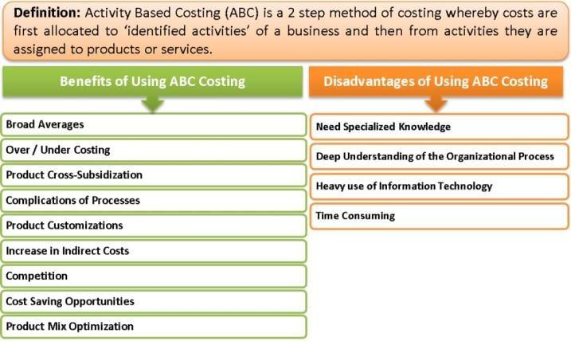

## Table of Contents

## What is Activity-Based Costing (ABC)?

Activity-Based Costing (ABC) is a way to figure out how much it costs to make a product or provide a service. It looks at all the activities that go into making something and assigns costs to each of these activities. Instead of just dividing total costs by the number of products made, ABC tries to be more accurate by connecting costs directly to the activities that cause them.

For example, if a company makes toys, ABC would look at activities like designing the toy, buying materials, assembling the toy, and packing it for shipping. Each of these activities has costs, like the salaries of designers, the price of plastic, or the cost of packing materials. By figuring out the cost of each activity, the company can then add up these costs to find out the total cost of making each toy. This helps the company understand which products are really profitable and which ones might be costing more than they're worth.

## How does Activity-Based Costing differ from traditional costing methods?

Activity-Based Costing (ABC) and traditional costing methods differ mainly in how they assign costs to products. Traditional costing usually splits costs into two big groups: direct costs, which are easy to link to a product, like the cost of materials, and indirect costs, or overheads, like rent or utilities. Traditional methods then spread these indirect costs across all products, often using a simple measure like the number of labor hours or machine hours. This can be quick and easy but might not show the true cost of making each product, especially if some products need more of the indirect resources than others.

On the other hand, ABC tries to be more accurate by looking at the specific activities that go into making a product and assigning costs to those activities. Instead of just spreading overhead costs evenly, ABC figures out which activities use up resources and assigns costs based on how much each product uses those activities. For example, if one product needs a lot of quality checks and another doesn't, ABC would assign more of the quality control costs to the first product. This can give a clearer picture of which products are really profitable and help businesses make better decisions about pricing and production.

In summary, while traditional costing is simpler and quicker, it might not accurately reflect the true cost of products, especially in complex businesses with many different products and activities. ABC, although more time-consuming to set up, provides a more detailed and accurate cost analysis, which can be crucial for businesses looking to improve efficiency and profitability.

## What are the key steps involved in implementing Activity-Based Costing?

Implementing Activity-Based Costing involves a few key steps that help businesses understand their costs better. First, you need to identify all the activities that go into making your products or providing your services. This means looking at everything from ordering materials to packing the final product. Once you have a list of these activities, you can start to figure out which ones are most important and how much they cost. This step is called activity analysis, and it's crucial because it helps you see where your money is really going.

Next, you need to assign costs to each of these activities. This is where you figure out how much it costs to do each activity, like how much it costs to run the machines or pay the people doing the work. After you know the cost of each activity, you can then link these costs to the products that use them. This is done by figuring out how much of each activity is needed for each product. For example, if one product needs a lot of machine time and another doesn't, you'll assign more machine costs to the first product. This step is called cost assignment, and it's what makes ABC different from traditional costing methods.

Finally, you use the information from the first two steps to calculate the total cost of each product. By adding up all the activity costs that go into making a product, you get a clearer picture of its true cost. This helps you see which products are really making you money and which ones might be costing more than they're worth. With this information, you can make better decisions about pricing, production, and even which products to focus on in the future.

## What types of activities are typically identified in Activity-Based Costing?

In Activity-Based Costing, businesses usually identify two main types of activities: unit-level activities and non-unit-level activities. Unit-level activities are things that happen every time you make a product. For example, if you're making toys, using a machine to shape the plastic or putting the pieces together would be unit-level activities. These activities are easy to link to each product because they happen every time you make one.

Non-unit-level activities are a bit trickier because they don't happen every time you make a product. They can be split into batch-level, product-level, and facility-level activities. Batch-level activities happen every time you make a batch of products, like setting up a machine or inspecting a group of items. Product-level activities are needed to support a specific product, like designing a new toy or keeping it in stock. Facility-level activities are needed to keep the whole business running, like paying rent or keeping the lights on. By understanding all these different types of activities, businesses can see where their costs are coming from and make smarter decisions.

## How are costs assigned to activities in Activity-Based Costing?

In Activity-Based Costing, costs are assigned to activities by figuring out how much it costs to do each activity. This means looking at all the resources that go into doing the activity, like the time people spend on it, the materials they use, and any machines or equipment needed. For example, if the activity is assembling a product, you'd add up the cost of the workers' time, any tools they use, and maybe even the electricity for the machines. This helps you see exactly how much it costs to do that one activity.

Once you know the cost of each activity, you can then link those costs to the products that use the activities. This is done by figuring out how much of each activity is needed for each product. If one product needs a lot of a certain activity, like a lot of machine time, you'll assign more of the cost of that activity to that product. This way, you get a clear picture of what it really costs to make each product, which helps you make better decisions about pricing and production.

## What are the benefits of using Activity-Based Costing for a business?

Using Activity-Based Costing (ABC) can help a business understand its costs better. ABC looks at all the little things a business does to make a product or provide a service, like ordering materials or running machines. By figuring out how much each of these activities costs, a business can see which products are really making money and which ones might be losing money. This helps the business make smarter choices about what to make, how to price things, and where to spend money. For example, if a product needs a lot of expensive machine time, ABC can show that, and the business might decide to raise the price or find a cheaper way to make it.

Another big benefit of ABC is that it can help a business work more efficiently. When a business knows exactly where its money is going, it can find ways to cut costs or do things better. For example, if ABC shows that a lot of money is spent on quality checks, the business might look for ways to do those checks faster or with fewer people. This can save money and make the business run smoother. Overall, ABC gives businesses a clearer picture of their costs, which can lead to better decisions and a healthier bottom line.

## Can Activity-Based Costing improve decision-making processes? If so, how?

Activity-Based Costing (ABC) can definitely help businesses make better decisions. By looking at all the little things a business does to make a product or provide a service, ABC helps figure out exactly how much each thing costs. This means a business can see which products are really making money and which ones might be losing money. With this clear picture, the business can decide which products to focus on, how to price them, and even where to cut costs. For example, if a product needs a lot of expensive machine time, ABC can show that, and the business might decide to raise the price or find a cheaper way to make it.

Another way ABC improves decision-making is by helping businesses work more efficiently. When a business knows exactly where its money is going, it can find ways to do things better or save money. For instance, if ABC shows that a lot of money is spent on quality checks, the business might look for ways to do those checks faster or with fewer people. This can save money and make the business run smoother. Overall, ABC gives businesses a clearer picture of their costs, which can lead to smarter decisions and a healthier bottom line.

## What industries benefit most from Activity-Based Costing?

Activity-Based Costing (ABC) is really helpful for businesses that make lots of different things or offer many services. This is because these businesses have lots of different activities, and ABC helps them see exactly how much each activity costs. For example, big manufacturing companies that make everything from cars to electronics can use ABC to figure out which products are making money and which ones are not. This helps them decide what to make more of and what to stop making. Also, hospitals and healthcare providers can use ABC to understand the costs of different treatments and services, which helps them manage their money better and offer better care.

Service industries like banks and consulting firms also benefit a lot from ABC. These businesses have many different activities that don't always lead to making a physical product, like processing loans or giving advice. ABC helps them see which services are costing more than they're worth and which ones are profitable. This can help them decide where to focus their efforts and how to price their services. Overall, any business with complex operations and lots of different activities can use ABC to make smarter decisions and save money.

## What are the potential challenges and limitations of implementing Activity-Based Costing?

Implementing Activity-Based Costing can be tough because it takes a lot of time and work to set up. You have to look at all the little things your business does, figure out how much each thing costs, and then link those costs to your products. This means you need a lot of detailed information, and gathering all that data can be hard. Plus, you might need special software or people who know a lot about ABC to do it right, which can cost a lot of money. If your business is small or doesn't have a lot of different products, it might not be worth the effort and expense.

Another challenge is that ABC can be hard to keep up with. As your business changes and grows, the activities and costs can change too. This means you have to keep updating your ABC system, which can be a lot of work. Sometimes, the benefits of ABC might not be worth the effort, especially if your business is simple or if the costs don't change much over time. Also, some people in your business might not like the new way of doing things and might resist the change, making it even harder to make ABC work well.

## How can Activity-Based Costing be integrated with other management tools and systems?

Activity-Based Costing can be used with other management tools to help businesses work better. For example, it can be combined with performance management systems. This means looking at how well people and machines are doing their jobs and using ABC to see how much it costs to do those jobs. By putting these two together, businesses can see which activities are costing too much and find ways to make them cheaper or faster. Another way to use ABC with other tools is with budgeting. ABC can help make budgets more accurate by showing exactly where money is being spent. This helps businesses plan better and make sure they're spending money on the right things.

ABC can also be used with ERP (Enterprise Resource Planning) systems. ERP systems help businesses keep track of everything they do, like buying materials, making products, and selling them. By adding ABC to an ERP system, businesses can see the cost of each activity right in their main system. This makes it easier to keep track of costs and make decisions. Overall, using ABC with other management tools can give businesses a clearer picture of their costs and help them make smarter choices about how to run their business.

## What advanced techniques can be used to enhance the accuracy of Activity-Based Costing?

To make Activity-Based Costing more accurate, businesses can use a technique called time-driven ABC. This means figuring out how long each activity takes and how much it costs per minute or hour. By doing this, businesses can assign costs more precisely to each product, especially if some products need more time for certain activities. For example, if one product needs a lot of time for quality checks, time-driven ABC can show that and assign the right amount of cost to that product. This helps businesses see the true cost of making each product and make better decisions.

Another advanced technique is using software that can handle a lot of data and do complex calculations. This software can look at lots of different activities and costs at the same time, making it easier to keep everything accurate and up-to-date. It can also help businesses see patterns and trends in their costs, which can help them find ways to save money or do things better. By using this kind of software, businesses can make sure their Activity-Based Costing is as accurate as possible and use the information to make smarter choices about their products and services.

## How can the effectiveness of an Activity-Based Costing system be measured and evaluated?

To measure and evaluate the effectiveness of an Activity-Based Costing system, businesses can look at how well it helps them understand their costs and make better decisions. One way to do this is by comparing the costs assigned by ABC to the actual costs of making products or providing services. If the ABC costs are close to the real costs, it means the system is working well. Businesses can also check if ABC helps them find ways to save money or make their operations more efficient. For example, if ABC shows that a certain activity is costing a lot, and the business can then find a cheaper way to do that activity, that's a sign that ABC is helping.

Another way to evaluate ABC's effectiveness is by looking at how it affects the business's overall performance. This means checking if using ABC leads to better profits, more accurate pricing, or better decisions about which products to focus on. Businesses can also ask their employees for feedback on how easy and useful the ABC system is to use. If employees find ABC helpful and it's making their jobs easier, that's a good sign. Overall, the key is to see if ABC is giving the business a clearer picture of its costs and helping it make smarter choices.

## How can one implement Activity-Based Costing (ABC)?

Implementing Activity-Based Costing (ABC) requires a systematic approach to accurately allocate costs to activities and ultimately to products or services. This process involves several key steps that ensure the effective application of this cost methodology.

**Identify Cost Drivers:** The implementation of ABC begins with the identification of activities that incur costs within an organization. A cost driver is a factor that influences the cost of an activity. For instance, in a manufacturing setup, machine setups, quality inspections, or the number of purchase orders may serve as cost drivers. Identifying these cost drivers is crucial as they form the basis for assigning costs to corresponding activities. Comprehensive mapping of all relevant processes and activities is essential to recognizing all potential drivers. 

**Assign Costs to Activities:** Once cost drivers are pinpointed, the next step is to allocate costs to each activity based on the resources consumed. This involves analyzing the relationship between activities and resources, which can be done through various methods such as time-driven ABC, where time is used as the cost driver. The formula below illustrates a basic way to assign costs:

$$
\text{Activity Cost} = \text{Cost Driver Rate} \times \text{Activity Driver Quantity}
$$

This equation helps in establishing how much each activity costs the organization by relating it back to the resources used.

**Allocate Costs to Products or Services:** After costs are assigned to individual activities, they need to be allocated to products or services based on their consumption of these activities. This step ensures the costs reflect the true consumption at the product or service level. Products that utilize more of a specific activity will incur higher costs associated with that activity. This allocation can be represented as:

$$
\text{Cost per Unit} = \frac{\text{Total Activity Costs for Product}}{\text{Total Units Produced}}
$$

This method aids in precise cost analysis, which is essential for developing pricing strategies and cost management.

**Utilize ABC Data for Strategic Decisions:** The data gathered from ABC offers valuable insights that can drive strategic decisions. Businesses can use this information to optimize resource allocation, target cost reductions, and enhance profitability. For example, identifying high-cost activities allows for efficiency improvements and strategic planning to minimize unnecessary expenditure.

**Overcome Implementation Challenges:** Implementing ABC can be complex due to the detailed data required and potential resistance from employees accustomed to traditional costing methods. Successful implementation necessitates strategic planning and change management. Investing in technology for data collection and management, as well as training employees on the benefits and processes of ABC, can mitigate these challenges. Support from leadership and consistent communication can further ease the transition and ensure the successful adoption of ABC in any organization. 

In conclusion, while implementing ABC requires effort and resources, it provides substantial benefits for organizations striving for detailed cost insights and enhanced decision-making.

## References & Further Reading

[1]: Kaplan, R. S., & Anderson, S. R. (2007). ["Time-Driven Activity-Based Costing: A Simpler and More Powerful Path to Higher Profits."](https://www.hbs.edu/ris/Publication%20Files/04-045_d62528d4-7931-4ea1-a205-d9683c639d6e.pdf) Harvard Business Review Press.

[2]: Cooper, R., & Kaplan, R. S. (1991). ["The Design of Cost Management Systems: Text and Cases."](https://archive.org/details/designofcostmana0000coop) Prentice Hall.

[3]: Drury, C. (2008). ["Management and Cost Accounting."](https://link.springer.com/book/10.1007/978-1-4899-6828-9) Cengage Learning.

[4]: Turney, P. B. B. (2005). ["Common Cents: How to Succeed with Activity-Based Costing and Activity-Based Management."](https://archive.org/details/commoncentshowto0000turn) McGraw-Hill.

[5]: Noreen, E., & Burgstahler, D. (1997). ["Managerial Accounting for Managers."](https://papers.ssrn.com/sol3/papers.cfm?abstract_id=8505) McGraw-Hill.