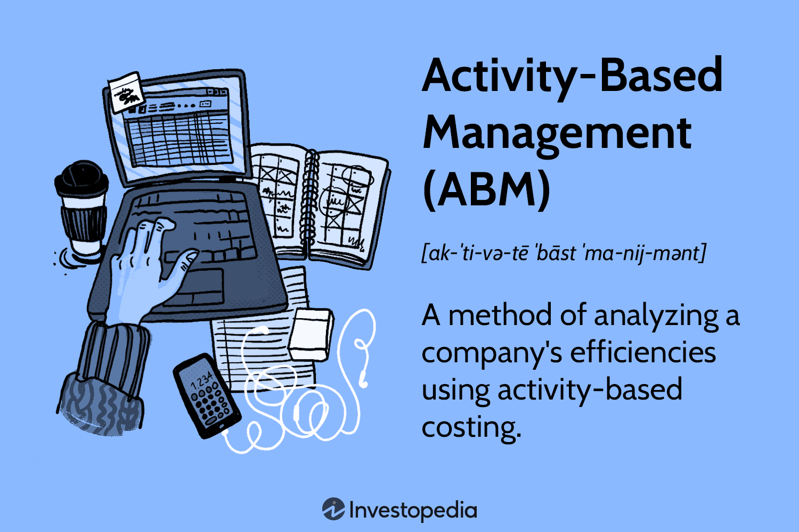

In the dynamic world of modern business, organizations continually seek strategies to enhance efficiency and profitability. Activity-Based Management (ABM) is a strategic approach that provides detailed insights into business operations through a cost-driven lens. ABM focuses on identifying and eliminating non-value-added activities, thereby improving financial performance and decision-making. By allocating costs based on specific activities, organizations gain a clearer understanding of how resources are consumed and where inefficiencies may lie. This nuanced view of financial dynamics enables more informed strategic planning and resource allocation.

The integration of algorithmic trading strategies with ABM introduces a unique synergy capable of driving more precise financial outcomes. Algorithmic trading, which uses automated systems to execute trades based on predefined criteria, benefits from the granular cost insights provided by ABM. This partnership enhances data accuracy and enables more effective trading strategies by aligning operational activities with financial goals. The result is optimized trading operations, reduced transaction costs, and improved market responsiveness.



This article will explore the fundamentals of Activity-Based Management, various management strategies employed within ABM, and how these concepts align with algorithmic trading to optimize business performance. The discussion will cover essential methodologies within ABM, its role in streamlining business activities, and the challenges businesses may face in adopting this approach. By examining the intersection between ABM and algorithmic trading, we aim to provide a comprehensive understanding of how this integration can support enhanced efficiency and profitability in modern business environments.

## Table of Contents

## Understanding Activity-Based Management (ABM)

Activity-Based Management (ABM) serves as a strategic framework that meticulously examines business activities, aiming to enhance both operational efficiency and economic performance. ABM gained prominence in the 1980s, a period marked by the pursuit of more effective management methodologies that could uncover inefficiencies within organizations. The primary objective of ABM is to identify areas where businesses may be incurring losses and to address these issues in an effective manner.

Central to the ABM framework is Activity-Based Costing (ABC), a method that provides a detailed analysis of the costs associated with business processes. Unlike traditional costing methods, which may assign costs based on broad averages, ABC seeks to allocate costs more precisely by identifying the specific activities that contribute to each cost driver. This granular approach allows organizations to pinpoint cost inefficiencies and areas for improvement more accurately.

ABM extends beyond mere cost analysis, embedding performance measures into operational processes. This integration offers insights not only on financial metrics but also on non-financial aspects of business operations. By focusing on performance metrics, ABM enables organizations to align their activities with strategic objectives, promoting a culture of continuous improvement.

The framework emphasizes the importance of understanding the relationship between various business activities and their associated costs. By doing so, ABM provides a more comprehensive view of an organization's operations, facilitating more informed decision-making. Organizations can then prioritize activities that add value while reducing or eliminating those that do not contribute to their strategic goals.

In summary, ABM is a strategic approach that leverages Activity-Based Costing to optimize business processes through detailed cost and performance analysis. It integrates financial and non-financial insights, driving businesses towards improved operational efficiency and effectiveness.

## ABM Management Strategies

Successful implementation of Activity-Based Management (ABM) strategies necessitates a structured approach comprising several critical phases, each essential for enhancing operational efficiency and financial performance.

The first phase, activity analysis, involves conducting a thorough examination of all business activities to identify and document each activity undertaken by the organization. This step is crucial for recognizing both value-added and non-value-added activities. Value-added activities are those that directly contribute to fulfilling customer requirements or improving the product, while non-value-added activities often result in unnecessary costs and inefficiencies.

Following the completion of activity analysis, the next phase involves cost assignment. This step focuses on accurately allocating costs to the various activities identified during the analysis. Central to this process is the identification of cost drivers, which are factors that cause changes in the cost of an activity. Accurately identifying and applying cost drivers allow for a more precise allocation of costs, ensuring that each activity is assigned costs proportionate to its consumption of resources. This accurate cost allocation facilitates the pinpointing of inefficiencies and provides a basis for cost-reduction initiatives.

Once costs have been assigned, the final phase is performance evaluation. This phase involves assessing the efficiency and effectiveness of each activity with the aim of aligning activities closely with organizational goals. By focusing on performance metrics, organizations can determine which activities add value and which need to be refined or eliminated. Evaluation is not a one-time event but requires continuous monitoring and reassessment. This ongoing evaluation ensures sustained efficiency improvements and cost accuracy over time.

Incorporating ABM strategies is not a static task; it involves an iterative process of continuous monitoring and adjustment. By maintaining awareness of changing business conditions and regularly recalibrating processes, organizations can consistently achieve improved efficiency and cost effectiveness. Through this structured approach, ABM serves not only as a tool for cost allocation but as an essential component of strategic decision-making, aiming to reduce waste while enhancing value-added operations.

## Algorithmic Trading and ABM Integration

Algorithmic trading utilizes sophisticated automated systems to execute trades with high speed and precision, leveraging algorithms that process vast amounts of market data. The integration of Activity-Based Management (ABM) with [algorithmic trading](/wiki/algorithmic-trading) represents a significant advancement in refining financial forecasting and decision-making processes. ABM's focus on cost attribution and resources optimization provides a robust framework for identifying and analyzing the cost drivers of trading operations, ensuring more accurate financial assessments.

By combining ABM with algorithmic strategies, businesses can achieve optimized trading operations, characterized by reduced transaction costs and enhanced efficiency. ABM offers detailed insights into the cost structures associated with specific trading activities, allowing organizations to identify areas where costs can be minimized and value maximized. This precision in cost analysis is critical for optimizing the algorithms used in trading, enabling them to be more responsive and cost-effective.

Furthermore, the integration promotes data-driven decision-making, an essential capability in the fast-paced trading environment. The enhanced data accuracy provided by ABM supports more reliable forecasts and strategic decisions, thereby improving market positions and profitability. This approach enables companies to leverage both quantitative and qualitative insights, resulting in refined strategies that maximize return on investment.

For instance, a simplified Python example of an algorithmic trading model that could benefit from ABM insights is shown below:

```python
def optimize_trading_strategy(current_data, cost_data):
    # Using activity-based insights to adjust strategy parameters
    cost_reduction = cost_data["non_value_added_activities"]

    # Example algorithm logic that adjusts parameters based on cost efficiency
    if cost_reduction < threshold:
        trade_volume = base_volume * 1.1
    else:
        trade_volume = base_volume * 0.9

    return execute_trades(current_data, trade_volume)

def execute_trades(data, volume):
    # Trading logic
    pass

# Sample Data
current_market_data = {"price": 100}
abm_cost_insights = {"non_value_added_activities": 5}

optimize_trading_strategy(current_market_data, abm_cost_insights)
```

In this example, ABM-derived cost insights drive the adjustments of trade [volume](/wiki/volume-trading-strategy), demonstrating how ABM can be operationally embedded within algorithmic trading strategies. By aligning their operations with cost-effective practices, organizations harness enhanced profitability and competitive advantage.

## Benefits of Implementing ABM in Trading

Activity-Based Management (ABM) offers a strategic advantage in trading by significantly enhancing the visibility and accuracy of cost information. This precision in cost data fosters the development of more effective pricing strategies and robust financial planning. By enabling firms to comprehend the true cost of activities, ABM provides a clear picture of where resources are consumed, allowing for more informed pricing decisions that reflect actual operational expenses.

One of the core advantages of ABM is its ability to identify inefficiencies within trading operations. By focusing on activities rather than products, ABM highlights non-value-added processes that can be streamlined or eliminated, resulting in reduced operational costs. This focus on efficiency enables trading businesses to enhance their cost-effectiveness, maintaining competitive pricing without sacrificing margins.

The integration of real-time data from trading platforms with the ABM framework allows for dynamic strategic adjustments. This capability is crucial in trading, where market conditions can change rapidly. Analyzing real-time data helps businesses respond promptly to these shifts by providing insights into cost behavior and potential areas for adjustment. This real-time analysis supports agile decision-making, ensuring that trading strategies remain aligned with current market conditions and organizational goals.

Furthermore, ABM facilitates improved resource utilization throughout trading activities. By ensuring that all resources are deployed effectively and align with corporate objectives, businesses can optimize their operations to support strategic aims. This alignment not only supports cost management but also enhances the overall efficiency of trading operations, contributing to improved financial outcomes.

In conclusion, the adoption of ABM in trading environments equips organizations with a robust framework for achieving enhanced cost accuracy, operational efficiency, and strategic adaptability, ultimately supporting broader corporate success.

## Challenges in Adopting ABM

Implementing Activity-Based Management (ABM) in an organization involves several complexities that can pose significant challenges. One primary challenge is the intricate nature of data collection and the analytical requirements associated with ABM. Organizations must gather detailed data on various activities, which requires robust data management systems capable of handling the volume and complexity of information. This process can be resource-intensive and may necessitate substantial investments in technology and personnel.

Resistance to change is another common hurdle in successfully adopting ABM. This resistance can manifest as reluctance among staff to adjust existing processes or skepticism about the benefits of the new system. Overcoming such resistance requires effective communication strategies to convey the advantages of ABM and to involve employees in the transformation process. Additionally, aligning the organization's culture with the objectives of ABM is crucial for fostering acceptance and support.

Ensuring data accuracy is essential for the successful implementation of ABM, as inaccurate data can significantly distort cost assignment and impact decision-making processes. Errors or inconsistencies in data collection can lead to misguided strategic insights, reducing the overall effectiveness of the ABM framework. Organizations must establish rigorous data validation protocols and continuously monitor data quality to mitigate these risks.

Addressing these challenges necessitates robust change management strategies. Comprehensive training programs are vital to equip staff with the necessary skills and knowledge to leverage ABM effectively. Continuous staff development ensures that employees remain proficient in using ABM tools and techniques, thereby optimizing operational efficiency and facilitating seamless adoption across the organization. Adopting a structured approach to change management can enhance the likelihood of a successful transition to ABM, ultimately leading to improved business performance and strategic alignment.

## Conclusion

Activity-Based Management (ABM) provides a robust mechanism to enhance business efficiency via detailed cost analysis and strategic alignment. By meticulously examining operational activities, ABM helps in identifying inefficiencies and reallocating resources towards value-added processes. This heightened financial visibility empowers organizations to make informed decisions that align with their strategic objectives.

The integration of ABM with algorithmic trading represents a proactive approach to financial management. Algorithmic trading systems, known for their speed and precision, can significantly benefit from the detailed cost insights that ABM provides. This synergy facilitates enhanced financial planning and improved market responsiveness, as businesses can leverage accurate, real-time data to optimize their trading strategies.

Despite inherent challenges, such as the complexity of implementation and data management, the advantages of adopting ABM cannot be overstated. Organizations that overcome these hurdles can achieve refined operational efficiency, optimizing profitability. ABM's ability to streamline processes and cut costs positions it as a strategic priority, essential for maintaining a competitive edge in today's dynamic business environment.

Embracing ABM equips businesses with the necessary tools to navigate a rapidly evolving landscape. By committing to its principles, organizations not only improve their current financial standing but also set a foundation for sustainable growth and long-term success.

## References & Further Reading

[1]: Kaplan, R. S., & Cooper, R. (1998). ["Cost & Effect: Using Integrated Cost Systems to Drive Profitability and Performance."](https://books.google.com/books/about/Cost_Effect.html?id=SP4ziJkv3yQC) Harvard Business School Press.

[2]: Kaplan, R. S., & Anderson, S. R. (2007). ["Time-Driven Activity-Based Costing: A Simpler and More Powerful Path to Higher Profits."](https://www.hbs.edu/ris/Publication%20Files/04-045_d62528d4-7931-4ea1-a205-d9683c639d6e.pdf) Harvard Business Review Press.

[3]: Clarke, R., & Skënderasi, I. (2019). ["Algorithmic and High-Frequency Trading."](https://assets.cambridge.org/97811070/91146/frontmatter/9781107091146_frontmatter.pdf) Routledge.

[4]: Cooper, R., & Kaplan, R. S. (1991). ["The Design of Cost Management Systems: Text, Cases, and Readings."](https://archive.org/details/designofcostmana0000coop) Prentice Hall.

[5]: Lopez de Prado, M. (2018). ["Advances in Financial Machine Learning."](https://www.amazon.com/Advances-Financial-Machine-Learning-Marcos/dp/1119482089) Wiley.