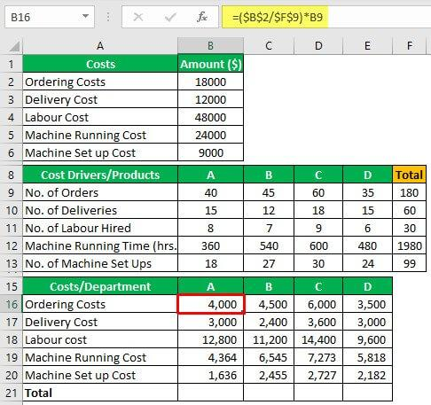

In today's competitive business environment, entities are increasingly focused on understanding cost structures and optimizing trading strategies to secure profitability. This article examines the intricate link between cost accounting, business management, activity cost drivers, and algorithmic trading. Cost accounting serves as a specialized area of accountancy that delineates every facet of a company's production costs, assessing both variable and fixed outlays involved in each stage of production. An integral aspect of cost accounting is the identification of activity cost drivers, elements that significantly influence the cost metrics of business operations. Recognizing and managing these drivers enables organizations to exercise effective oversight over expenses, creating opportunities for strategic decision-making that enhances financial performance.

On the other hand, algorithmic trading merges technology with trading practices, allowing for transactions to occur at unprecedented speeds and providing a competitive edge in today's market. By integrating an understanding of relevant cost drivers within algorithmic trading frameworks, businesses can potentially refine these systems to minimize costs and enhance execution quality. The relationship between algorithmic trading and cost drivers is symbiotic; sophisticated algorithms can be adjusted in response to transaction fees, technological expenses, and other cost factors to improve the overall efficiency of trading strategies.



This discussion will explore the interconnectivity between these concepts and offer insights for effective business management. By comprehensively understanding how cost accounting and activity cost drivers impact a company's operations, businesses can adopt strategies that optimize both operational efficiency and cost-effectiveness, ultimately supporting sustained profitability in a dynamic market landscape.

## Table of Contents

## Understanding Cost Accounting

Cost accounting is an essential discipline within the broader field of accounting, serving to capture and analyze the full scope of a company's production costs. This branch of accounting plays a vital role in financial planning and strategic business decision-making, providing detailed cost information that aids in evaluating both efficiency and profitability. The primary goal is to ascertain the costs incurred during the manufacturing or production processes, demarcated into variable and fixed costs. 

Variable costs pertain to expenses that fluctuate with the level of production output. Common examples include raw materials and direct labor costs. These costs increase as production ramps up and decrease when production slows. Conversely, fixed costs remain constant regardless of the production level, encompassing expenditures such as rent and salaries. Consequently, cost accounting facilitates the meticulous assessment of these costs at each production stage, generating critical insights into cost structure that are crucial for managerial control.

A pivotal aspect of cost accounting is the identification of activity cost drivers. These are specific activities or factors that incur costs within a business operation. Recognizing these drivers is fundamental as they directly influence the variable component of production costs. For instance, in a manufacturing setting, activity cost drivers might include machine running hours or the quantity of orders processed. Understanding these factors enables businesses to control cost behavior effectively.

By tracking activity cost drivers, companies can gather comprehensive data on how costs behave under different operational scenarios. This analysis allows them to optimize expenses by pinpointing inefficiencies or areas where costs can be reduced without jeopardizing product quality. This, in turn, leads to better-informed strategic decisions aimed at enhancing operational efficiency and profitability. For example, if machine maintenance emerges as a significant cost driver, a business might explore investing in more efficient machines or implementing a preventive maintenance program to reduce downtime and costs.

In practice, businesses often employ activity-based costing (ABC), a methodology that assigns costs to products and services based on their consumption of resources. This approach requires an understanding of activity cost drivers and directly links costs to specific activities. By doing so, it provides a more accurate picture of where money is being spent and highlights opportunities for cost savings.

In summary, cost accounting and the identification of activity cost drivers provide a framework for businesses to decode their cost structure and make strategic decisions to optimize expenses. This process equips firms with the necessary tools to improve budgeting, control costs, and ultimately, enhance profitability.

## The Role of Activity Cost Drivers

Activity cost drivers are pivotal elements in cost accounting, influencing the variable expenses of a business. These are the specific actions or decisions that lead to cost fluctuations and are intrinsic to understanding how costs can be managed effectively. Identifying and analyzing these drivers can significantly impact a business's financial strategy and operational efficiency.

Cost drivers encompass various factors, primarily those linked to variable expenses. For instance, direct labor hours are a common cost driver, where the amount of time employees spend on production directly affects labor costs. Similarly, machine usage—measured in terms of hours or cycles—can also serve as a critical cost driver, impacting both maintenance expenses and depreciation. By assessing these drivers, businesses can precisely ascertain which aspects of their operations incur additional costs, thus identifying opportunities for cost control and reduction.

Furthermore, the accurate identification of activity cost drivers extends beyond mere cost reduction; it facilitates resource allocation optimization. This involves ensuring that resources such as personnel, machinery, and materials are utilized in the most efficient and cost-effective manner. For example, if a company identifies that machine downtime significantly increases production costs, it might allocate resources to maintenance or invest in more reliable equipment to mitigate these costs over time.

Incorporating activity cost drivers into financial analysis allows businesses to refine their forecasting and budgeting processes. By understanding the correlation between specific activities and their associated costs, companies can predict financial outcomes more reliably and make informed strategic decisions.

In summary, activity cost drivers are integral to enhancing profitability and efficiency in business operations. Their identification and management enable businesses to allocate resources with greater precision, mitigate unnecessary expenditures, and ultimately improve their financial health.

## Incorporating Cost Drivers into Business Management

Effective business management requires integrating an understanding of cost drivers into the decision-making process. Cost drivers are vital indicators that define the activities and attributes causing costs to occur within an organization. Identifying and analyzing these drivers allow businesses to streamline operations, minimize expenses, and set strategic pricing.

Evaluating cost drivers enables organizations to gain insights into where and why resources are consumed. This evaluation leads to more informed decision-making concerning production processes, resource allocation, and overhead control. For example, understanding the cost drivers related to labor, materials, and machine time can lead a manufacturing business to optimize its production schedule, thereby reducing downtime and improving overall efficiency.

Activity-Based Costing (ABC) is a strategic tool used to allocate overhead expenses accurately by identifying and using cost drivers. Unlike traditional costing methods, which often apply a blanket rate for overhead allocation, ABC employs specific cost drivers to trace expenses to the exact products or services that generate them. This method enhances financial transparency by providing detailed insights into the cost and profitability of various business segments.

The implementation of ABC begins with identifying key activities and cost drivers associated with each. These could range from machine hours to the number of customer orders processed. Then, overhead costs are allocated based on the actual consumption of resources dictated by these drivers. The formula for calculating the overhead allocation using ABC could be represented as:

$$
\text{Overhead Cost Allocation} = \sum (\text{Activity Cost Driver Rate} \times \text{Activity Usage})
$$

Where:
- $\text{Activity Cost Driver Rate}$ is the cost per unit of activity,
- $\text{Activity Usage}$ is the number of activity units consumed by the product or service.

By utilizing ABC, companies can not only achieve more precise cost distribution but also assess the profitability of individual products, customer segments, or service lines. This information is instrumental in making strategic decisions about product development, pricing strategies, and market repositioning.

Incorporating cost drivers into business management decisions ultimately leads to enhanced operational efficiency and financial health. It allows organizations to identify inefficiencies, control costs, and formulate strategies that align with their financial goals and market demands.

## Algorithmic Trading and Its Relation to Cost Drivers

Algorithmic trading utilizes computational power and advanced algorithms to execute orders at velocities and frequencies beyond the capacity of human traders. This method leverages technology to deliver precision, speed, and efficiency in executing trades, significantly minimizing latency and human error.

The efficiency and profitability of [algorithmic trading](/wiki/algorithmic-trading) can be substantially impacted by various cost drivers such as transaction fees and technological expenses. Transaction fees refer to the charges applied by exchanges or brokers for executing trades, while technological expenses encompass the costs associated with the infrastructure, such as servers and software, required to maintain high-frequency trading systems.

Identifying and understanding these cost drivers is essential for optimizing trading strategies. For instance, transaction fees can be modeled and incorporated into algorithms to ensure trades remain cost-effective. This can involve calculating the total transaction costs using the formula:

$$
\text{Total Transaction Cost} = \text{Price} \times \text{Quantity} + \text{Transaction Fees}
$$

In practice, algorithms can include mechanisms to minimize these costs by selecting execution venues with the lowest fees or by optimizing the size and timing of trades to reduce market impact.

Technological expenses also play a critical role in the efficiency of algorithmic trading. Initial investments in robust technology and infrastructure can lead to lower operational costs in the long run. By analyzing these expenses, traders can determine the return on investment (ROI) from the infrastructure and decide when upgrades or alternative solutions are necessary.

Understanding these cost drivers equips businesses with the ability to modify algorithms to minimize unnecessary expenses and enhance execution quality. For example, by assessing technological expenses, traders can adjust algorithms to optimize server use and data processing, thereby reducing latency and operational costs.

Python programming can be employed to analyze and manage these costs effectively. For instance, the following Python code snippet demonstrates how to calculate transaction costs:

```python
def calculate_transaction_cost(price, quantity, fee_percentage):
    transaction_cost = (price * quantity)
    transaction_fee = transaction_cost * (fee_percentage / 100)
    total_cost = transaction_cost + transaction_fee
    return total_cost

# Example usage
price = 100.0  # Price per unit
quantity = 50  # Number of units
fee_percentage = 0.2  # Transaction fee as a percentage

total_cost = calculate_transaction_cost(price, quantity, fee_percentage)
print("Total Transaction Cost:", total_cost)
```

By incorporating such analytics and cost management techniques, algorithmic trading can be more closely aligned with financial objectives, reducing unnecessary expenditure while maintaining a high level of performance and quality in trading execution.

## Strategies for Optimizing Costs Using Algorithmic Trading

In algorithmic trading, optimizing costs is fundamental for enhancing profitability. The strategic use of technology and data analytics plays a vital role in identifying and managing cost drivers effectively. By doing so, businesses can execute trades more efficiently and at lower costs. Here’s how these strategies can be employed:

### Implementing Automated Trading Systems

Automated trading systems are essential for executing large volumes of trades at speeds that humans cannot achieve. These systems can account for various cost drivers, such as transaction fees and bid-ask spreads, to minimize execution costs. By automatically adjusting trading strategies in real-time based on cost fluctuations, these systems ensure that trades are executed at the most cost-effective moments.

For instance, using [machine learning](/wiki/machine-learning) algorithms, these systems can predict high-cost periods and avoid executing trades during these times, thus reducing overall expenses. An example of a Python implementation to analyze trading patterns might look like this:

```python
import pandas as pd
from sklearn.ensemble import RandomForestClassifier

# Load trading data
data = pd.read_csv('trading_data.csv')

# Define features and target
features = data[['time_of_day', 'market_volatility', 'transaction_fee']]
target = data['high_cost_period']

# Initialize and train model
model = RandomForestClassifier()
model.fit(features, target)

# Predict high-cost periods
predictions = model.predict(features)
```

Through such predictive analytics, businesses can better time their trades to optimize costs.

### Adopting Robust Technology

The use of advanced technology can substantially reduce market impact costs, which occur when large orders distort the price of a security. By adopting robust technology solutions, such as high-frequency trading platforms and advanced algorithms, businesses can provide [liquidity](/wiki/liquidity-risk-premium) without significantly impacting market prices.

Additionally, optimizing network infrastructure ensures minimal latency, which is crucial for executing trades at the intended price. Technologies like co-location, where trading systems are placed near exchange servers, facilitate this process by reducing transmission time.

By investing in and continually upgrading trading technology infrastructure, firms can maintain a competitive edge, execute more precise trades, and achieve higher profitability.

### Data Analytics for Cost Driver Management

Data analytics not only aids in predicting market trends but also in identifying hidden cost drivers. Advanced analytics can uncover insights from vast datasets, highlighting inefficiencies and areas for cost reduction.

For example, by analyzing historical trade data, firms can identify patterns or anomalies in transaction costs related to specific market conditions. Such analysis enables algorithmic adjustments that circumvent costly scenarios.

Effective use of data analytics in trade execution can be instrumental in refining strategies that optimize cost-effectiveness while meeting desired financial objectives. By fostering an environment where technology, data analysis, and trading strategy converge, firms can better navigate the complexities of algorithmic trading to their advantage.

## Conclusion

Understanding and managing activity cost drivers significantly impact the ability to optimize costs both in business management and algorithmic trading. Recognizing these drivers allows businesses to refine their operations, thereby reducing unnecessary expenses and improving profitability. The strategic application of these concepts not only contributes to better financial outcomes but also enhances operational efficiency by ensuring resources are allocated where they are most needed.

Incorporating activity cost drivers into the framework of algorithmic trading involves identifying and analyzing the costs associated with executing trades. Elements such as transaction fees, technological expenses, and market impact are critical to consider when designing trading algorithms. By understanding these factors, businesses can adjust their algorithms to minimize costs, ensuring optimal trade execution and financial efficiency.

Future trends indicate a growing dependence on data-driven techniques and cutting-edge technology for cost optimization in rapidly changing market landscapes. As businesses continue to embrace advancements in [artificial intelligence](/wiki/ai-artificial-intelligence), machine learning, and big data analytics, the potential for identifying and leveraging activity cost drivers will increase. These technological advancements will provide deeper insights into cost structures, enabling businesses to craft more sophisticated and precise cost management strategies. Consequently, companies that effectively utilize these tools will likely gain competitive advantages, boosting their profitability and ensuring sustainability in the market.

## References & Further Reading

[1]: Kaplan, R. S., & Anderson, S. R. (2004). ["Time-driven activity-based costing."](https://hbr.org/2004/11/time-driven-activity-based-costing) Harvard Business Review.

[2]: Cohen, G., Neslusan, C., & Stenback, C. (2014). ["Activity-Based Cost Management with SAP."](https://portals.iucn.org/library/sites/library/files/documents/2016-036.pdf) Springer.

[3]: Elder, A. (2014). ["Entries & Exits: Visits to Sixteen Trading Rooms."](https://www.amazon.com/Entries-Exits-Visits-Trading-Rooms/dp/0471678058) Wiley.

[4]: Hull, J. C. (2017). ["Options, Futures, and Other Derivatives."](https://www.pearson.com/en-us/subject-catalog/p/options-futures-and-other-derivatives/P200000005938/9780136939917) Pearson.

[5]: Treleaven, P., Galas, M., & Lalchand, V. (2013). ["Algorithmic Trading Review."](https://www.researchgate.net/publication/262239006_Algorithmic_Trading_Review) Communications of the ACM.

[6]: Lambert, D. M., & Cooper, M. C. (2000). ["Issues in Supply Chain Management."](https://www.sciencedirect.com/science/article/abs/pii/S0019850199001133) Industrial Marketing Management.