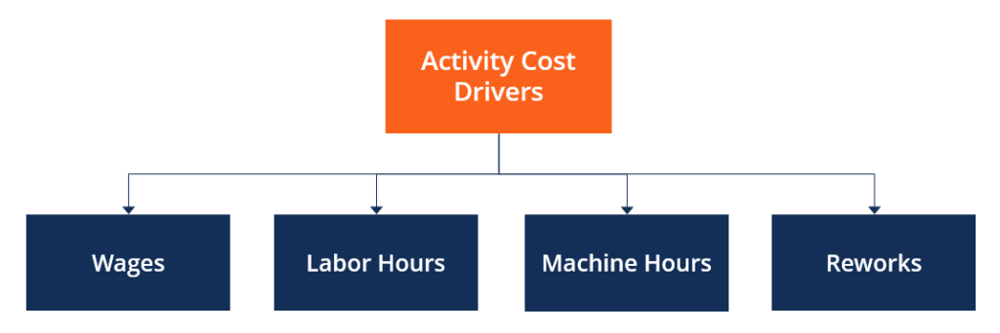

## Table of Contents

## What is an activity cost driver?

An activity cost driver is something that helps businesses figure out how much it costs to do certain activities. It's like a tool that connects the costs to the activities that cause them. For example, if a company makes toys, the number of toys made could be a cost driver because making more toys would increase costs like materials and labor.

Using activity cost drivers helps businesses see where their money is going. This way, they can make better decisions about how to save money or where to spend more. For instance, if a company finds out that shipping costs are high because they ship a lot of small orders, they might decide to encourage bigger orders to reduce the number of shipments and lower costs.

## Why are activity cost drivers important in cost accounting?

Activity cost drivers are important in cost accounting because they help businesses understand what activities are causing costs. By figuring out which activities drive costs, companies can see where their money is going. This is really helpful for making smart decisions about how to spend money or where to cut costs. For example, if a business sees that a lot of money is spent on customer service calls, they might look for ways to make those calls shorter or less frequent.

Using activity cost drivers also helps businesses to price their products or services more accurately. If a company knows exactly how much it costs to make a product, they can set a price that covers those costs and still makes a profit. This can make the business more competitive and successful. Without knowing the cost drivers, a company might set prices too low and lose money, or too high and lose customers.

## Can you provide examples of common activity cost drivers?

Activity cost drivers are things that make costs go up or down in a business. Some common ones are the number of products made, the time spent on making them, and the number of orders a business gets. For example, if a bakery makes more cakes, it will use more ingredients and spend more time baking, which increases costs. The number of cakes made is an activity cost driver because it directly affects how much the bakery spends.

Another example is the number of customer service calls a company gets. If a tech company gets a lot of calls about a new phone, it will need more people to answer those calls, which costs more money. The number of calls is a cost driver because it makes the cost of customer service go up. In a hospital, the number of patients treated can be a cost driver because more patients mean more supplies and more staff time, which increases costs.

These examples show how activity cost drivers help businesses see where their money is going. By understanding these drivers, companies can find ways to spend less or spend their money more wisely. For example, a company might find ways to make products faster or handle customer service calls more efficiently to save money.

## How do activity cost drivers relate to activity-based costing?

Activity cost drivers are a big part of activity-based costing (ABC). In ABC, businesses look at all the activities they do and figure out how much each activity costs. The activity cost drivers are the things that make these costs go up or down. For example, if a company makes toys, the number of toys made is an activity cost driver because making more toys means spending more on materials and labor. By using activity cost drivers, businesses can see exactly which activities are causing costs and how much those costs are.

Using activity cost drivers in ABC helps businesses understand their costs better. This way, they can make smarter choices about where to spend money and where to save it. For instance, if a company finds out that shipping a lot of small orders is expensive, they might decide to encourage bigger orders to lower the number of shipments and reduce costs. By knowing the activity cost drivers, companies can set prices that cover their costs and make a profit, which helps them stay competitive and successful.

## What is the process for identifying activity cost drivers in a business?

To identify activity cost drivers in a business, you start by looking at all the activities the business does. This means breaking down the work into smaller parts, like making products, handling customer calls, or shipping orders. Then, you watch these activities closely to see what makes them cost more or less. For example, if you make more toys, you'll spend more on materials and labor. So, the number of toys made is an activity cost driver. You talk to people who do these jobs to get their ideas about what drives costs. They might know things that aren't obvious from just looking at numbers.

Once you have a list of possible cost drivers, you check them against the business's financial data. You look at how changes in these drivers affect costs. If making more toys really does make costs go up, then you know the number of toys made is a good cost driver. You might use charts or graphs to see these patterns more clearly. After you've confirmed which drivers really matter, you can use them to understand your costs better and make smarter decisions about where to spend money or where to save it.

## How can activity cost drivers be used to improve business efficiency?

Activity cost drivers help businesses see where they're spending money and why. By knowing what makes costs go up or down, a business can find ways to work smarter. For example, if a company sees that shipping a lot of small orders costs a lot, they might decide to encourage customers to buy more at once. This way, they can ship fewer times and save money. Understanding cost drivers lets businesses make changes that cut down on waste and make things run smoother.

Using activity cost drivers also helps businesses find the best way to use their time and resources. If a company knows that handling customer calls takes a lot of time, they might look for ways to make those calls quicker or have fewer of them. Maybe they can use better technology or train their staff differently. By focusing on the activities that drive costs, businesses can make their operations more efficient and save money, which helps them do better overall.

## What are the differences between volume-based and activity-based cost drivers?

Volume-based cost drivers are about how many things a business makes or sells. For example, if a factory makes more cars, it will spend more on materials and labor. These drivers focus on the total number of products or services, thinking that more [volume](/wiki/volume-trading-strategy) means more costs. But this way of looking at costs can miss out on other things that make costs go up, like how long it takes to do something or how many orders a business gets.

Activity-based cost drivers look at all the different activities a business does and how much each one costs. Instead of just counting how many things are made, this method looks at things like the time spent making products, the number of customer service calls, or the number of shipments. By understanding these activities, a business can see exactly where its money is going and find better ways to save money or spend it more wisely. This approach gives a more detailed picture of costs and helps businesses make smarter decisions.

## How do you measure the effectiveness of an activity cost driver?

To measure the effectiveness of an activity cost driver, you look at how well it explains the costs of doing certain activities. For example, if a bakery uses the number of cakes made as a cost driver, they would check if making more cakes really does make costs go up. They do this by comparing the number of cakes made with the costs of ingredients and labor. If the numbers match up well, then the cost driver is effective because it shows a clear link between the activity and the costs.

Another way to measure the effectiveness is by looking at how using the cost driver helps the business make better decisions. If knowing the cost driver helps the bakery find ways to save money, like using less expensive ingredients or baking more efficiently, then it's working well. The bakery might see lower costs or more profit, which shows that the cost driver is useful for understanding and managing expenses.

## What challenges might a company face when implementing activity cost drivers?

When a company tries to use activity cost drivers, they might run into some problems. One big challenge is figuring out which activities really drive costs. It's not always easy to see what makes costs go up or down. For example, a business might think the number of products made is the main cost driver, but it could be something else like the time spent on making them or the number of customer service calls. To find the right cost drivers, the company needs to look closely at all their activities and talk to the people doing the work. This can take a lot of time and effort.

Another challenge is getting the data right. To use activity cost drivers well, a business needs good, accurate information about their costs and activities. If the data is wrong or missing, the cost drivers won't work properly. This means the company might make bad decisions about where to spend money or where to save it. Also, setting up systems to track all this data can be hard and expensive. But if a company can get past these challenges, using activity cost drivers can help them understand their costs better and make smarter choices.

## How can activity cost drivers be integrated into strategic planning?

Activity cost drivers can be a big help when a company is planning for the future. By understanding what activities drive costs, a business can see where they're spending money and why. This helps them make better decisions about where to put their resources. For example, if a company finds out that shipping costs a lot because they send out many small orders, they might decide to encourage bigger orders. This way, they can ship fewer times and save money. By using activity cost drivers in their planning, a company can focus on the activities that matter most and find ways to make their operations more efficient.

Using activity cost drivers also helps a company set goals and measure how well they're doing. If a business knows that the number of customer service calls is a big cost driver, they might set a goal to reduce those calls. They could do this by improving their products or training their staff better. By keeping an eye on these cost drivers, the company can see if their plans are working and make changes if they need to. This way, activity cost drivers become a key part of making sure the company's plans are on track and helping them reach their goals.

## What advanced techniques can be used to refine activity cost driver analysis?

To make activity cost driver analysis better, businesses can use advanced techniques like data analytics and [machine learning](/wiki/machine-learning). These tools help them look at a lot of data quickly and find patterns that might be hard to see otherwise. For example, a company might use data analytics to see how different activities affect costs over time. This can help them spot trends and make predictions about future costs. Machine learning can even help the business find new cost drivers that they didn't know about before, by looking at lots of different factors and figuring out which ones really matter.

Another advanced technique is using activity-based management (ABM). ABM takes the information from activity cost driver analysis and uses it to manage the business better. It helps companies focus on the activities that add the most value and cut out the ones that don't. For example, if a business finds out that a lot of time is spent on activities that don't make much money, they might decide to do those activities differently or stop doing them altogether. By using these advanced techniques, businesses can understand their costs even better and make smarter decisions about how to spend their money and time.

## How do activity cost drivers adapt to changes in technology and business models?

As technology changes, the way businesses work changes too. Activity cost drivers need to keep up with these changes. For example, if a company starts using robots to make products, the cost of making things might go down because robots can work faster and don't need breaks. The number of products made might still be a cost driver, but the cost per product could be different because of the new technology. Businesses need to look at their cost drivers again and see how technology changes them. This way, they can keep their costs accurate and make good decisions about where to spend money.

Business models can change too, like when a company starts selling things online instead of in stores. This can change what drives costs. For example, if a business used to spend a lot on store rent and now spends more on shipping, the number of shipments might become a bigger cost driver. The company needs to watch these changes and update their cost drivers to match the new way they do business. By doing this, they can understand their costs better and find new ways to save money or spend it more wisely.

## How can cost drivers be incorporated into business management?

Effective business management requires integrating an understanding of cost drivers into the decision-making process. Cost drivers are vital indicators that define the activities and attributes causing costs to occur within an organization. Identifying and analyzing these drivers allow businesses to streamline operations, minimize expenses, and set strategic pricing.

Evaluating cost drivers enables organizations to gain insights into where and why resources are consumed. This evaluation leads to more informed decision-making concerning production processes, resource allocation, and overhead control. For example, understanding the cost drivers related to labor, materials, and machine time can lead a manufacturing business to optimize its production schedule, thereby reducing downtime and improving overall efficiency.

Activity-Based Costing (ABC) is a strategic tool used to allocate overhead expenses accurately by identifying and using cost drivers. Unlike traditional costing methods, which often apply a blanket rate for overhead allocation, ABC employs specific cost drivers to trace expenses to the exact products or services that generate them. This method enhances financial transparency by providing detailed insights into the cost and profitability of various business segments.

The implementation of ABC begins with identifying key activities and cost drivers associated with each. These could range from machine hours to the number of customer orders processed. Then, overhead costs are allocated based on the actual consumption of resources dictated by these drivers. The formula for calculating the overhead allocation using ABC could be represented as:

$$
\text{Overhead Cost Allocation} = \sum (\text{Activity Cost Driver Rate} \times \text{Activity Usage})
$$

Where:
- $\text{Activity Cost Driver Rate}$ is the cost per unit of activity,
- $\text{Activity Usage}$ is the number of activity units consumed by the product or service.

By utilizing ABC, companies can not only achieve more precise cost distribution but also assess the profitability of individual products, customer segments, or service lines. This information is instrumental in making strategic decisions about product development, pricing strategies, and market repositioning.

Incorporating cost drivers into business management decisions ultimately leads to enhanced operational efficiency and financial health. It allows organizations to identify inefficiencies, control costs, and formulate strategies that align with their financial goals and market demands.

## What is the relationship between algorithmic trading and cost drivers?

Algorithmic trading utilizes computational power and advanced algorithms to execute orders at velocities and frequencies beyond the capacity of human traders. This method leverages technology to deliver precision, speed, and efficiency in executing trades, significantly minimizing latency and human error.

The efficiency and profitability of [algorithmic trading](/wiki/algorithmic-trading) can be substantially impacted by various cost drivers such as transaction fees and technological expenses. Transaction fees refer to the charges applied by exchanges or brokers for executing trades, while technological expenses encompass the costs associated with the infrastructure, such as servers and software, required to maintain high-frequency trading systems.

Identifying and understanding these cost drivers is essential for optimizing trading strategies. For instance, transaction fees can be modeled and incorporated into algorithms to ensure trades remain cost-effective. This can involve calculating the total transaction costs using the formula:

$$
\text{Total Transaction Cost} = \text{Price} \times \text{Quantity} + \text{Transaction Fees}
$$

In practice, algorithms can include mechanisms to minimize these costs by selecting execution venues with the lowest fees or by optimizing the size and timing of trades to reduce market impact.

Technological expenses also play a critical role in the efficiency of algorithmic trading. Initial investments in robust technology and infrastructure can lead to lower operational costs in the long run. By analyzing these expenses, traders can determine the return on investment (ROI) from the infrastructure and decide when upgrades or alternative solutions are necessary.

Understanding these cost drivers equips businesses with the ability to modify algorithms to minimize unnecessary expenses and enhance execution quality. For example, by assessing technological expenses, traders can adjust algorithms to optimize server use and data processing, thereby reducing latency and operational costs.

Python programming can be employed to analyze and manage these costs effectively. For instance, the following Python code snippet demonstrates how to calculate transaction costs:

```python
def calculate_transaction_cost(price, quantity, fee_percentage):
    transaction_cost = (price * quantity)
    transaction_fee = transaction_cost * (fee_percentage / 100)
    total_cost = transaction_cost + transaction_fee
    return total_cost

# Example usage
price = 100.0  # Price per unit
quantity = 50  # Number of units
fee_percentage = 0.2  # Transaction fee as a percentage

total_cost = calculate_transaction_cost(price, quantity, fee_percentage)
print("Total Transaction Cost:", total_cost)
```

By incorporating such analytics and cost management techniques, algorithmic trading can be more closely aligned with financial objectives, reducing unnecessary expenditure while maintaining a high level of performance and quality in trading execution.

## References & Further Reading

[1]: Kaplan, R. S., & Anderson, S. R. (2004). ["Time-driven activity-based costing."](https://hbr.org/2004/11/time-driven-activity-based-costing) Harvard Business Review.

[2]: Cohen, G., Neslusan, C., & Stenback, C. (2014). ["Activity-Based Cost Management with SAP."](https://portals.iucn.org/library/sites/library/files/documents/2016-036.pdf) Springer.

[3]: Elder, A. (2014). ["Entries & Exits: Visits to Sixteen Trading Rooms."](https://www.amazon.com/Entries-Exits-Visits-Trading-Rooms/dp/0471678058) Wiley.

[4]: Hull, J. C. (2017). ["Options, Futures, and Other Derivatives."](https://www.pearson.com/en-us/subject-catalog/p/options-futures-and-other-derivatives/P200000005938/9780136939917) Pearson.

[5]: Treleaven, P., Galas, M., & Lalchand, V. (2013). ["Algorithmic Trading Review."](https://www.researchgate.net/publication/262239006_Algorithmic_Trading_Review) Communications of the ACM.

[6]: Lambert, D. M., & Cooper, M. C. (2000). ["Issues in Supply Chain Management."](https://www.sciencedirect.com/science/article/abs/pii/S0019850199001133) Industrial Marketing Management.