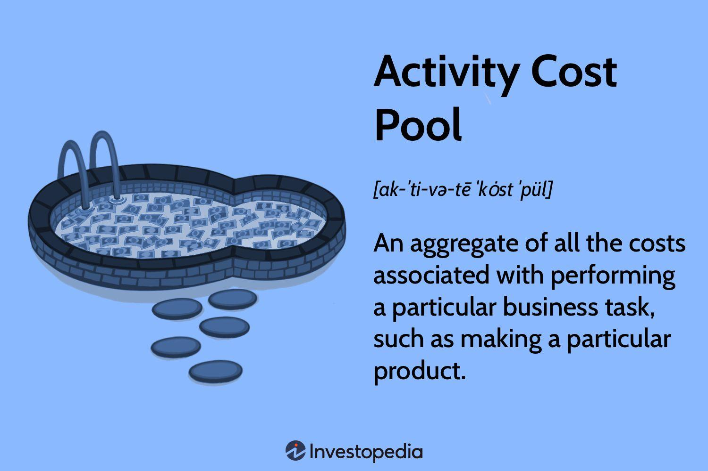

Business finance, cost accounting, and algorithmic trading represent a triad of interconnected disciplines that play pivotal roles in today’s dynamic economic landscapes. Each field contributes uniquely to the efficiency and profitability of enterprises, yet they are deeply interrelated through the fundamental concept of understanding and managing costs. At the heart of this interconnection lies the principle of accurately mapping out cost structures, particularly through the use of activity cost pools. 

Activity cost pools are a central concept in cost accounting, a discipline dedicated to meticulously tracking, analyzing, and controlling costs to inform strategic decision-making. In both traditional manufacturing and the fast-paced world of algorithmic trading, comprehending cost structures is vital. These pools aggregate costs related to specific activities within an organization, enabling businesses to adopt a more precise approach to cost management. By identifying and understanding these cost drivers, companies can better allocate resources, optimize processes, and enhance financial outcomes.



The relevance of activity cost pools extends into algorithmic trading, a sector heavily reliant on technology and rapid execution of trades. Here, the delicate balance of costs—spanning transaction fees, technological overheads, and operational expenses—can influence trading strategies and overall profitability. In such environments, recognizing and managing cost drivers is crucial to maintain competitiveness and operational efficiency.

In traditional manufacturing, as well as in algorithmic trading, the integration of activity-based costing (ABC) allows businesses to dissect and manage their cost structures with greater accuracy. This methodology supports firms in refocusing their strategies to maximize efficiency and profitability by aligning resources with the most impactful cost drivers. 

Understanding and employing these concepts can greatly benefit businesses aiming to thrive in modern economic landscapes. The subsequent sections will explore how the principles of cost accounting, activity cost pools, and cost drivers inform both manufacturing and algorithmic trading strategies, driving them toward optimization and financial success.

## Table of Contents

## Understanding Cost Accounting

Cost accounting is a specialized branch of accounting that focuses on determining the actual costs associated with the production of a product or the provision of a service. It is instrumental in helping businesses understand their cost structures, which encompasses both variable and fixed costs. The primary goal of cost accounting is to support the internal management of an organization by providing detailed cost data, enabling efficient planning, budgeting, and cost control.

In business finance, cost accounting is essential as it provides the framework for collecting and evaluating cost data, facilitating the comparison of actual costs with budgeted figures. This comparison aids in identifying discrepancies and areas for cost reduction. By understanding cost behaviors, businesses can strategize effectively to improve profitability. For instance, variable costs, which fluctuate with production [volume](/wiki/volume-trading-strategy) (e.g., raw materials and labor), can be managed by optimizing resource allocation. Meanwhile, fixed costs, such as rent and salaries, are typically stable regardless of output levels. Efficient tracking of these costs provides a foundation for strategic financial planning by improving cost allocation and resource utilization.

Moreover, cost accounting plays a crucial role in strategic decision-making. It helps management in pricing strategies by determining the cost structures and evaluating the profitability of different products or services. By identifying cost-efficient methods of production and operational efficiencies, businesses can enhance their competitive edge. For example, consider a manufacturing company that uses cost accounting data to decide whether to expand production capabilities or outsource certain operations based on cost-benefit analysis.

Cost accounting also aids in financial planning by assisting businesses in predicting future financial conditions, preparing budgets, and setting performance benchmarks. By providing insights into cost trends, management can make informed choices regarding investment, cost reduction strategies, and operational improvements. This ability to anticipate financial needs and allocate resources efficiently helps businesses achieve long-term financial stability and growth.

In summary, cost accounting is an invaluable tool in business finance for tracking and analyzing production costs. It supports strategic decision-making and financial planning by offering detailed cost information, allowing companies to manage resources effectively, enhance profitability, and sustain competitive advantage.

## The Concept of Activity Cost Pools

Activity cost pools are fundamental elements within the domain of cost accounting, particularly within the framework of activity-based costing (ABC). These pools aggregate costs that are associated with specific business activities or tasks, allowing for a more precise and methodical allocation of costs within an organization. By organizing these costs into specific categories—referred to as "pools"—companies can evaluate the cost-efficiency and financial impact of different operations, subsequently enabling more informed strategic decision-making.

In traditional costing systems, overhead costs are often distributed across products or services based on a single metric, such as direct labor hours or machine hours. However, this approach tends to be oversimplified and may lead to inaccurate cost allocation, as it does not reflect the diversity and complexity of activities involved in production. Activity-based costing (ABC) addresses this limitation by using multiple cost pools related to different business activities.

For instance, a manufacturing company might establish various activity cost pools for tasks such as machine setups, quality inspections, material handling, and order processing. Each of these pools aggregates the indirect costs associated with these specific activities. By identifying and measuring the cost drivers—factors that incur costs—associated with each pool, such as the number of setup hours or the number of inspections, ABC enables companies to distribute costs more accurately across products or services based on the actual consumption of resources.

The mathematical representation of ABC through activity cost pools can be expressed as follows:

$$
\text{Total Cost for a Product/Service} = \sum_{i=1}^{n} (\text{Cost Driver Rate}_i \times \text{Quantity of Cost Driver}_{i,j})
$$

where:
- $\text{Cost Driver Rate}_i$ refers to the rate associated with each activity's cost driver.
- $\text{Quantity of Cost Driver}_{i,j}$ denotes the amount of each cost driver utilized by a specific product or service.

This formula illustrates how costs are traced and assigned to products or services based on the magnitude of activity resources consumed. Python code could be used to implement ABC and perform cost allocation automatically, providing businesses with a tool to enhance their cost management practices.

```python
# Example of ABC calculation using Python
def calculate_abc_cost(driver_rates, driver_quantities):
    """Calculate the total cost using activity-based costing."""
    total_cost = 0
    for rate, quantity in zip(driver_rates, driver_quantities):
        total_cost += rate * quantity
    return total_cost

# Example input
cost_driver_rates = [30, 20, 15]  # Cost driver rates for 3 activities
cost_driver_quantities = [100, 150, 200]  # Quantities of each cost driver

# Calculate total cost
total_cost = calculate_abc_cost(cost_driver_rates, cost_driver_quantities)
print(f"Total ABC Cost: {total_cost}")
```

This enhanced visibility into cost allocation allows organizations to manage resources more effectively and identify cost-saving opportunities. Thus, activity cost pools serve as a pivotal component in refining the accuracy of cost distribution and supporting financial strategizing.

## The Role of Activity Cost Drivers

Activity cost drivers are elements that influence the overhead expenses associated with specific business activities. These drivers dictate the fluctuating costs that occur when the level of an activity changes, making them a critical component in the allocation of variable expenses. Understanding activity cost drivers enables businesses to more accurately track and assign costs to products or services, thus reflecting real-time financial dynamics.

In cost accounting, activity cost drivers relate directly to the resource usage. For example, in manufacturing, machine hours, labor hours, or setup times can serve as activity cost drivers. Each of these elements incurs a cost proportional to its usage, impacting the overall variable expenses borne by the company. Calculating these expenses can be represented using the formula:

$$
\text{Total Activity Cost} = \text{Activity Rate} \times \text{Activity Driver Units}
$$

Here, the "Activity Rate" is the predetermined cost assigned to each unit of the activity driver, and "Activity Driver Units" refer to the measure of the driver's quantity used in operations. This formula helps in pinpointing the specific expenses associated with activities, thereby facilitating more precise budgeting and cost control.

Identifying and managing activity cost drivers are essential for maximizing operational efficiency. By closely analyzing these drivers, businesses can discern which activities consume the most resources and why. This insight permits targeted efforts toward efficiency improvements, such as re-engineering processes to minimize waste or redesigning workflows to enhance productivity. Accurate identification of cost drivers also enables firms to implement strategic measures for cost reduction, such as automation or technology upgrades to optimize resource allocation.

Moreover, managing activity cost drivers provides valuable information for price setting, product development, and strategic planning. When firms recognize which drivers substantially impact costs, they can adjust operational strategies, renegotiate supplier contracts, or modify production processes to better align with financial goals. Consequently, this understanding promotes a proactive approach to financial management, steering the business toward achieving a competitive edge and fostering long-term sustainability.

## Algorithmic Trading and Cost Management

Algorithmic trading involves the use of computer algorithms to automatically execute trading orders at high speeds based on predetermined criteria such as market conditions, price fluctuations, or other financial indicators. This type of trading is heavily reliant on technology, particularly in terms of computing power and network speed, due to the necessity to process vast amounts of data in real time and execute trades within fractions of a second. The implementation of [algorithmic trading](/wiki/algorithmic-trading) comes with various costs, including transaction fees, costs of maintaining technological infrastructure, and costs associated with latency and slippage.

Understanding cost drivers is essential for refining trading strategies to maximize profitability by minimizing these expenses. In the context of algorithmic trading, cost drivers can be factors such as the frequency of trades, data acquisition fees, hardware and software maintenance, and latency costs. By accurately identifying and managing these cost drivers, traders can optimize their algorithmic strategies. For instance, optimizing the location of servers to be closer to exchanges can reduce latency, leading to faster execution times and potentially greater profits.

Consider the following Python example that outlines a basic strategy for cost management in algorithmic trading:

```python
def optimize_strategy(trades, transaction_fee, latency_cost):
    """
    Optimize trading strategy by minimizing transaction fees and latency costs.

    :param trades: list of trade details
    :param transaction_fee: float, per trade transaction fee
    :param latency_cost: float, cost incurred due to latency

    :return: dict, optimized strategy
    """
    total_cost = 0
    optimized_trades = []

    for trade in trades:
        trade_cost = transaction_fee + trade['latency'] * latency_cost
        if trade_cost < trade['expected_profit']:
            optimized_trades.append(trade)
            total_cost += trade_cost

    return {
        'optimized_trades': optimized_trades,
        'total_cost': total_cost
    }

trades = [
    {'latency': 0.005, 'expected_profit': 5.0},
    {'latency': 0.002, 'expected_profit': 2.0},
]

transaction_fee = 0.5
latency_cost = 100  # cost per unit of latency

optimized_strategy = optimize_strategy(trades, transaction_fee, latency_cost)
print("Optimized Trades: ", optimized_strategy['optimized_trades'])
print("Total Transaction Cost: ", optimized_strategy['total_cost'])
```

In this example, the function `optimize_strategy` calculates the cost of each trade by summing the transaction fee and a latency cost proportional to the trade's latency. Only trades where the total cost is less than the expected profit are considered part of the optimized strategy.

By reducing latency costs and transaction fees through strategic changes, companies involved in algorithmic trading can improve their profitability. The role of cost management extends beyond mere reduction of fees; it encompasses enhancing the efficiency and effectiveness of trading operations. Consequently, continuous monitoring and adjustment of cost drivers are crucial to maintaining competitive advantage in high-frequency trading environments. As technological advancements progress, these cost management strategies must evolve to accommodate new challenges and opportunities within the algorithmic trading landscape.

## Strategies for Cost Optimization in Algorithmic Trading

Algorithmic trading has transformed the financial markets by making transactions faster, more precise, and less susceptible to human error. A crucial aspect of maintaining competitiveness and profitability in this high-speed domain is cost optimization. This involves implementing automated trading systems that minimize expenses and maximize operational efficiency. Traders and financial institutions can employ several strategies to achieve cost optimization, primarily through robust technology adoption and advanced data analytics.

One effective method for reducing costs is the use of sophisticated algorithms to automate trading decisions. By replacing manual trading processes with algorithmic systems, firms can reduce human resource costs and improve execution speed. These systems can be designed to analyze market data in real-time, execute trades at optimal prices, and adapt to changing market conditions. This can be further augmented by [machine learning](/wiki/machine-learning) algorithms, which learn from historical data to make more accurate predictions and refine trading strategies.

Adopting robust technology is critical in limiting costs associated with trading infrastructure. Utilizing cloud computing and high-performance computing (HPC) systems allows businesses to enhance their computational capacity without the need for substantial investments in physical hardware. This not only lowers capital expenditure but also provides scalability and flexibility in adjusting computational resources according to trading volumes. Furthermore, employing advanced data analytics tools enables traders to monitor and analyze transaction costs, identify inefficiencies, and implement corrective measures promptly.

Data analytics plays a vital role in cost management by enhancing the understanding of cost drivers. For instance, analysis of latency in trade execution can help identify bottlenecks in the trading process. By addressing these bottlenecks through improved network infrastructure or optimized software solutions, firms can reduce slippage costs significantly. Moreover, predictive analytics can forecast transaction costs under various market conditions, enabling traders to devise strategies that minimize impact costs.

Businesses effectively employing these strategies often initiate a rigorous back-testing process for their algorithms. Back-testing involves running an algorithm on historical market data to assess its performance before going live. By simulating different market scenarios, firms can estimate potential profits and losses, thereby refining their strategies to be more cost-effective.

For example, a financial institution might enhance its algorithm by incorporating a machine learning model that predicts price movements with improved accuracy. By integrating this model, the firm achieves better order execution at reduced costs, thus increasing profitability. Additionally, by employing cloud services for their computational tasks, they further streamline their operational expenses, achieving significant cost savings.

In conclusion, the pathway to cost optimization in algorithmic trading is paved with technological advancements and meticulous data analysis. By leveraging automated trading systems, adopting robust technology, and utilizing data analytics, traders can minimize costs associated with transaction fees, execution delays, and infrastructure. Ultimately, these strategies not only ensure operational efficiency but also contribute to sustained competitive advantage in the dynamic landscape of financial markets.

## Case Studies and Real-World Applications

Examining how businesses effectively employ cost accounting and activity-based costing (ABC) provides insightful examples of improved profitability and informed decision-making. By accurately capturing and analyzing costs associated with various business activities, companies can enhance their financial performance and strategic planning.

One prominent example is the implementation of ABC by the manufacturing giant, Siemens. Siemens utilized ABC to better allocate overhead costs, which were previously distributed using broad averaging techniques. By identifying cost pools associated with specific activities such as production setup, quality inspection, and machine maintenance, Siemens improved its ability to trace expenses to individual products and services. This approach allowed the company to identify products that were underperforming because of high hidden costs, thereby optimizing its product portfolio and pricing strategy. As a result, Siemens achieved significant cost reductions and streamlining of operational processes, leading to increased profitability.

Another case of successful cost accounting is found in the retail sector with the company Target. To manage its vast inventory effectively, Target employed ABC to gain detailed insights into the costs associated with each product line. By identifying activity cost drivers such as shelf stocking, store maintenance, and customer service, Target was able to precisely allocate costs to each product category. This detailed visibility into cost structure enabled the company to implement more competitive pricing strategies and improved inventory management. Target experienced enhanced product margin and an improved bottom line by focusing on high-margin items and optimizing customer offerings based on cost-benefit analysis.

In the realm of financial services, JP Morgan Chase adopted cost accounting principles, integrating ABC to better understand the costs of various trading activities. By identifying key cost drivers such as data consumption, transaction processing, and compliance, JP Morgan Chase was able to optimize its algorithmic trading processes. This led to a more efficient allocation of resources towards high-value trading strategies, minimizing operational bottlenecks and transaction costs, ultimately leading to improved trading profits.

The aviation industry also highlights the importance of ABC, demonstrated by Southwest Airlines. With a unique business model, Southwest Airlines has continually leveraged cost accounting to maintain its low-cost carrier reputation. By meticulously analyzing operational costs, such as customer boarding processes, baggage handling, and turn-around time on ground, the airline achieved significant cost savings. These efforts have allowed Southwest to offer competitive pricing while maintaining profitability, reinforcing its position as a market leader.

These real-world applications underscore the transformative impact of cost accounting and activity-based costing. When businesses effectively deploy these methodologies, they not only improve their financial performance but also enhance decision-making and strategic planning capabilities. Aligning cost structures with business activities allows organizations to make informed decisions, focusing on areas that offer the greatest potential for profitability and growth.

## Conclusion

In the integration of cost accounting with business finance strategies, understanding cost structures through activity cost pools is essential for optimizing operations across industries, including manufacturing and algorithmic trading. By adopting cost accounting techniques, businesses can more effectively trace both variable and fixed production costs, enabling informed strategic decision-making and enhanced financial planning. 

Activity cost pools, as part of activity-based costing (ABC), provide accurate cost assignment by aggregating expenses associated with specific business activities. This improved accuracy facilitates not only a clearer understanding of the cost dynamics in production but also enhances the precision of cost management in trading environments. Particularly in algorithmic trading, where speed and technological costs are critical, recognizing and managing cost drivers can lead to significant reductions in transaction fees and operational expenses.

Implementing robust strategies to understand and optimize these cost drivers ensures higher efficiency and profitability. Businesses that harness cost accounting methods can achieve a competitive edge by maximizing resource allocation and minimizing unnecessary expenditures.

By embracing these practices, companies are better positioned for sustained profitability, ensuring that both manufacturing and algorithmic trading operations are not only efficient but also strategically positioned for long-term growth. The ability to allocate resources accurately and manage costs effectively is a cornerstone of successful business finance strategy, vital for navigating the complexities of modern economic landscapes.

## References & Further Reading

1. **"Cost Accounting: A Comprehensive Guide" by Catherine L. Wish**  
   - This book provides an exhaustive exploration of cost accounting principles and practices, detailing strategies for effective management of production costs. It is ideal for understanding how cost accounting integrates with broader financial strategies in businesses.

2. **"Activity-Based Costing: A Practitioner's Guide" by Bjørn Axel Gran**  
   - A practical approach to implementing activity-based costing (ABC) in various business environments. The author presents real-life examples and step-by-step methodologies essential for accurately assigning costs to business activities through activity cost pools.

3. **"Algorithmic Trading: Strategies for Optimizing Costs" by Ernie Chan**  
   - This publication explores the nuances of algorithmic trading, focusing on cost optimization strategies. Chan discusses how technology and cost management principles can be harmonized to enhance trading efficiency and profitability.

4. **Harvard Business Review Articles on Cost Management**  
   - Various articles published by the Harvard Business Review contribute valuable insights into modern cost management practices. These articles present case studies and strategic advice relevant to both traditional manufacturing and algorithmic trading sectors.

5. **"Principles of Corporate Finance" by Richard A. Brealey and Stewart C. Myers**  
   - This textbook is a respected source in the academic world for understanding corporate finance. It includes sections relevant to cost accounting and its role in the broader context of financial management.

6. **"Advanced Data Analysis for Algorithmic Traders" by John C. Hull**  
   - This book investigates into data analytics techniques essential for algorithmic traders. It covers how advanced data analysis can help manage technology costs and refine trading approaches to maximize financial returns.

7. **Journal of Cost Management**  
   - A scholarly journal that publishes research articles, case studies, and reviews on current practices in cost management. An excellent source for those looking to stay updated on innovations in cost accounting methodologies and their applications.

8. **Online Courses on Coursera and edX**  
   - Platforms like Coursera and edX offer numerous courses focusing on cost accounting, finance, and algorithmic trading. These courses can provide both foundational knowledge and advanced insights from industry experts and academia.

These resources should provide a comprehensive starting point for readers interested in expanding their understanding of cost accounting and algorithmic trading, catering to both theoretical and practical applications.

