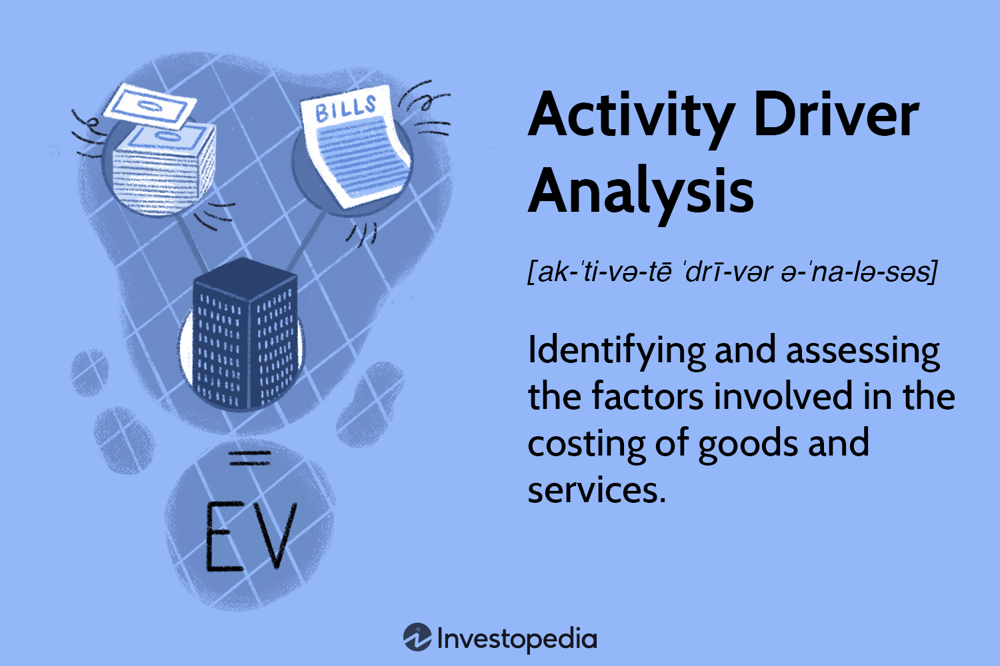

In the modern business environment, optimizing cost structures and implementing advanced trading strategies are critical objectives for organizations aiming to remain competitive. Companies increasingly recognize that understanding and leveraging the connections between cost accounting, activity driver analysis, and algorithmic trading is essential for achieving these objectives. These disciplines, though distinct, share intersecting goals related to enhancing both financial and operational efficiencies.

Cost accounting provides a comprehensive framework for assessing a company's cost structure, involving the measurement and analysis of production costs. This includes both variable and fixed outlays, applying detailed cost analysis to aid in strategic decision-making and efficient resource allocation. Activity driver analysis, a subset of cost accounting, focuses on identifying the specific activities that drive costs, enabling businesses to gain insights into resource consumption and facilitating improvements in operational efficiency.



Algorithmic trading, which relies on automated systems to execute trading strategies, presents opportunities to apply these cost insights to enhance trading efficiency. By incorporating an understanding of activity cost drivers into trading algorithms, organizations can minimize transaction costs and optimize the use of resources. Moreover, the use of technology in high-frequency trading environments underscores the importance of robust infrastructures to reduce operational expenses, improve execution times, and lower market impact.

The integration of these elements—cost accounting, activity driver analysis, and algorithmic trading—empowers businesses to optimize their financial performance and boost their operational efficacy. As organizations navigate the rapidly evolving technological landscape, these insights offer powerful advantages, helping them refine their approach to cost management and open new avenues of profitability. Through this comprehensive approach, companies can expand their competitive edge in the marketplace, ensuring sustainable growth and profitability.

Future technological advancements and the expanding role of data science will continue to enhance these domains, offering more sophisticated tools and methodologies for cost management and profitable operations. Recognizing and understanding these interconnections is, therefore, paramount for businesses striving to harness emerging opportunities and maintain their competitive stature.

## Table of Contents

## Understanding Activity Driver Analysis

Activity driver analysis is a pivotal component of activity-based costing (ABC), a method that assigns costs to products and services based on the activities required to produce them. This analytical approach pinpoints various factors, or "drivers," that influence the costs associated with specific business operations. By identifying and understanding these activity drivers, organizations can allocate resources more efficiently and improve overall business performance.

Activity drivers can be categorized into two types: [volume](/wiki/volume-trading-strategy)-related and non-volume-related. Volume-related drivers include factors such as the number of units produced or hours worked, which correlate directly with the level of production. Non-volume-related drivers, on the other hand, cover elements like the complexity of operations, variety of products, or quality control processes. Both categories are crucial for a comprehensive understanding of how costs originate and evolve.

Effective activity driver analysis involves several steps. Initially, businesses must identify key activities pertinent to their operations, such as manufacturing, marketing, or distribution. Once activities are cataloged, the next step is to determine appropriate drivers for each activity—these are quantifiable metrics that influence the cost of executing the activity. For example, in a manufacturing setup, an activity driver could be the number of machine hours required to produce a unit.

Consider this Python example to calculate the cost allocation for a manufacturing company using activity driver analysis:

```python
# Sample Data
activities = {
    'Machine Setup': {'driver_quantity': 100, 'driver_rate': 50},
    'Quality Inspection': {'driver_quantity': 200, 'driver_rate': 30},
    'Packaging': {'driver_quantity': 150, 'driver_rate': 20}
}

# Function to calculate cost
def calculate_cost(activity_data):
    total_cost = 0
    for activity, values in activity_data.items():
        activity_cost = values['driver_quantity'] * values['driver_rate']
        print(f"Cost for {activity}: ${activity_cost}")
        total_cost += activity_cost
    return total_cost

# Calculate total cost
total_cost = calculate_cost(activities)
print(f"Total Cost: ${total_cost}")
```

By applying activity driver analysis, businesses gain critical insights into how resources are consumed at various stages of their workflow, enabling them to make informed decisions regarding process improvements and cost reductions. This analytical approach provides precise data that can guide strategic initiatives, such as process reengineering or investment in technology, leading to enhanced organizational efficiency and competitive advantage.

## Cost Accounting and Its Role in Business Management

Cost accounting is an integral part of business management, providing critical insights into a company's production costs that are essential for strategic decision-making. This accounting approach meticulously details both variable and fixed outlays, ensuring businesses have a comprehensive understanding of their financial commitments. 

Variable costs are expenses that fluctuate with production volume, such as raw materials and direct labor. For instance, the formula to calculate total variable cost (TVC) is:

$$
\text{TVC} = \text{VC} \times Q
$$

where $\text{VC}$ is the variable cost per unit and $Q$ is the quantity of units produced. Fixed costs, in contrast, are expenses that do not change with the level of output, such as rent and salaries. These are often denoted as $FC$.

By analyzing these cost components, cost accounting aids businesses in resource allocation, leading to more efficient operations. It assists management in establishing budgetary controls by forecasting expenses and setting financial targets that align with organizational goals. Moreover, cost accounting provides a basis for performance measurement, allowing managers to compare actual performance against budgeted targets.

The integration of cost accounting within business management frameworks enhances financial performance by optimizing the allocation of resources. Through detailed cost analysis, businesses can identify inefficiencies and implement corrective actions, leading to a more judicious use of resources. Consequently, this integration facilitates the setting of optimal pricing strategies, ultimately improving profitability margins.

By leveraging cost accounting, companies can refine their strategic decision-making processes, aligning financial insights with operational goals. This holistic approach ensures that businesses can maintain competitive advantages in challenging market environments, achieving long-term sustainability and growth.

Understanding the nuances of cost accounting empowers businesses to better manage costs, anticipate financial challenges, and capitalize on opportunities, thereby reinforcing their overall management strategy.

## Incorporating Activity Drivers in Algorithmic Trading

Algorithmic trading is the process of executing trading orders using automated and pre-programmed instructions that account for variables such as time, price, and volume. This technology-driven approach allows for high-speed transactions, significantly enhancing traditional trading practices by leveraging computational precision and speed. A critical aspect of refining [algorithmic trading](/wiki/algorithmic-trading) systems is the incorporation of activity cost drivers, which are factors that significantly influence transaction costs.

Activity cost drivers, central to activity-based costing, help identify and analyze the factors that generate costs within a business process. In algorithmic trading, these drivers can include factors like market [volatility](/wiki/volatility-trading-strategies), order size, and execution venue. By integrating these drivers into algorithmic trading models, traders can develop more efficient algorithms that not only execute trades promptly but also minimize unnecessary costs.

The inclusion of activity drivers in trading algorithms leads to a detailed understanding of the cost implications of each trade. For instance, order execution at different times of the day can result in varied transaction costs due to differences in market depth and [liquidity](/wiki/liquidity-risk-premium). An algorithm that accounts for these variations in its decision-making process can select the optimal times and venues for executing orders, reducing slippage and market impact costs.

Consider an algorithm that utilizes a time-of-day cost driver to optimize trading execution. Such an algorithm might look like this in Python:

```python
import numpy as np

def cost_optimization(order_size, time_of_day, market_volatility):
    base_cost = 0.005 * order_size  # Example base cost rate
    time_multiplier = np.sin(time_of_day/24 * 2 * np.pi) + 1  # Simplified cost variation
    volatility_multiplier = 1 + 0.1 * market_volatility

    total_cost = base_cost * time_multiplier * volatility_multiplier
    return total_cost

optimized_time = min(range(24), key=lambda x: cost_optimization(1000, x, 0.05))
```

In this example, the algorithm calculates the transaction cost based on order size and varies the cost dynamically according to the time of day and market volatility. By identifying the time with the lowest cost, it enhances execution quality and manages expenses efficiently.

Furthermore, by continuously analyzing trading performance data, algorithms can adapt to changing market conditions. This dynamic adjustment, enabled by a structured understanding of cost drivers, allows businesses to maintain optimal resource usage and enhance profitability.

Through the synergy of algorithmic trading and activity drivers, organizations can develop sophisticated trading systems that not only focus on speed and accuracy but also on cost-effectiveness, ensuring a competitive edge in financial markets.

## Strategies for Optimizing Costs in Algo Trading

Implementing automated trading systems is essential for achieving cost efficiency in high-frequency trading environments. These systems utilize algorithmic strategies to execute trades at speeds unattainable by human traders, resulting in cost savings and improved accuracy. High-frequency traders make use of these systems to capitalize on market opportunities that arise and disappear in fractions of a second. By automating the execution process, traders can minimize the slippage costs associated with delayed order execution.

Leveraging robust technology infrastructures is another critical strategy. Advanced technologies, such as co-location and direct market access, significantly reduce latency, thereby improving execution times. Co-location involves placing trading servers in close proximity to exchange servers, thereby reducing the time it takes for trading signals to reach the market. Reduced latency not only leads to better trading execution but also minimizes market impact, which is the adverse price movement caused by the large volume of trades. This results in a substantial reduction in transaction costs, which is pivotal in high-frequency settings.

Data analytics has transformed cost management in algorithmic trading. By harnessing sophisticated data analytics tools, traders can identify inefficiencies and optimize resource allocation. These tools enable the examination of vast datasets to discern patterns and correlations that manual analysis would likely miss. For example, [machine learning](/wiki/machine-learning) algorithms can predict future price movements based on historical data, which supports the development of more efficient trading strategies. Moreover, data analytics aids in detecting anomalies and understanding cost drivers, offering opportunities for targeted cost reduction initiatives.

In Python, the use of libraries such as NumPy and pandas allows for efficient handling and analysis of large volumes of trading data. Here's a simple Python snippet showing how one might use these libraries to analyze trade execution times, which is crucial for identifying latency issues:

```python
import pandas as pd
import numpy as np

# Sample data of trade execution times
data = {
    'TradeID': [1, 2, 3, 4, 5],
    'ExecutionTime': [100, 150, 95, 210, 130]  # in milliseconds
}

# Creating DataFrame
df = pd.DataFrame(data)

# Descriptive statistics
execution_mean = np.mean(df['ExecutionTime'])
execution_std = np.std(df['ExecutionTime'])

print(f"Mean Execution Time: {execution_mean} ms")
print(f"Execution Time Standard Deviation: {execution_std} ms")
```

By continuously refining algorithms and leveraging high-performance computing resources, firms can execute trades more efficiently and at a lower cost. As technical capabilities continue to evolve, traders will have greater opportunities to optimize trading mechanisms, thereby safeguarding financial performance amidst the dynamic landscape of financial markets.

## Conclusion

Understanding the relationship between cost accounting, activity drivers, and algorithmic trading offers powerful advantages for businesses aiming to remain competitive in today's dynamic markets. By thoroughly analyzing and optimizing cost structures, companies can achieve enhanced operational efficiency and improved market competitiveness.

Cost accounting, with its detailed assessment of production costs and resource allocations, serves as a vital tool for businesses to identify areas for financial optimization. This discipline's integration with activity driver analysis allows businesses to pinpoint the specific activities responsible for driving costs. By identifying these cost drivers, organizations can strategically target inefficiencies and streamline operations, resulting in significant cost savings.

The application of activity driver insights extends beyond traditional business operations. In algorithmic trading, understanding these drivers can lead to more efficient use of resources and lower transaction costs. Algorithmic trading relies heavily on technology to execute high-speed transactions and manage large volumes of data. By incorporating cost driver analysis, trading algorithms can be fine-tuned to execute trades that minimize operational costs and maximize returns. This integration facilitates a more efficient allocation of capital and supports the development of advanced trading strategies.

Looking forward, future technological advancements and breakthroughs in data science are expected to further enhance the potential for cost management and profitability. Machine learning algorithms and [artificial intelligence](/wiki/ai-artificial-intelligence) can analyze extensive datasets to uncover patterns and insights that were previously inaccessible. As computation power increases, so too will the accuracy and depth of cost analyses, enabling more precise predictions and decisions. Python, with its extensive libraries such as NumPy and pandas, is well-positioned to aid in the development of sophisticated cost analysis models that incorporate these technologies.

In conclusion, the synergy of cost accounting, activity drivers, and algorithmic trading provides a comprehensive framework for businesses to enhance their financial and operational efficiencies. By leveraging these insights, organizations not only improve their competitiveness in the market but also lay the groundwork for future advancements in cost management and profit optimization. Continued exploration and integration of these disciplines offer promising opportunities for sustained business success.

## References & Further Reading

- Kaplan, R. S., & Anderson, S. R. (2004). "Time-driven activity-based costing." Harvard Business Review. This foundational article introduces the concept of time-driven activity-based costing (TDABC) as a more efficient and simplified approach to traditional ABC. Instead of detailed surveys and interviews, TDABC focuses on time as a primary cost driver, assigning costs based on time equations and practical capacity. This methodology allows for quick adjustments to changes in business environments, enhancing accurate cost management.

- Cohen, G., Neslusan, C., & Stenback, C. (2014). "Activity-Based Cost Management with SAP." Springer. This book provides comprehensive insights into implementing activity-based cost management using SAP software. It explores methodologies for integrating SAP systems to facilitate detailed cost analysis, helping businesses better understand cost drivers and resource allocation. With practical examples, the book elucidates how technology can support effective cost management strategies.

- Treleaven, P., Galas, M., & Lalchand, V. (2013). "Algorithmic Trading Review." Communications of the ACM. This review article examines the landscape of algorithmic trading, highlighting core strategies, technologies, and market implications. It discusses how algorithmic strategies optimize trading performance, reduce transaction costs, and improve liquidity management. The paper also explores how algorithmic trading necessitates the incorporation of cost efficiency through innovative technologies and methodologies.

- Bergstra, J., Bardenet, R., Bengio, Y., & Kégl, B. (2011). "Algorithms for Hyper-Parameter Optimization." Advances in Neural Information Processing Systems 24. This research paper introduces algorithms for hyper-parameter optimization, discussing how these can enhance machine learning model performance. By efficiently searching hyper-parameters, these algorithms minimize computational overhead and improve model accuracy. The principles here are analogous to managing resource allocation and cost efficiency in algorithmic systems.

