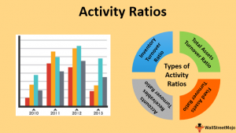

In the financial world, assessing the performance and efficiency of businesses through various metrics is crucial for investors, managers, and stakeholders. Among these metrics, activity ratios stand out as key indicators of how well a company utilizes its resources to generate revenue. These ratios help in evaluating a company's operational effectiveness and its ability to manage assets efficiently. By examining activity ratios, such as inventory turnover and accounts receivable turnover, businesses can understand their fiscal health and operational performance.

Algorithmic trading, or algo trading, represents a significant advancement in trading strategies, utilizing sophisticated algorithms to make trading decisions in financial markets. These algorithms often rely on financial metrics, including activity ratios, to optimize trading strategies. By incorporating activity ratios into trading algorithms, traders can make more informed, data-driven decisions, which can enhance the overall effectiveness and profitability of trading strategies.

Understanding the synergy between financial analysis and algorithmic trading is crucial for enhancing decision-making processes. The integration of financial analysis through activity ratios and the computational power of algorithmic trading allows for refined strategy development and improved market outcomes. This article highlights the importance of activity ratios in business metrics and explores their application in financial analysis and algorithmic trading, demonstrating their relevance to successful business and trading practices.

## Table of Contents

## Understanding Activity Ratios

Activity ratios, commonly known as efficiency ratios, are critical tools for assessing how effectively a company employs its assets in generating revenue. These ratios aid in providing a quantitative measure of an enterprise’s operational efficiency and financial health. By analyzing activity ratios, stakeholders can determine the ability of a company to convert various balance sheet accounts into cash or sales.

One of the most prominent activity ratios is the **inventory turnover ratio**, which indicates how many times a company’s inventory is sold and replaced over a period. It is calculated as:

$$
\text{Inventory Turnover} = \frac{\text{Cost of Goods Sold (COGS)}}{\text{Average Inventory}}
$$

A higher inventory turnover ratio signifies efficient inventory management, implying that the company is adept at converting inventory into sales.

Another critical metric is the **accounts receivable turnover ratio**. This ratio measures how efficiently a company is collecting revenue from its credit sales. The formula is expressed as:

$$
\text{Accounts Receivable Turnover} = \frac{\text{Net Credit Sales}}{\text{Average Accounts Receivable}}
$$

A higher accounts receivable turnover suggests that a company is effective at collecting its debts, leading to better [liquidity](/wiki/liquidity-risk-premium).

Lastly, the **total asset turnover ratio** provides insight into a company's ability to generate sales from its assets. This ratio is an indicator of how well a company utilizes its assets to produce revenue:

$$
\text{Total Asset Turnover} = \frac{\text{Net Sales}}{\text{Average Total Assets}}
$$

This ratio is particularly useful for evaluating asset utilization across different companies within the same industry. 

Activity ratios are not only pivotal for internal assessments; they are also invaluable in drawing comparisons between companies operating under similar conditions and tracking a company's performance over time. Such analyses enable investors, analysts, and management to make informed judgments about operational efficiency and strategic direction.

## Activity Ratios and Financial Analysis

In financial analysis, activity ratios are utilized in conjunction with profitability ratios to thoroughly assess a company's capabilities. These ratios are instrumental in providing insights into how efficiently a company can leverage its assets to generate revenue. Analysts and investors consider activity ratios as essential tools for making informed decisions regarding a business's viability and efficiency. 

Activity ratios measure various aspects of a company's operations. A common metric is the asset turnover ratio, which reflects the efficiency with which a company uses its assets to produce sales. It is calculated as:

$$
\text{Asset Turnover Ratio} = \frac{\text{Net Sales}}{\text{Average Total Assets}}
$$

A higher asset turnover ratio indicates a more efficient use of assets in generating revenue, signaling operational proficiency. Conversely, a lower ratio might suggest inefficiencies or underutilization of assets, urging a deeper investigation into the specific areas of the business.

Another critical metric is return on equity (ROE), which connects the net income to shareholders' equity. ROE provides insights into how effectively a company is using its equity base to generate profits. The formula for ROE is:

$$
\text{Return on Equity (ROE)} = \frac{\text{Net Income}}{\text{Shareholders' Equity}}
$$

A high ROE indicates an efficient management team adept at generating profits from each unit of shareholders' equity, which is crucial for investors seeking lucrative returns. 

In summary, activity ratios such as the asset turnover ratio and return on equity are indispensable in evaluating a company's operational soundness and profitability potential. By assessing these ratios, stakeholders can better understand a company's financial health, enabling more strategic investment and management decisions.

## Algorithmic Trading and Activity Ratios

Algorithmic trading utilizes computational algorithms to execute trades based on predefined strategies in financial markets. These algorithms can process large volumes of market data swiftly, enabling traders to capitalize on even minor price movements. By integrating activity ratios into [algorithmic trading](/wiki/algorithmic-trading) strategies, traders can enhance their decision-making processes and improve trading outcomes.

Activity ratios are vital for constructing more refined and data-driven trading strategies. For instance, the inventory turnover ratio, which measures how often inventory is sold and replaced over a period, can indicate trends in asset liquidity. When applied in algorithmic trading, understanding these trends allows strategies to be adjusted for optimal asset utilization based on current market conditions.

Several key metrics, such as the Sharpe Ratio, Maximum Drawdown, and Profit Factor, are essential for assessing and optimizing algorithmic trading strategies. The Sharpe Ratio sums up the trade-off between risk and return, calculated as:

$$
\text{Sharpe Ratio} = \frac{E[R_p - R_f]}{\sigma_p}
$$

where $E[R_p]$ is the expected return of the portfolio, $R_f$ is the risk-free rate, and $\sigma_p$ is the standard deviation of the portfolio's excess return.

The Maximum Drawdown measures the largest single drop from peak to trough in the portfolio's value, indicative of potential risk exposure. The Profit Factor, defined as the ratio of gross profit to gross loss, helps assess a trading system's reliability and efficiency.

Beyond these metrics, incorporating activity ratios into trading algorithms enables traders to better comprehend market conditions, manage risks more effectively, and enhance trade profitability. For example, a low accounts receivable turnover ratio might signal upcoming cash flow challenges, prompting a more conservative trading approach until liquidity trends stabilize.

In summary, embedding activity ratios into algorithmic trading frameworks provides a comprehensive view of market dynamics and asset performance. These insights facilitate improved risk management and trading efficiency, bolstering the profitability of algorithmic strategies.

## Key Performance Metrics in Algo Trading

Algorithmic trading strategies rely heavily on quantitative metrics to gauge their effectiveness and robustness. Among these, the Sharpe Ratio, Win Rate, and Average Trade Size are paramount for assessing risk-adjusted returns and strategy consistency.

The Sharpe Ratio is a measure of risk-adjusted return. It is calculated by subtracting the risk-free rate from the return of the strategy and then dividing by the standard deviation of the returns:
$$
\text{Sharpe Ratio} = \frac{R_p - R_f}{\sigma_p}
$$
Where $R_p$ is the expected portfolio return, $R_f$ is the risk-free rate, and $\sigma_p$ is the standard deviation of portfolio returns. A higher Sharpe Ratio indicates a more favorable risk-adjusted performance.

Win Rate is a simpler metric representing the frequency of profitable trades. It is calculated as:
$$
\text{Win Rate} = \frac{\text{Number of Profitable Trades}}{\text{Total Number of Trades}}
$$
This metric helps traders understand the consistency and reliability of their trading algorithm. A high win rate suggests that the strategy frequently results in profitable trades, although it does not [factor](/wiki/factor-investing) in the magnitude of gains or losses.

Average Trade Size, or Average Profit/Loss per Trade, provides insights into the typical outcomes of the trading strategy. It is determined by dividing the total profit or loss by the number of trades executed. This measure enables traders to assess the impact of individual trades on overall performance and to ensure that profitable trades sufficiently offset the losses.

To refine and optimize trading models, traders employ performance evaluation tools such as [backtesting](/wiki/backtesting) platforms and statistical analysis software. Backtesting involves applying trading strategies to historical data to verify their potential effectiveness without risking actual capital. Statistical tools assist in identifying patterns and correlations that may be leveraged for improved strategies.

Traders must continuously monitor these metrics to adapt strategies in response to market trends and conditions. By doing so, they can ensure their algorithms remain competitive and aligned with evolving market dynamics. This requires not only rigorous performance evaluation but also an iterative approach to strategy refinement.

## Challenges and Considerations

While using activity ratios in algorithmic trading offers significant advantages, several challenges and considerations must be addressed to ensure effective implementation. One prominent issue is overfitting, where a trading algorithm is excessively tailored to historical data, capturing noise rather than underlying trends. This results in poor performance when applied to new market data. Traders must employ techniques such as cross-validation and regularization to mitigate the risk of overfitting.

Market conditions are highly dynamic and can vary significantly over time, impacting the effectiveness of trading strategies anchored in activity ratios. Traders must continually monitor and adjust their algorithms to account for changes in [volatility](/wiki/volatility-trading-strategies), liquidity, and macroeconomic factors. This adaptability is crucial to maintaining the relevance of the trading strategy across different market conditions.

Transaction costs represent another important consideration. Even a strategy with a strong theoretical foundation can become unprofitable if transaction costs, including fees, slippage, and market impact, are not effectively managed. Quantifying these costs and incorporating them into the algorithmic model ensures a realistic assessment of net returns. Calculating the breakeven point, where total returns equal transaction costs, can help traders refine their strategies accordingly.

Ensuring robustness across diverse market environments is essential for sustainable trading success. Algorithms should be stress-tested against various scenarios, including extreme market events, to ensure they can withstand different conditions. Backtesting on diverse datasets and conducting simulations under hypothetical stress conditions provides valuable insights into strategy resilience.

Ongoing analysis and refinement are imperative for maintaining algorithmic effectiveness. Traders should regularly review performance metrics and refine their models to reflect new data and insights. This iterative process helps capture evolving market dynamics and enhances the long-term viability of trading strategies.

By addressing these challenges, traders can leverage activity ratios more effectively in algorithmic trading, optimizing for both efficiency and profitability in their strategies.

## Conclusion

Activity ratios are vital tools in evaluating business efficiency and operational performance. By providing insights into how effectively a company leverages its assets to generate revenue, these ratios inform both financial analysis and algorithmic trading strategies. The integration of activity ratios in trading models enhances decision-making processes by allowing traders and analysts to base their strategies on comprehensive, data-driven insights. This can lead to more optimal resource utilization and improved trading outcomes.

As financial markets continue to evolve, the effective application of activity ratios will be essential for maximizing efficiency and achieving better returns. These metrics help in adapting to dynamic market conditions and facilitate the development of robust strategies capable of withstanding volatility. The ongoing analysis of activity ratios ensures that financial models remain relevant and effective, allowing market participants to navigate challenges and capitalize on opportunities in an ever-changing environment.

## References & Further Reading

[1]: ["Financial Ratios for Executives: How to Assess Company Strength, Fix Problems, and Make Better Decisions"](https://link.springer.com/book/10.1007/978-1-4842-0731-4) by Michael Rist

[2]: Bodie, Z., Kane, A., & Marcus, A. J. (2014). ["Essentials of Investments."](https://books.google.com/books/about/EBOOK_Investments_Global_edition.html?id=BMsvEAAAQBAJ) McGraw-Hill Education.

[3]: ["Algorithmic Trading: Winning Strategies and Their Rationale"](https://www.amazon.com/Algorithmic-Trading-Winning-Strategies-Rationale-ebook/dp/B00CY5HC0U) by Ernie Chan

[4]: ["Trading and Exchanges: Market Microstructure for Practitioners"](https://www.amazon.com/Trading-Exchanges-Market-Microstructure-Practitioners/dp/0195144708) by Larry Harris

[5]: ["The Econometrics of Financial Markets"](https://press.princeton.edu/books/hardcover/9780691043012/the-econometrics-of-financial-markets) by John Y. Campbell, Andrew W. Lo, and A. Craig MacKinlay